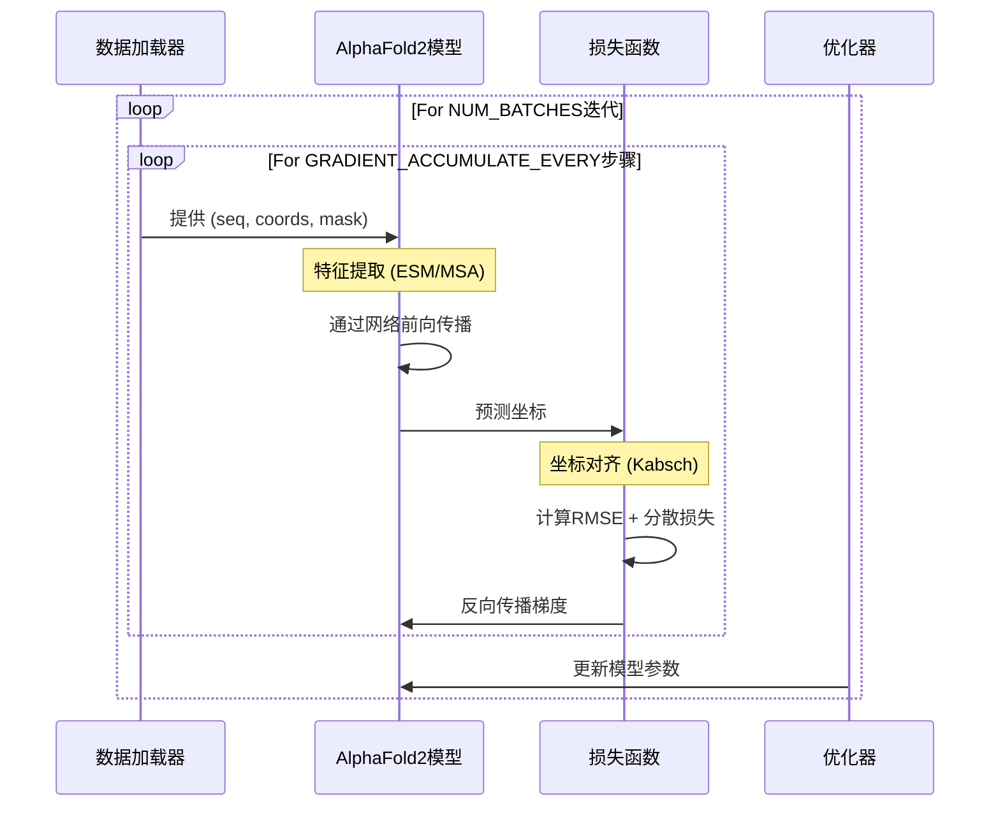

---
slug:13-end-to-end-training-pipeline
blog_type:normal
---


本文档介绍了AlphaFold2 PyTorch实现的端到端训练流程。我们将涵盖从数据准备到模型训练的完整工作流程，提供对系统如何设计以预测蛋白质结构的清晰理解。

## 训练流程概述

端到端训练流程使AlphaFold2模型能够直接从序列和结构数据中学习蛋白质结构预测。与分离的预训练和微调方法不同，该流程通过单一连续过程训练模型预测3D坐标。


来源：[train_end2end.py](train_end2end.py), [alphafold2.py](alphafold2_pytorch/alphafold2.py)

## 数据准备

训练流程使用SidechainNet，这是一个全面的蛋白质结构预测数据集，提供序列及其对应的3D坐标。

```python
data = scn.load(
    casp_version = 12,
    thinning = 30,
    with_pytorch = 'dataloaders',
    batch_size = 1,
    dynamic_batching = False
)
```

**关键组件：**
- **数据集来源**：CASP12（蛋白质结构预测的关键评估）
- **稀疏因子**：30（减少数据集中的冗余）
- **序列长度过滤**：排除长度超过250个残基的序列
- **数据格式**：每个批次包含序列、坐标和掩码

训练使用数据循环机制，持续迭代数据集：

```python
def cycle(loader, cond = lambda x: True):
    while True:
        for data in loader:
            if not cond(data):
                continue
            yield data
```

来源：[train_end2end.py#L63-L73](train_end2end.py#L63-L73)

## 特征提取

该流程支持多种特征提取策略：

| 特征类型 | 描述 | 实现 |
|---|---|---|
| ESM | 使用预训练的ESM-1b语言模型嵌入 | Facebook的ESM模型 |
| MSA | 使用多序列比对信息 | 自定义实现 |
| None | 仅使用原始序列信息 | 基本嵌入 |

对于基于ESM的特征：
```python
if FEATURES == "esm":
    embedd_model, alphabet = torch.hub.load("facebookresearch/esm", "esm1b_t33_650M_UR50S")
    batch_converter = alphabet.get_batch_converter()
    # 在训练期间
    embedds = get_esm_embedd(seq, embedd_model, batch_converter)
```

来源：[train_end2end.py#L41-L121](train_end2end.py#L41-L121)

## 模型架构

AlphaFold2模型由几个关键组件组成：

1. **序列嵌入**：将氨基酸序列转换为向量表示
2. **Evoformer**：通过注意力机制处理MSA和成对表示
3. **结构模块**：基于学习到的表示预测3D坐标

```python
model = Alphafold2(
    dim = 256,
    depth = 1,
    heads = 8,
    dim_head = 64,
    predict_coords = True,
    structure_module_dim = 8,
    structure_module_depth = 2,
    structure_module_heads = 4,
    structure_module_dim_head = 16,
    structure_module_refinement_iters = 2
).to(DEVICE)
```

模型处理输入序列（以及可选的MSA/嵌入）以生成3D坐标：

```python
refined = model(
    seq,
    msa = msa,
    embedds = embedds,
    mask = mask
)
```

来源：[train_end2end.py#L77-L130](train_end2end.py#L77-L130), [alphafold2.py#L469-L629](alphafold2_pytorch/alphafold2.py#L469-L629)

## 训练循环

训练循环包括以下步骤：

1. **数据加载**：从SidechainNet获取批次
2. **前向传播**：通过模型传递序列以预测坐标
3. **坐标处理**：将预测坐标与真实坐标对齐
4. **损失计算**：计算对齐坐标之间的MSE损失
5. **反向传播**：通过梯度下降更新模型参数



训练使用梯度累积有效增加批次大小：

```python
for _ in range(NUM_BATCHES):
    for _ in range(GRADIENT_ACCUMULATE_EVERY):
        batch = next(dl)
        # 前向传播和损失计算
        loss.backward()
    
    optim.step()
    optim.zero_grad()
```

来源：[train_end2end.py#L96-L166](train_end2end.py#L96-L166)

## 坐标预测和处理

模型预测蛋白质骨架和侧链坐标，然后进行处理以：

1. **生成完整结构**：基于预测坐标填充缺失原子
2. **与真实值对齐**：使用Kabsch算法处理旋转/平移自由度
3. **计算损失**：在原子级别计算RMSE，并进行适当的掩码处理

```python
# 坐标对齐
coords_aligned, labels_aligned = Kabsch(refined, coords[flat_cloud_mask])

# 带掩码的损失计算
loss = torch.sqrt(criterion(coords_aligned[flat_chain_mask], labels_aligned[flat_chain_mask])) + \
       dispersion_weight * torch.norm((1/weights)-1)
```

<CgxTip>
**提示**：坐标系使用埃（Å）单位，并遵循标准蛋白质坐标约定，首先表示N、CA、C、O骨架原子，随后是侧链原子。
</CgxTip>

来源：[train_end2end.py#L132-L159](train_end2end.py#L132-L159), [utils.py#L152-L191](alphafold2_pytorch/utils.py#L152-L191)

## 可视化和评估

该流程包括将预测结构转换为PDB格式以进行可视化的工具：

```python
if TO_PDB: 
    # 从批次中选择idx以保存prot和label
    idx = 0
    coords2pdb(seq[idx, :, 0], coords_aligned[idx], cloud_mask, prefix=SAVE_DIR, name="pred.pdb")
    coords2pdb(seq[idx, :, 0], labels_aligned[idx], cloud_mask, prefix=SAVE_DIR, name="label.pdb")
```

这允许研究人员使用PyMOL或ChimeraX等标准分子可视化工具直观比较预测结构与真实结构。

来源：[train_end2end.py#L151-L155](train_end2end.py#L151-L155)

## 超参数和配置

该流程使用以下关键超参数：

| 参数 | 默认值 | 描述 |
|---|---|---|
| 学习率 | 3e-4 | Adam优化器的学习率 |
| 批次大小 | 1 | 每批次的蛋白质数量 |
| 梯度累积 | 16 | 参数更新前的步骤数 |
| 模型维度 | 256 | 嵌入维度 |
| 序列长度阈值 | 250 | 最大蛋白质长度 |
| 分散权重 | 0.1 | 损失中分散项的权重 |

这些超参数可以调整，以平衡训练速度、内存使用和模型准确性。

来源：[train_end2end.py#L24-L32](train_end2end.py#L24-L32), [train_end2end.py#L77-L87](train_end2end.py#L77-L87)

## 与预训练模型的集成

该流程可以利用预训练的蛋白质语言模型如ESM-1b来提升性能：

```python
if FEATURES == "esm":
    # 从PyTorch Hub加载（约30GB）
    embedd_model, alphabet = torch.hub.load("facebookresearch/esm", "esm1b_t33_650M_UR50S")
    batch_converter = alphabet.get_batch_converter()
```

这种集成使模型能够受益于从数百万蛋白质序列中学习到的语言模型表示， potentially improving structure prediction accuracy.

来源：[train_end2end.py#L41-L48](train_end2end.py#L41-L48)

## 结论

该端到端训练流程提供了训练AlphaFold2风格模型以从序列数据预测蛋白质结构的完整工作流程。通过结合序列嵌入、MSA信息和先进的神经网络架构，系统学习将蛋白质序列直接映射到其3D结构。

模块化设计允许研究人员对不同组件进行实验，如嵌入方法、模型架构和训练策略，同时保持核心的端到端训练方法。