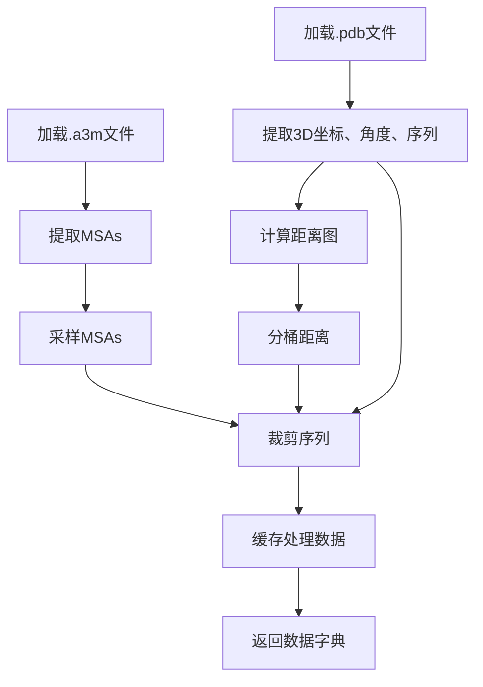

---
slug:15-trrosetta-dataset-usage
blog_type:normal
---


TrRosetta是用于训练蛋白质结构预测模型（如AlphaFold2）的关键数据集。本指南介绍了如何在lucidrains/alphafold2实现中使用TrRosetta数据集，涵盖数据结构、处理方法以及与训练流程的整合。

## TrRosetta数据集是什么？

TrRosetta（transform-restrained Rosetta）是一个包含蛋白质结构信息的数据集，包括：

- 主要序列
- 多序列比对（MSAs）
- 蛋白质结构的3D坐标
- 角度信息
- 残基间距离图

该数据集对于训练蛋白质结构预测模型非常宝贵，因为它提供了序列信息（输入）和结构信息（预测目标）。

来源：[trrosetta.py#L16-L28](training_scripts/datasets/trrosetta.py#L16-L28)

## 数据集结构

本实现中使用的TrRosetta数据集具有以下目录结构：

```
trrosetta/
├── a3m/             # 多序列比对文件
│   └── *.a3m
├── npz/             # 预处理数据文件
│   └── *.npz  
├── pdb/             # 蛋白质结构文件
│   └── *.pdb
├── train_files.txt  # 训练文件名列表
├── valid_files.txt  # 验证文件名列表
└── cache/           # 缓存处理数据（自动创建）
```

数据集在首次使用时会自动下载并提取，默认缓存位置为`~/.cache/alphafold2_pytorch/trrosetta`。

来源：[trrosetta.py#L26-L28](training_scripts/datasets/trrosetta.py#L26-L28), [trrosetta.py#L91-L114](training_scripts/datasets/trrosetta.py#L91-L114)

## 入门指南

### 快速设置

使用TrRosetta数据集最简单的方法是通过提供的`TrRosettaDataModule`类，该类处理下载、处理和创建适当的dataloader：

```python
from training_scripts.datasets.trrosetta import TrRosettaDataModule

# 使用默认设置创建数据模块
data_module = TrRosettaDataModule(
    train_batch_size=4,
    eval_batch_size=2,
    num_workers=4
)

# 设置数据集（如果需要则下载）
data_module.setup()

# 访问dataloader
train_loader = data_module.train_dataloader()
val_loader = data_module.val_dataloader()
```

这会自动下载数据集，如果系统上尚未存在。

来源：[trrosetta.py#L352-L476](training_scripts/datasets/trrosetta.py#L352-L476)

## 数据加载和处理

### 加载过程

当访问数据集时，会发生以下步骤：

1. 读取蛋白质的FASTA文件（`.a3m`）以获取MSAs
2. 解析PDB文件以提取3D坐标、角度和序列
3. 计算距离图并将其分桶到离散的区间
4. 所有数据被缓存以加快后续运行的访问速度

<CgxTip>
对于大规模训练，启用缓存可以显著加快第一轮后的数据加载速度，因为处理PDB和MSA文件计算成本较高。
</CgxTip>

来源：[trrosetta.py#L202-L227](training_scripts/datasets/trrosetta.py#L202-L227)

### 数据预处理

对原始数据应用了几个预处理步骤：

1. **MSA采样**：MSAs可能非常大，因此它们被采样到最大深度
2. **序列裁剪**：长序列被裁剪到最大长度
3. **距离计算**：计算残基间距离（CA-CA或CB-CB）并将其离散化到桶中
4. **标记化**：将氨基酸序列转换为数值标记



来源：[trrosetta.py#L229-L266](training_scripts/datasets/trrosetta.py#L229-L266), [trrosetta.py#L268-L282](training_scripts/datasets/trrosetta.py#L268-L282), [trrosetta.py#L284-L296](training_scripts/datasets/trrosetta.py#L284-L296)

## 批次结构

每个来自dataloader的批次包含以下元素：

| 字段      | 形状                | 描述                                        |
|-----------|--------------------|----------------------------------------------------|
| `id`      | [batch_size]       | 蛋白质标识符                                |
| `seq`     | [batch_size, L]    | 标记化的蛋白质序列                          |
| `msa`     | [batch_size, N, L] | 多序列比对                                  |
| `coords`  | [batch_size, L, 14, 3] | 每个残基的原子坐标                  |
| `angles`  | [batch_size, L, 12] | 二面角                                      |
| `mask`    | [batch_size, L]    | 序列填充掩码（1=有效，0=填充）              |
| `msa_mask`| [batch_size, N, L] | MSA填充掩码（1=有效，0=填充）                |
| `dist`    | [batch_size, L, L] | 残基间距离图（分桶）                        |

其中：
- L = 序列长度（填充到批次中的最大长度）
- N = MSA深度（填充到批次中的最大深度）

来源：[trrosetta.py#L298-L349](training_scripts/datasets/trrosetta.py#L298-L349)

## 配置选项

`TrRosettaDataModule`提供了许多配置选项：

### 基本参数

```python
data_module = TrRosettaDataModule(
    # 数据位置
    data_dir="/path/to/trrosetta",  # 自定义位置（可选）
    
    # 批次大小
    train_batch_size=4,
    eval_batch_size=2,
    test_batch_size=1,
    
    # 并行加载
    num_workers=4
)
```

### 高级参数

```python
data_module = TrRosettaDataModule(
    # 最大序列长度
    train_max_seq_len=256,  # 裁剪训练序列到此长度
    eval_max_seq_len=256,   # 裁剪验证序列到此长度
    test_max_seq_len=-1,    # -1表示不裁剪
    
    # 最大MSA深度
    train_max_msa_num=128,  # 采样训练MSA到此深度
    eval_max_msa_num=256,   # 采样验证MSA到此深度
    test_max_msa_num=512,   # 采样测试MSA到此深度
    
    # 自定义标记化
    tokenize=my_tokenize_function,  # 自定义标记器（可选）
    seq_pad_value=20,               # 填充标记值
    
    # 缓存控制
    overwrite=False  # 设置为True以重新生成缓存
)
```

<CgxTip>
平衡序列长度和MSA深度对于管理GPU内存使用至关重要。对于训练，考虑使用较短的序列和较小的MSA深度，然后随着训练稳定逐渐增加这些值。
</CgxTip>

来源：[trrosetta.py#L352-L414](training_scripts/datasets/trrosetta.py#L352-L414)

## 与训练流程的整合

### PyTorch Lightning整合

`TrRosettaDataModule`是一个PyTorch Lightning DataModule，易于与Lightning训练流程整合：

```python
import pytorch_lightning as pl
from training_scripts.datasets.trrosetta import TrRosettaDataModule
from your_model import AlphaFoldModel

# 初始化数据和模型
data_module = TrRosettaDataModule()
model = AlphaFoldModel()

# 创建并运行训练器
trainer = pl.Trainer(max_epochs=100, gpus=1)
trainer.fit(model, datamodule=data_module)
```

### 命令行整合

对于命令行脚本，可以使用内置的参数解析器：

```python
from argparse import ArgumentParser
from training_scripts.datasets.trrosetta import TrRosettaDataModule

parser = ArgumentParser()
parser = TrRosettaDataModule.add_data_specific_args(parser)
args = parser.parse_args()

data_module = TrRosettaDataModule(**vars(args))
```

这允许您直接通过命令行参数指定数据集参数，例如：

```bash
python train.py --train_batch_size 4 --train_max_seq_len 256 --train_max_msa_num 128
```

来源：[trrosetta.py#L354-L373](training_scripts/datasets/trrosetta.py#L354-L373)

## 结论

TrRosetta数据集提供了训练蛋白质结构预测模型所需的基本组件。本仓库中的实现处理了下载、处理以及将数据集整合到您的训练流程中，具有可配置性和性能优化。

对于高级用法，您可以扩展`TrRosettaDataset`类以添加自定义处理步骤或整合其他数据源，以实现更复杂的训练模式。