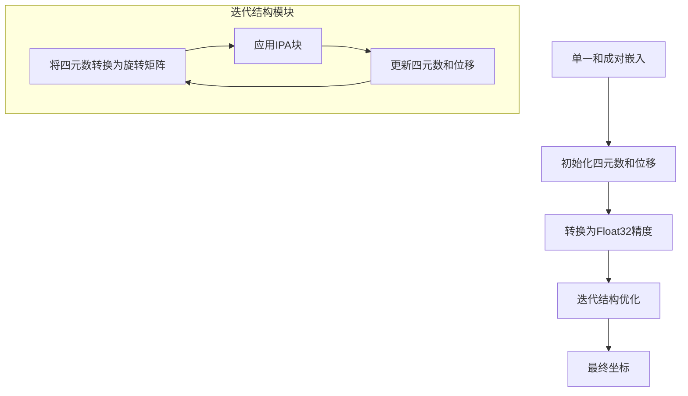

---
slug:16-structure-refinement-techniques
blog_type:normal
---


蛋白质结构预测并不止步于原始输出。就像雕塑家精雕细琢一块大理石一样，预测出的结构通常需要进一步优化以达到最佳质量。本文档探讨了在此AlphaFold2实现中可用的结构优化技术，从内置的迭代坐标优化到与外部优化工具的集成。

## 理解结构优化

结构优化通过优化以下方面来解决初始预测的局限性：
- 键长和键角
- 空间冲突
- 总体能量
- 侧链排列

在AlphaFold2实现中，优化分为两个层次：
1. **内部优化** - 在结构预测过程中通过迭代结构模块进行
2. **外部优化** - 使用PyRosetta等工具进行预测后处理

参考资料：[alphafold2.py#L841-L893](alphafold2_pytorch/alphafold2.py#L841-L893), [refinement.py#L1-L14](scripts/refinement.py#L1-L14)

## 内部结构优化

核心AlphaFold2模型通过结构模块直接将结构优化集成到其预测流程中，该模块使用不变点注意力（IPA）进行迭代坐标优化。

### 结构模块

结构模块以分步方式生成坐标：



1. 首先，模型从MSA中推导出**单一表示**，从主干网络中推导出**成对表示**
2. 建立初始四元数旋转和位移
3. 处理切换到float32精度以进行等变性操作
4. 通过多次迭代优化坐标：
   - 将四元数转换为旋转矩阵
   - 应用不变点注意力（IPA）
   - 更新四元数和位移

参考资料：[alphafold2.py#L843-L893](alphafold2_pytorch/alphafold2.py#L843-L893)

### 不变点注意力块

IPA块是坐标优化的核心。它：
1. 接收单一表示、掩码、成对表示、旋转和位移
2. 等变性地操作（无论坐标框架如何，保持3D空间关系）
3. 更新表示，同时保持几何一致性
4. 输出优化的单一表示，然后更新四元数和位移

参考资料：[alphafold2.py#L873-L879](alphafold2_pytorch/alphafold2.py#L873-L879)

### 坐标更新机制

坐标更新过程基于四元数，提供平滑的旋转更新：
1. 模型从单一表示生成四元数和位移更新
2. 通过四元数乘法应用四元数更新
3. 位移通过旋转感知调整进行更新
4. 局部坐标通过旋转和位移投影到全局空间
5. 该过程重复`structure_module_depth`次迭代（默认为4次）

<CgxTip>
**技术说明：** 使用四元数而非欧拉角是为了避免万向锁问题，为3D旋转在优化过程中提供更稳定的表示。
</CgxTip>

参考资料：[alphafold2.py#L883-L891](alphafold2_pytorch/alphafold2.py#L883-L891)

## 使用PyRosetta进行外部优化

为了对初始预测进行更广泛的优化，该实现通过`refinement.py`脚本提供了与PyRosetta的FastRelax协议的集成。

### FastRelax流程

FastRelax是Rosetta的一个协议，它：
1. 逐渐降低排斥力以解决冲突
2. 执行侧链重排和最小化
3. 迭代优化结构，使其趋向更低能量状态

该实现提供了以下工具：
- 在PDB文件和Rosetta姿态之间转换
- 使用可配置参数运行FastRelax
- 将优化后的结构保存回PDB格式

参考资料：[refinement.py#L22-L74](scripts/refinement.py#L22-L74)

### 使用PyRosetta优化

尽管FastRelax实现尚未完成（标记为`NotImplementedError`），但框架已经就位，只需少量扩展：

```python
# 完成后优化的示例用法
from scripts.refinement import run_fast_relax

# 配置优化参数
config_path = "path/to/config.json"

# 优化预测结构
refined_pose = run_fast_relax(config_path, pdb_route="predicted_structure.pdb")

# 保存优化后的结构
rosetta2pdb(refined_pose, "refined_structure.pdb")
```

参考资料：[refinement.py#L56-L74](scripts/refinement.py#L56-L74)

## 结构质量评估

评估优化结果需要定量指标。该实现提供了`utils.py`模块中的几个标准指标，并在笔记本中进行了演示。

### 关键指标

| 指标 | 描述 | 用途 |
|------|------|------|
| **RMSD** | 均方根偏差 | 衡量对应原子之间的平均距离 |
| **GDT-TS** | 全局距离测试 - 总分 | 评估在1、2、4和8Å内的残基百分比 |
| **GDT-HA** | 全局距离测试 - 高精度 | 评估在0.5、1、2和4Å内的残基百分比 |
| **TM-Score** | 模板建模评分 | 结构相似度的长度归一化度量 |

参考资料：[structure_utils_tests.ipynb#L73-L128](notebooks/structure_utils_tests.ipynb#L73-L128)

### 结构对齐

为了正确比较结构，对齐是必要的。该实现提供了：
- **Kabsch算法** - 用于结构的最佳叠加
- **镜像校正** - 处理手性问题

笔记本中的示例用法：
```python
# 将预测结构与目标对齐
pred_aligned, target_aligned = kabsch_torch(predicted, target)

# 对齐后计算指标
rmsd = RMSD(target_aligned, pred_aligned)
gdt_ts = GDT(target_aligned, pred_aligned, mode="TS")
```

参考资料：[structure_utils_tests.ipynb#L134-L212](notebooks/structure_utils_tests.ipynb#L134-L212)

## 坐标重建

笔记本中展示的一个有趣技术是从距离矩阵使用多维尺度分析（MDS）重建坐标。这可以用于：
1. 将预测的距离矩阵转换为3D坐标
2. 基于改进的距离预测优化坐标
3. 测试结构预测质量

```python
# 笔记本中的示例
preds, stresses = MDScaling(
    dist_mat,
    iters=5,
    tol=1e-5,
    fix_mirror=1,
    eigen=True,
    N_mask=N_mask,
    CA_mask=CA_mask,
    C_mask=C_mask,
    verbose=2
)
```

参考资料：[structure_utils_tests.ipynb#L218-L345](notebooks/structure_utils_tests.ipynb#L218-L345)

## 结构优化的最佳实践

基于该实现和领域内的常见做法：

1. **从高置信度区域开始** - 首先关注预测中高置信度部分的优化
2. **评估优化影响** - 始终比较优化前后的指标
3. **迭代优化** - 考虑多轮逐渐减少约束的优化
4. **结合方法** - 使用内部（结构模块）和外部（PyRosetta）优化技术
5. **领域特定优化** - 对于多域蛋白，考虑单独优化各个域
6. **保持立体化学** - 确保优化不引入立体化学违规

## 结论

结构优化是获得高质量AlphaFold2预测蛋白结构的关键步骤。该实现提供了：

1. 通过结构模块的迭代IPA机制进行内置坐标优化
2. 通过PyRosetta的FastRelax进行外部优化的框架
3. 评估优化质量的综合工具

利用这些优化技术，您可以显著提高预测结构的质量和可靠性，特别是在初始预测可能存在不准确性的区域。