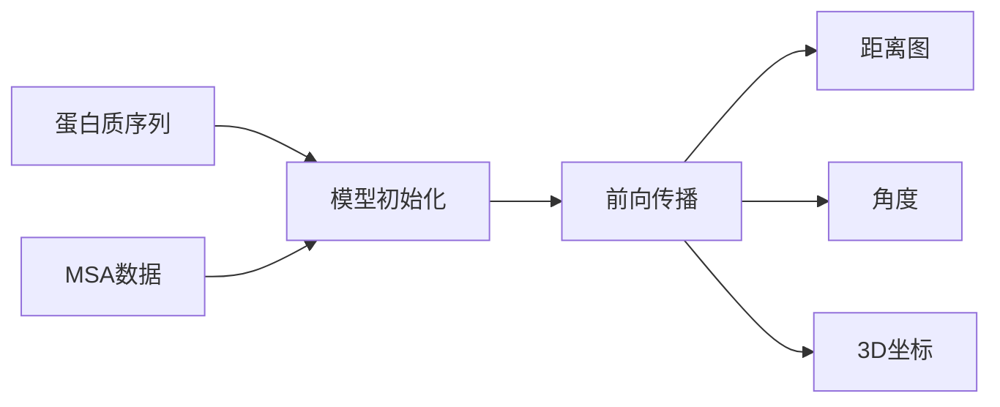
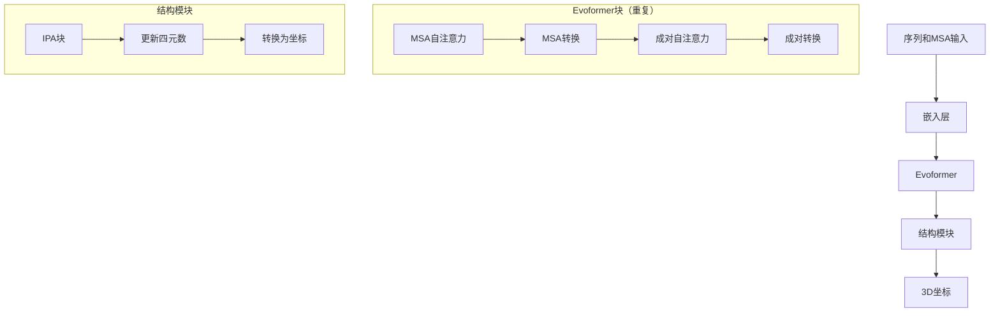

---
slug:4-predicting-protein-structure
blog_type:normal
---


蛋白质结构预测是计算生物学中最重要的挑战之一。本指南将指导您使用AlphaFold2 PyTorch实现，从氨基酸序列和多序列比对（MSA）中预测蛋白质结构。

## 为什么预测蛋白质结构？

蛋白质是生物系统中的主力军，其功能与其3D结构密切相关。能够准确预测蛋白质结构，将解锁无数可能性：

- **药物发现**：设计能与特定蛋白质结合位点相互作用的分子
- **酶工程**：创建或修改具有所需催化特性的蛋白质
- **理解疾病机制**：分析突变如何影响蛋白质的结构和功能

## 预测选项

此实现支持三种级别的结构预测：

| 预测类型 | 描述 | 用例 |
|----------|------|------|
| 距离图 | 残基对之间的距离矩阵 | 快速评估蛋白质折叠 |
| 角度 | 残基之间的扭转角（θ, φ, ω） | 更详细的构象信息 |
| 3D坐标 | 3D空间中的完整原子坐标 | 完整的结构模型 |

来源：[alphafold2.py#L821-L824](alphafold2_pytorch/alphafold2.py#L821-L824), [alphafold2.py#L815-L818](alphafold2_pytorch/alphafold2.py#L815-L818)

## 基本工作流程

以下是蛋白质结构预测的典型工作流程：



## 开始距离图预测

最简单的预测形式是距离图，类似于原始AlphaFold-1产生的结果，但通过注意力机制提高了准确性：

```python
import torch
from alphafold2_pytorch import Alphafold2

# 初始化模型
model = Alphafold2(
    dim = 256,
    depth = 2,
    heads = 8,
    dim_head = 64
).cuda()

# 准备输入数据
seq = torch.randint(0, 21, (1, 128)).cuda()      # 主序列（128个氨基酸）
msa = torch.randint(0, 21, (1, 5, 120)).cuda()   # 包含5个序列的MSA
mask = torch.ones_like(seq).bool().cuda()
msa_mask = torch.ones_like(msa).bool().cuda()

# 生成距离图预测
distogram = model(
    seq,
    msa,
    mask = mask,
    msa_mask = msa_mask
) # 输出形状： (1, 128, 128, 37)
```

输出距离图的形状为 `(batch_size, seq_length, seq_length, num_distance_bins)`，其中每个值表示残基在特定距离范围内的概率。

来源：[README.md#L29-L54](README.md#L29-L54)

## 预测角度

为了获得更详细的结构信息，您可以预测扭转角（类似于trRosetta），通过启用 `predict_angles` 选项：

```python
model = Alphafold2(
    dim = 256,
    depth = 2,
    heads = 8,
    dim_head = 64,
    predict_angles = True   # 启用角度预测
).cuda()

# 进行预测
distogram, theta, phi, omega = model(
    seq,
    msa,
    mask = mask,
    msa_mask = msa_mask
)

# 输出形状：
# distogram - (1, 128, 128, 37) - 距离概率
# theta     - (1, 128, 128, 25) - Theta角概率
# phi       - (1, 128, 128, 13) - Phi角概率
# omega     - (1, 128, 128, 25) - Omega角概率
```

角度预测包含离散角区间的概率分布，允许您重建蛋白质骨架。

来源：[README.md#L56-L86](README.md#L56-L86), [alphafold2.py#L834-L836](alphafold2_pytorch/alphafold2.py#L834-L836)

<CgxTip>
**提示**：当您需要骨架构象但不要求完整原子细节时，角度预测特别有用。它们在计算效率和结构细节之间提供了良好的平衡。
</CgxTip>

## 预测完整的3D坐标

为了进行完整的结构预测，您可以启用坐标预测，该预测使用不变点注意力（IPA）模块生成原子坐标：

```python
model = Alphafold2(
    dim = 256,
    depth = 2,
    heads = 8,
    dim_head = 64,
    predict_coords = True,
    structure_module_depth = 4,
    structure_module_heads = 1,
    structure_module_dim_head = 4
).cuda()

# 生成3D坐标
coords = model(
    seq,
    msa,
    mask = mask,
    msa_mask = msa_mask
) # 输出形状： (batch_size, seq_length * num_atoms, 3)
```

默认情况下，模型预测每个残基的3个骨架原子（N, Cα, C）的坐标。输出形状将为 `(batch_size, sequence_length * 3, 3)`，表示每个原子的 (x, y, z) 坐标。

来源：[alphafold2.py#L853-L891](alphafold2_pytorch/alphafold2.py#L853-L891), [README.md#L88-L126](README.md#L88-L126)

## 选择原子类型

您可以自定义坐标预测中包含哪些原子：

```python
model = Alphafold2(
    dim = 256,
    depth = 2,
    heads = 8,
    dim_head = 64,
    predict_coords = True,
    atoms = 'backbone-with-cbeta'  # 包含C-beta原子
).cuda()

coords = model(seq, msa, mask=mask, msa_mask=msa_mask)
# 输出现在包含每个残基的4个原子
```

可用的原子选项包括：
- `backbone` - 3个骨架原子（N, Cα, C）[默认]
- `backbone-with-cbeta` - 3个骨架原子加上Cβ
- `backbone-with-oxygen` - 3个骨架原子加上羰基氧
- `backbone-with-cbeta-and-oxygen` - 3个骨架原子加上Cβ和氧
- `all` - 包括侧链的所有原子

来源：[README.md#L128-L173](README.md#L128-L173)

## 结构预测过程解析

AlphaFold2中的结构预测过程涉及几个关键步骤：

1. **嵌入**：将氨基酸序列和MSA转换为连续的向量表示
2. **Evoformer处理**：通过多个Evoformer块处理嵌入，捕捉进化和空间关系
3. **结构模块**：通过迭代精化将表示转换为3D结构



结构模块使用迭代精化方法，其中每一层改进结构预测，应用一系列旋转和平移以产生最终的3D坐标。

来源：[alphafold2.py#L412-L467](alphafold2_pytorch/alphafold2.py#L412-L467), [alphafold2.py#L853-L891](alphafold2_pytorch/alphafold2.py#L853-L891)

## 使用预训练嵌入改进预测

您可以通过结合来自ESM或ProtTrans等模型的预训练蛋白质语言模型嵌入，来提高预测质量：

```python
from alphafold2_pytorch import Alphafold2
from alphafold2_pytorch.embeds import ESMEmbedWrapper

# 创建基础AlphaFold2模型
alphafold2 = Alphafold2(
    dim = 256,
    depth = 2,
    heads = 8,
    dim_head = 64,
    predict_coords = True
)

# 用嵌入模型包装
model = ESMEmbedWrapper(
    alphafold2,
    esm_model = 'esm1b_t33_650M_UR50S'  # 预训练的ESM模型
)

# 现在您可以输入原始序列
sequences = ['MKTVLIAGVLAVVALAASFLHPGGRSAIEDQEDFGLFQKLAKEQGVTQQ']
coords = model(sequences)
```

这种方法自动处理嵌入生成，可以显著提高预测准确性，特别是对于同源性信息有限的蛋白质。

## 使用循环精化预测

为了提高准确性，您可以使用坐标循环，将前一次迭代的预测结果反馈到模型中：

```python
model = Alphafold2(
    dim = 256,
    depth = 2,
    heads = 8,
    dim_head = 64,
    predict_coords = True
).cuda()

# 第一次传递以获取初始预测
coords, recyclables = model(
    seq, 
    msa, 
    mask=mask, 
    msa_mask=msa_mask, 
    return_recyclables=True
)

# 第二次传递使用循环信息
refined_coords = model(
    seq,
    msa,
    mask=mask,
    msa_mask=msa_mask,
    recyclables=recyclables
)
```

循环允许模型基于初始结构估计细化其预测，通常会产生更准确的最终结构。

来源：[alphafold2.py#L730-L739](alphafold2_pytorch/alphafold2.py#L730-L739), [alphafold2.py#L895-L897](alphafold2_pytorch/alphafold2.py#L895-L897)

## 解释和可视化结果

预测完成后，您将希望可视化和分析您的结构。以下是一个使用PyMOL的简单示例（您需要先将张量转换为坐标并保存为PDB文件）：

```python
import torch
import numpy as np
from alphafold2_pytorch import Alphafold2
from alphafold2_pytorch.utils import coords_to_pdb_file

# 进行预测
model = Alphafold2(dim=256, depth=2, heads=8, predict_coords=True).cuda()
coords = model(seq, msa, mask=mask, msa_mask=msa_mask)

# 转换为numpy并保存为PDB
coords_np = coords[0].cpu().detach().numpy()  # 批量中的第一个结构
pdb_file = coords_to_pdb_file(coords_np, 'predicted_structure.pdb', seq[0])

# 现在在PyMOL或其他分子可视化软件中打开
```

## 结论

本指南已向您介绍了使用AlphaFold2 PyTorch实现预测蛋白质结构的过程。从基本的距离图预测到完整的3D坐标生成，您现在拥有了应用这一强大模型进行蛋白质结构预测任务的工具。

请记住，尽管此实现提供了最先进的预测能力，但您的结果准确性将取决于输入数据的质量，特别是MSA。为了获得最佳结果，请为您的目标蛋白质创建多样化和信息丰富的MSA。

在下一个教程中，我们将探讨使用提供的Jupyter笔记本进行更互动的蛋白质结构分析。