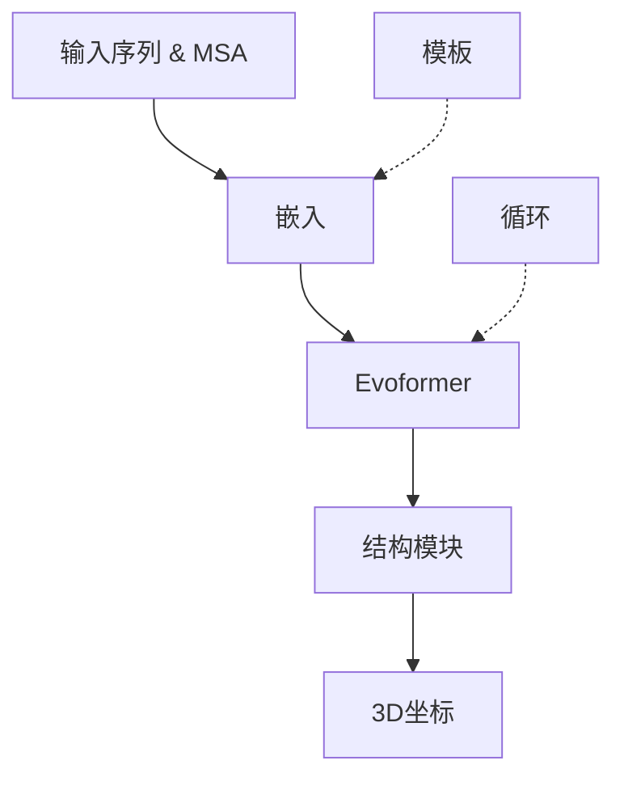
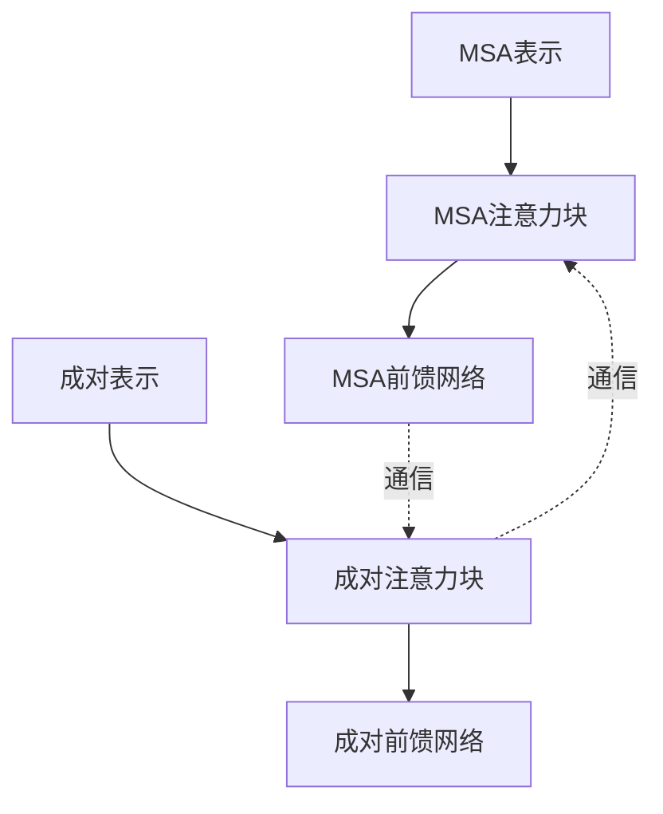
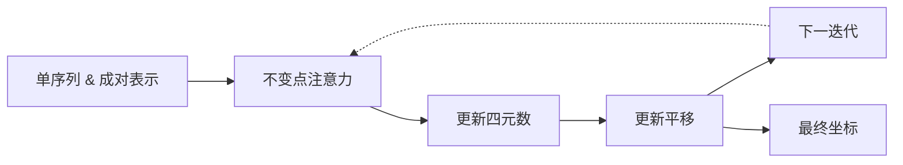

---
slug:9-alphafold2-architecture
blog_type:normal
---


AlphaFold2代表了蛋白质结构预测领域的一次革命性突破。本文档全面概述了该PyTorch版本中实现的架构，解释了关键组件及其相互作用。

## 架构概述

本仓库中的AlphaFold2实现遵循DeepMind的AlphaFold2论文中描述的开创性模型，并适配了PyTorch。该模型通过复杂的神经网络架构将蛋白质序列信息转换为精确的3D结构预测。



架构由三个主要阶段组成：
1. **嵌入生成**：将序列和MSA转换为丰富的特征表示
2. **Evoformer处理**：通过深度注意力机制转换这些表示
3. **结构模块**：将学到的表示转换为3D坐标

来源：[alphafold2.py#L469-L505](alphafold2_pytorch/alphafold2.py#L469-L505)

## 核心组件

### 1. 主AlphaFold2类

`Alphafold2`类作为整合所有模型部分的中心组件。它处理输入（蛋白质序列、MSA、模板），通过神经网络层进行处理，并生成结构预测。

关键参数包括：
- `dim`：嵌入维度
- `depth`：Evoformer块的数量
- `heads`：注意力头的数量
- `predict_coords`：是否预测3D坐标
- `predict_angles`：是否预测扭转角

来源：[alphafold2.py#L469-L627](alphafold2_pytorch/alphafold2.py#L469-L627)

### 2. Evoformer

Evoformer是模型表示学习的核心，由堆叠的EvoformerBlocks组成，用于转换和细化表示：



Evoformer处理两个关键表示：
- **MSA表示**：从多重序列比对中编码进化信息
- **成对表示**：捕捉氨基酸残基之间的相互作用

来源：[alphafold2.py#L412-L467](alphafold2_pytorch/alphafold2.py#L412-L467)

### 3. EvoformerBlock

每个EvoformerBlock包括：

1. **成对注意力块**：处理成对表示
   - 三角乘法（传出和传入）
   - 三角注意力（传出和传入）
   
2. **MSA注意力块**：更新MSA表示
   - 行注意力（沿序列）
   - 列注意力（沿比对位置）

3. **前馈网络**：用于成对和MSA表示

这些组件共同作用，使MSA和成对表示之间的信息流动，捕捉残基之间的复杂关系。

来源：[alphafold2.py#L412-L446](alphafold2_pytorch/alphafold2.py#L412-L446)

### 4. 结构模块

结构模块通过迭代细化将抽象表示转换为3D坐标：



关键组件：
- **不变点注意力（IPA）**：尊重3D等变的注意力机制
- **四元数更新**：旋转细化
- **平移更新**：位置细化

该模块通过`structure_module_depth`次迭代细化坐标，确保几何一致性。

来源：[alphafold2.py#L853-L892](alphafold2_pytorch/alphafold2.py#L853-L892)

## 特殊注意力机制

### 1. 轴向注意力

轴向注意力通过将2D特征图分离为行和列注意力操作，提供了一种高效的处理方式。这种方法用于MSA和成对表示处理。

关键类：
- `AxialAttention`：执行行或列注意力
- 参数：`row_attn`、`col_attn`和`global_query_attn`

来源：[alphafold2.py#L192-L255](alphafold2_pytorch/alphafold2.py#L192-L255)

### 2. 三角乘法模块

该模块在成对表示的三角形内实现乘法更新，具有两种混合模式：

- **传出**：`i,k → i,j`混合残基对
- **传入**：`k,j → i,j`混合残基对

这些操作有助于捕捉氨基酸残基之间的高阶相互作用。

来源：[alphafold2.py#L257-L317](alphafold2_pytorch/alphafold2.py#L257-L317)

### 3. 成对和MSA注意力块

这些专用块协调信息流动：

- `PairwiseAttentionBlock`：处理成对表示更新，通过外积均值整合MSA信息
- `MsaAttentionBlock`：使用行和列注意力处理MSA表示

来源：[alphafold2.py#L353-L408](alphafold2_pytorch/alphafold2.py#L353-L408)

## 输入处理

### 1. 序列和MSA嵌入

模型将输入序列和MSA嵌入到高维向量表示中：

- **标记嵌入**：将氨基酸身份映射到向量
- **位置嵌入**：编码残基之间的相对位置

来源：[alphafold2.py#L507-L514](alphafold2_pytorch/alphafold2.py#L507-L514), [alphafold2.py#L676-L712](alphafold2_pytorch/alphafold2.py#L676-L712)

### 2. 成对表示生成

成对表示从单序列嵌入生成：

```python
x_left, x_right = self.to_pairwise_repr(x).chunk(2, dim = -1)
x = rearrange(x_left, 'b i d -> b i () d') + rearrange(x_right, 'b j d-> b () j d')
```

这为序列中的每个位置对（i,j）创建一个表示。

来源：[alphafold2.py#L715-L717](alphafold2_pytorch/alphafold2.py#L715-L717)

### 3. 模板处理

当模板可用时，模型会整合这些信息：

1. **模板特征嵌入**：`self.to_template_embed`
2. **模板成对处理**：通过`template_pairwise_embedder`
3. **模板点注意力**：将模板信息与查询序列整合

来源：[alphafold2.py#L743-L778](alphafold2_pytorch/alphafold2.py#L743-L778)

## 输出预测

### 1. 距离预测

模型预测残基对之间的距离分布：

```python
trunk_embeds = (x + rearrange(x, 'b i j d -> b j i d')) * 0.5  # 对称化
distance_pred = self.to_distogram_logits(trunk_embeds)
```

输出是跨距离桶的logit分布，形成距离图。

来源：[alphafold2.py#L820-L823](alphafold2_pytorch/alphafold2.py#L820-L823)

### 2. 角度预测（可选）

当`predict_angles=True`时，模型预测扭转角：
- `theta_logits`：用于theta角
- `phi_logits`：用于phi角
- `omega_logits`：用于omega角

来源：[alphafold2.py#L815-L837](alphafold2_pytorch/alphafold2.py#L815-L837)

### 3. 3D结构预测（可选）

当`predict_coords=True`时，模型通过结构模块将表示转换为3D坐标：

1. 推导单序列和成对表示
2. 初始化四元数和平移
3. 通过不变点注意力迭代细化
4. 输出最终坐标

来源：[alphafold2.py#L841-L905](alphafold2_pytorch/alphafold2.py#L841-L905)

## 高级特性

### 1. 循环机制

模型支持循环预测以细化结果：

```python
if exists(recyclables):
    m[:, 0] = m[:, 0] + self.recycling_msa_norm(recyclables.single_msa_repr_row)
    x = x + self.recycling_pairwise_norm(recyclables.pairwise_repr)
    # ... 距离嵌入 ...
```

这允许之前的预测信息改进后续迭代。

来源：[alphafold2.py#L730-L739](alphafold2_pytorch/alphafold2.py#L730-L739)

### 2. 掩码语言建模（MLM）

用于训练时，模型支持在MSA上的掩码语言建模目标：

```python
if self.training and exists(msa):
    original_msa = msa
    msa_mask = default(msa_mask, lambda: torch.ones_like(msa).bool())
    noised_msa, replaced_msa_mask = self.mlm.noise(msa, msa_mask)
    msa = noised_msa
```

这有助于模型从可用的MSA数据中学习更好的表示。

来源：[alphafold2.py#L683-L688](alphafold2_pytorch/alphafold2.py#L683-L688)

<CgxTip>
**性能提示**：实现中使用PyTorch的检查点机制（`checkpoint_sequential`）在Evoformer内，以计算换内存效率，使得在有限的GPU内存中训练更深的模型成为可能。
</CgxTip>

## 结论

本仓库中的AlphaFold2架构全面实现了DeepMind的开创性蛋白质结构预测系统。通过其精心设计的组件——从专用注意力机制到结构模块——它能够从序列信息中实现极为精确的蛋白质结构预测。

模块化设计在训练和推理中提供了灵活性，支持角度预测、坐标预测，并在模板可用时利用模板。理解这一架构为解决蛋白质折叠问题的最新方法提供了宝贵见解。