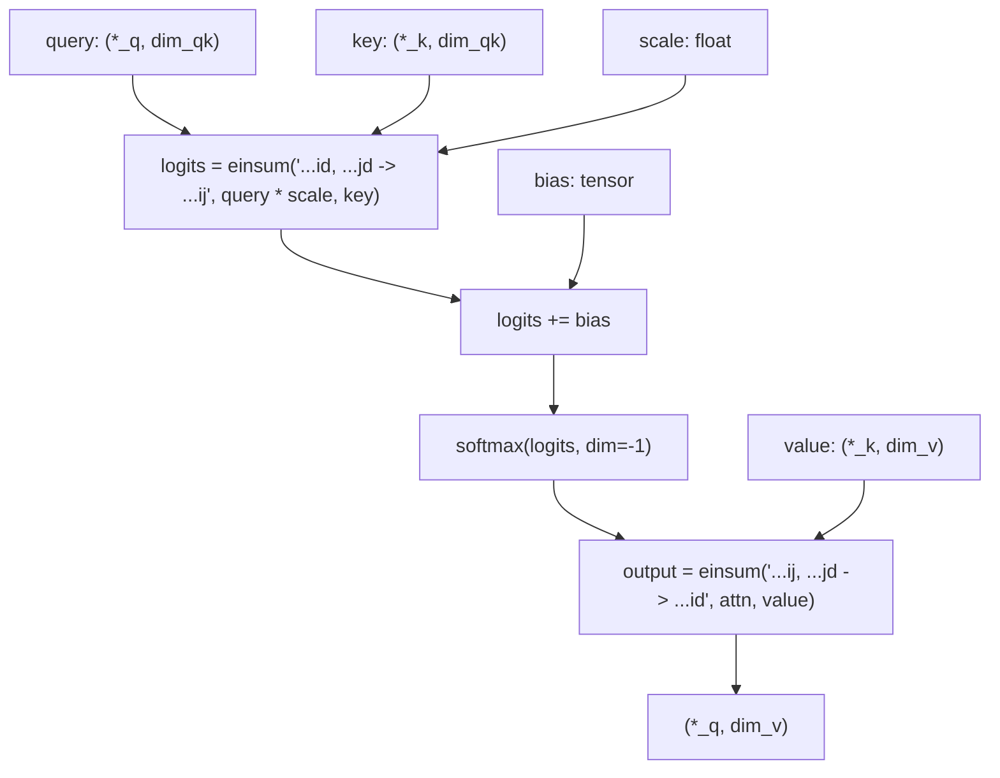
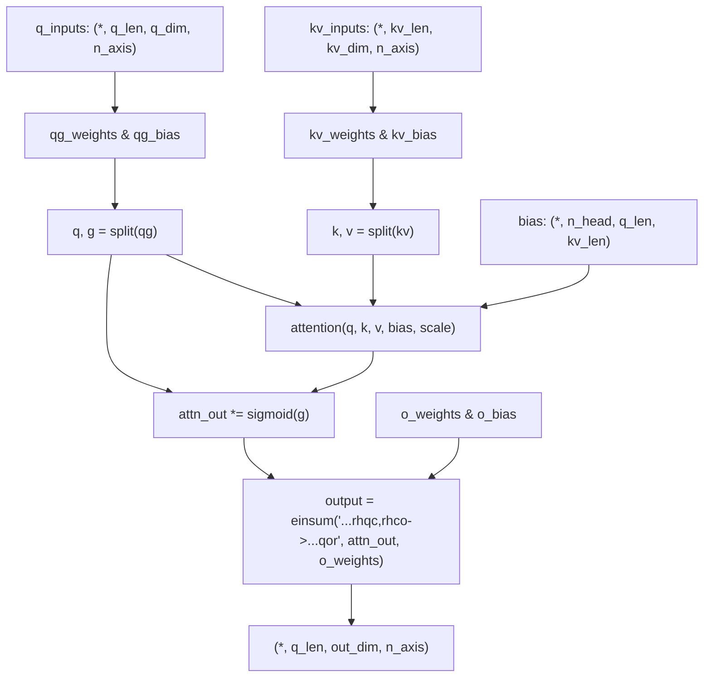
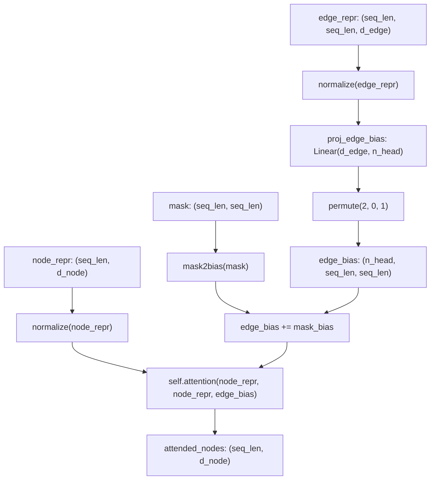
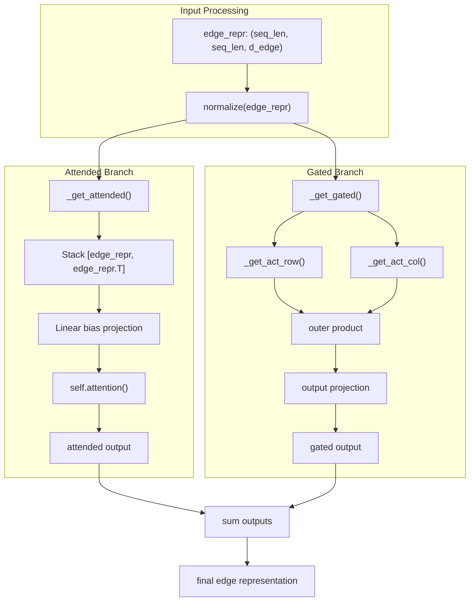
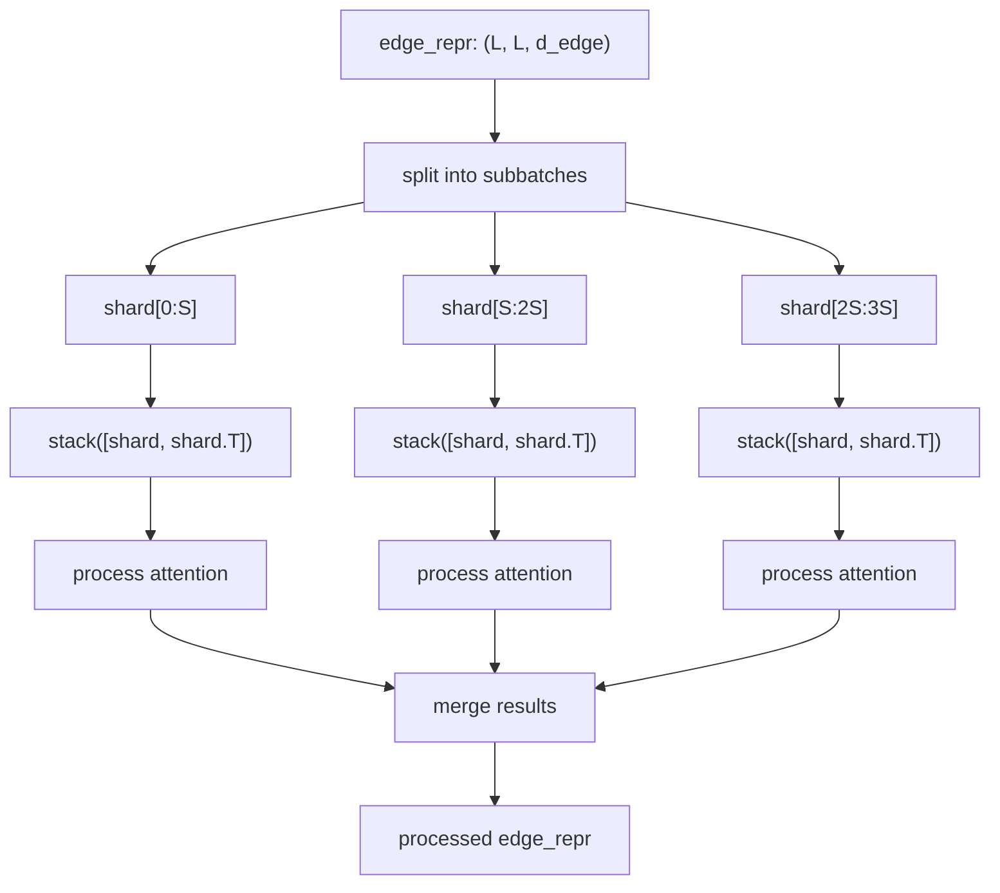
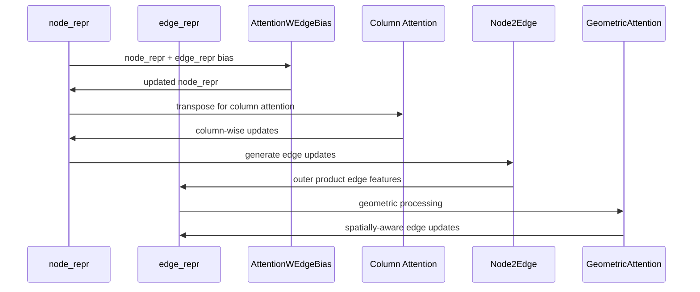
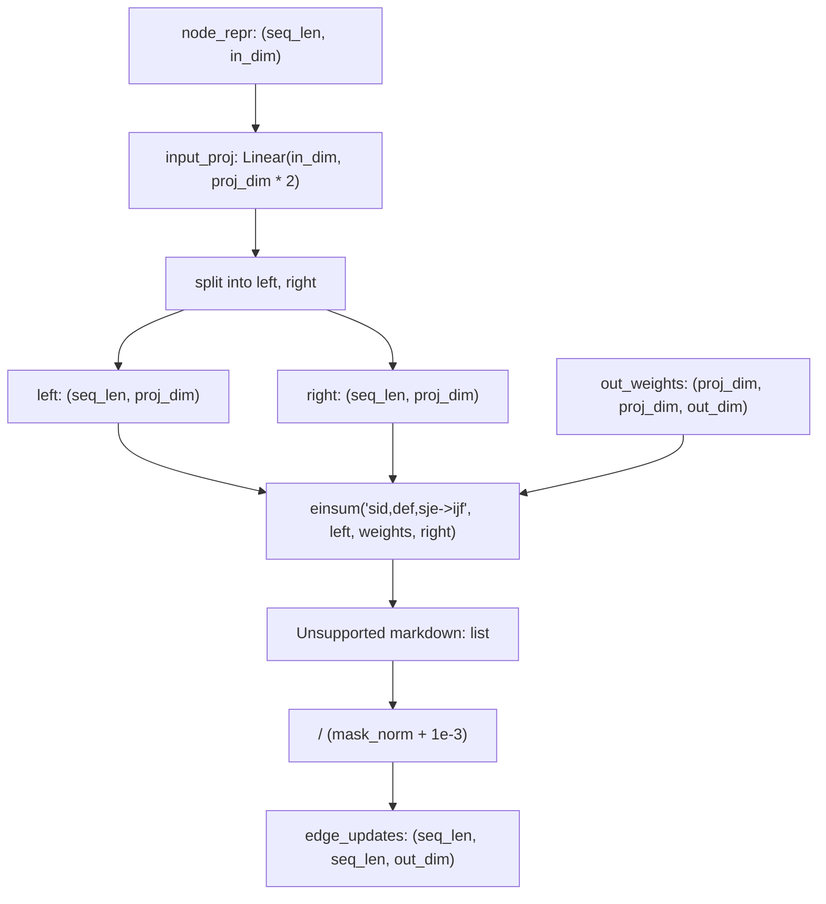

# Attention Mechanisms

> **Relevant source files**
> * [omegafold/geoformer.py](https://github.com/HeliXonProtein/OmegaFold/blob/313c873a/omegafold/geoformer.py)
> * [omegafold/modules.py](https://github.com/HeliXonProtein/OmegaFold/blob/313c873a/omegafold/modules.py)

This page documents the various attention mechanisms used throughout OmegaFold's neural network architecture. These components form the foundational building blocks for processing protein sequence and structural information. The attention mechanisms handle different aspects of the protein structure prediction task, from standard sequence-to-sequence attention to specialized geometric and edge-aware attention.

For information about how these attention mechanisms are integrated into the complete model architecture, see [Core Model Components](/HeliXonProtein/OmegaFold/4-core-model-components). For details on the embedding systems that provide inputs to these attention mechanisms, see [Embedding Systems](/HeliXonProtein/OmegaFold/5.2-embedding-systems).

## Core Attention Function

The foundation of all attention mechanisms in OmegaFold is the `attention()` function in [omegafold/modules.py L104-L164](https://github.com/HeliXonProtein/OmegaFold/blob/313c873a/omegafold/modules.py#L104-L164)

 This function implements the standard scaled dot-product attention with support for subbatching to manage memory usage during inference.

### Attention Data Flow

The function supports subbatching through the `subbatch_size` parameter, splitting large sequences into manageable chunks to avoid memory overflow. The core computation is performed by the internal `_attention()` function [omegafold/modules.py L69-L101](https://github.com/HeliXonProtein/OmegaFold/blob/313c873a/omegafold/modules.py#L69-L101)

Sources: [omegafold/modules.py L69-L164](https://github.com/HeliXonProtein/OmegaFold/blob/313c873a/omegafold/modules.py#L69-L164)

## Standard Multi-Headed Attention

The `Attention` class [omegafold/modules.py L375-L495](https://github.com/HeliXonProtein/OmegaFold/blob/313c873a/omegafold/modules.py#L375-L495)

 implements the standard multi-headed attention mechanism with several OmegaFold-specific enhancements:

### Architecture Overview

### Key Features

| Component | Purpose | Parameters |
| --- | --- | --- |
| `qg_weights` | Query and gate projection | `(q_dim, n_axis, n_head, (gating + 1) * c)` |
| `kv_weights` | Key and value projection | `(kv_dim, n_axis, n_head, 2 * c)` |
| `o_weights` | Output projection | `(n_axis, n_head, c, out_dim)` |
| `gating` | Optional gating mechanism | Boolean flag |

The attention mechanism supports an optional gating mechanism where attention outputs are element-wise multiplied by sigmoid-activated gate values [omegafold/modules.py L490-L492](https://github.com/HeliXonProtein/OmegaFold/blob/313c873a/omegafold/modules.py#L490-L492)

Sources: [omegafold/modules.py L375-L495](https://github.com/HeliXonProtein/OmegaFold/blob/313c873a/omegafold/modules.py#L375-L495)

## Edge-Biased Attention

The `AttentionWEdgeBias` class [omegafold/modules.py L497-L548](https://github.com/HeliXonProtein/OmegaFold/blob/313c873a/omegafold/modules.py#L497-L548)

 extends standard attention by incorporating edge representations as bias terms. This mechanism is crucial for integrating pairwise relationships between residues.

### Edge Bias Integration

This mechanism allows the attention weights to be influenced by edge features, enabling the model to consider pairwise residue relationships during attention computation.

Sources: [omegafold/modules.py L497-L548](https://github.com/HeliXonProtein/OmegaFold/blob/313c873a/omegafold/modules.py#L497-L548)

## Geometric Attention

The `GeometricAttention` class [omegafold/modules.py L569-L706](https://github.com/HeliXonProtein/OmegaFold/blob/313c873a/omegafold/modules.py#L569-L706)

 implements the most sophisticated attention mechanism in OmegaFold, designed specifically for processing geometric and spatial relationships in protein structures.

### Dual Processing Architecture

### Memory-Efficient Sharding

The geometric attention uses a sophisticated sharding mechanism through `_get_sharded_stacked()` [omegafold/modules.py L551-L566](https://github.com/HeliXonProtein/OmegaFold/blob/313c873a/omegafold/modules.py#L551-L566)

 to handle large protein sequences:

Sources: [omegafold/modules.py L569-L706](https://github.com/HeliXonProtein/OmegaFold/blob/313c873a/omegafold/modules.py#L569-L706)

 [omegafold/modules.py L551-L566](https://github.com/HeliXonProtein/OmegaFold/blob/313c873a/omegafold/modules.py#L551-L566)

## Integration in GeoFormer

The attention mechanisms work together in the `GeoFormerBlock` [omegafold/geoformer.py L43-L137](https://github.com/HeliXonProtein/OmegaFold/blob/313c873a/omegafold/geoformer.py#L43-L137)

 to process both node and edge representations:

### GeoFormer Attention Flow

### Attention Usage Pattern

| Layer | Attention Type | Purpose |
| --- | --- | --- |
| `attention_w_edge_bias` | `AttentionWEdgeBias` | Node updates with edge bias |
| `column_attention` | `Attention` | Column-wise node processing |
| `geometric_attention` | `GeometricAttention` | Spatial edge processing |

The column attention operates on transposed node representations [omegafold/geoformer.py L128-L137](https://github.com/HeliXonProtein/OmegaFold/blob/313c873a/omegafold/geoformer.py#L128-L137)

 enabling the model to process sequences along different dimensions.

Sources: [omegafold/geoformer.py L43-L137](https://github.com/HeliXonProtein/OmegaFold/blob/313c873a/omegafold/geoformer.py#L43-L137)

 [omegafold/geoformer.py L128-L137](https://github.com/HeliXonProtein/OmegaFold/blob/313c873a/omegafold/geoformer.py#L128-L137)

## Node-to-Edge Communication

The `Node2Edge` class [omegafold/modules.py L341-L372](https://github.com/HeliXonProtein/OmegaFold/blob/313c873a/omegafold/modules.py#L341-L372)

 facilitates communication between node and edge representations through an efficient outer product mechanism:

This mechanism enables the model to update edge representations based on current node states, facilitating information flow between sequence and pairwise representations.

Sources: [omegafold/modules.py L341-L372](https://github.com/HeliXonProtein/OmegaFold/blob/313c873a/omegafold/modules.py#L341-L372)