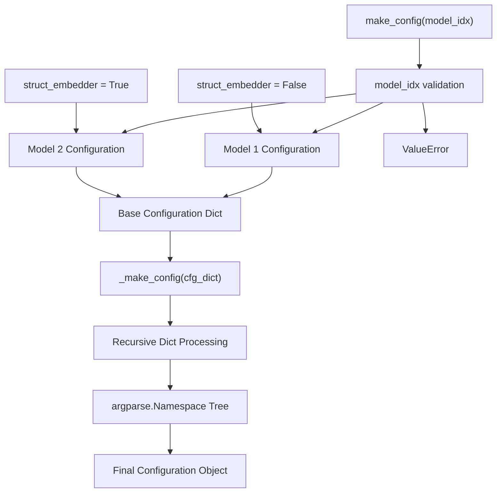
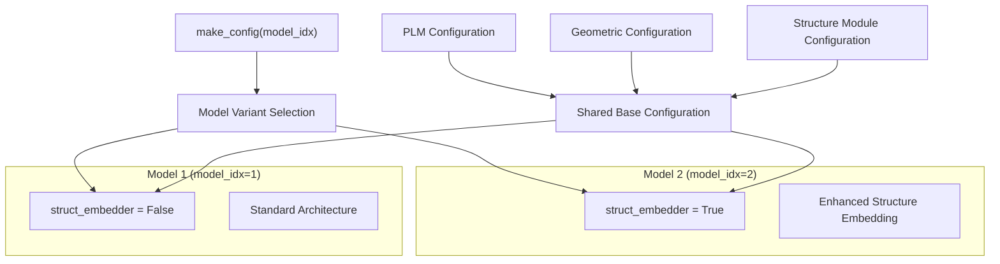
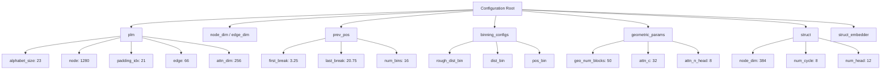
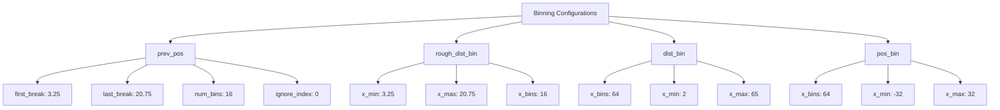
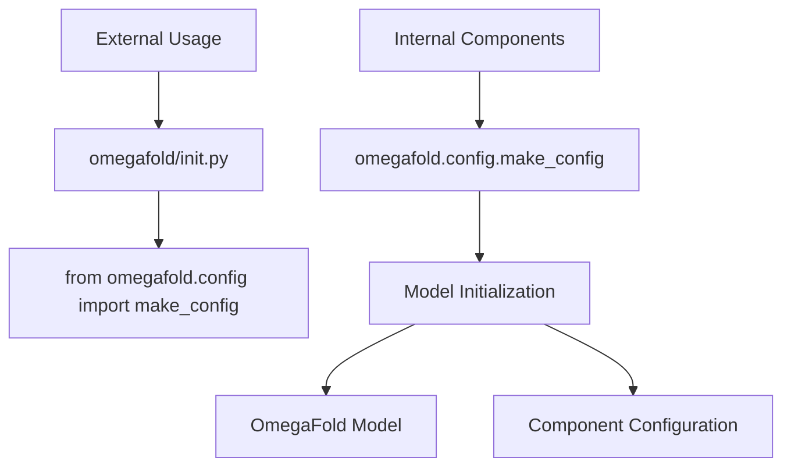

# Configuration Management

> **Relevant source files**
> * [omegafold/__init__.py](https://github.com/HeliXonProtein/OmegaFold/blob/313c873a/omegafold/__init__.py)
> * [omegafold/config.py](https://github.com/HeliXonProtein/OmegaFold/blob/313c873a/omegafold/config.py)

## Purpose and Scope

This document covers OmegaFold's configuration management system, which defines and manages model parameters across different model variants. The configuration system provides a centralized approach to handling hyperparameters, architectural settings, and component-specific configurations used throughout the neural network pipeline.

For information about how these configurations are applied within the core model components, see [Core Model Components](/HeliXonProtein/OmegaFold/4-core-model-components). For details on the pipeline execution system that consumes these configurations, see [Execution Pipeline](/HeliXonProtein/OmegaFold/6-execution-pipeline).

## Configuration System Overview

OmegaFold uses a hierarchical configuration system based on nested dictionaries that are converted to `argparse.Namespace` objects for convenient attribute access. The system supports multiple model variants with different architectural configurations.

**Configuration Creation Flow**

Sources: [omegafold/config.py L43-L111](https://github.com/HeliXonProtein/OmegaFold/blob/313c873a/omegafold/config.py#L43-L111)

The configuration system provides two main functions:

| Function | Purpose | Parameters |
| --- | --- | --- |
| `make_config` | Creates complete model configuration | `model_idx`: 1 or 2 |
| `_make_config` | Recursively converts dict to Namespace | `input_dict`: nested dictionary |

Sources: [omegafold/config.py L32-L41](https://github.com/HeliXonProtein/OmegaFold/blob/313c873a/omegafold/config.py#L32-L41)

 [omegafold/config.py L43-L111](https://github.com/HeliXonProtein/OmegaFold/blob/313c873a/omegafold/config.py#L43-L111)

## Model Variants

OmegaFold supports two distinct model variants, differentiated primarily by their structure embedding capabilities:

**Model Variant Comparison**

Sources: [omegafold/config.py L44-L45](https://github.com/HeliXonProtein/OmegaFold/blob/313c873a/omegafold/config.py#L44-L45)

 [omegafold/config.py L110](https://github.com/HeliXonProtein/OmegaFold/blob/313c873a/omegafold/config.py#L110-L110)

## Configuration Parameter Hierarchy

The configuration is organized into logical component groups, each handling specific aspects of the model architecture:

**Configuration Structure**

Sources: [omegafold/config.py L46-L109](https://github.com/HeliXonProtein/OmegaFold/blob/313c873a/omegafold/config.py#L46-L109)

### Core Configuration Categories

**1. Protein Language Model (PLM) Configuration**

| Parameter | Value | Purpose |
| --- | --- | --- |
| `alphabet_size` | 23 | Vocabulary size for PLM |
| `node` | 1280 | Node dimension |
| `padding_idx` | 21 | Padding token index |
| `edge` | 66 | Edge feature dimension |
| `proj_dim` | 2560 | Projection dimension (1280 * 2) |
| `attn_dim` | 256 | Attention dimension |
| `num_head` | 1 | Number of attention heads |
| `num_relpos` | 129 | Number of relative positions |
| `masked_ratio` | 0.12 | Masking ratio for training |

Sources: [omegafold/config.py L48-L58](https://github.com/HeliXonProtein/OmegaFold/blob/313c873a/omegafold/config.py#L48-L58)

**2. Geometric Processing Configuration**

| Parameter | Value | Purpose |
| --- | --- | --- |
| `geo_num_blocks` | 50 | Number of geometric blocks |
| `gating` | True | Enable gating mechanism |
| `attn_c` | 32 | Attention channel dimension |
| `attn_n_head` | 8 | Number of attention heads |
| `transition_multiplier` | 4 | Feed-forward expansion factor |
| `activation` | "ReLU" | Activation function |

Sources: [omegafold/config.py L84-L89](https://github.com/HeliXonProtein/OmegaFold/blob/313c873a/omegafold/config.py#L84-L89)

**3. Structure Module Configuration**

| Parameter | Value | Purpose |
| --- | --- | --- |
| `node_dim` | 384 | Node feature dimension |
| `edge_dim` | 128 | Edge feature dimension |
| `num_cycle` | 8 | Number of recycling cycles |
| `num_transition` | 3 | Number of transition layers |
| `num_head` | 12 | Number of attention heads |
| `num_point_qk` | 4 | Point attention query/key points |
| `num_point_v` | 8 | Point attention value points |
| `num_scalar_qk` | 16 | Scalar attention query/key dimension |
| `num_scalar_v` | 16 | Scalar attention value dimension |

Sources: [omegafold/config.py L94-L108](https://github.com/HeliXonProtein/OmegaFold/blob/313c873a/omegafold/config.py#L94-L108)

## Distance and Position Binning

The configuration defines multiple binning schemes for different distance and position representations:

**Binning Configuration Structure**

Sources: [omegafold/config.py L62-L82](https://github.com/HeliXonProtein/OmegaFold/blob/313c873a/omegafold/config.py#L62-L82)

## Configuration Integration

The configuration system integrates with the broader OmegaFold architecture through the package's `__init__.py`, making configurations easily accessible to other components:

**Configuration Integration Flow**

Sources: [omegafold/__init__.py L23](https://github.com/HeliXonProtein/OmegaFold/blob/313c873a/omegafold/__init__.py#L23-L23)

 [omegafold/__init__.py L24](https://github.com/HeliXonProtein/OmegaFold/blob/313c873a/omegafold/__init__.py#L24-L24)

The configuration object provides dotted-notation access to all parameters, enabling clean integration with PyTorch modules and other system components. For example, `config.plm.node` accesses the PLM node dimension, while `config.struct.num_cycle` retrieves the number of structure refinement cycles.

Sources: [omegafold/config.py L32-L41](https://github.com/HeliXonProtein/OmegaFold/blob/313c873a/omegafold/config.py#L32-L41)