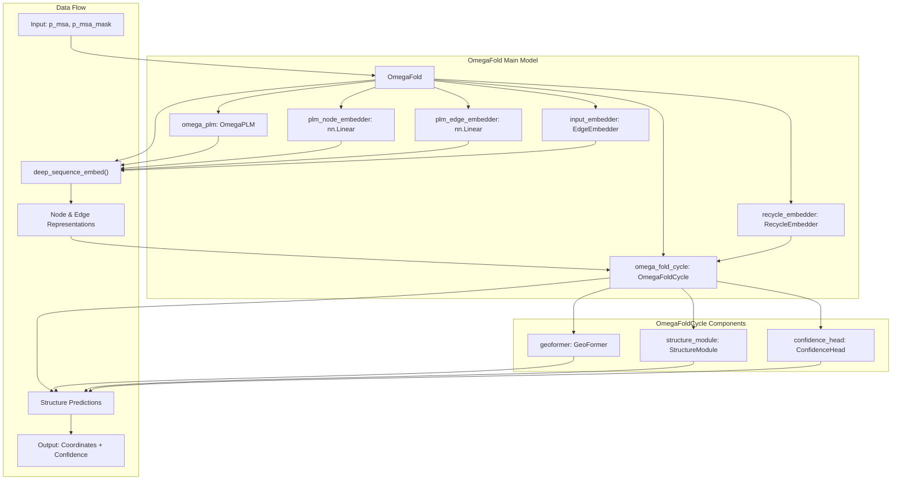
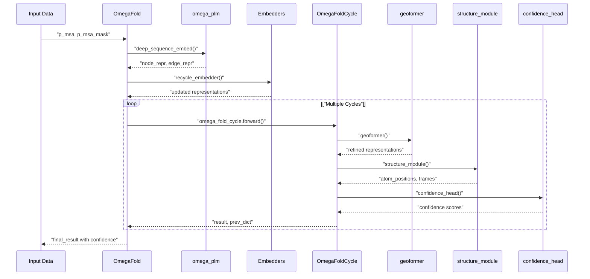

# Core Model Components

> **Relevant source files**
> * [omegafold/model.py](https://github.com/HeliXonProtein/OmegaFold/blob/313c873a/omegafold/model.py)

This document provides an overview of the main neural network architecture and model components that form the core of OmegaFold's protein structure prediction system. The core model components orchestrate the iterative prediction process, coordinate between different specialized modules, and manage the flow of information through the prediction pipeline.

For detailed information about neural network building blocks and attention mechanisms, see [Neural Network Building Blocks](/HeliXonProtein/OmegaFold/5-neural-network-building-blocks). For structure generation and coordinate prediction details, see [Structure Generation](/HeliXonProtein/OmegaFold/6.2-structure-generation). For quality assessment, see [Quality Assessment](/HeliXonProtein/OmegaFold/8-quality-assessment).

## Overview

The core model system in OmegaFold consists of two primary classes that work together to predict protein structures through an iterative refinement process:

* **`OmegaFold`** - The main model class that orchestrates the entire prediction process
* **`OmegaFoldCycle`** - Handles a single iteration of the structure refinement process

These classes coordinate several specialized subsystems including protein language modeling, geometric processing, structure generation, and confidence estimation.

## Main Model Architecture

The following diagram shows the overall architecture of the core model components:

**Sources:** [omegafold/model.py L118-L134](https://github.com/HeliXonProtein/OmegaFold/blob/313c873a/omegafold/model.py#L118-L134)

 [omegafold/model.py L52-L60](https://github.com/HeliXonProtein/OmegaFold/blob/313c873a/omegafold/model.py#L52-L60)

## Component Interaction Flow

This diagram illustrates how the core components interact during a single prediction cycle:

**Sources:** [omegafold/model.py L135-L203](https://github.com/HeliXonProtein/OmegaFold/blob/313c873a/omegafold/model.py#L135-L203)

 [omegafold/model.py L61-L112](https://github.com/HeliXonProtein/OmegaFold/blob/313c873a/omegafold/model.py#L61-L112)

## Core Component Responsibilities

### OmegaFold Class

The `OmegaFold` class serves as the main orchestrator and contains the following key responsibilities:

| Component | Purpose | Implementation |
| --- | --- | --- |
| `omega_plm` | Protein language model processing | `omegaplm.OmegaPLM` |
| `plm_node_embedder` | Linear projection for node features | `nn.Linear(cfg.plm.node, cfg.node_dim)` |
| `plm_edge_embedder` | Linear projection for edge features | `nn.Linear(cfg.plm.edge, cfg.edge_dim)` |
| `input_embedder` | Sequence and position embedding | `embedders.EdgeEmbedder` |
| `recycle_embedder` | Previous cycle information integration | `embedders.RecycleEmbedder` |
| `omega_fold_cycle` | Single iteration processing | `OmegaFoldCycle` |

The main prediction process involves iterating through input cycles, where each cycle can potentially improve the prediction quality. The model uses confidence-based selection to choose the best prediction across multiple cycles.

**Sources:** [omegafold/model.py L126-L134](https://github.com/HeliXonProtein/OmegaFold/blob/313c873a/omegafold/model.py#L126-L134)

 [omegafold/model.py L163-L203](https://github.com/HeliXonProtein/OmegaFold/blob/313c873a/omegafold/model.py#L163-L203)

### OmegaFoldCycle Class

The `OmegaFoldCycle` class handles a single iteration of structure prediction and contains:

| Component | Purpose | Implementation |
| --- | --- | --- |
| `geoformer` | Geometric reasoning and attention | `geoformer.GeoFormer` |
| `structure_module` | 3D coordinate prediction | `decode.StructureModule` |
| `confidence_head` | Prediction quality estimation | `confidence.ConfidenceHead` |

Each cycle processes node and edge representations through geometric attention, generates 3D coordinates, and estimates confidence in the predictions.

**Sources:** [omegafold/model.py L54-L60](https://github.com/HeliXonProtein/OmegaFold/blob/313c873a/omegafold/model.py#L54-L60)

 [omegafold/model.py L90-L112](https://github.com/HeliXonProtein/OmegaFold/blob/313c873a/omegafold/model.py#L90-L112)

## Key Methods and Data Flow

### Forward Pass Process

The prediction process follows this sequence:

1. **Initial Setup** - Create initial previous state dictionary with zeros
2. **Cycle Processing** - For each input cycle: * Extract primary sequence and mask * Run protein language model via `deep_sequence_embed()` * Apply recycling embeddings from previous cycle * Execute `OmegaFoldCycle.forward()` * Calculate overall confidence score * Select best prediction based on confidence
3. **Result Selection** - Return the prediction with highest confidence

**Sources:** [omegafold/model.py L154-L203](https://github.com/HeliXonProtein/OmegaFold/blob/313c873a/omegafold/model.py#L154-L203)

 [omegafold/model.py L236-L264](https://github.com/HeliXonProtein/OmegaFold/blob/313c873a/omegafold/model.py#L236-L264)

### Previous State Management

The model maintains state between cycles through a `prev_dict` containing:

* `prev_node` - Previous node representations
* `prev_edge` - Previous edge representations
* `prev_x` - Previous atom coordinates
* `prev_frames` - Previous coordinate frames

This enables iterative refinement where each cycle can build upon previous predictions.

**Sources:** [omegafold/model.py L106-L112](https://github.com/HeliXonProtein/OmegaFold/blob/313c873a/omegafold/model.py#L106-L112)

 [omegafold/model.py L248-L264](https://github.com/HeliXonProtein/OmegaFold/blob/313c873a/omegafold/model.py#L248-L264)

## Component Integration

The core model components integrate with other parts of the system:

* **Protein Language Model** - Detailed in [Protein Language Model](/HeliXonProtein/OmegaFold/4.3-protein-language-model)
* **Geometric Processing** - Detailed in [Geometric Processing](/HeliXonProtein/OmegaFold/4.2-geometric-processing)
* **Embedding Systems** - Detailed in [Embedding Systems](/HeliXonProtein/OmegaFold/5.2-embedding-systems)
* **Structure Generation** - Detailed in [Structure Generation](/HeliXonProtein/OmegaFold/6.2-structure-generation)
* **Confidence Assessment** - Detailed in [Quality Assessment](/HeliXonProtein/OmegaFold/8-quality-assessment)

**Sources:** [omegafold/model.py L29-L38](https://github.com/HeliXonProtein/OmegaFold/blob/313c873a/omegafold/model.py#L29-L38)