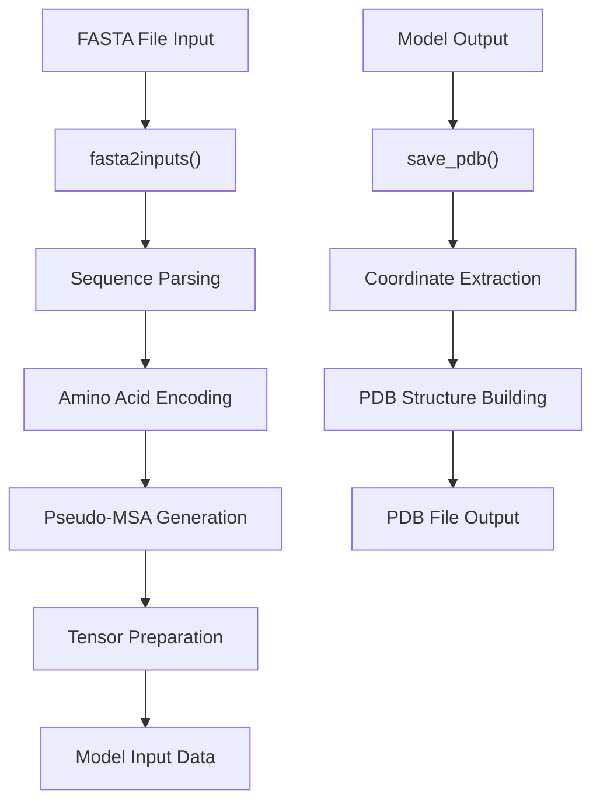
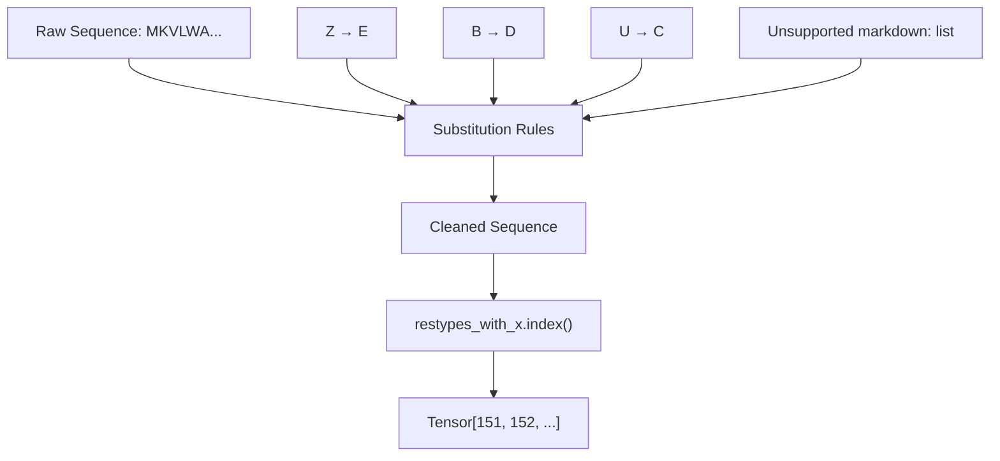
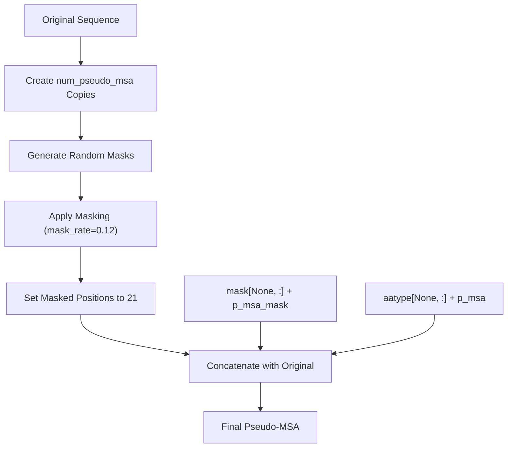
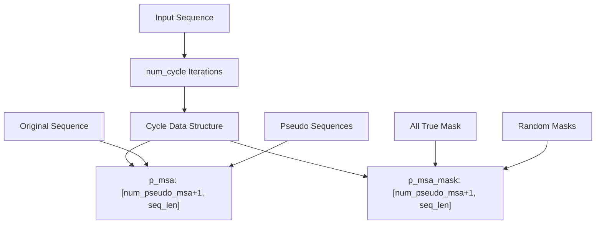
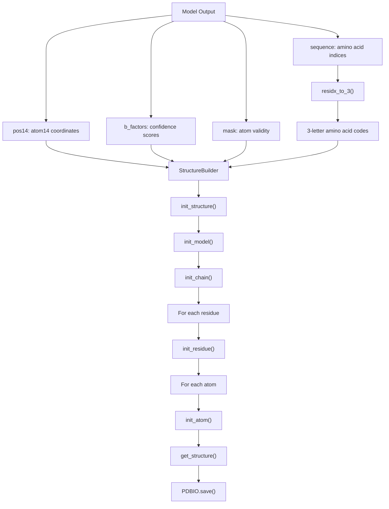
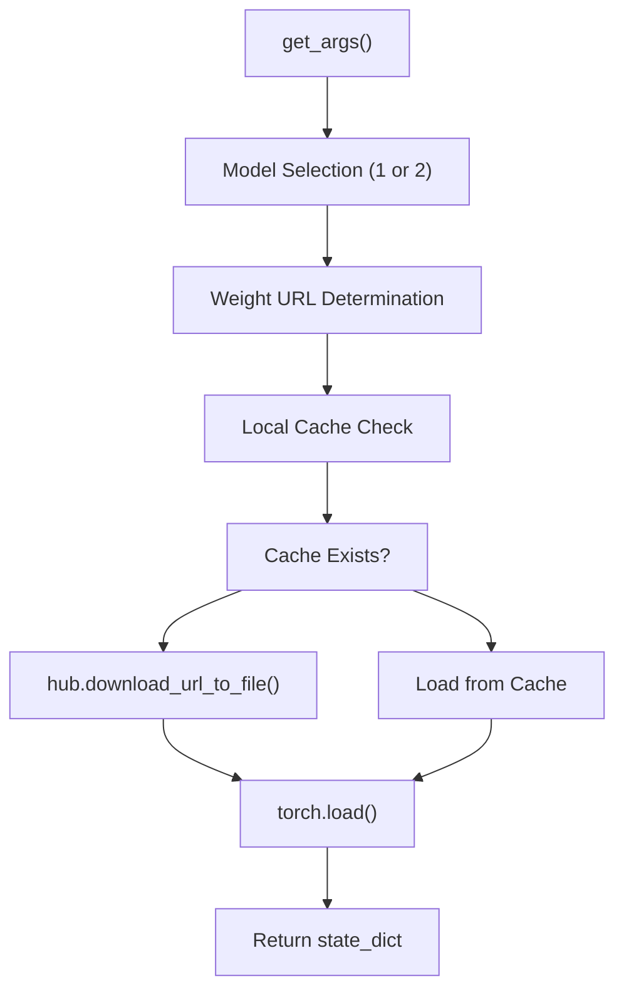

# Data Processing Pipeline

> **Relevant source files**
> * [omegafold/__main__.py](https://github.com/HeliXonProtein/OmegaFold/blob/313c873a/omegafold/__main__.py)
> * [omegafold/pipeline.py](https://github.com/HeliXonProtein/OmegaFold/blob/313c873a/omegafold/pipeline.py)

## Purpose and Scope

The data processing pipeline handles the complete transformation of protein sequence data from FASTA input files to structured tensors ready for neural network inference, and converts model outputs back to standard PDB format. This pipeline encompasses input validation, pseudo-MSA generation, tensor preparation, and output formatting.

For information about the model execution and inference orchestration, see [Execution Pipeline](/HeliXonProtein/OmegaFold/6-execution-pipeline). For details about structure generation and coordinate prediction, see [Structure Generation](/HeliXonProtein/OmegaFold/6.2-structure-generation).

## Pipeline Overview

The data processing pipeline consists of three main phases: input processing, data preparation, and output generation. The pipeline is implemented primarily in [omegafold/pipeline.py](https://github.com/HeliXonProtein/OmegaFold/blob/313c873a/omegafold/pipeline.py)

 and orchestrated through [omegafold/__main__.py](https://github.com/HeliXonProtein/OmegaFold/blob/313c873a/omegafold/__main__.py)

### High-Level Data Flow



**Sources:** [omegafold/pipeline.py L93-L181](https://github.com/HeliXonProtein/OmegaFold/blob/313c873a/omegafold/pipeline.py#L93-L181)

 [omegafold/pipeline.py L183-L240](https://github.com/HeliXonProtein/OmegaFold/blob/313c873a/omegafold/pipeline.py#L183-L240)

 [omegafold/__main__.py L58-L93](https://github.com/HeliXonProtein/OmegaFold/blob/313c873a/omegafold/__main__.py#L58-L93)

## FASTA Input Processing

### Sequence Parsing and Validation

The `fasta2inputs` function handles FASTA file parsing and sequence preprocessing. The process begins with reading the input file and extracting sequence identifiers and amino acid strings.

| Processing Step | Description | Implementation |
| --- | --- | --- |
| File Reading | Parse FASTA format with headers and sequences | [pipeline.py L120-L134](https://github.com/HeliXonProtein/OmegaFold/blob/313c873a/pipeline.py#L120-L134) |
| Sequence Cleaning | Replace non-standard amino acids (Z→E, B→D, U→C) | [pipeline.py L150](https://github.com/HeliXonProtein/OmegaFold/blob/313c873a/pipeline.py#L150-L150) |
| Length Sorting | Sort sequences by length for efficient processing | [pipeline.py L135-L137](https://github.com/HeliXonProtein/OmegaFold/blob/313c873a/pipeline.py#L135-L137) |
| Index Encoding | Convert amino acids to integer indices using `restypes_with_x` | [pipeline.py L151-L153](https://github.com/HeliXonProtein/OmegaFold/blob/313c873a/pipeline.py#L151-L153) |

### Amino Acid Encoding

The system uses a 22-element encoding scheme where standard amino acids are mapped to indices 0-19, unknown amino acids to index 20, and gaps to index 21.



**Sources:** [omegafold/pipeline.py L150-L153](https://github.com/HeliXonProtein/OmegaFold/blob/313c873a/omegafold/pipeline.py#L150-L153)

 [omegafold/utils/protein_utils/residue_constants.py](https://github.com/HeliXonProtein/OmegaFold/blob/313c873a/omegafold/utils/protein_utils/residue_constants.py)

## Pseudo-MSA Generation

### Multiple Sequence Alignment Simulation

The pipeline generates pseudo-MSAs by creating multiple copies of the input sequence with random masking. This simulates the evolutionary information typically provided by real MSAs.

### Masking Strategy



The masking process is controlled by several parameters:

| Parameter | Default | Purpose |
| --- | --- | --- |
| `num_pseudo_msa` | 15 | Number of pseudo sequences to generate |
| `mask_rate` | 0.12 | Fraction of positions to mask in each pseudo sequence |
| `deterministic` | True | Use fixed random seed based on sequence length |

**Sources:** [omegafold/pipeline.py L166-L178](https://github.com/HeliXonProtein/OmegaFold/blob/313c873a/omegafold/pipeline.py#L166-L178)

 [omegafold/pipeline.py L96-L99](https://github.com/HeliXonProtein/OmegaFold/blob/313c873a/omegafold/pipeline.py#L96-L99)

### Deterministic Generation

When `deterministic=True`, the system uses a torch Generator with a seed based on the sequence length to ensure reproducible pseudo-MSA generation across runs.

```markdown
# Deterministic masking implementationif deterministic:    g = torch.Generator()    g.manual_seed(num_res)  # Seed based on sequence length
```

**Sources:** [omegafold/pipeline.py L167-L169](https://github.com/HeliXonProtein/OmegaFold/blob/313c873a/omegafold/pipeline.py#L167-L169)

## Data Structure Preparation

### Input Tensor Organization

The pipeline organizes data into a specific format expected by the OmegaFold model. Each sequence generates multiple cycles of data, where each cycle contains a pseudo-MSA and corresponding mask.



Each cycle contains:

* `p_msa`: Concatenated original and pseudo sequences
* `p_msa_mask`: Validity masks for each position

**Sources:** [omegafold/pipeline.py L170-L179](https://github.com/HeliXonProtein/OmegaFold/blob/313c873a/omegafold/pipeline.py#L170-L179)

### Device and Memory Management

The pipeline uses `utils.recursive_to()` to efficiently move tensor data to the target device (CPU, CUDA, or MPS) while maintaining the nested data structure.

**Sources:** [omegafold/pipeline.py L180](https://github.com/HeliXonProtein/OmegaFold/blob/313c873a/omegafold/pipeline.py#L180-L180)

## Output Processing

### PDB File Generation

The `save_pdb` function converts model outputs into standard PDB format using BioPython's StructureBuilder.

### Coordinate Processing Pipeline



### PDB Structure Building Process

| Step | Function | Purpose |
| --- | --- | --- |
| Structure Init | `builder.init_structure(0)` | Create top-level structure |
| Model Init | `builder.init_model(model)` | Initialize model (default 0) |
| Chain Init | `builder.init_chain(init_chain)` | Set chain ID (default 'A') |
| Residue Processing | `builder.init_residue()` | Add each amino acid residue |
| Atom Processing | `builder.init_atom()` | Add individual atoms with coordinates |

**Sources:** [omegafold/pipeline.py L208-L239](https://github.com/HeliXonProtein/OmegaFold/blob/313c873a/omegafold/pipeline.py#L208-L239)

### Atom14 Representation

The system uses the atom14 representation where each residue can have up to 14 atoms. The mapping from atom14 indices to actual atom names is handled through `restype_name_to_atom14_names`.

**Sources:** [omegafold/pipeline.py L227-L234](https://github.com/HeliXonProtein/OmegaFold/blob/313c873a/omegafold/pipeline.py#L227-L234)

## Configuration and Parameters

### Command-Line Arguments

The pipeline accepts various configuration parameters through `get_args()`:

| Parameter | Type | Default | Description |
| --- | --- | --- | --- |
| `num_cycle` | int | 10 | Number of optimization cycles |
| `num_pseudo_msa` | int | 15 | Number of pseudo-MSA sequences |
| `pseudo_msa_mask_rate` | float | 0.12 | Masking rate for pseudo-MSAs |
| `subbatch_size` | int | None | Memory optimization parameter |
| `device` | str | auto | Target device (cpu/cuda/mps) |

### Model Weight Management

The pipeline handles automatic downloading and caching of model weights:



**Sources:** [omegafold/pipeline.py L396-L420](https://github.com/HeliXonProtein/OmegaFold/blob/313c873a/omegafold/pipeline.py#L396-L420)

 [omegafold/pipeline.py L242-L268](https://github.com/HeliXonProtein/OmegaFold/blob/313c873a/omegafold/pipeline.py#L242-L268)