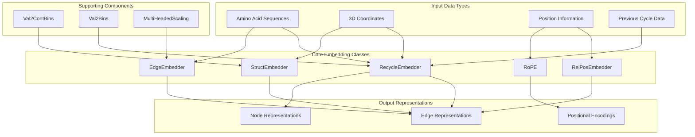
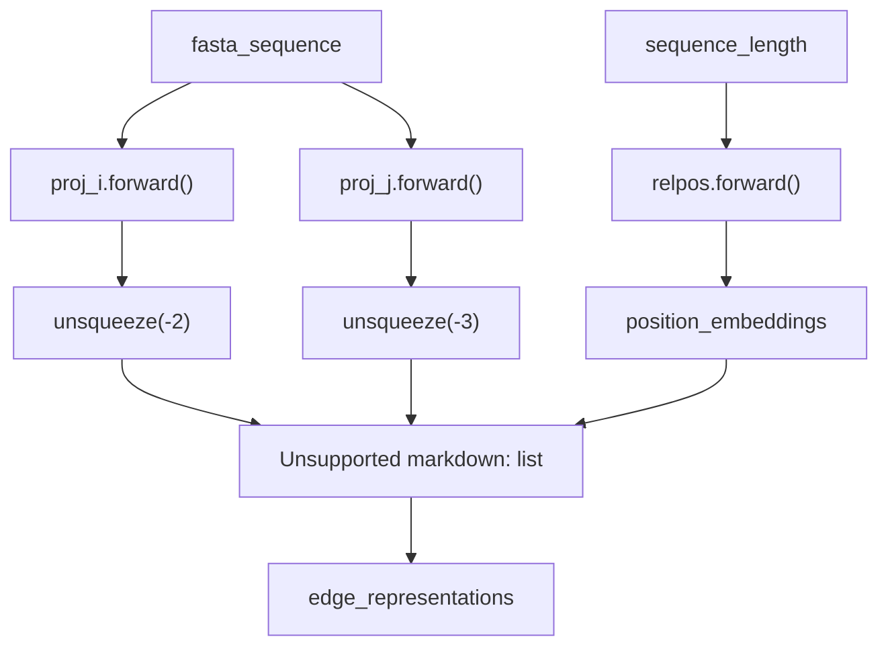
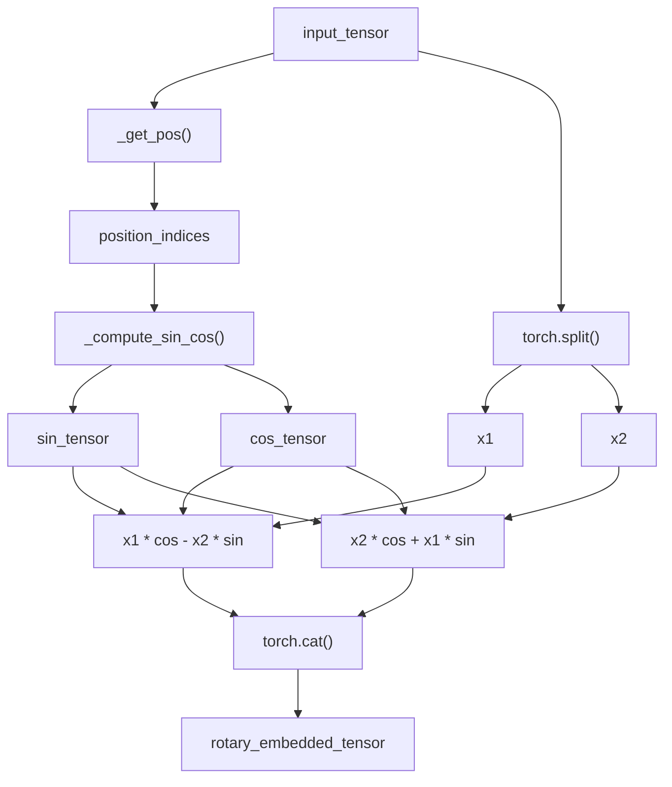
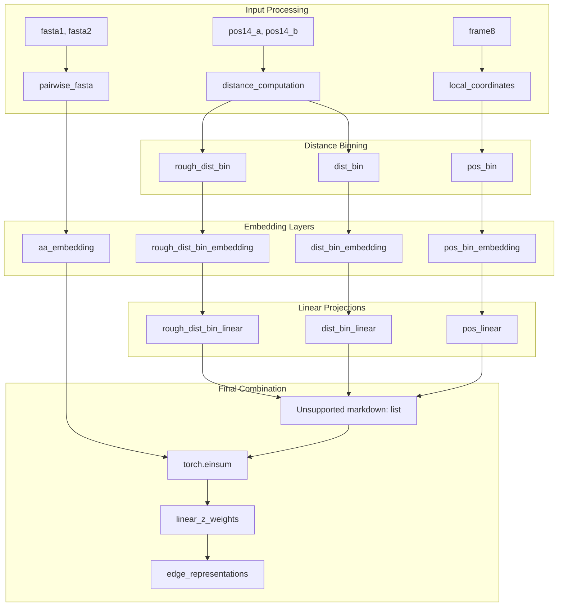
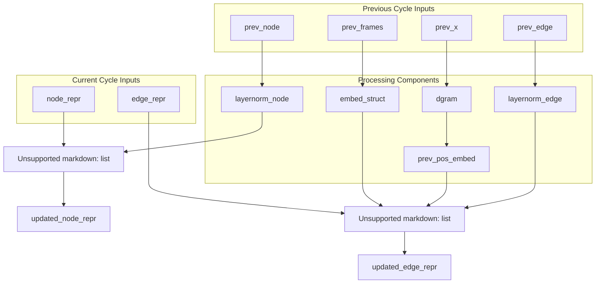
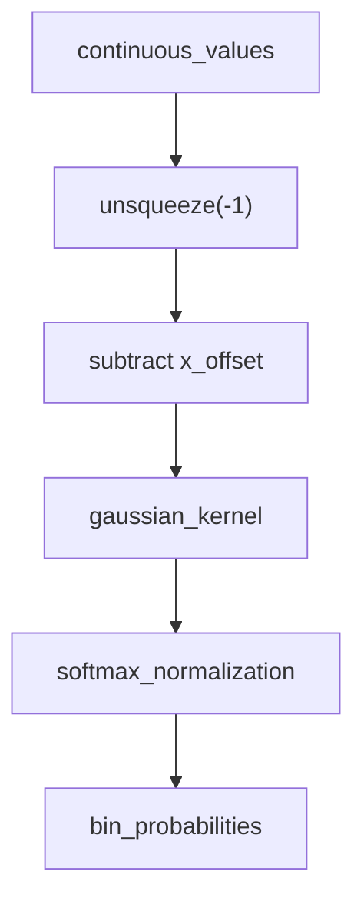

# Embedding Systems

> **Relevant source files**
> * [omegafold/embedders.py](https://github.com/HeliXonProtein/OmegaFold/blob/313c873a/omegafold/embedders.py)
> * [omegafold/modules.py](https://github.com/HeliXonProtein/OmegaFold/blob/313c873a/omegafold/modules.py)

## Purpose and Scope

This document covers the embedding components in OmegaFold that transform discrete tokens and structural information into continuous vector representations used by the neural network. These systems handle sequence embeddings, positional encodings, structural feature embeddings, and recycling mechanisms for iterative refinement.

For information about attention mechanisms that operate on these embeddings, see [Attention Mechanisms](/HeliXonProtein/OmegaFold/5.1-attention-mechanisms). For details about the overall model architecture that uses these embeddings, see [Core Model Components](/HeliXonProtein/OmegaFold/4-core-model-components).

## Overview of Embedding Systems

OmegaFold's embedding systems convert various types of input data into dense vector representations that the neural network can process effectively. The system includes specialized embedders for different data types and purposes.

### Embedding System Architecture

Sources: [omegafold/embedders.py L1-L416](https://github.com/HeliXonProtein/OmegaFold/blob/313c873a/omegafold/embedders.py#L1-L416)

 [omegafold/modules.py L219-L281](https://github.com/HeliXonProtein/OmegaFold/blob/313c873a/omegafold/modules.py#L219-L281)

## Sequence and Edge Embeddings

The `EdgeEmbedder` class creates initial representations for protein sequences by embedding amino acid tokens and combining them with positional information.

### EdgeEmbedder Implementation

| Component | Purpose | Input | Output |
| --- | --- | --- | --- |
| `proj_i` | Embed amino acids for row positions | Sequence tokens | Edge features |
| `proj_j` | Embed amino acids for column positions | Sequence tokens | Edge features |
| `relpos` | Add relative positional encoding | Sequence length | Position embeddings |

The embedding process creates pairwise representations by projecting each amino acid in two directions and adding relative positional information:

Sources: [omegafold/embedders.py L116-L139](https://github.com/HeliXonProtein/OmegaFold/blob/313c873a/omegafold/embedders.py#L116-L139)

## Positional Embeddings

OmegaFold implements two types of positional embeddings: rotary position embeddings (RoPE) for sequence-aware attention and relative position embeddings for pairwise relationships.

### Rotary Position Embedding (RoPE)

The `RoPE` class applies rotary position embeddings to tensors, enabling position-aware attention computations:

The RoPE implementation includes:

* **Frequency computation**: `inv_freq` buffer stores precomputed frequencies [omegafold/embedders.py L158-L163](https://github.com/HeliXonProtein/OmegaFold/blob/313c873a/omegafold/embedders.py#L158-L163)
* **Sinusoidal embeddings**: Sine and cosine tensors computed from positions [omegafold/embedders.py L183-L200](https://github.com/HeliXonProtein/OmegaFold/blob/313c873a/omegafold/embedders.py#L183-L200)
* **Rotation application**: Input tensors split and rotated using trigonometric functions [omegafold/embedders.py L109-L110](https://github.com/HeliXonProtein/OmegaFold/blob/313c873a/omegafold/embedders.py#L109-L110)

### Relative Position Embedding

The `RelPosEmbedder` computes relative positional relationships between residues using a learned embedding table:

Sources: [omegafold/embedders.py L141-L223](https://github.com/HeliXonProtein/OmegaFold/blob/313c873a/omegafold/embedders.py#L141-L223)

## Structure Embeddings

The `StructEmbedder` class processes 3D structural information to create distance-based and geometric feature representations.

### StructEmbedder Architecture

The structural embedding process involves:

1. **Distance computation**: Euclidean distances between atom pairs [omegafold/embedders.py L279-L283](https://github.com/HeliXonProtein/OmegaFold/blob/313c873a/omegafold/embedders.py#L279-L283)
2. **Binning mechanisms**: Converting continuous distances to discrete bins using `Val2ContBins` [omegafold/embedders.py L307-L309](https://github.com/HeliXonProtein/OmegaFold/blob/313c873a/omegafold/embedders.py#L307-L309)
3. **Local coordinate embedding**: Frame-relative positions processed through position binning [omegafold/embedders.py L290-L292](https://github.com/HeliXonProtein/OmegaFold/blob/313c873a/omegafold/embedders.py#L290-L292)
4. **Feature combination**: Multi-stage linear projections and tensor products [omegafold/embedders.py L324-L328](https://github.com/HeliXonProtein/OmegaFold/blob/313c873a/omegafold/embedders.py#L324-L328)

Sources: [omegafold/embedders.py L225-L329](https://github.com/HeliXonProtein/OmegaFold/blob/313c873a/omegafold/embedders.py#L225-L329)

## Recycling Embeddings

The `RecycleEmbedder` incorporates information from previous prediction cycles to enable iterative refinement of protein structure predictions.

### Recycling Data Flow

Key recycling operations:

* **Pseudo-beta creation**: Previous coordinates converted to pseudo-beta positions [omegafold/embedders.py L395](https://github.com/HeliXonProtein/OmegaFold/blob/313c873a/omegafold/embedders.py#L395-L395)
* **Distance binning**: Inter-residue distances discretized using `Val2Bins` [omegafold/embedders.py L397](https://github.com/HeliXonProtein/OmegaFold/blob/313c873a/omegafold/embedders.py#L397-L397)
* **Layer normalization**: Previous representations normalized before addition [omegafold/embedders.py L398-L402](https://github.com/HeliXonProtein/OmegaFold/blob/313c873a/omegafold/embedders.py#L398-L402)
* **Structural embedding**: Optional structural features from previous frames [omegafold/embedders.py L403-L406](https://github.com/HeliXonProtein/OmegaFold/blob/313c873a/omegafold/embedders.py#L403-L406)

Sources: [omegafold/embedders.py L347-L409](https://github.com/HeliXonProtein/OmegaFold/blob/313c873a/omegafold/embedders.py#L347-L409)

## Supporting Embedding Components

Several utility classes in `modules.py` support the embedding systems with specialized transformations.

### Value-to-Bins Conversion

| Class | Purpose | Configuration | Usage |
| --- | --- | --- | --- |
| `Val2ContBins` | Continuous values to soft bins | `x_min`, `x_max`, `x_bins` | Distance/position binning |
| `Val2Bins` | Hard binning with thresholds | `first_break`, `last_break`, `num_bins` | Discrete categorization |

### Val2ContBins Implementation

The `Val2ContBins` class converts continuous values to soft probability distributions over bins using Gaussian kernels:

The implementation uses a Gaussian kernel with coefficient `coeff = -0.5 / ((x_bin_size * 0.2) ** 2)` for smooth binning [omegafold/modules.py L296](https://github.com/HeliXonProtein/OmegaFold/blob/313c873a/omegafold/modules.py#L296-L296)

### MultiHeadedScaling

The `MultiHeadedScaling` class performs element-wise scaling and shifting operations with multiple heads, enabling flexible feature transformations for embedding layers.

Sources: [omegafold/modules.py L283-L340](https://github.com/HeliXonProtein/OmegaFold/blob/313c873a/omegafold/modules.py#L283-L340)

 [omegafold/modules.py L219-L281](https://github.com/HeliXonProtein/OmegaFold/blob/313c873a/omegafold/modules.py#L219-L281)