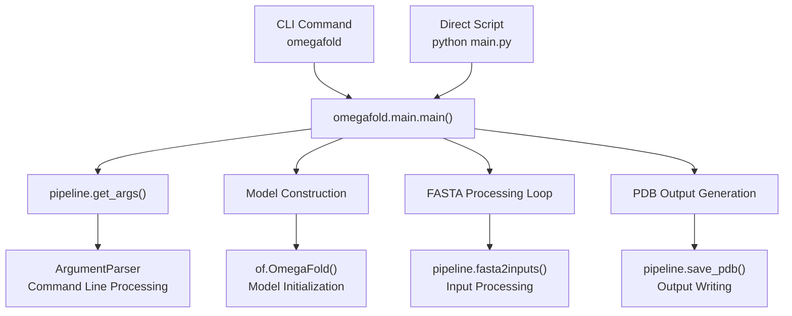
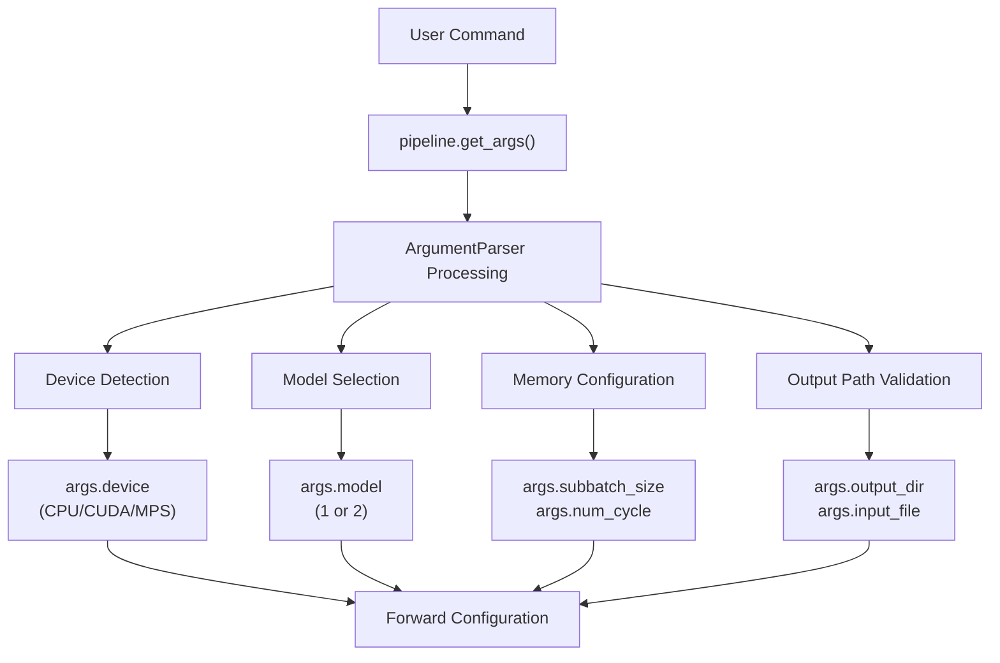
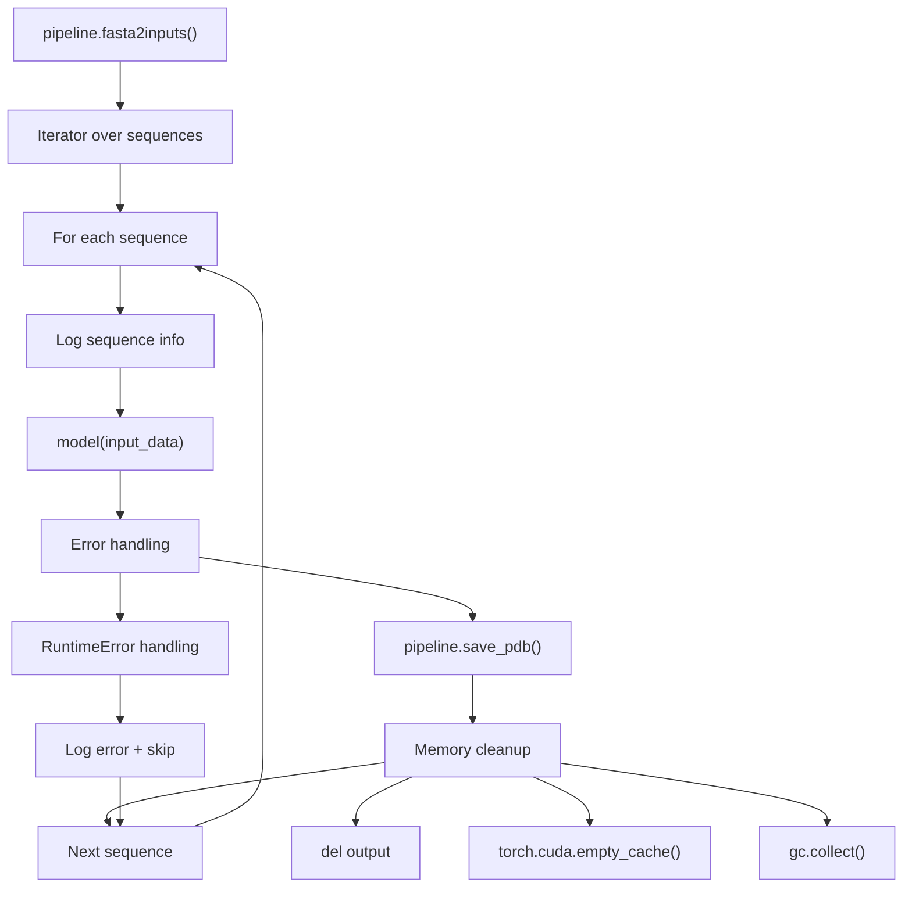
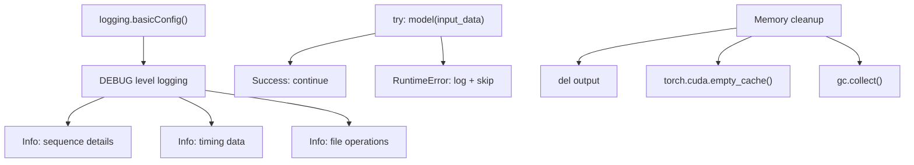

# Entry Points and CLI

> **Relevant source files**
> * [README.md](https://github.com/HeliXonProtein/OmegaFold/blob/313c873a/README.md?plain=1)
> * [main.py](https://github.com/HeliXonProtein/OmegaFold/blob/313c873a/main.py)
> * [omegafold/__main__.py](https://github.com/HeliXonProtein/OmegaFold/blob/313c873a/omegafold/__main__.py)

This document covers the various mechanisms for executing OmegaFold from the command line, including CLI interface design, argument parsing, and the main execution workflow. For details about the data processing pipeline that gets invoked after startup, see [Data Processing Pipeline](/HeliXonProtein/OmegaFold/6.1-data-processing-pipeline). For information about the core model execution, see [OmegaFold Model](/HeliXonProtein/OmegaFold/4.1-omegafold-model).

## Entry Point Mechanisms

OmegaFold provides two primary entry points for execution, both of which converge on the same underlying implementation:

### CLI Command Entry Point

When installed via pip, OmegaFold provides a `omegafold` command that can be invoked directly:

```
omegafold INPUT_FILE.fasta OUTPUT_DIRECTORY
```

This entry point is configured through the package's `setup.py` and provides the most user-friendly interface.

### Direct Script Entry Point

For development or when the CLI command is unavailable (such as on macOS), users can execute OmegaFold directly via the main script:

```
python main.py INPUT_FILE.fasta OUTPUT_DIRECTORY
```

The `main.py` script serves as a simple wrapper that imports and executes the main function.



*Sources: [main.py L1-L7](https://github.com/HeliXonProtein/OmegaFold/blob/313c873a/main.py#L1-L7)

 [omegafold/__main__.py L40-L105](https://github.com/HeliXonProtein/OmegaFold/blob/313c873a/omegafold/__main__.py#L40-L105)*

## Command Line Interface

### Basic Usage Pattern

Both entry points accept the same arguments with a simple required pattern:

```
omegafold <input_fasta> <output_directory> [options]
```

The CLI expects:

* **input_fasta**: Path to a FASTA file containing protein sequences
* **output_directory**: Directory where PDB output files will be saved

### Key Command Line Options

Based on the README documentation and implementation, the main configurable options include:

| Option | Purpose | Default | Notes |
| --- | --- | --- | --- |
| `--model` | Select model variant | 1 | Model 2 available via `--model 2` |
| `--subbatch_size` | Memory vs time tradeoff | Sequence length | Lower values reduce memory usage |
| `--num_cycle` | Prediction quality vs speed | Default cycles | Fewer cycles = faster, potentially lower quality |
| `--num_pseudo_msa` | Pseudo-MSA generation | - | Controls MSA simulation |
| `--pseudo_msa_mask_rate` | MSA masking rate | - | For pseudo-MSA generation |
| `--device` | Compute device | Auto-detected | CPU, CUDA, or MPS support |



*Sources: [README.md L15-L34](https://github.com/HeliXonProtein/OmegaFold/blob/313c873a/README.md?plain=1#L15-L34)

 [omegafold/__main__.py L42](https://github.com/HeliXonProtein/OmegaFold/blob/313c873a/omegafold/__main__.py#L42-L42)*

## Main Execution Flow

The `main()` function in `omegafold.__main__` orchestrates the complete execution process:

### Initialization Phase

```mermaid
sequenceDiagram
  participant main()
  participant pipeline
  participant OmegaFold
  participant torch.device

  main()->>pipeline: get_args()
  pipeline-->>main(): args, state_dict, forward_config
  main()->>main(): os.makedirs(output_dir)
  main()->>OmegaFold: of.OmegaFold(config)
  main()->>OmegaFold: load_state_dict(state_dict)
  main()->>OmegaFold: eval() + to(device)
```

*Sources: [omegafold/__main__.py L40-L55](https://github.com/HeliXonProtein/OmegaFold/blob/313c873a/omegafold/__main__.py#L40-L55)*

### Processing Loop

The main execution processes each sequence in the input FASTA file through an iterator pattern:



*Sources: [omegafold/__main__.py L58-L98](https://github.com/HeliXonProtein/OmegaFold/blob/313c873a/omegafold/__main__.py#L58-L98)*

### Model Execution and Output

For each sequence, the system:

1. **Logs sequence information**: Displays residue count and sequence index
2. **Executes prediction**: Calls `model()` with confidence prediction enabled
3. **Handles errors**: Catches `RuntimeError` exceptions and continues processing
4. **Saves results**: Uses `pipeline.save_pdb()` to write PDB files
5. **Cleans memory**: Explicitly manages GPU memory and garbage collection

The prediction call includes specific configuration:

```
output = model(    input_data,    predict_with_confidence=True,    fwd_cfg=forward_config)
```

### Error Handling and Logging

The system implements comprehensive error handling:

* **Logging setup**: Configures DEBUG-level logging to stdout
* **Runtime error recovery**: Catches prediction failures and continues with remaining sequences
* **Memory management**: Explicit cleanup after each prediction to prevent OOM errors
* **Progress tracking**: Logs timing information and sequence progress



*Sources: [omegafold/__main__.py L41](https://github.com/HeliXonProtein/OmegaFold/blob/313c873a/omegafold/__main__.py#L41-L41)

 [omegafold/__main__.py L79-L82](https://github.com/HeliXonProtein/OmegaFold/blob/313c873a/omegafold/__main__.py#L79-L82)

 [omegafold/__main__.py L95-L97](https://github.com/HeliXonProtein/OmegaFold/blob/313c873a/omegafold/__main__.py#L95-L97)*

## Integration with Pipeline System

The CLI system serves as a thin orchestration layer that delegates core functionality to the pipeline system. The main responsibilities are:

* **Argument parsing and validation** via `pipeline.get_args()`
* **Model initialization and configuration**
* **Iterator-based processing** using `pipeline.fasta2inputs()`
* **Output formatting** through `pipeline.save_pdb()`

This design separates user interface concerns from core processing logic, allowing the same pipeline to be used programmatically or through the CLI interface.

*Sources: [omegafold/__main__.py L32](https://github.com/HeliXonProtein/OmegaFold/blob/313c873a/omegafold/__main__.py#L32-L32)

 [omegafold/__main__.py L42](https://github.com/HeliXonProtein/OmegaFold/blob/313c873a/omegafold/__main__.py#L42-L42)

 [omegafold/__main__.py L58-L66](https://github.com/HeliXonProtein/OmegaFold/blob/313c873a/omegafold/__main__.py#L58-L66)

 [omegafold/__main__.py L86-L93](https://github.com/HeliXonProtein/OmegaFold/blob/313c873a/omegafold/__main__.py#L86-L93)*