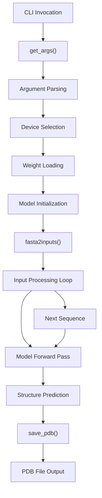
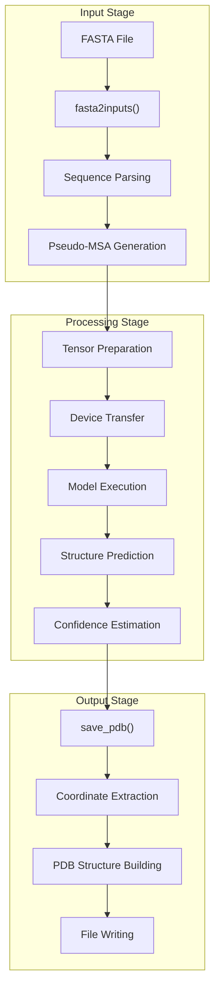
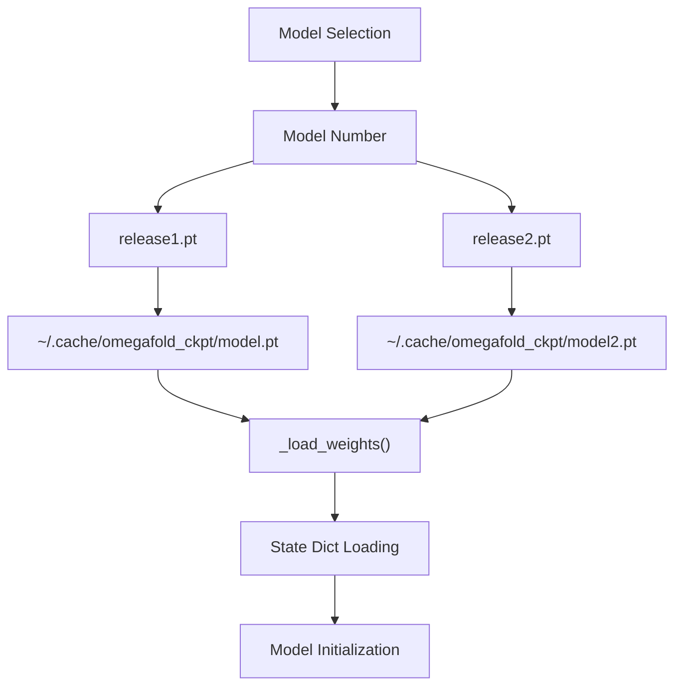

# Execution Pipeline

> **Relevant source files**
> * [omegafold/pipeline.py](https://github.com/HeliXonProtein/OmegaFold/blob/313c873a/omegafold/pipeline.py)

This page documents the high-level execution pipeline of OmegaFold, covering how the system orchestrates the complete flow from FASTA input to PDB output. The execution pipeline handles command-line interface processing, model weight loading, data preparation coordination, and output file generation.

For detailed information about input data processing and pseudo-MSA generation, see [Data Processing Pipeline](/HeliXonProtein/OmegaFold/6.1-data-processing-pipeline). For specifics about structure coordinate generation and decoding, see [Structure Generation](/HeliXonProtein/OmegaFold/6.2-structure-generation). For command-line interface details, see [Entry Points and CLI](/HeliXonProtein/OmegaFold/6.3-entry-points-and-cli).

## Overview

The OmegaFold execution pipeline coordinates the entire protein structure prediction workflow through a series of well-defined stages. The system processes FASTA files containing protein sequences, orchestrates model execution, and generates PDB structure files with confidence estimates.

## High-Level Execution Flow

The execution pipeline follows this sequence:



**Sources:** [omegafold/pipeline.py L304-L429](https://github.com/HeliXonProtein/OmegaFold/blob/313c873a/omegafold/pipeline.py#L304-L429)

## Pipeline Orchestration Components

The execution pipeline consists of several key orchestration functions:

| Component | Function | Purpose |
| --- | --- | --- |
| **Argument Processing** | `get_args()` | Parse CLI arguments, load model weights, configure execution parameters |
| **Input Processing** | `fasta2inputs()` | Convert FASTA files to model-ready tensor inputs with pseudo-MSAs |
| **Output Generation** | `save_pdb()` | Convert model predictions to PDB format with B-factors |
| **Device Management** | `_get_device()` | Automatically detect and configure compute devices (CPU/CUDA/MPS) |
| **Weight Loading** | `_load_weights()` | Download or load pre-trained model weights from URLs or local files |

**Sources:** [omegafold/pipeline.py L59-L430](https://github.com/HeliXonProtein/OmegaFold/blob/313c873a/omegafold/pipeline.py#L59-L430)

## Data Flow Architecture

The pipeline manages data transformation through multiple stages:



**Sources:** [omegafold/pipeline.py L93-L181](https://github.com/HeliXonProtein/OmegaFold/blob/313c873a/omegafold/pipeline.py#L93-L181)

 [omegafold/pipeline.py L183-L240](https://github.com/HeliXonProtein/OmegaFold/blob/313c873a/omegafold/pipeline.py#L183-L240)

## Configuration and Setup

The pipeline handles multiple configuration aspects automatically:

### Model Weight Management

The system supports multiple model variants with automatic weight downloading:



**Sources:** [omegafold/pipeline.py L396-L429](https://github.com/HeliXonProtein/OmegaFold/blob/313c873a/omegafold/pipeline.py#L396-L429)

 [omegafold/pipeline.py L242-L269](https://github.com/HeliXonProtein/OmegaFold/blob/313c873a/omegafold/pipeline.py#L242-L269)

### Compute Device Auto-Detection

The pipeline automatically selects optimal compute devices:

| Priority | Device Type | Detection Method |
| --- | --- | --- |
| 1 | CUDA GPU | `torch.cuda.is_available()` |
| 2 | Apple MPS | `mps.is_available()` |
| 3 | CPU | Default fallback |

**Sources:** [omegafold/pipeline.py L271-L302](https://github.com/HeliXonProtein/OmegaFold/blob/313c873a/omegafold/pipeline.py#L271-L302)

### Precision Configuration

The system configures floating-point precision based on hardware capabilities:

* **TensorFloat-32 (TF32)**: Enabled by default for performance on compatible hardware
* **Full FP32**: Available via `--allow_tf32=False` for maximum precision
* **Version Compatibility**: Automatically adapts to different PyTorch versions

**Sources:** [omegafold/pipeline.py L59-L76](https://github.com/HeliXonProtein/OmegaFold/blob/313c873a/omegafold/pipeline.py#L59-L76)

## Sequence Processing Loop

The core execution loop processes multiple sequences from a single FASTA file:

```mermaid
sequenceDiagram
  participant Pipeline
  participant fasta2inputs()
  participant Model
  participant save_pdb()

  Pipeline->>fasta2inputs(): "Initialize generator"
  loop ["For each sequence"]
    fasta2inputs()->>fasta2inputs(): "Parse sequence data"
    fasta2inputs()->>fasta2inputs(): "Generate pseudo-MSA"
    fasta2inputs()->>fasta2inputs(): "Create input tensors"
    fasta2inputs()->>Pipeline: "Yield (data, output_path)"
    Pipeline->>Model: "model(input_data)"
    Model->>Pipeline: "Return predictions"
    Pipeline->>save_pdb(): "save_pdb(pos14, b_factors, sequence, mask, path)"
    save_pdb()->>save_pdb(): "Build PDB structure"
    save_pdb()->>save_pdb(): "Write to file"
  end
```

**Sources:** [omegafold/pipeline.py L149-L180](https://github.com/HeliXonProtein/OmegaFold/blob/313c873a/omegafold/pipeline.py#L149-L180)

## Output File Management

The pipeline handles output file organization automatically:

* **Directory Creation**: Creates output directories if they don't exist
* **Filename Generation**: Uses sequence identifiers from FASTA headers
* **Path Sanitization**: Handles filesystem limitations and illegal characters
* **Collision Avoidance**: Falls back to numbered naming for long identifiers

**Sources:** [omegafold/pipeline.py L138-L163](https://github.com/HeliXonProtein/OmegaFold/blob/313c873a/omegafold/pipeline.py#L138-L163)

 [omegafold/pipeline.py L183-L240](https://github.com/HeliXonProtein/OmegaFold/blob/313c873a/omegafold/pipeline.py#L183-L240)

## Error Handling and Validation

The pipeline includes robust error handling:

* **Device Availability**: Validates requested compute devices exist
* **File System Limits**: Adapts filename lengths to filesystem constraints
* **Sequence Validation**: Ensures amino acid sequences use valid character sets
* **Model Compatibility**: Verifies model weights match expected format

**Sources:** [omegafold/pipeline.py L271-L302](https://github.com/HeliXonProtein/OmegaFold/blob/313c873a/omegafold/pipeline.py#L271-L302)

 [omegafold/pipeline.py L150-L157](https://github.com/HeliXonProtein/OmegaFold/blob/313c873a/omegafold/pipeline.py#L150-L157)