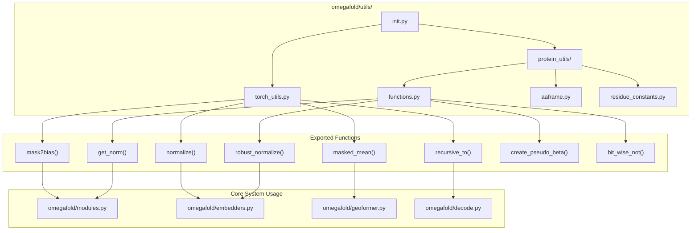
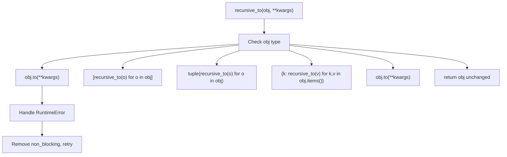
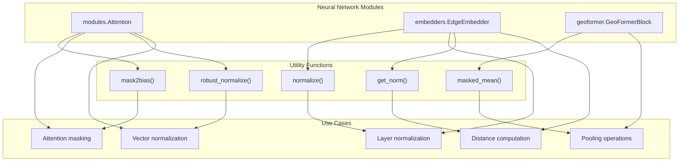

# General Utilities

> **Relevant source files**
> * [omegafold/utils/__init__.py](https://github.com/HeliXonProtein/OmegaFold/blob/313c873a/omegafold/utils/__init__.py)
> * [omegafold/utils/protein_utils/functions.py](https://github.com/HeliXonProtein/OmegaFold/blob/313c873a/omegafold/utils/protein_utils/functions.py)
> * [omegafold/utils/torch_utils.py](https://github.com/HeliXonProtein/OmegaFold/blob/313c873a/omegafold/utils/torch_utils.py)

This page documents the general utility functions and helper modules that provide foundational support across the OmegaFold codebase. These utilities include PyTorch tensor operations, mathematical functions, and device compatibility helpers that are used throughout the neural network components and processing pipeline.

For specialized protein data structures and coordinate systems, see [Protein Data Structures](/HeliXonProtein/OmegaFold/7.2-protein-data-structures). For model configuration management, see [Configuration Management](/HeliXonProtein/OmegaFold/7.1-configuration-management).

## Purpose and Scope

The general utilities system provides three main categories of functionality:

* **PyTorch Operations**: Tensor manipulation, normalization, masking, and device management utilities
* **Mathematical Functions**: Geometric transformations, robust numerical operations, and linear algebra helpers
* **Compatibility Helpers**: Cross-platform support for different PyTorch backends including MPS (Metal Performance Shaders)

These utilities are designed to be reusable across all components of the OmegaFold system, from the core neural network modules to the data processing pipeline.

## Utility Module Architecture



**Sources:** [omegafold/utils/__init__.py L27-L40](https://github.com/HeliXonProtein/OmegaFold/blob/313c873a/omegafold/utils/__init__.py#L27-L40)

 [omegafold/utils/torch_utils.py L39-L143](https://github.com/HeliXonProtein/OmegaFold/blob/313c873a/omegafold/utils/torch_utils.py#L39-L143)

 [omegafold/utils/protein_utils/functions.py L34-L152](https://github.com/HeliXonProtein/OmegaFold/blob/313c873a/omegafold/utils/protein_utils/functions.py#L34-L152)

## PyTorch Tensor Utilities

The `torch_utils.py` module provides essential tensor operations that are used extensively throughout the neural network components.

### Attention and Masking Operations

| Function | Purpose | Key Parameters | Return Type |
| --- | --- | --- | --- |
| `mask2bias()` | Convert boolean masks to attention bias values | `mask: torch.Tensor`, `inf: float = 1e9` | `torch.Tensor` |
| `masked_mean()` | Compute mean with masking support | `values: torch.Tensor`, `mask: torch.Tensor`, `dim: Union[int, Sequence[int]]` | `torch.Tensor` |

The `mask2bias()` function converts boolean masks into the bias format used by attention mechanisms:

```markdown
# Converts True/False mask to 0/-inf bias for attentionbias = mask.float().sub(1).mul(inf)  # True->0, False->-inf
```

**Sources:** [omegafold/utils/torch_utils.py L39-L50](https://github.com/HeliXonProtein/OmegaFold/blob/313c873a/omegafold/utils/torch_utils.py#L39-L50)

 [omegafold/utils/torch_utils.py L86-L108](https://github.com/HeliXonProtein/OmegaFold/blob/313c873a/omegafold/utils/torch_utils.py#L86-L108)

### Normalization Functions

The `normalize()` function provides layer normalization without requiring a PyTorch module, offering both in-place and functional variants:

```markdown
# Fast functional normalization using F.layer_normnormalized = F.layer_norm(inputs, normalized_shape, None, None, 1e-5) # In-place variant for memory efficiencyinputs -= inputs.mean(dim=dim, keepdim=True)inputs *= torch.rsqrt(inputs.var(dim=dim, keepdim=True) + 1e-5)
```

**Sources:** [omegafold/utils/torch_utils.py L53-L83](https://github.com/HeliXonProtein/OmegaFold/blob/313c873a/omegafold/utils/torch_utils.py#L53-L83)

### Device and Data Movement

The `recursive_to()` function handles moving complex nested data structures across devices and data types:



**Sources:** [omegafold/utils/torch_utils.py L111-L142](https://github.com/HeliXonProtein/OmegaFold/blob/313c873a/omegafold/utils/torch_utils.py#L111-L142)

## Protein Computation Functions

The `protein_utils/functions.py` module provides specialized mathematical operations for protein structure computations.

### Geometric Operations

| Function | Input | Output | Purpose |
| --- | --- | --- | --- |
| `get_norm()` | `x: torch.Tensor` | `torch.Tensor` | L2 norm computation (MPS compatible) |
| `robust_normalize()` | `x: torch.Tensor, dim: int, p: Union[int, str]` | `torch.Tensor` | Normalization with numerical stability |
| `quaternion_to_matrix()` | `quaternions: torch.Tensor (..., 4)` | `torch.Tensor (..., 3, 3)` | Convert quaternions to rotation matrices |
| `batch_matrix_vector()` | `matrix: torch.Tensor (..., d, d)`, `vector: torch.Tensor (..., d)` | `torch.Tensor (..., d)` | Batched matrix-vector multiplication |

### Protein-Specific Functions

The `create_pseudo_beta()` function generates pseudo-beta coordinates for protein structures:

```markdown
# Use CB when available, fall back to CA for glycinepseudo_beta = torch.where(    atom_mask[..., 4:5].expand([...] + [3]).bool(),  # CB mask    atom_pos[..., 4, :],  # CB position    atom_pos[..., 1, :]   # CA position (fallback))
```

**Sources:** [omegafold/utils/protein_utils/functions.py L120-L145](https://github.com/HeliXonProtein/OmegaFold/blob/313c873a/omegafold/utils/protein_utils/functions.py#L120-L145)

### Cross-Platform Compatibility

The utilities include compatibility functions for different PyTorch backends:

```python
def bit_wise_not(boolean_tensor: torch.Tensor) -> torch.Tensor:    """For MPS devices that have no support for bit-wise not"""    boolean_tensor = 1 - boolean_tensor.float()    return boolean_tensor.bool()
```

**Sources:** [omegafold/utils/protein_utils/functions.py L148-L151](https://github.com/HeliXonProtein/OmegaFold/blob/313c873a/omegafold/utils/protein_utils/functions.py#L148-L151)

## Function Usage Patterns



**Sources:** [omegafold/utils/__init__.py L35-L40](https://github.com/HeliXonProtein/OmegaFold/blob/313c873a/omegafold/utils/__init__.py#L35-L40)

 [omegafold/utils/torch_utils.py L39-L143](https://github.com/HeliXonProtein/OmegaFold/blob/313c873a/omegafold/utils/torch_utils.py#L39-L143)

 [omegafold/utils/protein_utils/functions.py L34-L152](https://github.com/HeliXonProtein/OmegaFold/blob/313c873a/omegafold/utils/protein_utils/functions.py#L34-L152)

## Import Organization

The utilities are organized through a centralized import system in `omegafold/utils/__init__.py`:

```javascript
# PyTorch utilitiesfrom omegafold.utils.torch_utils import (    mask2bias, masked_mean, normalize, recursive_to,) # Protein computation functions  from omegafold.utils.protein_utils.functions import (    bit_wise_not, create_pseudo_beta, get_norm, robust_normalize,) # Type definitionsDATA = Dict[str, Union[str, bool, torch.Tensor, AAFrame]]
```

This organization allows other modules to import utilities with simple statements like:

```javascript
from omegafold.utils import mask2bias, normalize, robust_normalize
```

**Sources:** [omegafold/utils/__init__.py L27-L45](https://github.com/HeliXonProtein/OmegaFold/blob/313c873a/omegafold/utils/__init__.py#L27-L45)