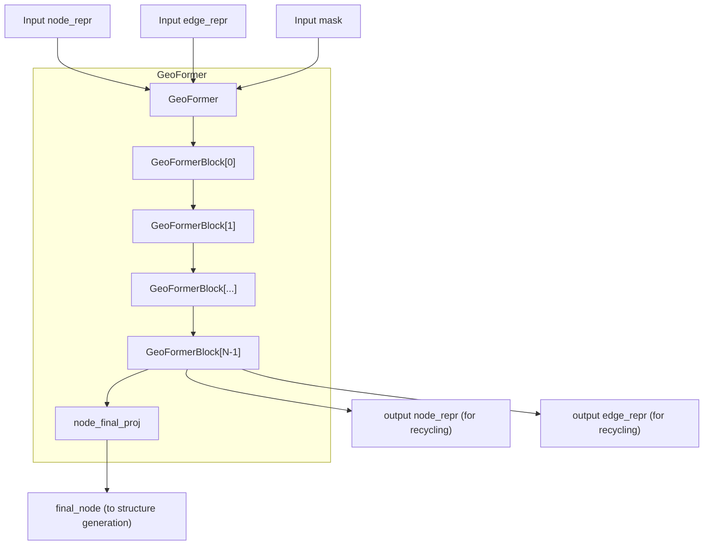
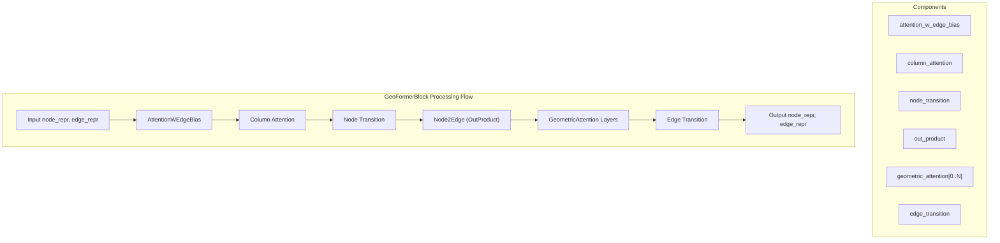
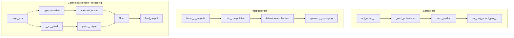
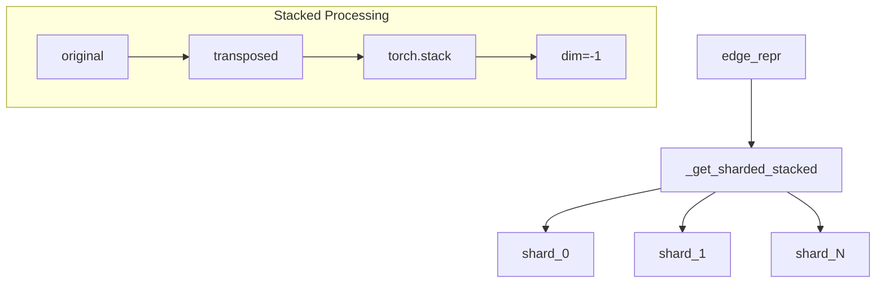
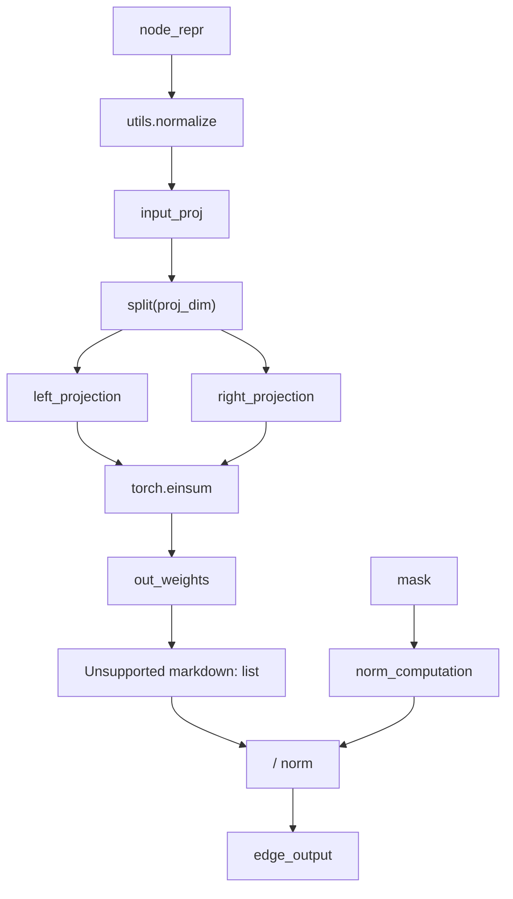
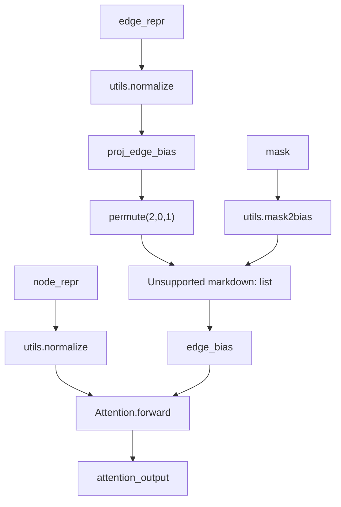
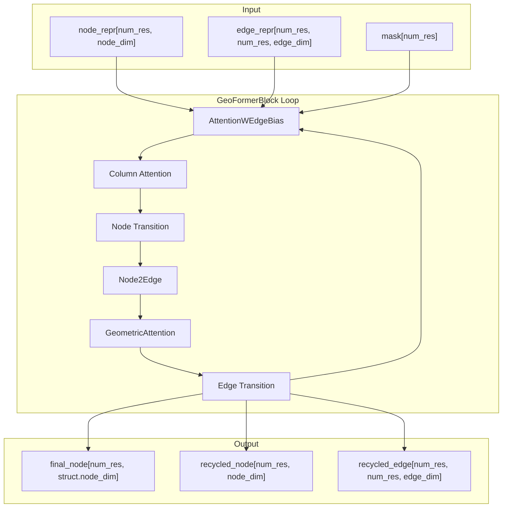

# Geometric Processing

> **Relevant source files**
> * [omegafold/geoformer.py](https://github.com/HeliXonProtein/OmegaFold/blob/313c873a/omegafold/geoformer.py)
> * [omegafold/modules.py](https://github.com/HeliXonProtein/OmegaFold/blob/313c873a/omegafold/modules.py)

This document explains the GeoFormer architecture and its role in processing geometric and structural information within OmegaFold. The GeoFormer serves as the main geometric processing component that refines protein structure representations through iterative attention mechanisms and node-edge communication. For information about the overall model architecture, see [OmegaFold Model](/HeliXonProtein/OmegaFold/4.1-omegafold-model). For details about the attention building blocks, see [Attention Mechanisms](/HeliXonProtein/OmegaFold/5.1-attention-mechanisms).

## GeoFormer Architecture Overview

The `GeoFormer` class orchestrates geometric processing through multiple stacked `GeoFormerBlock` instances. Each block processes node and edge representations using specialized attention mechanisms designed for geometric data.

### GeoFormer Structure

Sources: [omegafold/geoformer.py L140-L181](https://github.com/HeliXonProtein/OmegaFold/blob/313c873a/omegafold/geoformer.py#L140-L181)

### Component Initialization

The `GeoFormer` constructor creates a configurable number of processing blocks and a final projection layer:

| Component | Purpose | Configuration |
| --- | --- | --- |
| `blocks` | Stack of `GeoFormerBlock` instances | `cfg.geo_num_blocks` blocks |
| `node_final_proj` | Projects to structure module dimensions | `cfg.node_dim` → `cfg.struct.node_dim` |

Sources: [omegafold/geoformer.py L141-L146](https://github.com/HeliXonProtein/OmegaFold/blob/313c873a/omegafold/geoformer.py#L141-L146)

## GeoFormerBlock Processing

Each `GeoFormerBlock` performs a complete cycle of geometric processing through multiple attention mechanisms and transitions. The block combines node-focused attention, edge-focused attention, and geometric reasoning.

### GeoFormerBlock Architecture

Sources: [omegafold/geoformer.py L43-L138](https://github.com/HeliXonProtein/OmegaFold/blob/313c873a/omegafold/geoformer.py#L43-L138)

### Processing Sequence

The `GeoFormerBlock.forward` method implements the following sequential processing:

1. **Edge-Biased Node Attention**: Updates node representations using edge information as bias
2. **Column Attention**: Performs attention across the transposed dimension
3. **Node Transition**: Applies feed-forward processing to nodes
4. **Node-to-Edge Communication**: Projects node information to edge representations
5. **Geometric Attention**: Multiple layers of geometric reasoning on edges
6. **Edge Transition**: Final feed-forward processing on edges

Sources: [omegafold/geoformer.py L89-L126](https://github.com/HeliXonProtein/OmegaFold/blob/313c873a/omegafold/geoformer.py#L89-L126)

## Geometric Attention Mechanisms

The core geometric processing happens through specialized attention mechanisms that understand spatial relationships and geometric constraints.

### GeometricAttention Architecture

Sources: [omegafold/modules.py L569-L707](https://github.com/HeliXonProtein/OmegaFold/blob/313c873a/omegafold/modules.py#L569-L707)

### Attention Components

The `GeometricAttention` class contains several key components:

| Component | Purpose | Shape |
| --- | --- | --- |
| `linear_b_weights` | Edge bias computation | `[d_edge, n_axis, n_head]` |
| `linear_b_bias` | Bias offset | `[n_axis, n_head, 1, 1]` |
| `act_w` | Gating activations weights | `[d_edge, n_axis, d_edge * 5]` |
| `act_b` | Gating activations bias | `[n_axis, d_edge * 5]` |
| `out_proj_w` | Output projection weights | `[n_axis, d_edge, d_edge]` |
| `out_proj_b` | Output projection bias | `[n_axis, d_edge]` |

Sources: [omegafold/modules.py L574-L595](https://github.com/HeliXonProtein/OmegaFold/blob/313c873a/omegafold/modules.py#L574-L595)

### Sharded Processing

Geometric attention uses memory-efficient sharded processing through the `_get_sharded_stacked` function to handle large protein sequences:

Sources: [omegafold/modules.py L551-L567](https://github.com/HeliXonProtein/OmegaFold/blob/313c873a/omegafold/modules.py#L551-L567)

## Node-Edge Communication

The `Node2Edge` module facilitates communication between node and edge representations through outer product operations.

### Node2Edge Processing

Sources: [omegafold/modules.py L341-L373](https://github.com/HeliXonProtein/OmegaFold/blob/313c873a/omegafold/modules.py#L341-L373)

### Communication Pattern

The `Node2Edge.forward` method implements the following computation:

1. **Normalization**: Apply layer normalization to input nodes
2. **Projection**: Project to twice the projection dimension
3. **Splitting**: Split into left and right components
4. **Outer Product**: Compute weighted outer product using `torch.einsum`
5. **Normalization**: Apply mask-based normalization

Sources: [omegafold/modules.py L356-L372](https://github.com/HeliXonProtein/OmegaFold/blob/313c873a/omegafold/modules.py#L356-L372)

## Attention with Edge Bias

The `AttentionWEdgeBias` module enhances standard attention by incorporating edge information as bias terms.

### Edge-Biased Attention Flow

Sources: [omegafold/modules.py L497-L549](https://github.com/HeliXonProtein/OmegaFold/blob/313c873a/omegafold/modules.py#L497-L549)

## Data Flow Through GeoFormer

The complete data flow through the geometric processing system follows a structured pattern that maintains both node and edge representations while progressively refining geometric understanding.

### Complete Processing Pipeline

Sources: [omegafold/geoformer.py L148-L180](https://github.com/HeliXonProtein/OmegaFold/blob/313c873a/omegafold/geoformer.py#L148-L180)

### Configuration Parameters

The geometric processing behavior is controlled by several configuration parameters:

| Parameter | Purpose | Typical Value |
| --- | --- | --- |
| `geo_num_blocks` | Number of GeoFormerBlocks | 4-8 |
| `node_dim` | Node representation dimension | 256-512 |
| `edge_dim` | Edge representation dimension | 128-256 |
| `attn_n_head` | Number of attention heads | 8-16 |
| `geom_c` | Geometric attention dimension | 64-128 |
| `geom_head` | Geometric attention heads | 4-8 |
| `geom_count` | Geometric attention layers per block | 1-2 |

Sources: [omegafold/geoformer.py L49-L87](https://github.com/HeliXonProtein/OmegaFold/blob/313c873a/omegafold/geoformer.py#L49-L87)

The GeoFormer architecture provides a sophisticated framework for processing geometric information in protein structures, combining multiple attention mechanisms with efficient memory management through sharded processing. This design enables the model to reason about spatial relationships while maintaining computational tractability for large protein sequences.