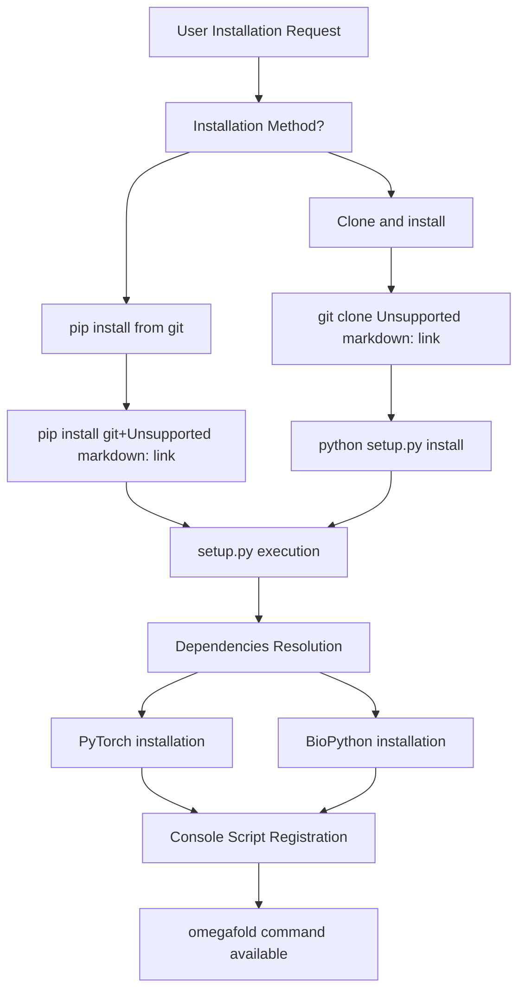
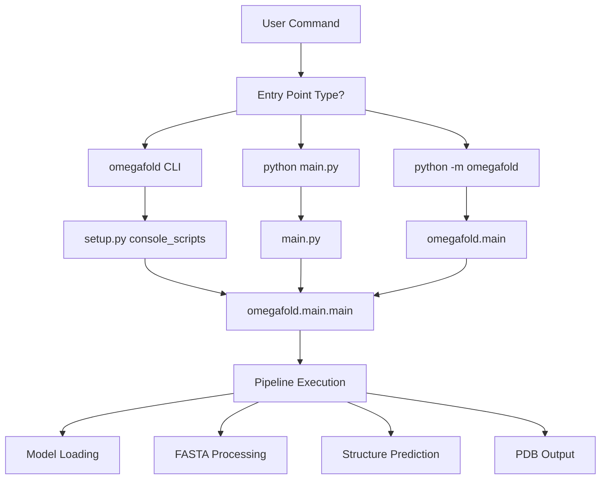
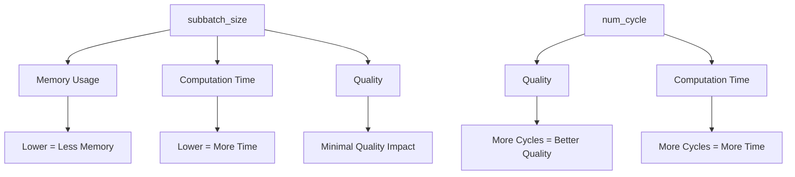
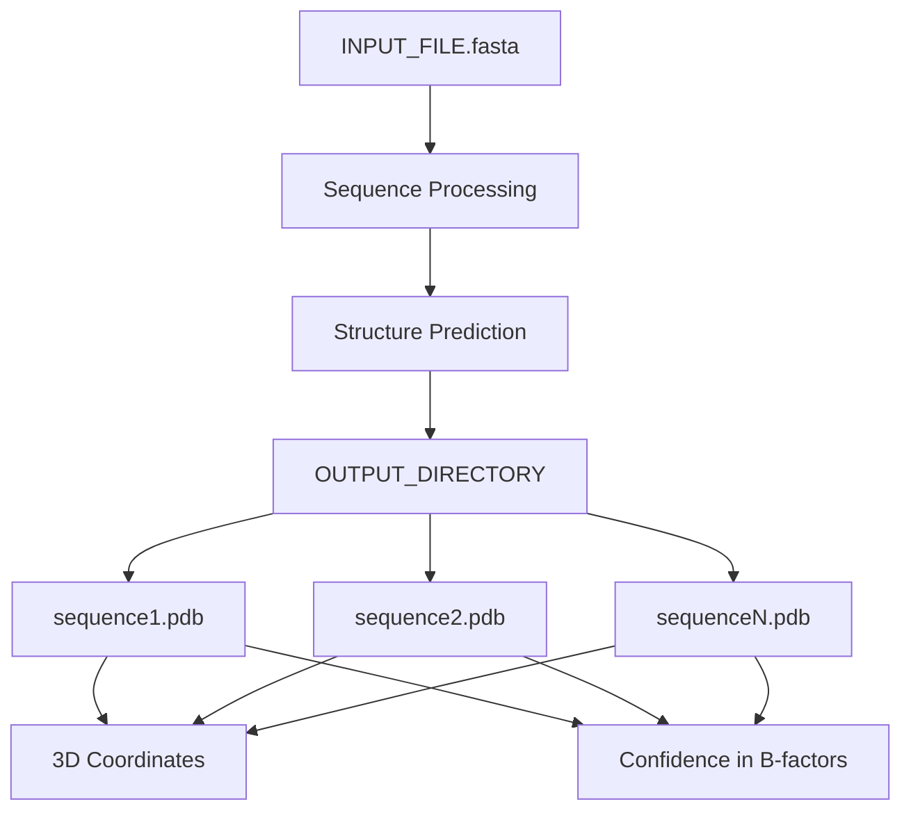

# Installation and Usage

> **Relevant source files**
> * [.gitignore](https://github.com/HeliXonProtein/OmegaFold/blob/313c873a/.gitignore)
> * [README.md](https://github.com/HeliXonProtein/OmegaFold/blob/313c873a/README.md?plain=1)
> * [main.py](https://github.com/HeliXonProtein/OmegaFold/blob/313c873a/main.py)
> * [requirements.txt](https://github.com/HeliXonProtein/OmegaFold/blob/313c873a/requirements.txt)
> * [setup.py](https://github.com/HeliXonProtein/OmegaFold/blob/313c873a/setup.py)

This document provides comprehensive guidance for installing OmegaFold and using it to predict protein structures from primary sequences. It covers system requirements, installation methods, basic usage patterns, command-line options, and output formats.

For detailed information about the underlying neural network architecture, see [Core Model Components](/HeliXonProtein/OmegaFold/4-core-model-components). For configuration management and model parameters, see [Configuration Management](/HeliXonProtein/OmegaFold/7.1-configuration-management).

## System Requirements

OmegaFold requires Python 3.8 or higher and has minimal third-party dependencies. The system is designed to work across multiple platforms with specific considerations for different hardware configurations.

### Hardware Requirements

| Component | Minimum | Recommended |
| --- | --- | --- |
| GPU Memory | 8GB VRAM | 80GB (NVIDIA A100) |
| System RAM | 16GB | 32GB+ |
| Storage | 1GB for models | 10GB+ for large datasets |
| Python Version | 3.8 | 3.9-3.10 |

### Platform Support

* **Linux**: Full support with CUDA acceleration
* **Windows**: Supported via CUDA
* **macOS**: Supported with MPS acceleration (Apple Silicon)

*Sources: [README.md L36-L41](https://github.com/HeliXonProtein/OmegaFold/blob/313c873a/README.md?plain=1#L36-L41)

 [setup.py L7-L23](https://github.com/HeliXonProtein/OmegaFold/blob/313c873a/setup.py#L7-L23)*

## Installation Methods

OmegaFold provides two primary installation approaches, each with specific use cases and platform considerations.

### Installation Flow Diagram



### Method 1: Direct Installation from Git

The simplest installation method uses pip to install directly from the GitHub repository:

```
pip install git+https://github.com/HeliXonProtein/OmegaFold.git
```

This method automatically handles dependency resolution and registers the `omegafold` console command.

### Method 2: Clone and Install

For development or when you need to modify the source code:

```
git clone https://github.com/HeliXonProtein/OmegaFoldcd OmegaFoldpython setup.py install
```

This approach provides access to the source code and enables running via `python main.py` for platforms with installation issues.

### macOS-Specific Installation

macOS users require special consideration for Apple Silicon acceleration:

1. Install PyTorch nightly build for MPS support
2. Clone the repository (required for current macOS compatibility)
3. Use `python main.py` execution method

*Sources: [README.md L46-L61](https://github.com/HeliXonProtein/OmegaFold/blob/313c873a/README.md?plain=1#L46-L61)

 [setup.py L25-L38](https://github.com/HeliXonProtein/OmegaFold/blob/313c873a/setup.py#L25-L38)*

## Entry Points and Execution

OmegaFold provides multiple entry points to accommodate different usage patterns and platform requirements.

### Entry Point Architecture



### Primary Usage Command

The standard execution method after installation:

```
omegafold INPUT_FILE.fasta OUTPUT_DIRECTORY
```

### Alternative Execution Methods

For systems where the console script installation fails or for development:

```
python main.py INPUT_FILE.fasta OUTPUT_DIRECTORY
```

Or using Python module execution:

```
python -m omegafold INPUT_FILE.fasta OUTPUT_DIRECTORY
```

*Sources: [README.md L74-L94](https://github.com/HeliXonProtein/OmegaFold/blob/313c873a/README.md?plain=1#L74-L94)

 [main.py L1-L6](https://github.com/HeliXonProtein/OmegaFold/blob/313c873a/main.py#L1-L6)

 [setup.py L32](https://github.com/HeliXonProtein/OmegaFold/blob/313c873a/setup.py#L32-L32)*

## Command Line Interface

OmegaFold provides extensive command-line options for controlling execution behavior, memory usage, and model selection.

### Basic Usage Pattern

```
omegafold [OPTIONS] INPUT_FILE.fasta OUTPUT_DIRECTORY
```

### Core Parameters

| Parameter | Description | Default | Example |
| --- | --- | --- | --- |
| `INPUT_FILE.fasta` | Input FASTA file with protein sequences | Required | `proteins.fasta` |
| `OUTPUT_DIRECTORY` | Directory for PDB output files | Required | `./results/` |
| `--model` | Model variant selection (1 or 2) | 1 | `--model 2` |
| `--num_cycle` | Number of refinement cycles | Model default | `--num_cycle 10` |
| `--subbatch_size` | Memory optimization parameter | Sequence length | `--subbatch_size 448` |

### Help System

Access complete parameter documentation:

```
omegafold --help
```

*Sources: [README.md L107-L113](https://github.com/HeliXonProtein/OmegaFold/blob/313c873a/README.md?plain=1#L107-L113)

 [README.md L15](https://github.com/HeliXonProtein/OmegaFold/blob/313c873a/README.md?plain=1#L15-L15)*

## Memory Optimization and Performance

OmegaFold implements sophisticated memory management to handle large protein sequences efficiently.

### Subbatch Configuration

The `--subbatch_size` parameter enables memory-computation trade-offs:

* **Default**: Equal to sequence length (maximum memory usage)
* **Minimum**: 1 (maximum memory savings)
* **Recommended**: Start with half the sequence length if memory issues occur

### Memory Usage Examples

| Sequence Length | GPU Memory | Recommended Subbatch | Max Length (A100 80GB) |
| --- | --- | --- | --- |
| 1000 residues | ~8GB | 500 | N/A |
| 2000 residues | ~32GB | 1000 | N/A |
| 4096 residues | ~80GB | 448 | 4096 |

### Performance Trade-offs



*Sources: [README.md L17-L34](https://github.com/HeliXonProtein/OmegaFold/blob/313c873a/README.md?plain=1#L17-L34)*

## Input Format Requirements

OmegaFold accepts standard FASTA format files with specific formatting requirements.

### FASTA File Structure

```
>sequence_identifier_1
MKLLVLSLCFLAFAVAQKNMQAQRGLMAVAKKTERAKDIFRVQRQVQSLLLVVPKYTISRFCVFGL
>sequence_identifier_2  
MRLISRLDPCLLFLLPLVSLFFSEAGAAAKEITVQAFLQSLQGRPFLDTFLDPPASGRGFQIHTP
```

### Format Requirements

* Comment lines start with `>` or `:`
* Each sequence follows its comment line
* Multiple sequences per file supported
* Standard amino acid single-letter codes
* No sequence length restrictions (limited by available memory)

*Sources: [README.md L63-L66](https://github.com/HeliXonProtein/OmegaFold/blob/313c873a/README.md?plain=1#L63-L66)*

## Model Variants and Weight Management

OmegaFold supports multiple model variants with automatic weight management.

### Model Selection

| Model | Release Date | Usage | Characteristics |
| --- | --- | --- | --- |
| Model 1 | Initial | `--model 1` | Original release model |
| Model 2 | Dec 2022 | `--model 2` | Enhanced performance |

### Automatic Weight Download

The system automatically downloads model weights on first execution:

* **Source URL**: `https://helixon.s3.amazonaws.com/release1.pt`
* **Cache Location**: `~/.cache/omegafold_ckpt/model.pt`
* **Size**: Approximately 1GB per model

*Sources: [README.md L13-L15](https://github.com/HeliXonProtein/OmegaFold/blob/313c873a/README.md?plain=1#L13-L15)

 [README.md L67-L71](https://github.com/HeliXonProtein/OmegaFold/blob/313c873a/README.md?plain=1#L67-L71)*

## Output Format and Structure

OmegaFold generates standard PDB files with embedded confidence information.

### Output Organization



### PDB File Features

* **One PDB file per input sequence**
* **Standard PDB coordinate format**
* **Confidence scores in B-factor fields**
* **High-resolution 3D structure data**

### Confidence Interpretation

The B-factor field contains OmegaFold's confidence estimates for each residue, providing quality assessment for predicted coordinates.

*Sources: [README.md L115-L119](https://github.com/HeliXonProtein/OmegaFold/blob/313c873a/README.md?plain=1#L115-L119)*

## Troubleshooting and Platform Issues

Common installation and execution issues with their solutions.

### Memory Issues

**Problem**: CUDA out of memory errors
**Solution**: Reduce `--subbatch_size` parameter incrementally

```
omegafold input.fasta output/ --subbatch_size 256
```

### macOS Installation Issues

**Problem**: Console script not working on macOS
**Solution**: Use direct Python execution

```
python main.py input.fasta output/
```

### Dependency Conflicts

**Problem**: PyTorch version conflicts
**Solution**: Install minimal dependencies manually

```
pip install torch biopythonpython main.py input.fasta output/
```

### Platform-Specific Dependencies

The setup.py automatically selects appropriate PyTorch wheels based on platform detection, but manual installation may be required for unsupported configurations.

*Sources: [README.md L84-L94](https://github.com/HeliXonProtein/OmegaFold/blob/313c873a/README.md?plain=1#L84-L94)

 [setup.py L7-L23](https://github.com/HeliXonProtein/OmegaFold/blob/313c873a/setup.py#L7-L23)*