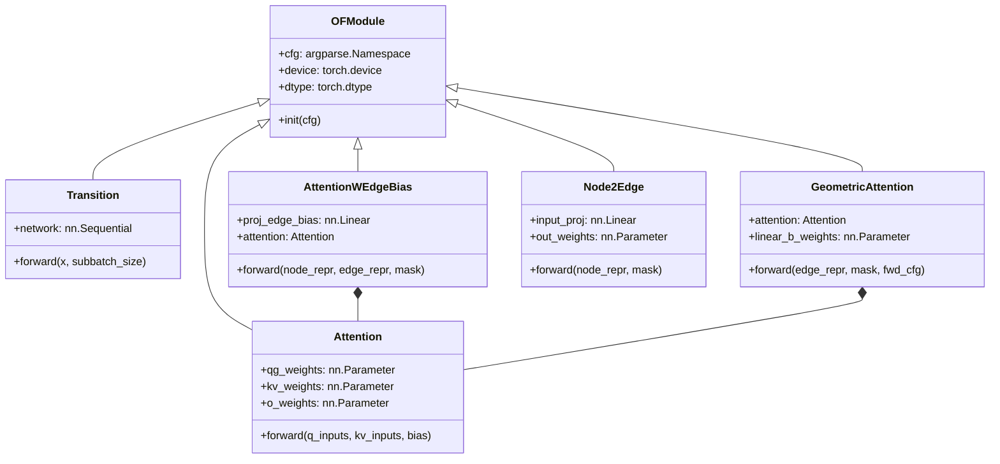
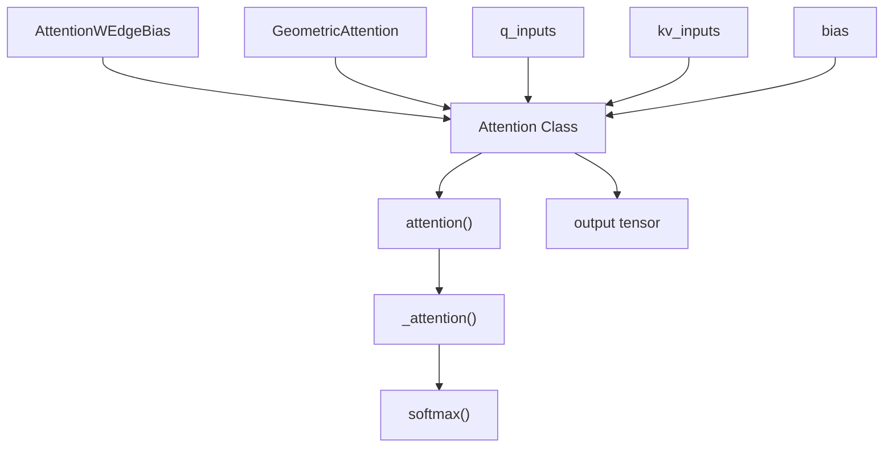
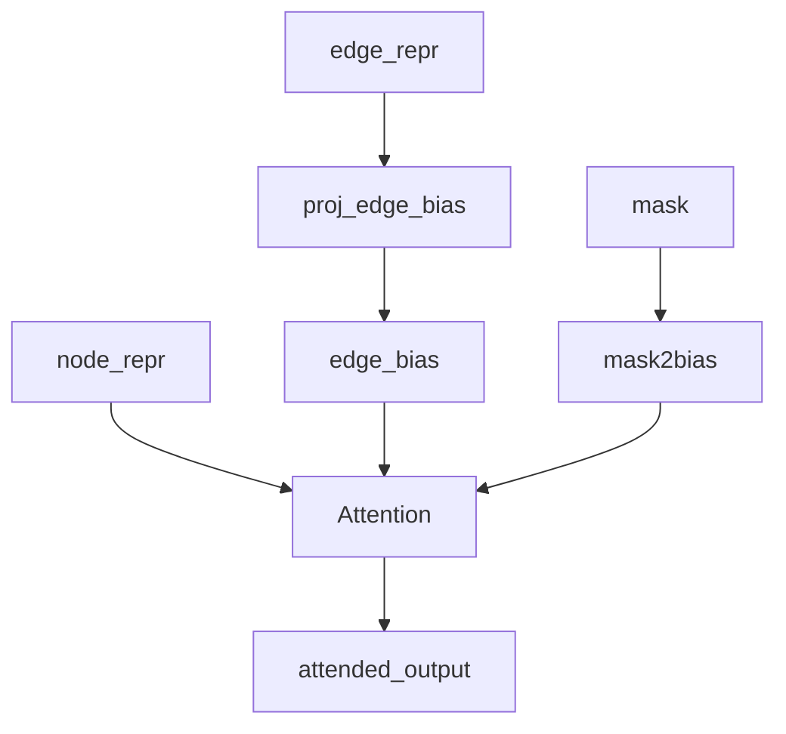
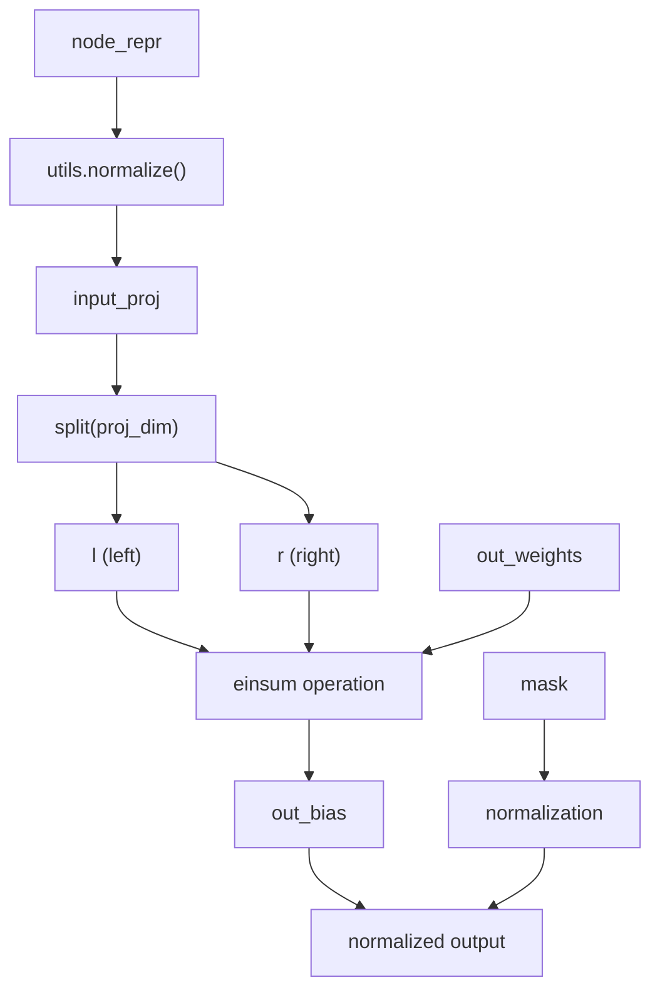
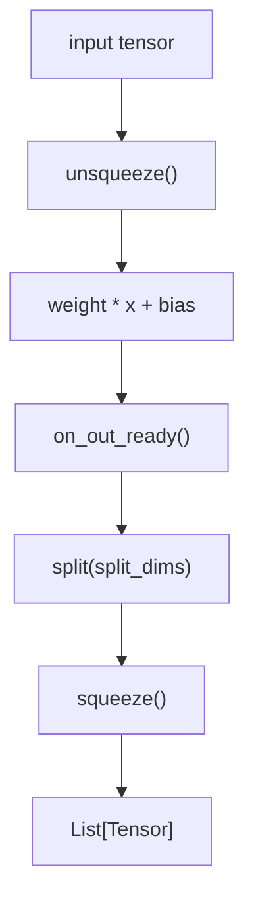
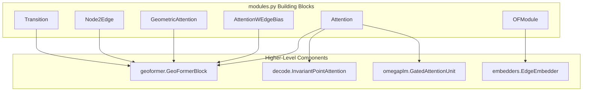

# Neural Network Building Blocks

> **Relevant source files**
> * [omegafold/modules.py](https://github.com/HeliXonProtein/OmegaFold/blob/313c873a/omegafold/modules.py)

This document provides a comprehensive guide to the reusable neural network components and modules that form the foundation of the OmegaFold system. These building blocks are primarily defined in `omegafold/modules.py` and serve as the fundamental computational units that are composed into higher-level architectures.

For detailed information about specific attention mechanisms, see [Attention Mechanisms](/HeliXonProtein/OmegaFold/5.1-attention-mechanisms). For embedding-related components, see [Embedding Systems](/HeliXonProtein/OmegaFold/5.2-embedding-systems). For how these building blocks are assembled into complete models, see [Core Model Components](/HeliXonProtein/OmegaFold/4-core-model-components).

## Base Module Infrastructure

### OFModule Base Class

The `OFModule` class serves as the foundation for all neural network components in OmegaFold, providing common functionality and device/dtype management.

**Sources:** [omegafold/modules.py L171-L191](https://github.com/HeliXonProtein/OmegaFold/blob/313c873a/omegafold/modules.py#L171-L191)

### Transition Networks

The `Transition` class implements feed-forward networks with normalization and activation functions, commonly used between attention layers.

| Component | Purpose | Key Features |
| --- | --- | --- |
| `network` | Sequential feed-forward layers | Expansion factor `n`, configurable activation |
| `forward()` | Batch processing with subbatching | Memory-efficient processing of large sequences |

**Sources:** [omegafold/modules.py L193-L217](https://github.com/HeliXonProtein/OmegaFold/blob/313c873a/omegafold/modules.py#L193-L217)

## Core Attention Infrastructure

### Standard Attention Implementation

The system provides both low-level attention functions and high-level attention modules:

**Key Functions:**

* `attention()` - Main attention computation with subbatching support
* `_attention()` - Core attention math implementation
* `softmax()` - Optimized softmax with in-place option

**Sources:** [omegafold/modules.py L104-L164](https://github.com/HeliXonProtein/OmegaFold/blob/313c873a/omegafold/modules.py#L104-L164)

 [omegafold/modules.py L69-L102](https://github.com/HeliXonProtein/OmegaFold/blob/313c873a/omegafold/modules.py#L69-L102)

 [omegafold/modules.py L39-L67](https://github.com/HeliXonProtein/OmegaFold/blob/313c873a/omegafold/modules.py#L39-L67)

### Multi-Headed Attention Module

The `Attention` class provides the standard multi-headed attention mechanism with optional gating:

| Parameter | Shape | Purpose |
| --- | --- | --- |
| `qg_weights` | `(q_dim, n_axis, n_head, (gating+1)*c)` | Query and gate projections |
| `kv_weights` | `(kv_dim, n_axis, n_head, 2*c)` | Key and value projections |
| `o_weights` | `(n_axis, n_head, c, out_dim)` | Output projection |

**Sources:** [omegafold/modules.py L375-L495](https://github.com/HeliXonProtein/OmegaFold/blob/313c873a/omegafold/modules.py#L375-L495)

## Specialized Attention Mechanisms

### Edge-Biased Attention

`AttentionWEdgeBias` incorporates edge information into attention computation for graph-based processing:

**Sources:** [omegafold/modules.py L497-L549](https://github.com/HeliXonProtein/OmegaFold/blob/313c873a/omegafold/modules.py#L497-L549)

### Geometric Attention

`GeometricAttention` handles spatial relationships and geometric processing with specialized sharding for memory efficiency:

**Key Features:**

* Symmetric edge processing with `_get_sharded_stacked()`
* Separate row and column activations
* GLU-based gating mechanisms
* Memory-efficient computation for large structures

**Sources:** [omegafold/modules.py L569-L707](https://github.com/HeliXonProtein/OmegaFold/blob/313c873a/omegafold/modules.py#L569-L707)

## Graph Processing Components

### Node-to-Edge Communication

The `Node2Edge` module facilitates communication between node and edge representations in graph neural networks:

**Sources:** [omegafold/modules.py L341-L373](https://github.com/HeliXonProtein/OmegaFold/blob/313c873a/omegafold/modules.py#L341-L373)

## Utility Components

### Value Binning

Two specialized modules handle conversion between continuous and discrete representations:

| Module | Purpose | Configuration |
| --- | --- | --- |
| `Val2Bins` | Hard binning with thresholds | `first_break`, `last_break`, `num_bins` |
| `Val2ContBins` | Soft binning with Gaussian kernels | `x_min`, `x_max`, `x_bins` |

**Sources:** [omegafold/modules.py L309-L339](https://github.com/HeliXonProtein/OmegaFold/blob/313c873a/omegafold/modules.py#L309-L339)

 [omegafold/modules.py L283-L307](https://github.com/HeliXonProtein/OmegaFold/blob/313c873a/omegafold/modules.py#L283-L307)

### Multi-Headed Scaling

`MultiHeadedScaling` provides element-wise scaling and shifting operations across multiple heads:

**Sources:** [omegafold/modules.py L219-L281](https://github.com/HeliXonProtein/OmegaFold/blob/313c873a/omegafold/modules.py#L219-L281)

## System Integration

### Building Block Composition

These components are composed into higher-level architectures throughout the OmegaFold system:

**Sources:** [omegafold/modules.py L1-L714](https://github.com/HeliXonProtein/OmegaFold/blob/313c873a/omegafold/modules.py#L1-L714)

### Memory Management

The building blocks incorporate several memory optimization strategies:

* **Subbatching**: Most attention mechanisms support `subbatch_size` parameters for processing large sequences in chunks
* **In-place operations**: The `softmax()` function supports in-place computation
* **Sharded processing**: `GeometricAttention` uses `_get_sharded_stacked()` for memory-efficient geometric processing

**Sources:** [omegafold/modules.py L551-L567](https://github.com/HeliXonProtein/OmegaFold/blob/313c873a/omegafold/modules.py#L551-L567)

 [omegafold/modules.py L58-L64](https://github.com/HeliXonProtein/OmegaFold/blob/313c873a/omegafold/modules.py#L58-L64)