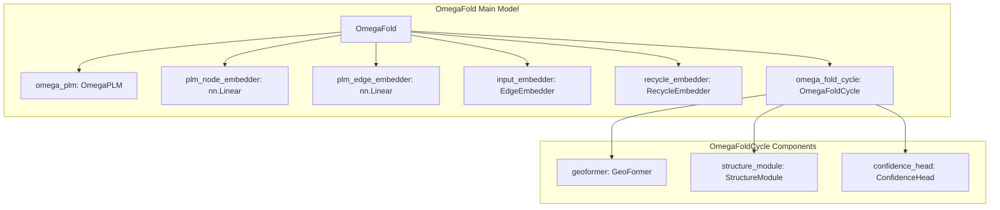
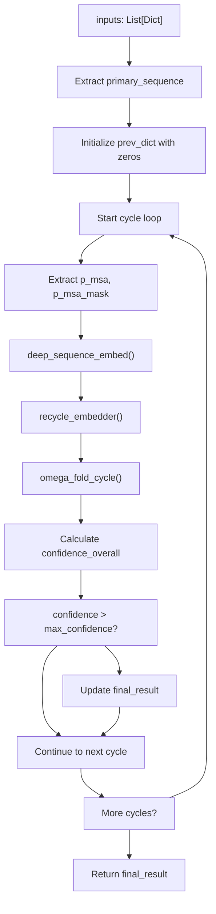
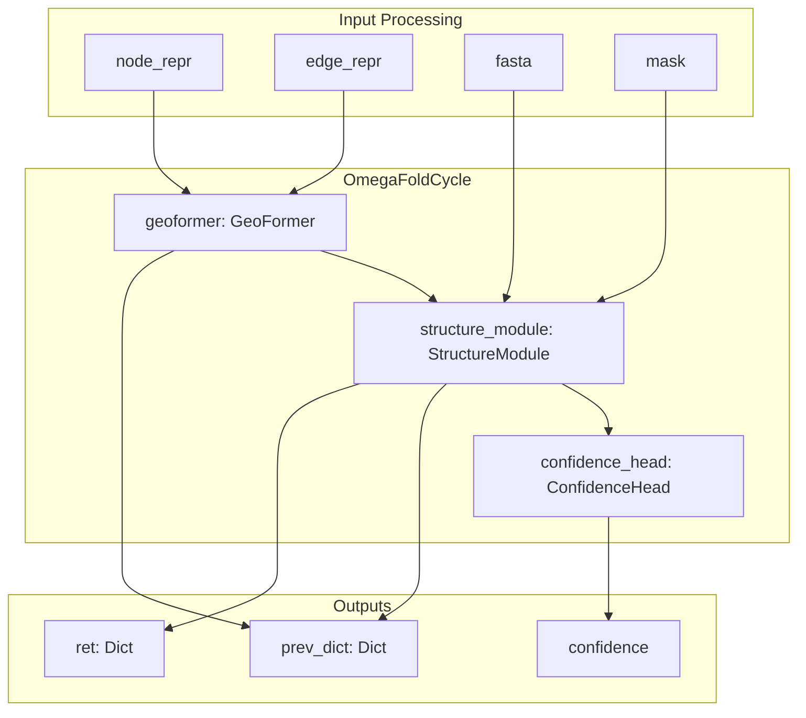
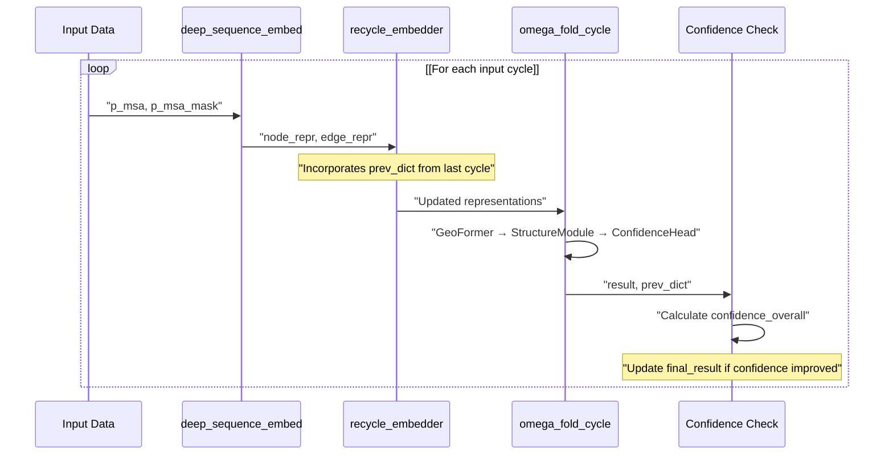
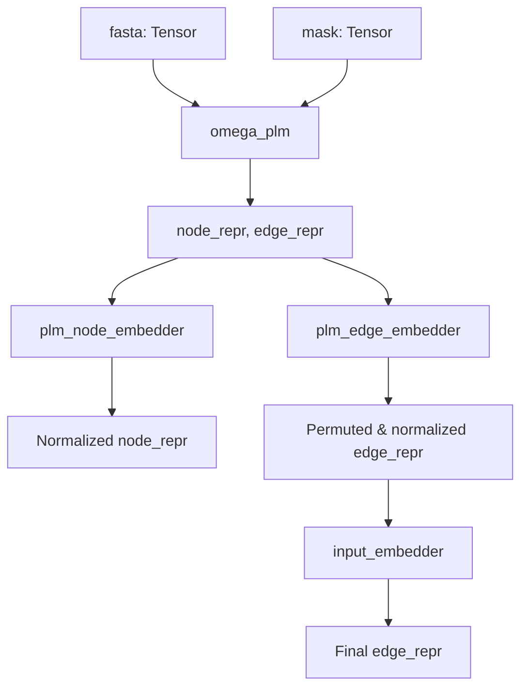

# OmegaFold Model

> **Relevant source files**
> * [omegafold/config.py](https://github.com/HeliXonProtein/OmegaFold/blob/313c873a/omegafold/config.py)
> * [omegafold/model.py](https://github.com/HeliXonProtein/OmegaFold/blob/313c873a/omegafold/model.py)

This document covers the core model architecture of OmegaFold, specifically the `OmegaFold` and `OmegaFoldCycle` classes that implement the main neural network for protein structure prediction. These classes orchestrate the iterative refinement process that transforms protein sequences into 3D structures.

For information about the geometric processing components used within these models, see [Geometric Processing](/HeliXonProtein/OmegaFold/4.2-geometric-processing). For details about the protein language model component, see [Protein Language Model](/HeliXonProtein/OmegaFold/4.3-protein-language-model). For the neural network building blocks that comprise these models, see [Neural Network Building Blocks](/HeliXonProtein/OmegaFold/5-neural-network-building-blocks).

## Model Architecture Overview

The OmegaFold model consists of two primary classes that work together to perform iterative structure prediction:

* `OmegaFold`: The main orchestrating class that manages the overall prediction process
* `OmegaFoldCycle`: Represents a single iteration of the structure refinement process

### OmegaFold Model Composition



Sources: [omegafold/model.py L126-L133](https://github.com/HeliXonProtein/OmegaFold/blob/313c873a/omegafold/model.py#L126-L133)

 [omegafold/model.py L54-L59](https://github.com/HeliXonProtein/OmegaFold/blob/313c873a/omegafold/model.py#L54-L59)

## OmegaFold Class Structure

The `OmegaFold` class serves as the main entry point and orchestrator for the structure prediction process. It manages the iterative refinement across multiple cycles and handles confidence-based result selection.

### Component Initialization

| Component | Type | Purpose |
| --- | --- | --- |
| `omega_plm` | `OmegaPLM` | Protein language model for initial sequence embeddings |
| `plm_node_embedder` | `nn.Linear` | Projects PLM node representations to model dimensions |
| `plm_edge_embedder` | `nn.Linear` | Projects PLM edge representations to model dimensions |
| `input_embedder` | `EdgeEmbedder` | Embeds sequence and positional information |
| `recycle_embedder` | `RecycleEmbedder` | Incorporates information from previous cycles |
| `omega_fold_cycle` | `OmegaFoldCycle` | Performs one iteration of structure refinement |

### Forward Pass Process



Sources: [omegafold/model.py L135-L203](https://github.com/HeliXonProtein/OmegaFold/blob/313c873a/omegafold/model.py#L135-L203)

 [omegafold/model.py L154-L202](https://github.com/HeliXonProtein/OmegaFold/blob/313c873a/omegafold/model.py#L154-L202)

## OmegaFoldCycle Structure

The `OmegaFoldCycle` class represents a single iteration of the structure prediction process. It combines geometric processing, structure generation, and confidence estimation.

### Component Architecture



### Forward Method Flow

The `OmegaFoldCycle.forward` method processes inputs through three sequential stages:

1. **Geometric Processing**: The `geoformer` processes node and edge representations
2. **Structure Generation**: The `structure_module` generates 3D coordinates
3. **Confidence Estimation**: The `confidence_head` evaluates prediction quality

Sources: [omegafold/model.py L61-L112](https://github.com/HeliXonProtein/OmegaFold/blob/313c873a/omegafold/model.py#L61-L112)

 [omegafold/model.py L90-L104](https://github.com/HeliXonProtein/OmegaFold/blob/313c873a/omegafold/model.py#L90-L104)

## Iterative Refinement Process

The model implements an iterative refinement mechanism where information from previous cycles is recycled to improve predictions.

### Cycle Data Flow



### Previous State Management

The model maintains state between cycles through a `prev_dict` containing:

| Key | Shape | Purpose |
| --- | --- | --- |
| `prev_node` | `[num_res, node_dim]` | Node representations from previous cycle |
| `prev_edge` | `[num_res, num_res, edge_dim]` | Edge representations from previous cycle |
| `prev_x` | `[num_res, 14, 3]` | Atom coordinates from previous cycle |
| `prev_frames` | `AAFrame` | Coordinate frames from previous cycle |

Sources: [omegafold/model.py L106-L111](https://github.com/HeliXonProtein/OmegaFold/blob/313c873a/omegafold/model.py#L106-L111)

 [omegafold/model.py L248-L264](https://github.com/HeliXonProtein/OmegaFold/blob/313c873a/omegafold/model.py#L248-L264)

## Data Flow and Transformations

### Deep Sequence Embedding Process

The `deep_sequence_embed` method transforms raw sequence data into neural network representations:



### Input Data Structure

The model expects inputs as a list of dictionaries with the following structure:

```
_INPUTS = List[Dict[Union[str, int], Any]]
```

Each dictionary contains:

* `p_msa`: Pseudo-multiple sequence alignment data
* `p_msa_mask`: Mask indicating valid positions

Sources: [omegafold/model.py L205-L234](https://github.com/HeliXonProtein/OmegaFold/blob/313c873a/omegafold/model.py#L205-L234)

 [omegafold/model.py L115](https://github.com/HeliXonProtein/OmegaFold/blob/313c873a/omegafold/model.py#L115-L115)

 [omegafold/model.py L154-L165](https://github.com/HeliXonProtein/OmegaFold/blob/313c873a/omegafold/model.py#L154-L165)

## Configuration Integration

The model classes integrate with the configuration system defined in `config.py`. Key configuration parameters include:

| Parameter | Default | Purpose |
| --- | --- | --- |
| `node_dim` | 256 | Dimensionality of node representations |
| `edge_dim` | 128 | Dimensionality of edge representations |
| `geo_num_blocks` | 50 | Number of geometric processing blocks |
| `struct.num_cycle` | 8 | Number of structure module cycles |

Sources: [omegafold/model.py L54](https://github.com/HeliXonProtein/OmegaFold/blob/313c873a/omegafold/model.py#L54-L54)

 [omegafold/model.py L126](https://github.com/HeliXonProtein/OmegaFold/blob/313c873a/omegafold/model.py#L126-L126)

 [omegafold/config.py L59-L108](https://github.com/HeliXonProtein/OmegaFold/blob/313c873a/omegafold/config.py#L59-L108)