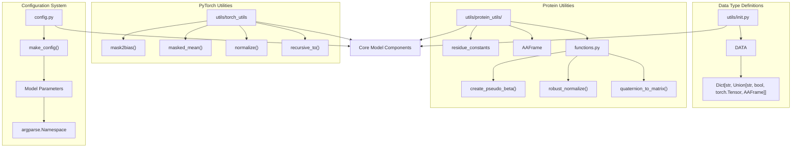
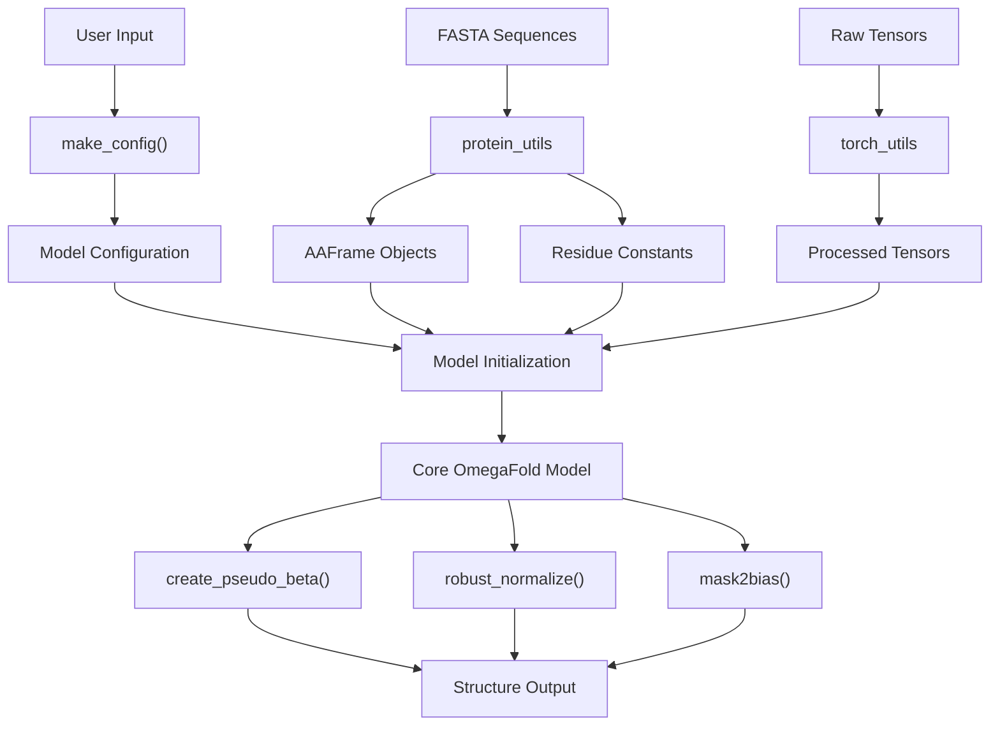
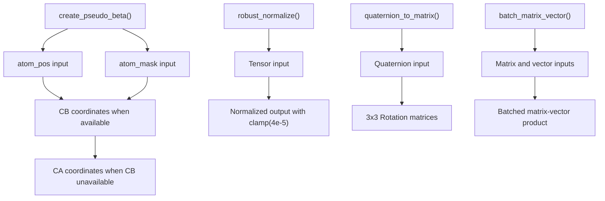
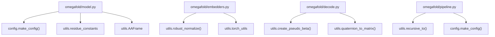

# Supporting Systems

# Supporting Systems

> **Relevant source files**
> - [omegafold/config\.py](https://github.com/HeliXonProtein/OmegaFold/blob/313c873a/omegafold/config.py)
> - [omegafold/utils/\_\_init\_\_\.py](https://github.com/HeliXonProtein/OmegaFold/blob/313c873a/omegafold/utils/__init__.py)
> - [omegafold/utils/protein\_utils/functions\.py](https://github.com/HeliXonProtein/OmegaFold/blob/313c873a/omegafold/utils/protein_utils/functions.py)

 This page documents the utility modules, configuration management, and supporting data structures that enable OmegaFold's core functionality\. These systems provide essential infrastructure for model configuration, protein data handling, PyTorch operations, and general computational utilities\.

 For detailed information about model configurations, see [Configuration Management](https://deepwiki.com/HeliXonProtein/OmegaFold/7.1-configuration-management)\. For protein\-specific data structures and coordinate handling, see [Protein Data Structures](https://deepwiki.com/HeliXonProtein/OmegaFold/7.2-protein-data-structures)\. For PyTorch utilities and general helper functions, see [General Utilities](https://deepwiki.com/HeliXonProtein/OmegaFold/7.3-general-utilities)\.

## Overview

 The supporting systems in OmegaFold form the foundation that enables the core model components to operate effectively\. These systems handle three primary responsibilities:

 1. **Configuration Management**: Centralized parameter definitions for different model variants
2. **Protein Data Handling**: Specialized utilities for protein coordinates, frames, and biochemical constants
3. **General Computational Utilities**: PyTorch operations, tensor manipulations, and common helper functions

## System Architecture

### Supporting Systems Organization



 Sources: [config\.py L1-L122](https://github.com/HeliXonProtein/OmegaFold/blob/313c873a/omegafold/config.py#L1-L122) [\_\_init\_\_\.py L1-L57](https://github.com/HeliXonProtein/OmegaFold/blob/313c873a/omegafold/utils/__init__.py#L1-L57) [functions\.py L1-L159](https://github.com/HeliXonProtein/OmegaFold/blob/313c873a/omegafold/utils/protein_utils/functions.py#L1-L159)

### Data Flow Through Supporting Systems



 Sources: [config\.py L43-L111](https://github.com/HeliXonProtein/OmegaFold/blob/313c873a/omegafold/config.py#L43-L111) [\_\_init\_\_\.py L27-L40](https://github.com/HeliXonProtein/OmegaFold/blob/313c873a/omegafold/utils/__init__.py#L27-L40) [functions\.py L120-L146](https://github.com/HeliXonProtein/OmegaFold/blob/313c873a/omegafold/utils/protein_utils/functions.py#L120-L146)

## Configuration System

 The configuration system provides centralized parameter management through the `make_config()` function in `omegafold/config.py`\. This system supports two model variants and organizes parameters into logical groups:

### Configuration Structure

| Parameter Group | Purpose | Key Parameters |
| --- | --- | --- |
| plm | Protein Language Model settings | alphabet\_size, node, attn\_dim |
| prev\_pos | Previous position binning | first\_break, last\_break, num\_bins |
| dist\_bin | Distance binning parameters | x\_min, x\_max, x\_bins |
| struct | Structure module configuration | node\_dim, num\_cycle, num\_head |

 The `_make_config()` function recursively converts nested dictionaries into `argparse.Namespace` objects, enabling dot\-notation access to configuration parameters throughout the codebase\.

 Sources: [config\.py L32-L40](https://github.com/HeliXonProtein/OmegaFold/blob/313c873a/omegafold/config.py#L32-L40) [config\.py L43-L111](https://github.com/HeliXonProtein/OmegaFold/blob/313c873a/omegafold/config.py#L43-L111)

## Protein Utilities

### Core Functions

 The protein utilities provide specialized functions for handling protein\-specific computations:



 Sources: [functions\.py L120-L146](https://github.com/HeliXonProtein/OmegaFold/blob/313c873a/omegafold/utils/protein_utils/functions.py#L120-L146) [functions\.py L47-L63](https://github.com/HeliXonProtein/OmegaFold/blob/313c873a/omegafold/utils/protein_utils/functions.py#L47-L63) [functions\.py L65-L98](https://github.com/HeliXonProtein/OmegaFold/blob/313c873a/omegafold/utils/protein_utils/functions.py#L65-L98) [functions\.py L101-L117](https://github.com/HeliXonProtein/OmegaFold/blob/313c873a/omegafold/utils/protein_utils/functions.py#L101-L117)

### Data Structures

 The protein utilities define the primary data interchange format used throughout OmegaFold:

```
DATA = Dict[str, Union[str, bool, torch.Tensor, AAFrame]]
```

 This type definition appears in [\_\_init\_\_\.py L45](https://github.com/HeliXonProtein/OmegaFold/blob/313c873a/omegafold/utils/__init__.py#L45-L45) and establishes the standard format for passing protein data between components\.

 Sources: [\_\_init\_\_\.py L45](https://github.com/HeliXonProtein/OmegaFold/blob/313c873a/omegafold/utils/__init__.py#L45-L45)

## PyTorch Utilities

 The PyTorch utilities provide essential tensor operations optimized for OmegaFold's computational patterns:

### Key Utility Functions

| Function | Purpose | Location |
| --- | --- | --- |
| mask2bias\(\) | Convert attention masks to bias tensors | torch\_utils |
| masked\_mean\(\) | Compute means while respecting masks | torch\_utils |
| normalize\(\) | Standard tensor normalization | torch\_utils |
| recursive\_to\(\) | Move nested data structures to devices | torch\_utils |

### Device Compatibility

 Several functions include special handling for device compatibility, particularly for MPS \(Metal Performance Shaders\) devices:

 - `get_norm()` replaces `LA.norm` for MPS compatibility [functions\.py L34-L44](https://github.com/HeliXonProtein/OmegaFold/blob/313c873a/omegafold/utils/protein_utils/functions.py#L34-L44)
- `bit_wise_not()` provides MPS\-compatible bitwise operations [functions\.py L148-L151](https://github.com/HeliXonProtein/OmegaFold/blob/313c873a/omegafold/utils/protein_utils/functions.py#L148-L151)

 Sources: [\_\_init\_\_\.py L35-L40](https://github.com/HeliXonProtein/OmegaFold/blob/313c873a/omegafold/utils/__init__.py#L35-L40) [functions\.py L34-L44](https://github.com/HeliXonProtein/OmegaFold/blob/313c873a/omegafold/utils/protein_utils/functions.py#L34-L44) [functions\.py L148-L151](https://github.com/HeliXonProtein/OmegaFold/blob/313c873a/omegafold/utils/protein_utils/functions.py#L148-L151)

## Integration with Core Systems

### Supporting System Dependencies



 Sources: [\_\_init\_\_\.py L27-L40](https://github.com/HeliXonProtein/OmegaFold/blob/313c873a/omegafold/utils/__init__.py#L27-L40) [config\.py L43-L111](https://github.com/HeliXonProtein/OmegaFold/blob/313c873a/omegafold/config.py#L43-L111)

 The supporting systems integrate seamlessly with OmegaFold's core components, providing essential infrastructure that enables the model's protein structure prediction capabilities\. Configuration management ensures consistent parameter handling across model variants, while protein and PyTorch utilities provide the computational primitives necessary for efficient tensor operations and protein data manipulation\.

---
*Source: [https://deepwiki.com/HeliXonProtein/OmegaFold/7-supporting-systems](https://deepwiki.com/HeliXonProtein/OmegaFold/7-supporting-systems) on DeepWiki*