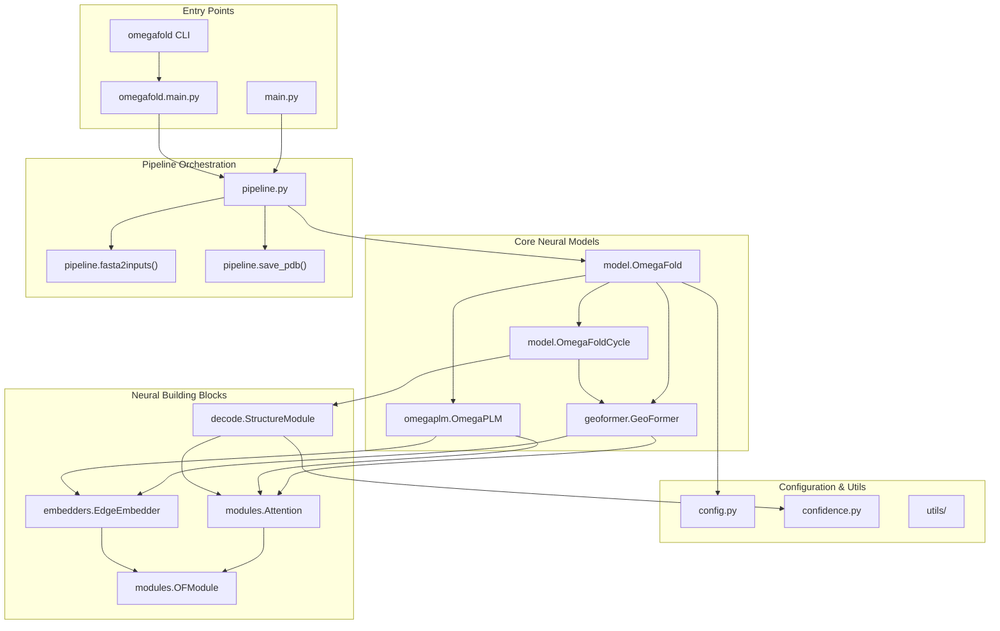
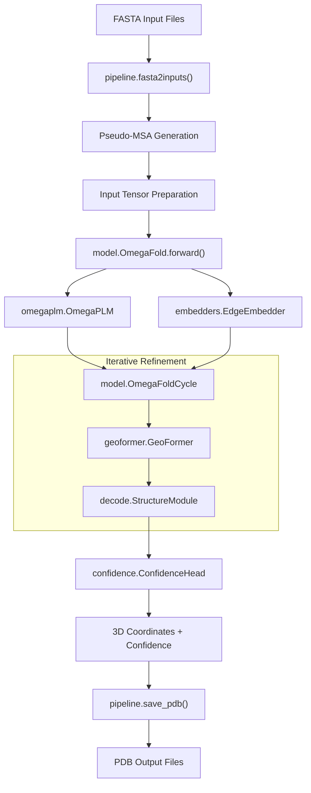

# Overview

> **Relevant source files**
> * [README.md](https://github.com/HeliXonProtein/OmegaFold/blob/313c873a/README.md?plain=1)
> * [figure.png](https://github.com/HeliXonProtein/OmegaFold/blob/313c873a/figure.png)

## Purpose and Scope

This document provides a high-level introduction to OmegaFold, a deep learning system for de novo protein structure prediction from amino acid sequences. It covers the system's purpose, core capabilities, and main architectural components. For detailed installation and usage instructions, see [Installation and Usage](/HeliXonProtein/OmegaFold/2-installation-and-usage). For in-depth technical details about the neural network architecture, see [System Architecture](/HeliXonProtein/OmegaFold/3-system-architecture) and [Core Model Components](/HeliXonProtein/OmegaFold/4-core-model-components).

## What is OmegaFold

OmegaFold is a high-resolution protein structure prediction system that generates 3D molecular structures directly from amino acid sequences without requiring multiple sequence alignments (MSAs) or evolutionary information. The system implements a transformer-based neural network architecture that performs iterative refinement to predict protein coordinates and confidence scores.

The system accepts FASTA-formatted protein sequences as input and produces PDB files containing predicted 3D structures with confidence scores stored in the B-factor field. OmegaFold represents a significant advancement in ab initio structure prediction by achieving high accuracy without relying on homologous sequences.

Sources: [README.md L3-L5](https://github.com/HeliXonProtein/OmegaFold/blob/313c873a/README.md?plain=1#L3-L5)

 [README.md L63-L65](https://github.com/HeliXonProtein/OmegaFold/blob/313c873a/README.md?plain=1#L63-L65)

 [README.md L117-L119](https://github.com/HeliXonProtein/OmegaFold/blob/313c873a/README.md?plain=1#L117-L119)

## Core System Capabilities

| Capability | Description |
| --- | --- |
| **De novo prediction** | Predicts 3D structure from sequence alone without MSAs |
| **High resolution** | Generates atomic-level coordinate predictions |
| **Confidence estimation** | Provides per-residue confidence scores |
| **Memory optimization** | Supports long sequences through subbatch processing |
| **Multiple models** | Includes model variants with different performance characteristics |
| **Batch processing** | Handles multiple sequences in a single FASTA file |

The system supports proteins up to 4096 residues in length on high-memory GPUs and provides configurable trade-offs between computation time, memory usage, and prediction quality through parameters like `subbatch_size` and `num_cycle`.

Sources: [README.md L17-L23](https://github.com/HeliXonProtein/OmegaFold/blob/313c873a/README.md?plain=1#L17-L23)

 [README.md L27-L33](https://github.com/HeliXonProtein/OmegaFold/blob/313c873a/README.md?plain=1#L27-L33)

 [README.md L98-L105](https://github.com/HeliXonProtein/OmegaFold/blob/313c873a/README.md?plain=1#L98-L105)

## Main System Components

The following diagram maps the primary system components to their corresponding code entities:

Sources: [main.py L1](https://github.com/HeliXonProtein/OmegaFold/blob/313c873a/main.py#L1-L1)

 [omegafold/__main__.py L1](https://github.com/HeliXonProtein/OmegaFold/blob/313c873a/omegafold/__main__.py#L1-L1)

 [omegafold/pipeline.py L1](https://github.com/HeliXonProtein/OmegaFold/blob/313c873a/omegafold/pipeline.py#L1-L1)

 [omegafold/model.py L1](https://github.com/HeliXonProtein/OmegaFold/blob/313c873a/omegafold/model.py#L1-L1)

## Data Flow Architecture

The system processes protein sequences through a well-defined pipeline from input to output:

Sources: [omegafold/pipeline.py L1](https://github.com/HeliXonProtein/OmegaFold/blob/313c873a/omegafold/pipeline.py#L1-L1)

 [omegafold/model.py L1](https://github.com/HeliXonProtein/OmegaFold/blob/313c873a/omegafold/model.py#L1-L1)

 [omegafold/geoformer.py L1](https://github.com/HeliXonProtein/OmegaFold/blob/313c873a/omegafold/geoformer.py#L1-L1)

 [omegafold/decode.py L1](https://github.com/HeliXonProtein/OmegaFold/blob/313c873a/omegafold/decode.py#L1-L1)

## Key System Characteristics

### Iterative Refinement Process

The core prediction mechanism uses `OmegaFoldCycle` to iteratively refine structure predictions. Each cycle processes the current state through geometric transformations and attention mechanisms to progressively improve coordinate accuracy.

### Memory-Efficient Processing

The system implements subbatch processing to handle long protein sequences on limited GPU memory. The `subbatch_size` parameter controls the trade-off between memory usage and computation time.

### Multiple Model Support

OmegaFold supports different model variants (model 1, model 2) with varying performance characteristics. Models are automatically downloaded from remote storage and cached locally.

### Cross-Platform Compatibility

The system supports NVIDIA GPUs with CUDA acceleration and Apple Silicon with MPS acceleration. Fallback CPU execution is available for systems without GPU support.

Sources: [README.md L15](https://github.com/HeliXonProtein/OmegaFold/blob/313c873a/README.md?plain=1#L15-L15)

 [README.md L27-L33](https://github.com/HeliXonProtein/OmegaFold/blob/313c873a/README.md?plain=1#L27-L33)

 [README.md L37-L40](https://github.com/HeliXonProtein/OmegaFold/blob/313c873a/README.md?plain=1#L37-L40)

 [README.md L67-L70](https://github.com/HeliXonProtein/OmegaFold/blob/313c873a/README.md?plain=1#L67-L70)

## Output and Confidence Assessment

OmegaFold generates PDB-formatted structure files with predicted 3D coordinates for all heavy atoms. Confidence scores are embedded in the B-factor field of the PDB file, providing per-residue quality estimates for the predictions. The confidence scoring helps users assess the reliability of different regions within the predicted structure.

Sources: [README.md L117-L119](https://github.com/HeliXonProtein/OmegaFold/blob/313c873a/README.md?plain=1#L117-L119)

 [omegafold/confidence.py L1](https://github.com/HeliXonProtein/OmegaFold/blob/313c873a/omegafold/confidence.py#L1-L1)