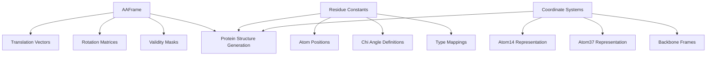
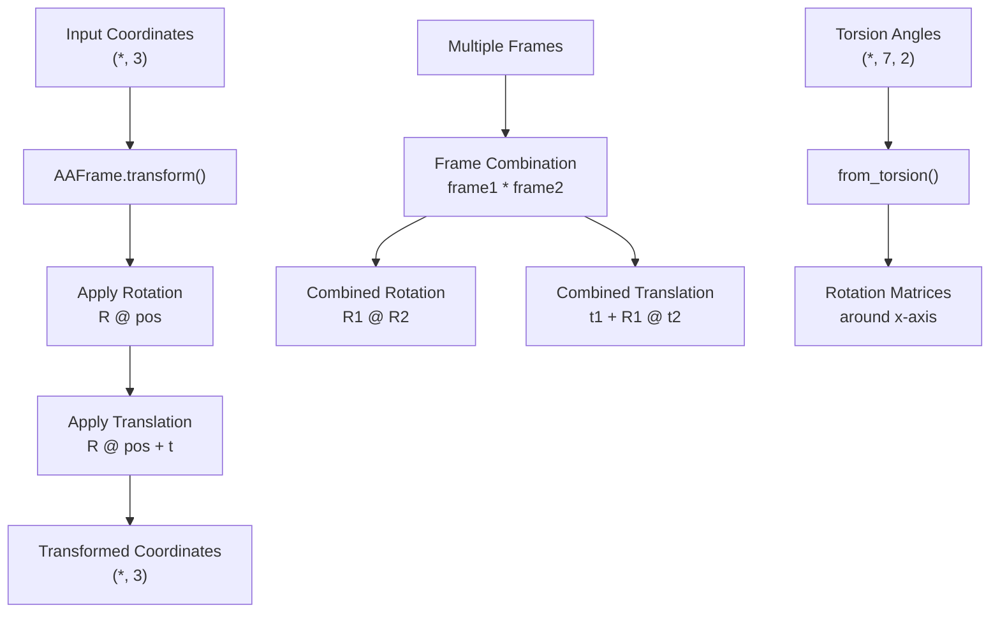
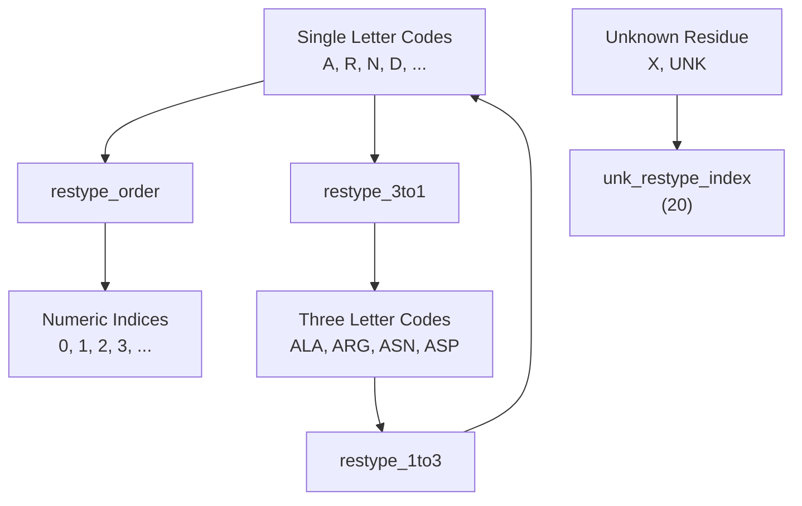
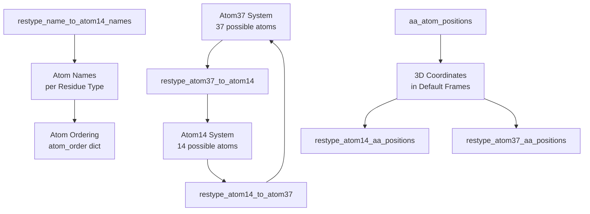
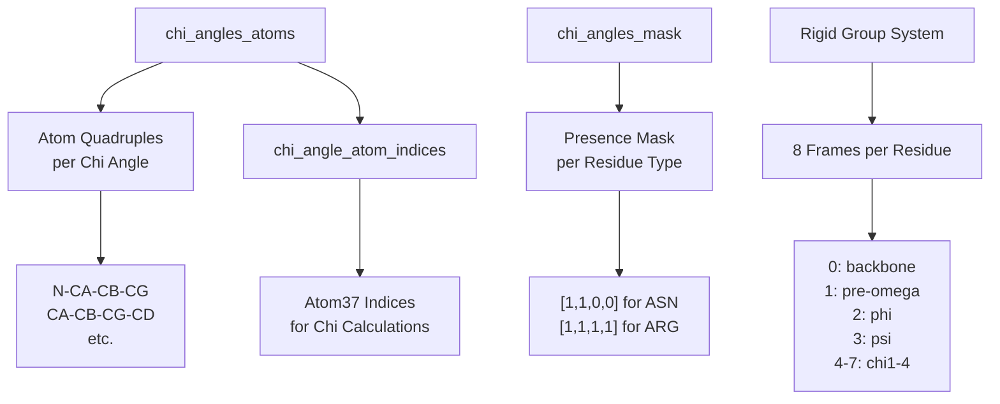
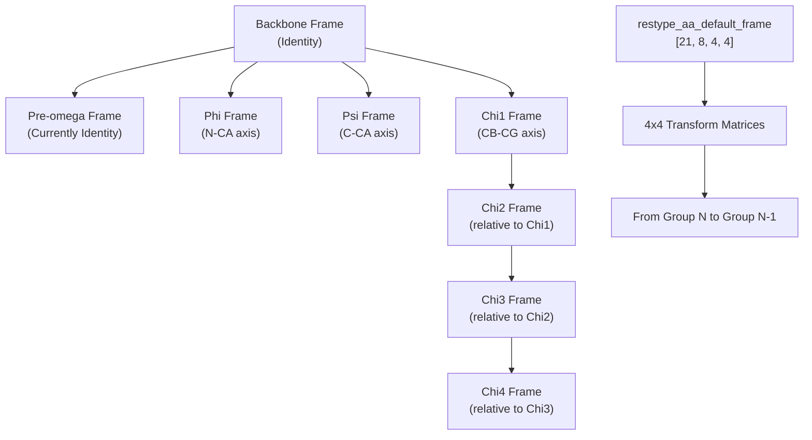
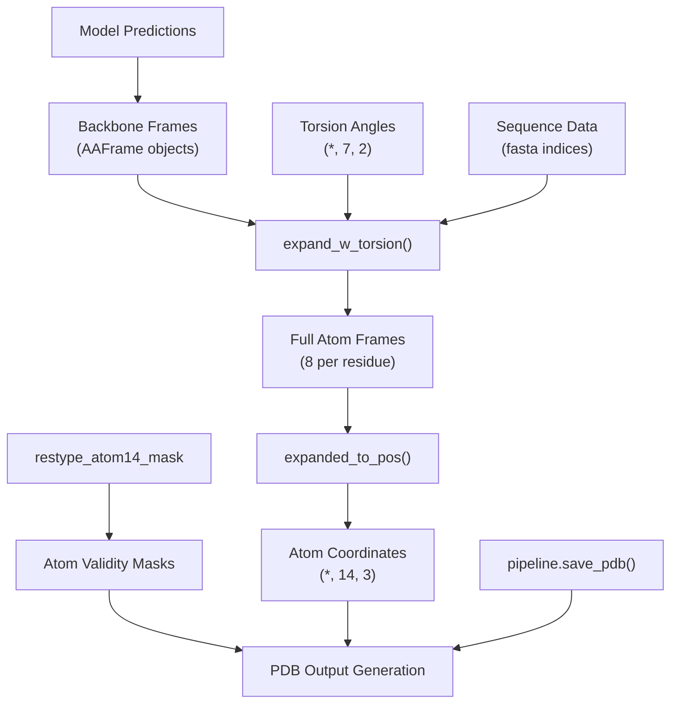

# Protein Data Structures

> **Relevant source files**
> * [omegafold/utils/protein_utils/__init__.py](https://github.com/HeliXonProtein/OmegaFold/blob/313c873a/omegafold/utils/protein_utils/__init__.py)
> * [omegafold/utils/protein_utils/aaframe.py](https://github.com/HeliXonProtein/OmegaFold/blob/313c873a/omegafold/utils/protein_utils/aaframe.py)
> * [omegafold/utils/protein_utils/residue_constants.py](https://github.com/HeliXonProtein/OmegaFold/blob/313c873a/omegafold/utils/protein_utils/residue_constants.py)

This document covers the specialized data structures used in OmegaFold for representing protein coordinates, transformation frames, and amino acid constants. These structures provide the foundation for handling 3D protein geometry and converting between different atomic representations.

For information about the broader configuration management system, see [Configuration Management](/HeliXonProtein/OmegaFold/7.1-configuration-management). For general utility functions that work with these structures, see [General Utilities](/HeliXonProtein/OmegaFold/7.3-general-utilities).

## Overview of Protein Data Structures

OmegaFold uses a sophisticated system of data structures to represent protein geometry at multiple levels of detail. The core components include coordinate transformation frames, amino acid constants, and mapping systems between different atomic representations.

**Core Data Structure Components**



Sources: [omegafold/utils/protein_utils/aaframe.py L57-L96](https://github.com/HeliXonProtein/OmegaFold/blob/313c873a/omegafold/utils/protein_utils/aaframe.py#L57-L96)

 [omegafold/utils/protein_utils/residue_constants.py L18-L24](https://github.com/HeliXonProtein/OmegaFold/blob/313c873a/omegafold/utils/protein_utils/residue_constants.py#L18-L24)

## AAFrame: Protein Coordinate Transformation System

The `AAFrame` class serves as the primary data structure for handling protein coordinate transformations, representing rigid body transformations with translation and rotation components.

### AAFrame Structure and Properties

**AAFrame Core Components**


The `AAFrame` class manages three core tensor components:

| Component | Shape | Purpose |
| --- | --- | --- |
| `_translation` | `(*, 3)` | 3D translation vectors |
| `_rotation` | `(*, 3, 3)` | 3x3 rotation matrices |
| `_mask` | `(*)` | Boolean validity masks |

Sources: [omegafold/utils/protein_utils/aaframe.py L62-L96](https://github.com/HeliXonProtein/OmegaFold/blob/313c873a/omegafold/utils/protein_utils/aaframe.py#L62-L96)

 [omegafold/utils/protein_utils/aaframe.py L194-L255](https://github.com/HeliXonProtein/OmegaFold/blob/313c873a/omegafold/utils/protein_utils/aaframe.py#L194-L255)

### Coordinate Transformation Operations

The `AAFrame` system provides methods for transforming coordinates and combining transformations:

**Transformation Pipeline**



Key transformation methods include:

* `transform(pos)`: Applies the frame transformation to input coordinates
* `_combine_transformation(other)`: Combines two frames using matrix multiplication
* `from_torsion(torsion_angles, mask)`: Creates frames from torsion angle representations

Sources: [omegafold/utils/protein_utils/aaframe.py L414-L479](https://github.com/HeliXonProtein/OmegaFold/blob/313c873a/omegafold/utils/protein_utils/aaframe.py#L414-L479)

 [omegafold/utils/protein_utils/aaframe.py L640-L685](https://github.com/HeliXonProtein/OmegaFold/blob/313c873a/omegafold/utils/protein_utils/aaframe.py#L640-L685)

 [omegafold/utils/protein_utils/aaframe.py L482-L523](https://github.com/HeliXonProtein/OmegaFold/blob/313c873a/omegafold/utils/protein_utils/aaframe.py#L482-L523)

### Protein-Specific Frame Operations

The `AAFrame` class provides specialized methods for protein structure generation:

**Full Atom Expansion Process**

```mermaid
sequenceDiagram
  participant Backbone Frames
  participant expand_w_torsion()
  participant Default Frames
  participant Torsion Frames
  participant Side Chain Chaining
  participant All Atom Frames

  Backbone Frames->>expand_w_torsion(): backbone frames + torsion angles
  expand_w_torsion()->>Default Frames: load restype_aa_default_frame
  expand_w_torsion()->>Torsion Frames: create rotation frames from angles
  Default Frames->>Side Chain Chaining: combine with torsion rotations
  Side Chain Chaining->>Side Chain Chaining: chain chi1->chi2->chi3->chi4
  Side Chain Chaining->>All Atom Frames: 8 frames per residue (bb + 7 torsions)
  All Atom Frames->>All Atom Frames: expanded_to_pos() → atom coordinates
```

The `expand_w_torsion` method implements Algorithm 24 from the AlphaFold 2 supplementary material, converting backbone frames and torsion angles into full atomic coordinate systems.

Sources: [omegafold/utils/protein_utils/aaframe.py L716-L809](https://github.com/HeliXonProtein/OmegaFold/blob/313c873a/omegafold/utils/protein_utils/aaframe.py#L716-L809)

 [omegafold/utils/protein_utils/aaframe.py L836-L882](https://github.com/HeliXonProtein/OmegaFold/blob/313c873a/omegafold/utils/protein_utils/aaframe.py#L836-L882)

## Residue Constants and Atomic Representations

The residue constants system provides comprehensive mappings between different protein representations and amino acid properties.

### Amino Acid Type System

**Residue Type Mappings**



Key constants include:

| Constant | Purpose | Shape |
| --- | --- | --- |
| `restypes` | Standard 20 amino acids | `[20]` |
| `restype_order` | Letter to index mapping | `dict` |
| `restype_1to3` | Single to three letter codes | `dict` |
| `unk_restype_index` | Unknown residue index (20) | `int` |

Sources: [omegafold/utils/protein_utils/residue_constants.py L374-L380](https://github.com/HeliXonProtein/OmegaFold/blob/313c873a/omegafold/utils/protein_utils/residue_constants.py#L374-L380)

 [omegafold/utils/protein_utils/residue_constants.py L386-L414](https://github.com/HeliXonProtein/OmegaFold/blob/313c873a/omegafold/utils/protein_utils/residue_constants.py#L386-L414)

### Atomic Representation Systems

OmegaFold uses multiple atomic representation systems optimized for different purposes:

**Atom Representation Comparison**

| Representation | Atoms per Residue | Purpose | Key Constants |
| --- | --- | --- | --- |
| Atom37 | Up to 37 | Complete atomic detail | `restype_atom37_mask` |
| Atom14 | Up to 14 | Compact representation | `restype_atom14_mask` |
| Backbone | 4-5 | Core structure | N, CA, C, O atoms |

**Atomic Representation Mappings**



Sources: [omegafold/utils/protein_utils/residue_constants.py L574-L606](https://github.com/HeliXonProtein/OmegaFold/blob/313c873a/omegafold/utils/protein_utils/residue_constants.py#L574-L606)

 [omegafold/utils/protein_utils/residue_constants.py L330-L368](https://github.com/HeliXonProtein/OmegaFold/blob/313c873a/omegafold/utils/protein_utils/residue_constants.py#L330-L368)

 [omegafold/utils/protein_utils/residue_constants.py L100-L309](https://github.com/HeliXonProtein/OmegaFold/blob/313c873a/omegafold/utils/protein_utils/residue_constants.py#L100-L309)

### Chi Angle and Torsion Systems

The system includes comprehensive definitions for protein backbone and side chain torsion angles:

**Chi Angle Definition System**



The chi angle system defines up to 4 side chain torsion angles per residue type, with atom quadruples specifying the dihedral angle calculation.

Sources: [omegafold/utils/protein_utils/residue_constants.py L30-L57](https://github.com/HeliXonProtein/OmegaFold/blob/313c873a/omegafold/utils/protein_utils/residue_constants.py#L30-L57)

 [omegafold/utils/protein_utils/residue_constants.py L62-L86](https://github.com/HeliXonProtein/OmegaFold/blob/313c873a/omegafold/utils/protein_utils/residue_constants.py#L62-L86)

 [omegafold/utils/protein_utils/residue_constants.py L442-L467](https://github.com/HeliXonProtein/OmegaFold/blob/313c873a/omegafold/utils/protein_utils/residue_constants.py#L442-L467)

### Default Frame System

The system includes pre-computed transformation matrices for converting between rigid group frames:

**Rigid Group Frame Hierarchy**



The `restype_aa_default_frame` tensor contains pre-computed 4x4 transformation matrices that define the spatial relationships between rigid groups for each amino acid type.

Sources: [omegafold/utils/protein_utils/residue_constants.py L498-L572](https://github.com/HeliXonProtein/OmegaFold/blob/313c873a/omegafold/utils/protein_utils/residue_constants.py#L498-L572)

 [omegafold/utils/protein_utils/residue_constants.py L470-L485](https://github.com/HeliXonProtein/OmegaFold/blob/313c873a/omegafold/utils/protein_utils/residue_constants.py#L470-L485)

## Integration with OmegaFold Pipeline

These protein data structures integrate with the broader OmegaFold system to enable structure prediction and output generation:

**Data Structure Integration Flow**



The protein data structures serve as the bridge between neural network outputs and final PDB file generation, handling the complex geometric transformations required for accurate protein structure representation.

Sources: [omegafold/utils/protein_utils/aaframe.py L716-L809](https://github.com/HeliXonProtein/OmegaFold/blob/313c873a/omegafold/utils/protein_utils/aaframe.py#L716-L809)

 [omegafold/utils/protein_utils/aaframe.py L836-L882](https://github.com/HeliXonProtein/OmegaFold/blob/313c873a/omegafold/utils/protein_utils/aaframe.py#L836-L882)

 [omegafold/utils/protein_utils/residue_constants.py L941-L961](https://github.com/HeliXonProtein/OmegaFold/blob/313c873a/omegafold/utils/protein_utils/residue_constants.py#L941-L961)