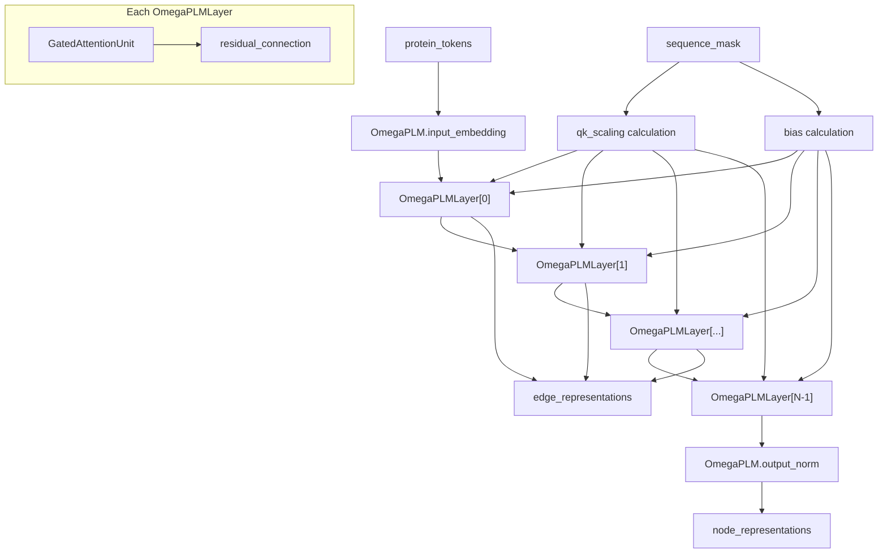
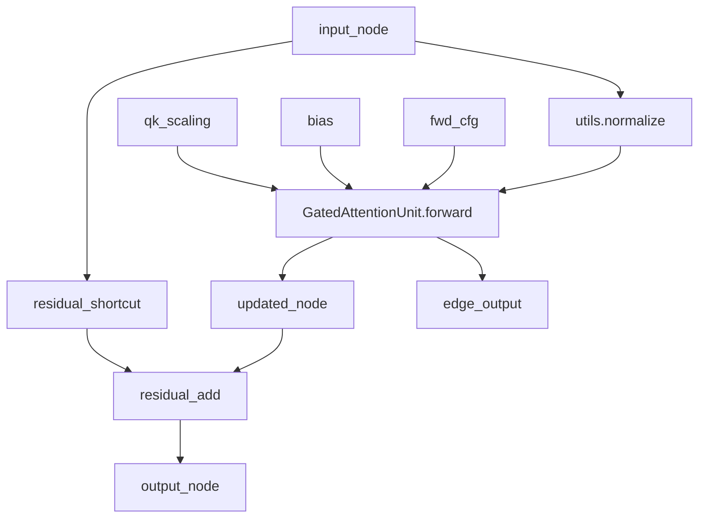
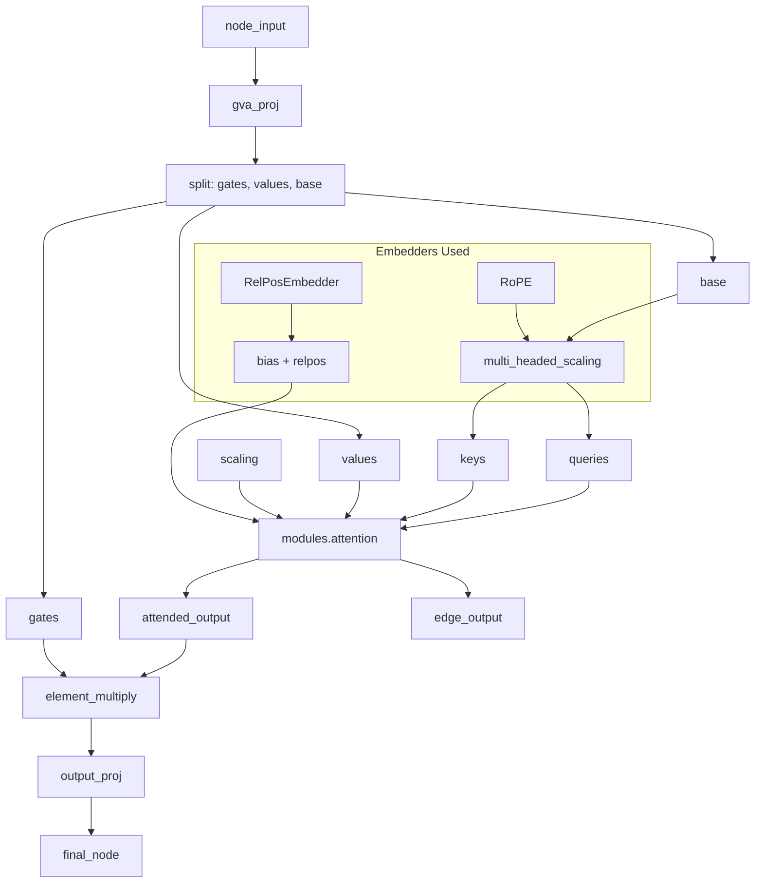
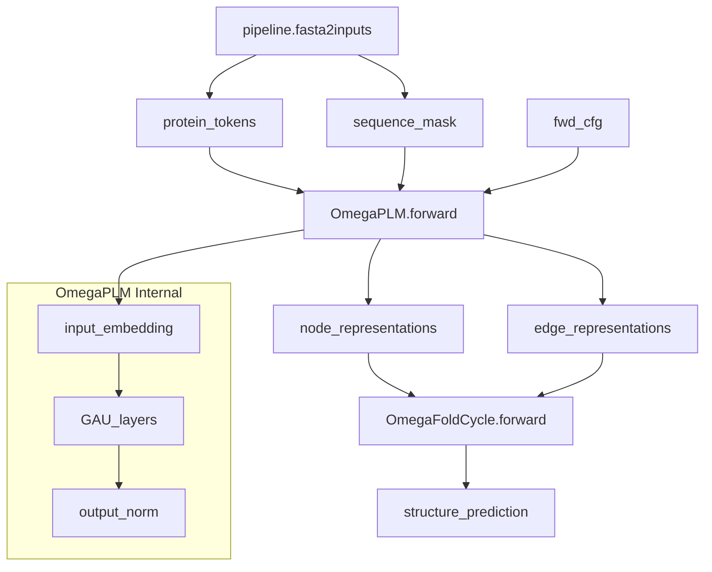

# Protein Language Model

> **Relevant source files**
> * [omegafold/modules.py](https://github.com/HeliXonProtein/OmegaFold/blob/313c873a/omegafold/modules.py)
> * [omegafold/omegaplm.py](https://github.com/HeliXonProtein/OmegaFold/blob/313c873a/omegafold/omegaplm.py)

## Purpose and Scope

This document covers the OmegaPLM (Protein Language Model) component, which generates initial sequence representations from protein tokens that serve as the foundation for structure prediction. The OmegaPLM processes amino acid sequences using a transformer-like architecture with Gated Attention Units (GAU) to produce both node and edge representations that feed into the iterative structure refinement process.

For information about the broader model architecture that uses these representations, see [OmegaFold Model](/HeliXonProtein/OmegaFold/4.1-omegafold-model). For details about the attention mechanisms used within OmegaPLM, see [Attention Mechanisms](/HeliXonProtein/OmegaFold/5.1-attention-mechanisms). For embedding components used by the language model, see [Embedding Systems](/HeliXonProtein/OmegaFold/5.2-embedding-systems).

## Architecture Overview

The protein language model in OmegaFold implements a specialized transformer architecture optimized for protein sequences. Unlike standard language models, OmegaPLM is designed to capture both sequential dependencies and potential structural relationships in protein sequences.

**OmegaPLM System Architecture**



Sources: [omegafold/omegaplm.py L162-L244](https://github.com/HeliXonProtein/OmegaFold/blob/313c873a/omegafold/omegaplm.py#L162-L244)

## Core Components

### OmegaPLM Class

The `OmegaPLM` class serves as the main entry point for protein language modeling. It implements a stack of specialized transformer layers with modifications for protein sequences.

| Component | Type | Purpose |
| --- | --- | --- |
| `input_embedding` | `nn.Embedding` | Converts protein tokens to dense vectors |
| `layers` | `nn.ModuleList[OmegaPLMLayer]` | Stack of GAU-based transformer layers |
| `output_norm` | `nn.LayerNorm` | Final normalization of node representations |

The model processes sequences through the following key steps:

1. Token embedding with fine-tuning scale adjustment
2. Dynamic QK scaling based on sequence length
3. Sequential processing through GAU layers
4. Aggregation of edge representations across layers

Sources: [omegafold/omegaplm.py L162-L183](https://github.com/HeliXonProtein/OmegaFold/blob/313c873a/omegafold/omegaplm.py#L162-L183)

 [omegafold/omegaplm.py L184-L219](https://github.com/HeliXonProtein/OmegaFold/blob/313c873a/omegafold/omegaplm.py#L184-L219)

### OmegaPLMLayer Architecture

Each `OmegaPLMLayer` implements a pre-layernorm configuration with residual connections around a `GatedAttentionUnit`.

**OmegaPLMLayer Data Flow**



Sources: [omegafold/omegaplm.py L121-L159](https://github.com/HeliXonProtein/OmegaFold/blob/313c873a/omegafold/omegaplm.py#L121-L159)

### Gated Attention Unit (GAU)

The `GatedAttentionUnit` is the core computational component that combines attention mechanisms with gating for enhanced representation learning.

**GAU Internal Architecture**



The GAU implements several key innovations:

* **Gating mechanism**: Element-wise multiplication of attention output with learned gates
* **Rotary Position Embedding (RoPE)**: Applied to queries and keys for position awareness
* **Relative position bias**: Added to attention logits for sequence modeling
* **Multi-headed scaling**: Learnable scaling applied to attention dimensions

Sources: [omegafold/omegaplm.py L56-L118](https://github.com/HeliXonProtein/OmegaFold/blob/313c873a/omegafold/omegaplm.py#L56-L118)

 [omegafold/embedders.py](https://github.com/HeliXonProtein/OmegaFold/blob/313c873a/omegafold/embedders.py)

## Input Processing and Scaling

### Dynamic QK Scaling

OmegaPLM implements a sophisticated scaling mechanism that adapts attention logits based on sequence length:

```python
def _get_qk_scaling(num_res: torch.Tensor, attn_dim: int) -> torch.Tensor:    return num_res.clamp(min=4e-5).log() / (math.log(512) * attn_dim ** 0.5)
```

This scaling prevents attention collapse in very long sequences and normalizes attention patterns across different protein lengths.

Sources: [omegafold/omegaplm.py L39-L50](https://github.com/HeliXonProtein/OmegaFold/blob/313c873a/omegafold/omegaplm.py#L39-L50)

### Fine-tuning Scale Adjustment

The model applies a dynamic scaling factor to input embeddings based on the observed masking ratio during training:

| Parameter | Purpose |
| --- | --- |
| `un_masked_ratio_train` | Expected unmasked ratio during training |
| `mask_ratio_observed` | Actual masking ratio in current input |
| Scaling factor | Compensates for distribution shift between training and inference |

Sources: [omegafold/omegaplm.py L222-L243](https://github.com/HeliXonProtein/OmegaFold/blob/313c873a/omegafold/omegaplm.py#L222-L243)

## Integration with OmegaFold Pipeline

**OmegaPLM in System Context**



The OmegaPLM serves as the initial feature extractor in the OmegaFold pipeline:

1. **Input**: Receives tokenized protein sequences and attention masks
2. **Processing**: Generates contextualized representations through GAU layers
3. **Output**: Produces node representations for each residue and aggregated edge representations
4. **Integration**: Feeds into geometric processing and iterative refinement cycles

Sources: [omegafold/model.py](https://github.com/HeliXonProtein/OmegaFold/blob/313c873a/omegafold/model.py)

 [omegafold/pipeline.py](https://github.com/HeliXonProtein/OmegaFold/blob/313c873a/omegafold/pipeline.py)

## Key Technical Features

### Attention Mechanism Details

The GAU uses the general attention function from `modules.attention` with specific configurations:

| Parameter | Value | Purpose |
| --- | --- | --- |
| `return_edge` | `True` | Captures inter-residue relationships |
| `edge_reduction` | `'sum'` | Aggregates attention across heads |
| `edge_reduction_dim` | `-3` | Reduces over the head dimension |

### Position Encoding Strategy

OmegaPLM combines multiple position encoding approaches:

* **RoPE (Rotary Position Embedding)**: Applied to queries and keys in multi-headed scaling
* **Relative Position Embedding**: Added as bias terms to attention logits
* **Dynamic scaling**: Length-dependent normalization of attention patterns

Sources: [omegafold/omegaplm.py L103-L113](https://github.com/HeliXonProtein/OmegaFold/blob/313c873a/omegafold/omegaplm.py#L103-L113)

 [omegafold/embedders.py](https://github.com/HeliXonProtein/OmegaFold/blob/313c873a/omegafold/embedders.py)

## Output Representations

The OmegaPLM produces two types of outputs that are crucial for downstream structure prediction:

### Node Representations

* **Shape**: `[batch_size, seq_len, node_dim]`
* **Content**: Contextualized per-residue features
* **Usage**: Input to geometric attention and structure modules

### Edge Representations

* **Shape**: `[num_layers, seq_len, seq_len]`
* **Content**: Aggregated attention patterns across all layers
* **Normalization**: Divided by number of valid sequences in batch
* **Usage**: Provides initial pairwise relationship estimates

Sources: [omegafold/omegaplm.py L208-L218](https://github.com/HeliXonProtein/OmegaFold/blob/313c873a/omegafold/omegaplm.py#L208-L218)