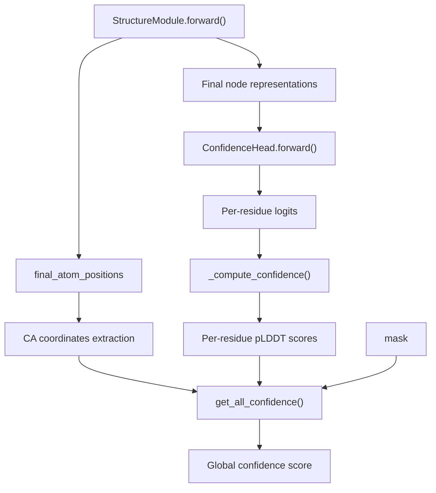
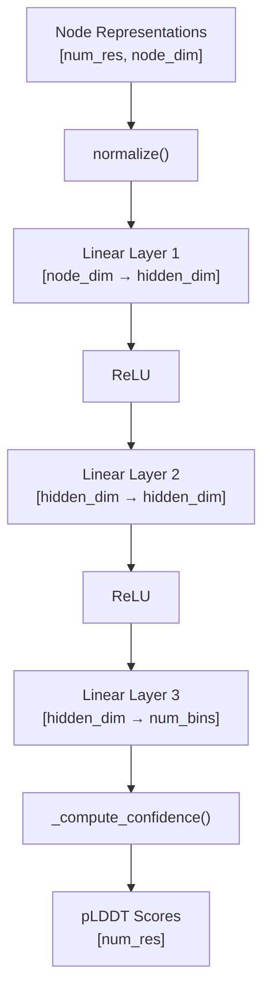
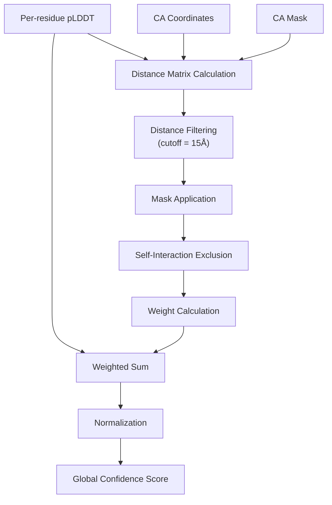

# Quality Assessment

> **Relevant source files**
> * [omegafold/confidence.py](https://github.com/HeliXonProtein/OmegaFold/blob/313c873a/omegafold/confidence.py)
> * [omegafold/decode.py](https://github.com/HeliXonProtein/OmegaFold/blob/313c873a/omegafold/decode.py)

This page documents how OmegaFold estimates and reports confidence in its protein structure predictions. The quality assessment system provides both per-residue and global confidence scores to help users evaluate the reliability of predicted structures.

For information about the structure generation process that precedes confidence assessment, see [Structure Generation](/HeliXonProtein/OmegaFold/6.2-structure-generation). For details about the overall execution pipeline, see [Execution Pipeline](/HeliXonProtein/OmegaFold/6-execution-pipeline).

## Overview

OmegaFold's quality assessment system is built around confidence scoring mechanisms similar to those used in AlphaFold2. The system provides two main types of confidence measures:

1. **Per-residue confidence scores** - Individual reliability scores for each amino acid position
2. **Global confidence scores** - Overall quality assessment for the entire predicted structure

The confidence assessment occurs after structure generation and uses the final node representations from the neural network to predict Local Distance Difference Test (lDDT) scores.

## Confidence Assessment Architecture

The quality assessment system integrates with the main prediction pipeline through the `ConfidenceHead` neural network and supporting confidence calculation functions.



**Confidence Assessment Data Flow**

Sources: [omegafold/confidence.py L124-L147](https://github.com/HeliXonProtein/OmegaFold/blob/313c873a/omegafold/confidence.py#L124-L147)

 [omegafold/confidence.py L39-L94](https://github.com/HeliXonProtein/OmegaFold/blob/313c873a/omegafold/confidence.py#L39-L94)

 [omegafold/decode.py L316-L393](https://github.com/HeliXonProtein/OmegaFold/blob/313c873a/omegafold/decode.py#L316-L393)

## ConfidenceHead Neural Network

The `ConfidenceHead` class implements a neural network that predicts per-residue confidence scores from the final node representations produced by the structure generation process.

### Network Architecture

| Component | Configuration | Purpose |
| --- | --- | --- |
| Input Layer | `cfg.node_dim` → `cfg.hidden_dim` | Initial projection of node features |
| Hidden Layer | `cfg.hidden_dim` → `cfg.hidden_dim` | Feature transformation |
| Output Layer | `cfg.hidden_dim` → `cfg.num_bins` | Prediction of confidence bins |
| Activation | ReLU | Non-linear activation between layers |

The network uses a simple three-layer architecture with ReLU activations:



**ConfidenceHead Neural Network Architecture**

Sources: [omegafold/confidence.py L131-L147](https://github.com/HeliXonProtein/OmegaFold/blob/313c873a/omegafold/confidence.py#L131-L147)

### Confidence Score Computation

The `_compute_confidence` function converts the neural network's logits into interpretable pLDDT (predicted Local Distance Difference Test) scores:

1. **Bin Centers Calculation**: Creates bin centers for confidence intervals
2. **Softmax Conversion**: Converts logits to probability distribution
3. **Weighted Average**: Computes expected confidence as weighted sum

The implementation follows the AlphaFold2 approach for pLDDT calculation:

```markdown
# From omegafold/confidence.py:110-117num_bins = logits.shape[-1]bin_width = 1.0 / num_binsbin_centers = torch.arange(    start=0.5 * bin_width, end=1.0, step=bin_width, device=logits.device)probs = torch.softmax(logits, dim=-1)confidence = torch.mv(probs, bin_centers)
```

Sources: [omegafold/confidence.py L96-L118](https://github.com/HeliXonProtein/OmegaFold/blob/313c873a/omegafold/confidence.py#L96-L118)

## Global Confidence Assessment

The `get_all_confidence` function computes an overall confidence score for the entire predicted structure using the per-residue pLDDT scores and structural information.

### Algorithm Components

| Component | Purpose | Implementation |
| --- | --- | --- |
| Distance Matrix | Calculate CA-CA distances | `torch.sqrt(torch.sum((ca_coords[:, None] - ca_coords[None, :]) ** 2, dim=-1))` |
| Distance Filtering | Apply cutoff for relevant pairs | `torch.lt(dmat_true, cutoff)` |
| Mask Application | Include only valid residues | `ca_mask[..., :, None] * ca_mask[..., None, :]` |
| Self-Exclusion | Remove self-interactions | `1. - torch.eye(dmat_true.shape[1])` |
| Weighted Average | Compute global score | `(lddt_per_residue * weights).sum() / weights.sum()` |

### Global Confidence Calculation Flow



**Global Confidence Computation Process**

Sources: [omegafold/confidence.py L39-L94](https://github.com/HeliXonProtein/OmegaFold/blob/313c873a/omegafold/confidence.py#L39-L94)

## Integration with Structure Prediction

The confidence assessment system is tightly integrated with the structure prediction pipeline, receiving inputs from the `StructureModule` and providing quality scores for the generated structures.

### Input Sources

| Input | Source | Usage |
| --- | --- | --- |
| Node Representations | `StructureModule.forward()` return | Fed to `ConfidenceHead` for per-residue scoring |
| Atom Positions | `final_atom_positions` from structure dict | Used for CA coordinate extraction |
| Atom Mask | `final_atom_mask` from structure dict | Applied during global confidence calculation |
| Sequence Mask | Original sequence mask | Used to filter valid residues |

### Confidence Integration Flow

```mermaid
sequenceDiagram
  participant StructureModule
  participant ConfidenceHead
  participant get_all_confidence()
  participant Pipeline Output

  StructureModule->>StructureModule: "Structure generation cycles"
  StructureModule->>ConfidenceHead: "Final node_repr"
  StructureModule->>get_all_confidence(): "final_atom_positions"
  StructureModule->>get_all_confidence(): "final_atom_mask"
  ConfidenceHead->>ConfidenceHead: "Neural network forward pass"
  ConfidenceHead->>get_all_confidence(): "Per-residue pLDDT scores"
  get_all_confidence()->>get_all_confidence(): "Extract CA coordinates"
  get_all_confidence()->>get_all_confidence(): "Compute distance matrix"
  get_all_confidence()->>get_all_confidence(): "Calculate global score"
  get_all_confidence()->>Pipeline Output: "Global confidence"
  ConfidenceHead->>Pipeline Output: "Per-residue confidence"
```

**Confidence Assessment Integration with Structure Prediction**

Sources: [omegafold/decode.py L331-L393](https://github.com/HeliXonProtein/OmegaFold/blob/313c873a/omegafold/decode.py#L331-L393)

 [omegafold/confidence.py L124-L147](https://github.com/HeliXonProtein/OmegaFold/blob/313c873a/omegafold/confidence.py#L124-L147)

 [omegafold/confidence.py L39-L94](https://github.com/HeliXonProtein/OmegaFold/blob/313c873a/omegafold/confidence.py#L39-L94)

## Output Format and Interpretation

### Per-Residue Confidence Scores

Per-residue confidence scores range from 0 to 1, where:

* **> 0.9**: Very high confidence - prediction likely accurate
* **0.7-0.9**: Confident - prediction generally reliable
* **0.5-0.7**: Low confidence - prediction may have errors
* **< 0.5**: Very low confidence - prediction unreliable

### Global Confidence Score

The global confidence score provides an overall assessment of structure quality:

* Computed as a weighted average of per-residue scores
* Weights based on the number of distance constraints for each residue
* Higher scores indicate better overall structure quality

### Usage in Pipeline

The confidence scores are typically used by the pipeline system to:

1. Filter low-quality predictions
2. Provide user feedback on prediction reliability
3. Guide interpretation of structural features
4. Support downstream analysis decisions

Sources: [omegafold/confidence.py L39-L94](https://github.com/HeliXonProtein/OmegaFold/blob/313c873a/omegafold/confidence.py#L39-L94)

 [omegafold/confidence.py L96-L118](https://github.com/HeliXonProtein/OmegaFold/blob/313c873a/omegafold/confidence.py#L96-L118)

 [omegafold/confidence.py L124-L147](https://github.com/HeliXonProtein/OmegaFold/blob/313c873a/omegafold/confidence.py#L124-L147)