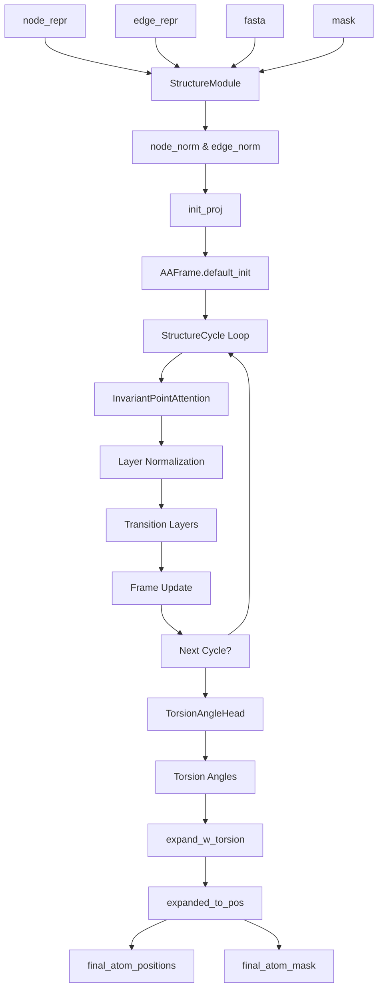
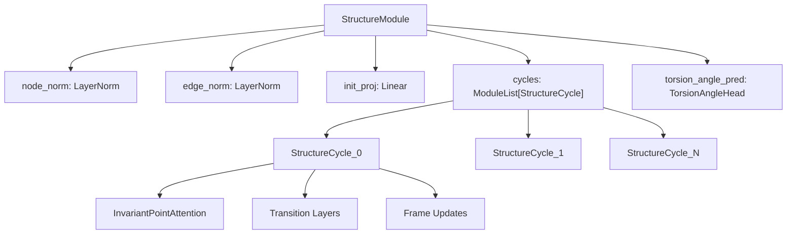
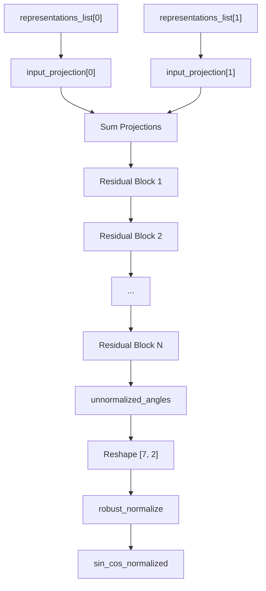
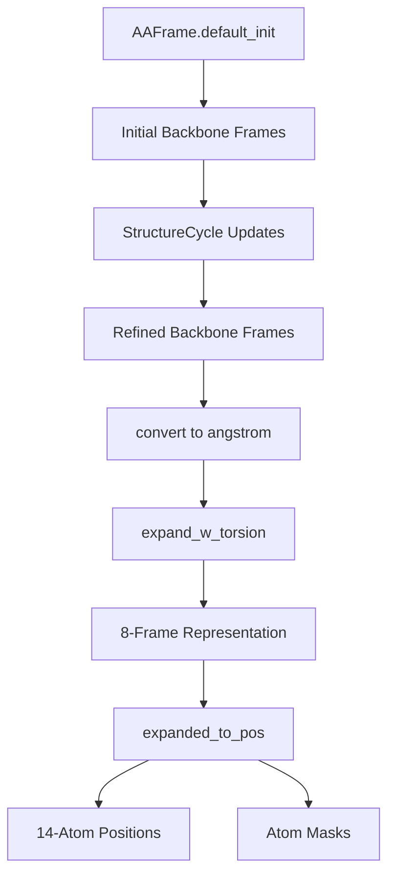
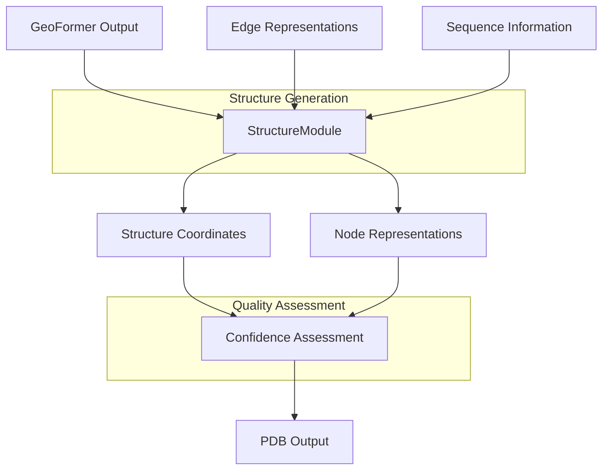

# Structure Generation

> **Relevant source files**
> * [omegafold/decode.py](https://github.com/HeliXonProtein/OmegaFold/blob/313c873a/omegafold/decode.py)
> * [omegafold/modules.py](https://github.com/HeliXonProtein/OmegaFold/blob/313c873a/omegafold/modules.py)

Structure generation in OmegaFold refers to the process of converting neural network representations into 3D protein coordinates and atomic positions. This system takes the geometric and sequence representations produced by the core model components and transforms them into physically meaningful protein structures with backbone and side-chain coordinates.

For information about the overall execution pipeline that orchestrates structure generation, see [Execution Pipeline](/HeliXonProtein/OmegaFold/6-execution-pipeline). For details about the geometric processing that precedes structure generation, see [Geometric Processing](/HeliXonProtein/OmegaFold/4.2-geometric-processing). For information about the protein data structures used to represent coordinates and frames, see [Protein Data Structures](/HeliXonProtein/OmegaFold/7.2-protein-data-structures).

## Structure Generation Overview

The structure generation process operates through a multi-cycle refinement approach that iteratively updates both node representations and backbone frame geometries. The system uses Invariant Point Attention (IPA) to reason about 3D spatial relationships while maintaining rotational and translational invariance.

**Structure Generation Process Flow**



Sources: [omegafold/decode.py L316-L393](https://github.com/HeliXonProtein/OmegaFold/blob/313c873a/omegafold/decode.py#L316-L393)

## Key Components

### StructureModule

The `StructureModule` class serves as the main orchestrator for structure generation, implementing the algorithm from Jumper et al. (2021) Supplementary Algorithm 20. It manages the complete pipeline from normalized representations to final atomic coordinates.

**StructureModule Architecture**



Sources: [omegafold/decode.py L316-L327](https://github.com/HeliXonProtein/OmegaFold/blob/313c873a/omegafold/decode.py#L316-L327)

### InvariantPointAttention

The `InvariantPointAttention` class implements the core 3D-aware attention mechanism that operates on both scalar representations and spatial point coordinates within local coordinate frames.

| Component | Purpose | Input Dimensions |
| --- | --- | --- |
| `q_scalar`, `k_scalar`, `v_scalar` | Scalar attention components | `[node_dim, num_head * num_scalar_*]` |
| `q_point`, `k_point`, `v_point` | Spatial attention components | `[node_dim, num_head * 3 * num_point_*]` |
| `bias_2d` | Edge representation bias | `[edge_dim, num_head]` |
| `output_projection` | Final output transformation | `[combined_features, node_dim]` |

The attention mechanism combines three types of logits:

* **Scalar logits**: Standard query-key dot products weighted by `scalar_weight`
* **Edge logits**: Learned biases from edge representations weighted by `edge_logits_weight`
* **Point logits**: Spatial distances between transformed points weighted by `point_weight`

Sources: [omegafold/decode.py L44-L152](https://github.com/HeliXonProtein/OmegaFold/blob/313c873a/omegafold/decode.py#L44-L152)

### StructureCycle

Each `StructureCycle` performs one iteration of structure refinement through IPA followed by frame updates. The cycle maintains residual connections and applies layer normalization for stable training.

**StructureCycle Processing**

```mermaid
sequenceDiagram
  participant node_repr, edge_repr, backbone_frames
  participant InvariantPointAttention
  participant input_norm
  participant Transition Layers
  participant update_norm
  participant affine_update
  participant AAFrame.from_tensor

  node_repr, edge_repr, backbone_frames->>InvariantPointAttention: Process spatial attention
  InvariantPointAttention->>node_repr, edge_repr, backbone_frames: Attention output (residual)
  node_repr, edge_repr, backbone_frames->>input_norm: Normalize
  input_norm->>Transition Layers: Multi-layer transformation
  Transition Layers->>input_norm: Output (residual)
  input_norm->>update_norm: Normalize
  update_norm->>affine_update: Generate frame updates
  affine_update->>AAFrame.from_tensor: Convert to frame transformation
  AAFrame.from_tensor->>node_repr, edge_repr, backbone_frames: Updated backbone_frames
```

Sources: [omegafold/decode.py L255-L313](https://github.com/HeliXonProtein/OmegaFold/blob/313c873a/omegafold/decode.py#L255-L313)

### TorsionAngleHead

The `TorsionAngleHead` predicts side-chain torsion angles from multiple node representation inputs using residual blocks and produces normalized sine-cosine angle representations.

**Torsion Angle Prediction**



Sources: [omegafold/decode.py L200-L252](https://github.com/HeliXonProtein/OmegaFold/blob/313c873a/omegafold/decode.py#L200-L252)

## Coordinate Generation Process

The transformation from neural representations to atomic coordinates follows a structured pipeline that maintains geometric consistency and physical constraints.

### Frame-Based Geometry

The system uses `AAFrame` objects to represent local coordinate systems for each residue. Initial frames are created using "Black-hole" initialization, then iteratively refined through the structure cycles.

**Frame Transformation Pipeline**



### Torsion Angle Integration

Side-chain conformations are determined by predicted torsion angles that are applied to the refined backbone frames:

1. **Angle Prediction**: `TorsionAngleHead` outputs normalized sine-cosine representations for 7 torsion angles per residue
2. **Frame Expansion**: `expand_w_torsion` creates 8 local frames per residue (backbone + side-chain)
3. **Position Calculation**: `expanded_to_pos` converts frames to 14-atom coordinate representations

Sources: [omegafold/decode.py L374-L392](https://github.com/HeliXonProtein/OmegaFold/blob/313c873a/omegafold/decode.py#L374-L392)

## Integration with Pipeline

Structure generation integrates with the broader OmegaFold pipeline by consuming representations from the geometric processing components and producing final coordinate outputs for confidence assessment and PDB generation.

**Pipeline Integration**



The `StructureModule.forward` method returns both the final node representations (used for confidence prediction) and a dictionary containing:

* `final_atom_positions`: 14-atom coordinate tensor `[num_res, 14, 3]`
* `final_atom_mask`: atom validity mask `[num_res, 14]`
* `final_frames`: 8-frame geometric representation

Sources: [omegafold/decode.py L388-L392](https://github.com/HeliXonProtein/OmegaFold/blob/313c873a/omegafold/decode.py#L388-L392)

## Mathematical Foundations

### Invariant Point Attention Formulation

The IPA mechanism computes attention weights by combining three terms:

```
logits = scalar_weight * (Q_s @ K_s^T) + edge_logits_weight * bias_2d - point_weight * ||Q_p - K_p||^2
```

Where:

* `Q_s, K_s`: Scalar query and key vectors
* `Q_p, K_p`: Point coordinates in global frame
* `bias_2d`: Learned edge biases
* Weights balance the contribution of each component

### Frame Update Mechanism

Backbone frames are updated through learned affine transformations:

1. Generate 6-dimensional update vector from node representations
2. Convert to `AAFrame` transformation using `AAFrame.from_tensor`
3. Compose with current frames: `new_frames = old_frames * frame_update`

Sources: [omegafold/decode.py L87-L89](https://github.com/HeliXonProtein/OmegaFold/blob/313c873a/omegafold/decode.py#L87-L89)

 [omegafold/decode.py L309-L311](https://github.com/HeliXonProtein/OmegaFold/blob/313c873a/omegafold/decode.py#L309-L311)