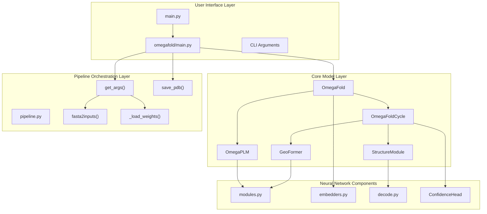
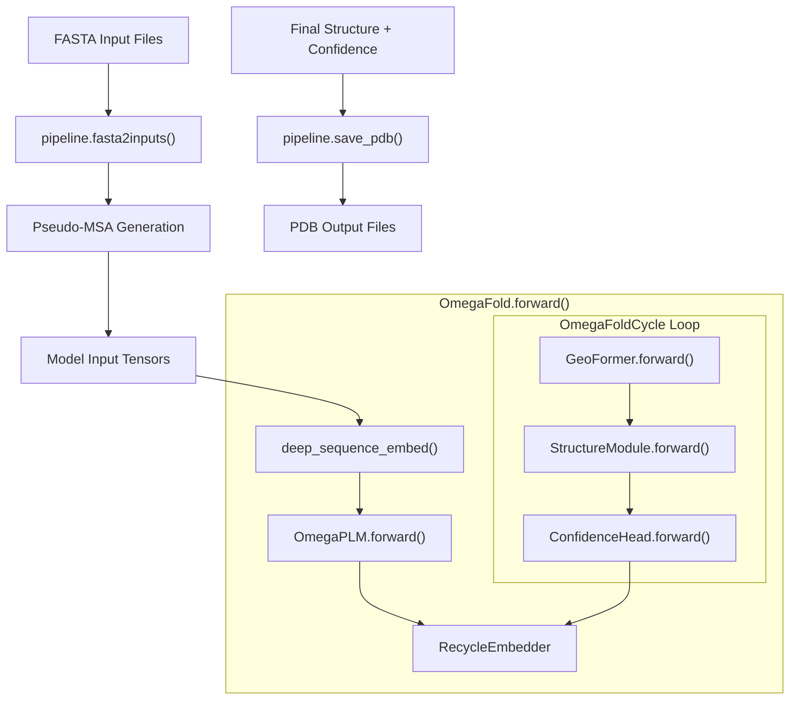
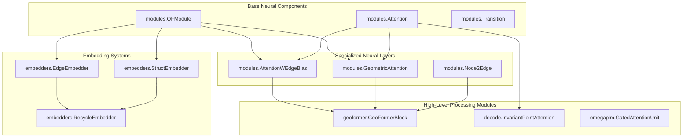
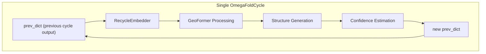

# System Architecture

> **Relevant source files**
> * [omegafold/__main__.py](https://github.com/HeliXonProtein/OmegaFold/blob/313c873a/omegafold/__main__.py)
> * [omegafold/model.py](https://github.com/HeliXonProtein/OmegaFold/blob/313c873a/omegafold/model.py)
> * [omegafold/pipeline.py](https://github.com/HeliXonProtein/OmegaFold/blob/313c873a/omegafold/pipeline.py)

## Purpose and Scope

This document provides a high-level overview of OmegaFold's system architecture, showing how major components interact and how data flows through the system from FASTA input to PDB output. It focuses on the structural organization of the codebase and the relationships between key modules.

For detailed information about specific neural network components, see [Core Model Components](/HeliXonProtein/OmegaFold/4-core-model-components). For information about the data processing pipeline, see [Execution Pipeline](/HeliXonProtein/OmegaFold/6-execution-pipeline). For implementation details of individual modules, see [Neural Network Building Blocks](/HeliXonProtein/OmegaFold/5-neural-network-building-blocks).

## Overall System Structure

OmegaFold follows a layered architecture with clear separation of concerns across four primary layers:

### System Architecture Overview



**Sources**: [omegafold/pipeline.py L1-L440](https://github.com/HeliXonProtein/OmegaFold/blob/313c873a/omegafold/pipeline.py#L1-L440)

 [omegafold/model.py L1-L272](https://github.com/HeliXonProtein/OmegaFold/blob/313c873a/omegafold/model.py#L1-L272)

 [omegafold/__main__.py L1-L106](https://github.com/HeliXonProtein/OmegaFold/blob/313c873a/omegafold/__main__.py#L1-L106)

## Data Flow Architecture

The system processes protein sequences through a multi-stage pipeline with iterative refinement:

### Data Processing Flow



**Sources**: [omegafold/pipeline.py L93-L181](https://github.com/HeliXonProtein/OmegaFold/blob/313c873a/omegafold/pipeline.py#L93-L181)

 [omegafold/model.py L135-L203](https://github.com/HeliXonProtein/OmegaFold/blob/313c873a/omegafold/model.py#L135-L203)

 [omegafold/__main__.py L58-L97](https://github.com/HeliXonProtein/OmegaFold/blob/313c873a/omegafold/__main__.py#L58-L97)

## Execution Control Flow

The system orchestrates execution through a clear sequence of operations managed by the pipeline:

### Main Execution Sequence

```mermaid
sequenceDiagram
  participant User
  participant __main__.main()
  participant pipeline.get_args()
  participant OmegaFold
  participant pipeline.fasta2inputs()
  participant OmegaFoldCycle
  participant pipeline.save_pdb()

  User->>__main__.main(): "omegafold input.fasta output_dir"
  __main__.main()->>pipeline.get_args(): "Parse arguments and load weights"
  pipeline.get_args()-->>__main__.main(): "args, state_dict, forward_config"
  __main__.main()->>OmegaFold: "Initialize model and load weights"
  __main__.main()->>pipeline.fasta2inputs(): "Process FASTA sequences"
  loop ["Multiple cycles (num_cycle)"]
    pipeline.fasta2inputs()-->>__main__.main(): "input_data, save_path"
    __main__.main()->>OmegaFold: "model(input_data, fwd_cfg=forward_config)"
    OmegaFold->>OmegaFoldCycle: "Process with previous iteration data"
    OmegaFoldCycle-->>OmegaFold: "Updated structure and confidence"
    OmegaFold-->>__main__.main(): "final_result with best confidence"
    __main__.main()->>pipeline.save_pdb(): "Save structure to PDB file"
  end
```

**Sources**: [omegafold/__main__.py L40-L99](https://github.com/HeliXonProtein/OmegaFold/blob/313c873a/omegafold/__main__.py#L40-L99)

 [omegafold/pipeline.py L304-L429](https://github.com/HeliXonProtein/OmegaFold/blob/313c873a/omegafold/pipeline.py#L304-L429)

 [omegafold/model.py L135-L203](https://github.com/HeliXonProtein/OmegaFold/blob/313c873a/omegafold/model.py#L135-L203)

## Component Interaction Patterns

The system uses several key architectural patterns for component interaction:

### Neural Network Component Hierarchy



**Sources**: [omegafold/model.py L52-L113](https://github.com/HeliXonProtein/OmegaFold/blob/313c873a/omegafold/model.py#L52-L113)

 [omegafold/model.py L126-L134](https://github.com/HeliXonProtein/OmegaFold/blob/313c873a/omegafold/model.py#L126-L134)

## Key Architectural Patterns

### Model Initialization and Configuration

The system uses a configuration-driven approach where models are initialized from structured configurations:

| Component | Configuration Source | Initialization Pattern |
| --- | --- | --- |
| `OmegaFold` | `of.make_config(args.model)` | Top-level model container |
| `OmegaPLM` | `cfg.plm` | Protein language model |
| `GeoFormer` | `cfg` | Geometric processing |
| `StructureModule` | `cfg.struct` | Structure generation |
| `ConfidenceHead` | `cfg.struct` | Quality assessment |

**Sources**: [omegafold/__main__.py L47](https://github.com/HeliXonProtein/OmegaFold/blob/313c873a/omegafold/__main__.py#L47-L47)

 [omegafold/model.py L126-L133](https://github.com/HeliXonProtein/OmegaFold/blob/313c873a/omegafold/model.py#L126-L133)

 [omegafold/model.py L54-L59](https://github.com/HeliXonProtein/OmegaFold/blob/313c873a/omegafold/model.py#L54-L59)

### Iterative Refinement Pattern

The core prediction process uses iterative cycles where each cycle refines the previous prediction:



**Sources**: [omegafold/model.py L156-L202](https://github.com/HeliXonProtein/OmegaFold/blob/313c873a/omegafold/model.py#L156-L202)

 [omegafold/model.py L90-L112](https://github.com/HeliXonProtein/OmegaFold/blob/313c873a/omegafold/model.py#L90-L112)

### Device and Precision Management

The pipeline handles device selection and precision configuration automatically:

* **Device Detection**: `pipeline._get_device()`() automatically selects CUDA, MPS, or CPU
* **Precision Control**: `pipeline._set_precision()`() manages TensorFloat-32 settings
* **Memory Management**: `__main__.py`() includes explicit cleanup between predictions

**Sources**: [omegafold/pipeline.py L271-L301](https://github.com/HeliXonProtein/OmegaFold/blob/313c873a/omegafold/pipeline.py#L271-L301)

 [omegafold/pipeline.py L59-L76](https://github.com/HeliXonProtein/OmegaFold/blob/313c873a/omegafold/pipeline.py#L59-L76)

 [omegafold/__main__.py L95-L97](https://github.com/HeliXonProtein/OmegaFold/blob/313c873a/omegafold/__main__.py#L95-L97)