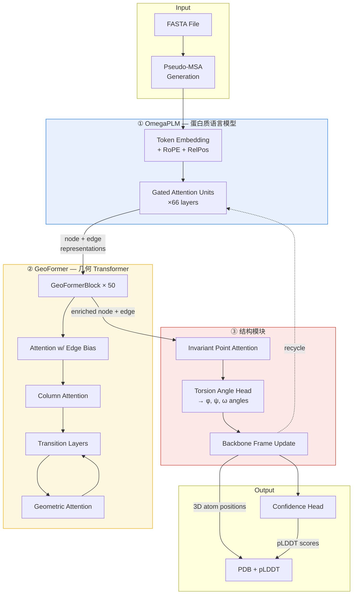

---
slug:1-overview
blog_type:normal
---


**OmegaFold** 是一个高分辨率 *de novo* 蛋白质结构预测系统，它直接从初级氨基酸序列推导出 3D 原子坐标——无需多序列比对（MSA）、同源模板或任何外部进化信息。OmegaFold 由 HeliXon Limited 发布，并以 *"High-resolution de novo structure prediction from primary sequence"* (Wu et al., 2022) 为题发表论文，通过将其定制的蛋白质语言模型与几何感知 Transformer 及迭代结构解码器配对，实现了极具竞争力的准确度。


来源: [README.md](/README.md#L1-L143), [model.py](/omegafold/model.py#L1-L272)

---

## OmegaFold 的功能

给定一个包含一条或多条蛋白质序列的 FASTA 文件，OmegaFold 会预测每条链的全原子 3D 结构，并将结果写为 **PDB 文件**。在输出坐标的同时，它还会输出一个**残基级置信度分数**（pLDDT），该分数存储在 B 因子列中，因此你可以立即评估预测中哪些区域是可靠的。整个流程在每次循环迭代中仅通过单次前向传播即可完成——无需外部数据库、无需 MSA 搜索、无需模板挖掘。

| 功能 | 详情 |
|---|---|
| **输入** | 标准 FASTA 文件（一条或多条序列） |
| **输出** | 每条序列对应一个 PDB 文件，B 因子列中包含 pLDDT |
| **是否需要 MSA** | 否——使用已学习到的蛋白质语言模型替代 |
| **可用模型** | 模型 1（默认），模型 2（`--model 2`） |
| **最大序列长度** | 在 80 GB A100 上最高约 4096 个残基（使用 `--subbatch_size 448`） |
| **硬件** | NVIDIA CUDA、Apple MPS (Silicon) 或 CPU 回退 |
| **许可证** | Apache 2.0 |

来源: [README.md](/README.md#L1-L143), [pipeline.py](/omegafold/pipeline.py#L300-L398)

---

## 工作原理 — 架构概览

OmegaFold 的推理流水线是封装在迭代循环中的三阶段架构。每个阶段履行不同的职责：将序列**嵌入**为已学习的表征、对几何关系进行**推理**，以及将这些关系**解码**为 3D 坐标。



**① OmegaPLM** — 一个基于 **门控注意力单元 (GAU)** 构建的 66 层蛋白质语言模型。GAU 是标准多头注意力的继任者，它将查询-键-值投影统一到单个门控操作中。每一层应用 pre-LayerNorm → GAU → 残差连接。该模型生成**节点表征**（每个残基）和**边表征**（残基对），从原始序列中捕获进化和上下文模式。旋转位置嵌入和相对位置嵌入提供了位置感知能力。

**② GeoFormer** — 核心几何推理引擎，由 50 个堆叠的 `GeoFormerBlock` 模块组成。每个模块执行带边偏置的行注意力、列注意力（转置）、节点和边过渡层、从节点到边的外积映射，以及对成对空间关系进行推理的**几何注意力**层。此阶段正是模型优化其对残基在 3D 空间中相互关系理解的地方。

**③ 结构模块** — 使用改编自 AlphaFold2 的**等变点注意力 (IPA)**，对蛋白质骨架的 SE(3) 帧表征进行操作。IPA 以 SE(3) 等变的方式结合了标量、点和边对数。随后，扭转角头预测骨架二面角 (φ, ψ, ω)，并通过帧更新将其转换为原子位置。**ConfidenceHead** 估计每个残基的 pLDDT。

**循环** — 整个周期（GeoFormer → 结构模块 → 置信度）运行多次（默认 10 次）。每个周期的输出——前一次的节点/边表征、原子位置和骨架帧——作为**循环嵌入**反馈到下一次迭代中。选择具有最高整体置信度的周期作为最终预测。

来源: [model.py](/omegafold/model.py#L87-L195), [omegaplm.py](/omegafold/omegaplm.py#L1-L251), [geoformer.py](/omegafold/geoformer.py#L1-L188), [decode.py](/omegafold/decode.py#L1-L200), [confidence.py](/omegafold/confidence.py#L1-L154)

---

## 项目结构

代码库刻意保持紧凑——整个模型存放在一个 Python 包中，且外部依赖极少（PyTorch + Biopython）。

```
OmegaFold/
├── main.py                          # CLI 入口点
├── setup.py                         # 包安装 & 依赖
├── requirements.txt                 # 固定的依赖
├── figure.png                       # 项目头图
│
├── omegafold/                       # ── 核心包 ──
│   ├── __init__.py                  #   暴露 OmegaFold, make_config
│   ├── __main__.py                  #   CLI 编排: 加载 → 预测 → 保存
│   ├── config.py                    #   静态模型配置 (维度, 超参数)
│   ├── pipeline.py                  #   FASTA I/O, PDB 输出, 参数解析, 权重加载
│   │
│   ├── omegaplm.py                  #   ① OmegaPLM 语言模型 (GAU 层)
│   ├── geoformer.py                 #   ② GeoFormer Transformer (50 块)
│   ├── decode.py                    #   ③ 结构模块 (IPA + 扭转角 → 3D)
│   ├── confidence.py                #   pLDDT 置信度估计
│   ├── embedders.py                 #   RoPE, RelPos, 边, 循环嵌入
│   ├── modules.py                   #   共享神经构建块 (注意力, 过渡层等)
│   │
│   └── utils/                       # ── 工具 ──
│       ├── __init__.py              #   重新导出: normalize, mask2bias, AAFrame 等
│       ├── torch_utils.py           #   PyTorch 辅助函数 (归一化, 掩码)
│       └── protein_utils/           #   蛋白质特定工具
│           ├── aaframe.py           #     SE(3) 氨基酸帧操作
│           ├── functions.py         #     几何辅助函数
│           └── residue_constants.py #     氨基酸查找表 & 原子映射
```

来源: [setup.py](/setup.py#L1-L39), [requirements.txt](/requirements.txt#L1-L3), [__init__.py](/omegafold/__init__.py#L1-L40)

---

## 关键设计决策

OmegaFold 在几个基本方面不同于依赖 MSA 的方法（如 AlphaFold2 的完整流水线）。理解这些选择对于掌握模型的优势及其操作特性至关重要。

| 设计选择 | 理由 | 实现 |
|---|---|---|
| **无外部 MSA** | 消除了 AF2 中最耗时的步骤；使无同源物的孤立序列预测成为可能 | OmegaPLM 的已学习表征替代了进化信息 |
| **伪 MSA** | 模型的输入格式仍然期望类似 MSA 的数据，因此流水线通过随机掩码从单一序列中合成“伪 MSA”行 | `pipeline.py` 中的 `fasta2inputs()` 以可配置比率（默认 12%）生成掩码副本 |
| **门控注意力单元** | GAU 将 Q/K/V 投影和门控统一到一个操作中，相比标准多头注意力提高了参数效率 | `omegaplm.py` 中的 `GatedAttentionUnit` — 单个线性投影被拆分为门控、值和基底 |
| **子批处理** | 通过分块注意力计算来控制 GPU 显存；以时间换空间 | `--subbatch_size` 标志；值越小 = 速度越慢但显存占用越少 |
| **循环** | 迭代优化——每个周期接收上一轮的结构反馈 | `OmegaFold.forward()` 循环遍历周期数据；选择置信度最高的周期 |
| **两种模型变体** | 模型 2 包含结构嵌入器 (`struct_embedder=True`) 以提供额外的表达能力 | `config.py` 中的 `make_config()` 根据 `model_idx` 切换 `cfg.struct_embedder` |

<CgxTip>**伪 MSA** 并非真正的多序列比对——它是将单个输入序列重复 N 次（默认 15 次）并应用随机残基掩码。这为模型提供了其训练时所用的 MSA 形状输入，同时需要零次数据库查询。</CgxTip>

来源: [model.py](/omegafold/model.py#L197-L272), [pipeline.py](/omegafold/pipeline.py#L82-L165), [config.py](/omegafold/config.py#L41-L122), [omegaplm.py](/omegafold/omegaplm.py#L77-L148)

---

## 依赖与要求

OmegaFold 刻意保持轻量级。除标准库外，仅需两个运行时依赖：

| 依赖 | 用途 | 版本 |
|---|---|---|
| **PyTorch** | 张量操作，CUDA/MPS 加速，模型权重 | 1.12.0+cu113 (固定) |
| **Biopython** | 通过 `Bio.PDB.StructureBuilder` 进行 PDB 文件 I/O | 最新版 |

需要 Python **3.8、3.9 或 3.10**。安装脚本会自动检测你的 Python 版本和平台，以获取正确的 PyTorch wheel。

来源: [setup.py](/setup.py#L1-L39), [requirements.txt](/requirements.txt#L1-L3)

---

## 接下来去哪

现在你已经了解了 OmegaFold 是什么及其架构如何组合，以下是文档的逻辑阅读路径：

1. **[快速入门](2-quick-start)** — 在两分钟内运行你的第一次预测
2. **[输入和输出格式](3-input-and-output-formats)** — 详细了解 FASTA 输入和 PDB 输出
3. **[架构概览](4-architecture-overview)** — 完整流水线的深度架构解析
4. **[OmegaPLM 语言模型](5-omegaplm-language-model)** — 基于 GAU 的语言建模如何替代 MSA
5. **[GeoFormer Transformer](6-geoformer-transformer)** — 残基对的几何推理
6. **[结构模块与 IPA](7-structure-module-and-ipa)** — SE(3) 等变解码至 3D 坐标
7. **[循环与迭代优化](11-recycling-and-iterative-refinement)** — 反馈循环如何改进预测
8. **[置信度估计 (pLDDT)](12-confidence-estimation-plddt)** — 解读预测可靠性
9. **[配置参考](13-configuration-reference)** — 所有 CLI 标志和模型超参数
10. **[显存优化策略](14-memory-optimization-strategies)** — 在受限的 GPU 显存上运行