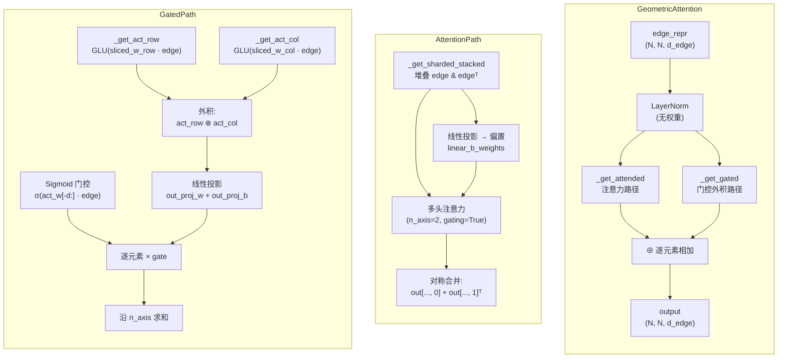

---
slug:10-geometric-attention
blog_type:normal
---


几何注意力是 OmegaFold 的**配对级信息交换机制**——这是标准多头注意力的结构类比，它不在残基级（节点）表示上操作，而是在对所有残基对之间的两两几何关系进行编码的二次边表示张量上操作。与在序列中广播信息的节点级 [注意力与子批处理](8-attention-and-subbatching) 模块不同，几何注意力通过配对表示传播**几何约束**，使模型能够细化空间关系，例如残基间距离、方向和接触。它是每个 [GeoFormer Transformer](6-geoformer-transformer) 块内的核心计算原语，在每个块的边轨道上调用两次（`geom_count=2`）。

来源: [modules.py](omegafold/modules.py#L569-L706), [geoformer.py](omegafold/geoformer.py#L75-L82)

## 双路径架构

GeometricAttention 分解为**两条加性路径**，并行处理归一化的边表示。前向传播应用无权重层归一化，然后对两条路径的输出求和：`out = _get_attended(normalized_edge) + _get_gated(normalized_edge)`。这种双重设计捕捉了配对级推理的互补方面——**注意力路径**通过学习到的查询-键-值投影在配对矩阵上全局传播信息，而**门控外积路径**则通过带有 Sigmoid 门控的行/列分解在局部构建两两交互。



来源: [modules.py](omegafold/modules.py#L699-L706)

## 分片堆叠原语

两条路径都依赖于 `_get_sharded_stacked` 生成器，它作为配对级计算的基础子批处理机制。给定形状为 `(N, N, d_edge)` 的边表示和 `subbatch_size`，它会产出 `(start, end, stacked_chunk)` 元组，其中每个块沿一个新的末尾维度堆叠相同行的两个视图——原始行切片 `edge_repr[start:end]` 和对应的转置切片 `edge_repr.transpose(-2, -3)[start:end]`——生成形状为 `(subbatch_size, N, d_edge, 2)` 的张量。这种**双轴堆叠**使得整个模块中可以使用 `n_axis=2` 参数：轴 0 对应于原始（行）方向，轴 1 对应于转置（列）方向，从而允许在单次通过共享 `Attention` 模块时处理两个空间方向。生成器模式还确保每个子批的内存为 O(N) 而不是 O(N²)，这对于长序列至关重要。

来源: [modules.py](omegafold/modules.py#L551-L566)

## 注意力路径: `_get_attended`

注意力路径在配对矩阵上应用多头注意力，将每行（及其转置列）视为 N 个残基对上的序列。计算在两个子批处理阶段中进行：

**阶段 1 — 偏置构建**: 对于每个分片块，通过从堆叠边块投影的 `linear_b_weights`（形状 `[d_edge, n_axis, n_head]`）计算每个头的注意力偏置 `b`。该偏置累积到形状为 `(n_axis, n_head, N, N)` 的张量中，并加上掩码偏置。此偏置将位置特定的配对信息编码到注意力 logits 中——类似于 `AttentionWEdgeBias` 如何将边特征注入节点注意力，但在这里边本身是被关注的实体。

**阶段 2 — 注意力应用**: 相同的分片块作为查询和键值输入传递给内部的 `Attention` 模块（其中 `gating=True`, `c=32`, `n_head=4`, `n_axis=2`）。输出形状为 `(N, N, d_edge, n_axis)`。

**对称合并**: 最后一步——`attended[..., 0] + attended[..., 1].transpose(-2, -3)`——将行方向结果（轴 0）与列方向结果（轴 1）的转置相结合。这确保了输出遵循**配对表示的对称性**：如果残基 *i* 通过行注意力影响残基 *j*，则残基 *j* 同样通过带转置的列注意力影响残基 *i*。没有此合并，信息将通过配对矩阵不对称地传播。

来源: [modules.py](omegafold/modules.py#L607-L636)

## 门控外积路径: `_get_gated`

门控路径实现了一个**分解的配对更新**，通过将交互分解为经由外积组合的行特征和列特征，避免了完整的 O(N²) 注意力。这种计算受到 `Node2Edge` 模块外积均值的启发，但在边级别上通过学习到的 GLU 激活和 Sigmoid 门控进行操作。

计算在行和列上使用**双循环子批处理**策略：

| 步骤 | 操作 | 形状（每个块） |
|------|------|----------------|
| 行激活 | `GLU(edge_row · sliced_w_row + sliced_b_row) × mask` | `(subbatch, N, n_axis, d_act)` |
| 列激活 | `GLU(edge_col · sliced_w_col + sliced_b_col) × mask` | `(subbatch, N, n_axis, d_act)` |
| 外积 | `einsum('...ikrd,...jkrd->...ijrd', act_row, act_col)` | `(subbatch_row, subbatch_col, n_axis, d_act)` |
| 投影 | `outer_prod · out_proj_w + out_proj_b` | `(subbatch_row, subbatch_col, n_axis, d_edge)` |
| Sigmoid 门控 | `σ(edge_row · act_w[-d_edge:] + act_b[-d_edge:])` | `(subbatch_row, N, n_axis, d_edge)` |
| 门控运算 | `projected × gate` | `(subbatch_row, subbatch_col, n_axis, d_edge)` |

行和列激活由 `_get_act_row` 和 `_get_act_col` 产生，它们共享相同的 `act_w` 和 `act_b` 参数张量，但通过 `_get_sliced_weight` 访问**不同的切片视图**。切片机制从前 `4 × d_edge` 个通道中提取交替的子张量（在为门控保留最后 `d_edge` 个通道之后），其中 `shift=0` 为行选择偶数索引切片，`shift=1` 为列选择奇数索引切片。这种带有交替访问的参数共享是一种**具有方向特异性的权重绑定**形式——相同的参数块同时编码行方向和列方向的变换，但各自访问不相交的子空间。

计算外积后，在投影前应用层归一化。Sigmoid 门控（每个行块计算一次，然后跨列块广播）控制保留哪些边特征——这是一种类似于 [注意力与子批处理](8-attention-and-subbatching) 模块中门控的机制，但直接应用于配对输出。最后，对 `n_axis` 维度求和以生成形状为 `(N, N, d_edge)` 的输出。

来源: [modules.py](omegafold/modules.py#L638-L669), [modules.py](omegafold/modules.py#L671-L697)

## 参数架构

`GeometricAttention` 的完整参数清单揭示了一种深思熟虑的分配策略。形状为 `[d_edge, n_axis, d_edge * 5]` 的 `act_w` 参数发挥三重作用：其前 `4 × d_edge` 个通道被分割为行/列切片权重（每个获得 `2 × d_edge` 个通道，分解为 4 组 `d_edge/2` 用于 GLU），而最后的 `d_edge` 个通道提供 Sigmoid 门控投影。这种多路复用减少了参数量，同时保持了方向表达能力。

| 参数 | 形状 | 用途 |
|------|------|------|
| `linear_b_weights` | `[128, 2, 4]` | 注意力偏置投影（边 → 每头偏置） |
| `linear_b_bias` | `[2, 4, 1, 1]` | 注意力偏置偏移量 |
| `act_w` | `[128, 2, 640]` | 行/列激活 + 门控权重（多路复用） |
| `act_b` | `[2, 640]` | 行/列激活 + 门控偏置（多路复用） |
| `out_proj_w` | `[2, 128, 128]` | 外积输出投影 |
| `out_proj_b` | `[2, 128]` | 外积输出偏置 |
| 内部 `Attention` | — | Q/K/V/O 投影，参数为 `c=32, n_head=4, gating=True` |

在默认配置（`d_edge=128, c=32, n_head=4, n_axis=2`）下，包括内部 Attention 模块在内的总参数量约为 282K。

来源: [modules.py](omegafold/modules.py#L574-L605), [config.py](omegafold/config.py#L59-L93)

## 在 GeoFormer 中的集成

在每个 `GeoFormerBlock` 中，GeometricAttention 被实例化为长度为 `geom_count=2` 的 `ModuleList`，并在节点级注意力和转换**之后**应用，仅在边轨道上操作。调用约定严格为加性（残差）：

```python
edge_repr += self.out_product(node_repr, mask)        # node → edge
for layer in self.geometric_attention:                 # edge → edge
    edge_repr += layer(edge_repr, mask[..., 0, :], fwd_cfg=fwd_cfg)
edge_repr += self.edge_transition(edge_repr, ...)      # edge MLP
```

`Node2Edge` 外积均值首先将更新的节点信息注入到边轨道中。然后，两个 GeometricAttention 层依次细化配对表示——第一层传播局部配对约束，第二层允许这些约束在整个矩阵中交互。`mask[..., 0, :]` 切片从多轴掩码张量中提取有效残基掩码，以匹配边表示所期望的一维掩码格式。

来源: [geoformer.py](omegafold/geoformer.py#L89-L126)

## 内存与计算复杂度

边表示的 O(N²) 大小使 GeometricAttention 成为 OmegaFold 中的**主要内存瓶颈**。两条路径都采用子批处理来控制峰值内存：

- **注意力路径**: 两个顺序子批循环——一个用于偏置构建，一个用于注意力计算——每次处理 `subbatch_size` 行。每个子批的内存为 O(subbatch_size × N × d_edge) 而不是 O(N² × d_edge)。
- **门控路径**: 遍历行和列子批的嵌套双循环。外循环处理行块并计算一次 Sigmoid 门控；内循环遍历列块以计算外积。外积累积的峰值内存为 O(subbatch_size² × d_edge)。

<CgxTip>`_get_gated` 中的双循环子批处理意味着，降低 `subbatch_size` 对门控路径的峰值内存具有**二次效应**（因为外积是在子批对之间计算的），但对注意力路径仅具有**线性效应**。对于极长的序列，门控路径通常主导内存使用。</CgxTip>

<CgxTip>对称合并 `attended[..., 0] + attended[..., 1].transpose(-2, -3)` 不仅仅是为了方便——它在结构上是必要的。没有它，注意力输出将破坏 `edge_repr[i, j]` 和 `edge_repr[j, i]` 应携带几何一致信息的对称不变性，因为行注意力和列注意力处理配对矩阵的相反方向。</CgxTip>

来源: [modules.py](omegafold/modules.py#L607-L669)

## 相关模块

GeometricAttention 是 OmegaFold 中三种不同注意力机制之一，每种机制在不同的表示级别上操作：

| 模块 | 轨道 | 机制 | 页面 |
|------|------|------|------|
| `AttentionWEdgeBias` | 节点（单一） | 带有边注入偏置的多头注意力 | [注意力与子批处理](8-attention-and-subbatching) |
| `Attention` (列) | 节点（配对轴） | 跨配对维度的多头注意力 | [注意力与子批处理](8-attention-and-subbatching) |
| **`GeometricAttention`** | **边（配对）** | **双路径：配对注意力 + 门控外积** | **本页** |

架构的演进反映了表示层次结构：节点注意力细化每个残基的特征，列注意力在 MSA/配对维度上混合信息，而 GeometricAttention 通过配对表示传播几何约束——这是 [结构模块与 IPA](7-structure-module-and-ipa) 解码 3D 坐标之前的最终表示层。