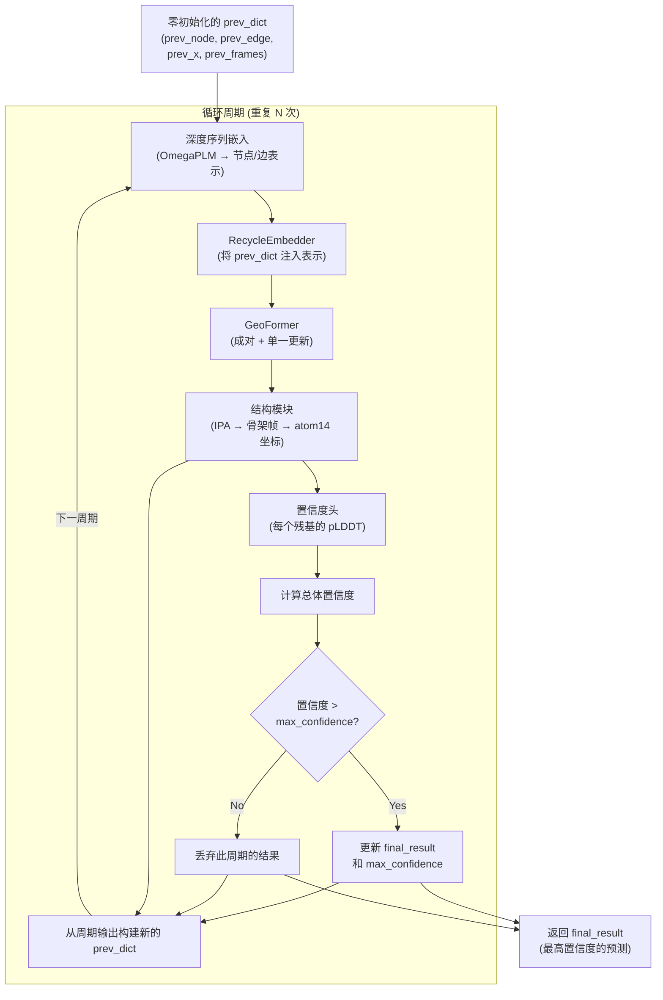
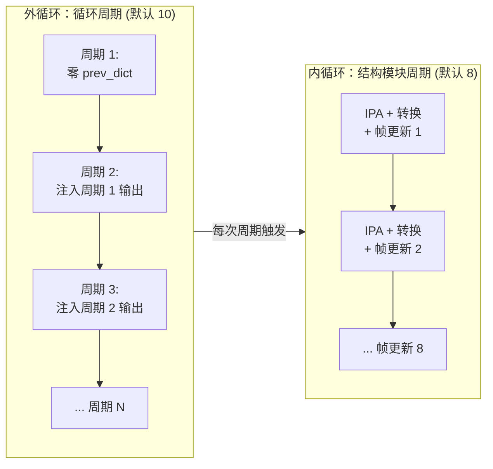

---
slug:11-recycling-and-iterative-refinement
blog_type:normal
---


OmegaFold 预测蛋白质结构并非通过单次前向传播完成，而是通过**迭代循环**——这是一个反馈循环，其中一个预测周期的输出将成为下一个周期的输入上下文。受 AlphaFold2 循环策略 (Jumper et al., 2021) 启发，该机制允许模型逐步细化其结构假设，利用自身的几何预测来改善后续迭代中的成对推理。其结果是一个自纠正循环：粗略的初始预测孕育出越来越精确的坐标输出，而置信度门控选择机制确保只返回最佳精化的结构。

来源: [model.py](omegafold/model.py#L118-L203), [embedders.py](omegafold/embedders.py#L347-L408)

## 循环循环架构

循环机制位于 `OmegaFold.forward()` 方法中，它对每个周期的输入列表进行迭代。每个周期执行完整的预测栈——语言模型嵌入、GeoFormer、结构模块和置信度估计——同时通过 `RecycleEmbedder` 注入上一个周期的输出信息。在第一个周期，所有“先前”的信号均被零初始化，因此模型纯粹基于序列信息运行。从第二个周期开始，模型可以访问其先前的结构预测，从而能够纠正残基对距离和骨架几何中的误差。



该循环由两个关键状态对象控制：**输入表示**（每个周期重新生成的伪 MSA 嵌入）和 **prev_dict**（承前启后的结构记忆）。每个周期生成一个新的 `prev_dict`，其中包含更新的节点表示、边表示、atom14 坐标和骨架帧——所有这些都将输入到下一次迭代的 `RecycleEmbedder` 中。

来源: [model.py](omegafold/model.py#L153-L203), [model.py](omegafold/model.py#L52-L112)

## prev_dict：结构记忆状态

`prev_dict` 是在循环周期之间传递信息的中心数据结构。它由 `create_initial_prev_dict()` 用零填充张量和默认帧进行初始化，然后由每个 `OmegaFoldCycle` 用该周期的输出进行填充：

| 字段 | 形状 | 来源 | 用途 |
|-------|-------|--------|---------|
| `prev_node` | `[num_res, node_dim]` | GeoFormer 输出 (单一表示) | 来自上一周期的残基级特征 |
| `prev_edge` | `[num_res, num_res, edge_dim]` | GeoFormer 输出 (成对表示) | 来自上一周期的残基对特征 |
| `prev_x` | `[num_res, 14, 3]` | 结构模块 `final_atom_positions` | 先前的 3D 原子坐标 |
| `prev_frames` | `AAFrame[num_res, 8]` | 结构模块 `final_frames` | 先前的骨架 + 侧链刚体帧 |

在第一个周期，`prev_node` 和 `prev_edge` 是零张量，`prev_x` 是零坐标张量，`prev_frames` 被初始化为埃克斯刻度下的默认（单位）帧。这确保了第一次传播纯粹由序列驱动，没有任何几何先验。在每个周期之后，`OmegaFoldCycle.forward()` 从其自身的输出中组装一个新的 `prev_dict`——具体来说，是 GeoFormer 的单一表示、更新后的边表示、解码后的 atom14 位置，以及包含由扭转角导出的侧链帧的扩展 8 帧表示。

来源: [model.py](omegafold/model.py#L236-L264), [model.py](omegafold/model.py#L106-L112)

## RecycleEmbedder：注入先验知识

`RecycleEmbedder` 是将上一周期的结构知识合并到当前周期的表示中的机制。它执行三种不同的注入路径，每种路径基于先前预测的不同方面：

**节点注入** — 上一周期的单一表示 (`prev_node`) 经过 `LayerNorm` 后直接加到当前周期的节点表示中。这种残差连接允许模型“记住”它先前学习到的每个残基的特征，而 LayerNorm 防止了各周期间幅度的漂移：

```
node_repr[..., 0, :, :] += LayerNorm(prev_node)
```

**基于距离克矩阵的边注入** — 上一周期的 atom14 坐标被缩减为伪 β 位置（每个残基的一个代表性点，通常是 Cβ 原子）。计算这些伪 β 位置之间的成对距离，通过 `Val2Bins` 离散化到区间中（配置为 `prev_pos` 个区间：3.25Å–20.75Å 跨越 16 个区间），并通过一个学习到的 `nn.Embedding` 进行嵌入。这为模型提供了关于残基对距离的直接几何先验：

```
prev_beta = create_pseudo_beta(prev_x, atom_mask)
d = ||prev_beta_i - prev_beta_j||₂
edge_repr += Embedding(DGram(d))
```

**基于先前成对表示的边注入** — 上一周期的边表示 (`prev_edge`) 经过 LayerNorm 后加到当前边表示中，保留了学习到的成对关系：

```
edge_repr += LayerNorm(prev_edge)
```

**可选的结构嵌入器（仅限模型 2）** — 当启用 `struct_embedder`（模型索引 2）时，额外的 `PairStructEmbedder` 将完整的成对 atom14 距离矩阵和局部帧相对位置编码到边表示中。相比于仅使用距离克矩阵，这提供了更丰富的几何信号，但代价是额外的计算量。

来源: [embedders.py](omegafold/embedders.py#L347-L408), [embedders.py](omegafold/embedders.py#L225-L328)

## 置信度门控选择

并非每个循环周期都能产生更好的预测。为了解决这个问题，OmegaFold 实现了**置信度门控选择**：在每个周期之后，根据每个残基的 pLDDT 预测和 Cα 距离矩阵计算总体置信度分数。模型仅保留具有最高总体置信度的周期的结果，而不是盲目使用最后一个周期的输出。

这由 `OmegaFold.forward()` 中的 `predict_with_confidence` 标志控制。启用时（默认情况），模型会跨所有周期跟踪 `max_confidence`，并且仅当某个周期的置信度超过当前最大值时才更新 `final_result`。禁用时，则无条件使用最后一个周期的结果。总体置信度由 `confidence.get_all_confidence()` 计算，该方法近似一个加权的 lDDT 分数，仅考虑 15Å 截断距离内的残基对。

<CgxTip>置信度门控选择意味着在收益递减点之后增加 `num_cycle` 是安全的——模型将简单地忽略更差的周期。然而，每个周期仍然需要完整的计算开销，因此存在一个时间与精度的权衡。</CgxTip>

来源: [model.py](omegafold/model.py#L190-L201), [confidence.py](omegafold/confidence.py#L39-L93)

## 跨周期的伪 MSA 多样性

每个循环周期接收一个**不同的伪 MSA**——即输入序列的随机掩码版本。流水线中的 `fasta2inputs()` 函数预先生成 `num_cycle` 个独立的伪 MSA 副本，每个副本是通过以配置的 `mask_rate`（默认 12%）随机掩码残基，并用未知词元（索引 21）替换被掩码的位置而生成的。这种随机变化意味着每个周期处理的输入略有不同，这起到了测试时增强的作用，有助于防止模型循环陷入退化的固定点。

当 `deterministic=True` 时，随机数生成器以序列长度为种子进行初始化，确保同一输入在不同运行间的可复现性。

来源: [pipeline.py](omegafold/pipeline.py#L93-L180)

## 周期计数配置

循环迭代的次数在两个层面上进行配置：

| 配置点 | 参数 | 默认值 | 作用域 |
|---------------------|-----------|---------|-------|
| CLI 参数 | `--num_cycle` | 10 | 控制循环迭代次数 + 伪 MSA 数量 |
| 前向传播配置 | `num_recycle` | 由 `--num_cycle` 设定 | 作为 `fwd_cfg` 传递给模型 |
| 结构模块 | `cfg.struct.num_cycle` | 8 | 内部 IPA 迭代（独立机制） |

区分**循环周期**（`OmegaFold.forward()` 中的外循环）和**结构模块周期**（`StructureModule` 中通过 IPA 迭代细化骨架帧的内循环）至关重要。循环周期是本页讨论的从粗到细的细化过程；结构模块周期是单个结构预测步骤内的内部坐标细化。

来源: [pipeline.py](omegafold/pipeline.py#L343-L346), [pipeline.py](omegafold/pipeline.py#L422-L425), [config.py](omegafold/config.py#L94-L108)

## 两级迭代细化：循环周期 vs. 结构模块周期

OmegaFold 在两种不同的粒度上采用迭代细化，理解它们之间的关系是掌握整体架构的关键：



**外循环循环**在全模型传播的层面上运行：每次迭代通过语言模型重新编码序列，使用循环上下文重新运行 GeoFormer，并生成一个完整的结构。**内结构模块循环**在骨架帧更新的层面上运行：在单个结构预测中，IPA 更新被迭代应用（默认 8 次）以逐渐对齐骨架帧。循环循环在每个周期重置内循环，但通过 `RecycleEmbedder` 提供逐步更好的起始表示。

来源: [model.py](omegafold/model.py#L159-L203), [decode.py](omegafold/decode.py#L316-L392)

## 循环数据流总结

下表追溯了通过一个循环周期的完整数据流，展示了周期 *k-1* 的 `prev_dict` 如何影响周期 *k* 的输出：

| 阶段 | 输入 | 输出 | 循环信号 |
|-------|-------|--------|-----------------|
| 深度序列嵌入 | 伪 MSA, 掩码 | `node_repr`, `edge_repr` | 无 (仅序列) |
| RecycleEmbedder | node_repr, edge_repr, prev_dict | 更新的 node_repr, edge_repr | LayerNorm(prev_node) → 节点; DGram(prev_x) + LayerNorm(prev_edge) → 边 |
| GeoFormer | node_repr, edge_repr, 掩码 | prev_node, edge_repr, node_repr | 通过丰富的输入隐式传递 |
| 结构模块 | node_repr, edge_repr, fasta, 掩码 | atom14 位置, 帧 | 通过 GeoFormer 输出隐式传递 |
| 置信度头 | node_repr | 每个残基的 pLDDT | 无 |
| prev_dict 组装 | GeoFormer + 结构输出 | 新的 prev_dict | 无 (生成下一周期的输入) |

来源: [model.py](omegafold/model.py#L163-L188), [model.py](omegafold/model.py#L106-L112)

## 实践指南

**选择周期计数** — 默认的 10 个循环周期在大多数序列的精度和速度之间提供了良好的平衡。短序列（<200 个残基）通常在 3-5 个周期内收敛，而长序列可能受益于完整的 10 个甚至更多周期。由于置信度门控选择保留了最佳结果，增加额外的周期绝不会损害精度，只会增加运行时间。

**模型 2 结构嵌入器** — 当使用模型索引 2 (`--model 2`) 时，`PairStructEmbedder` 为 RecycleEmbedder 提供了额外的几何上下文。它编码完整的成对距离矩阵和局部帧相对位置，提供了比仅使用距离克矩阵更丰富的信号。期望以每个周期额外的内存和计算开销为代价，获得适度的精度提升。

**内存考量** — 每个循环周期复用相同的模型参数（无参数复制），因此内存随每周期的激活大小缩放，而不是随周期数缩放。然而，`prev_dict` 必须在周期间保留，增加了大约 `(num_res × node_dim) + (num_res² × edge_dim) + (num_res × 14 × 3)` 个浮点数的固定开销。对于非常长的序列，`prev_edge` 项占主导地位。有关管理此开销的技术，请参阅[内存优化策略](14-memory-optimization-strategies)。

来源: [pipeline.py](omegafold/pipeline.py#L343-L346), [embedders.py](omegafold/embedders.py#L362-L363), [config.py](omegafold/config.py#L110-L111)

<CgxTip>OmegaFold 中的循环循环在架构上比 AlphaFold2 更简单——没有单独的模板或 MSA 循环路径。所有循环信号都通过单个 `RecycleEmbedder` 流动，使得该机制更易于推理，但表达力不如 AF2 的多源循环。</CgxTip>

## 相关页面

- [架构概览](4-architecture-overview) — 获取完整的模型架构上下文
- [GeoFormer Transformer](6-geoformer-transformer) — 了解被循环的成对/单一表示的详细信息
- [结构模块与 IPA](7-structure-module-and-ipa) — 了解内部迭代细化机制
- [置信度估计 (pLDDT)](12-confidence-estimation-plddt) — 了解 pLDDT 分数如何驱动周期选择
- [配置参考](13-configuration-reference) — 获取所有与循环相关的配置参数