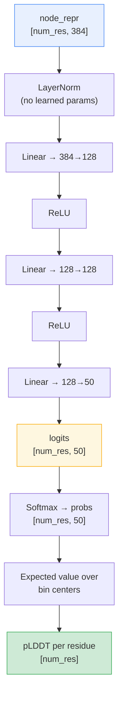
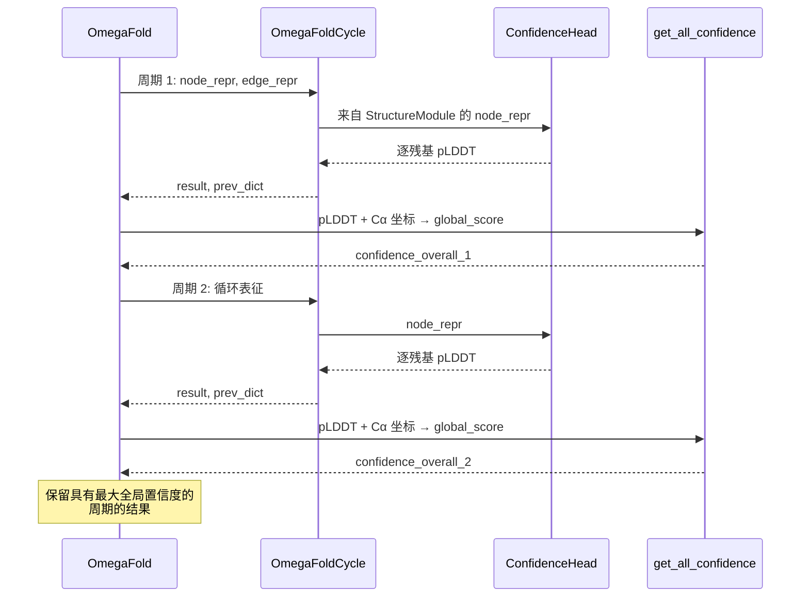

---
slug:12-confidence-estimation-plddt
blog_type:normal
---


OmegaFold 为预测结构中的每个氨基酸生成一个**逐残基置信度分数 pLDDT**（predicted Local Distance Difference Test，预测局部距离差异测试），此外还提供一个单一的**全局置信度**标量，用于总结整条链的预测质量。这些分数是模型对结构可靠性的自我评估——高 pLDDT 区域可能折叠正确，而低分区域则标记了不确定的环或无序片段。该实现遵循 AlphaFold2 的置信度头设计，适配至 OmegaFold 的模块层级结构中，并与循环环集成，以便在迭代精化周期中选取最佳结构。

来源：[confidence.py](/omegafold/confidence.py#L1-L154), [model.py](/omegafold/model.py#L52-L113)

## pLDDT 概念

**LDDT** 指标（Mariani et al., 2013）在不要求全局叠加的情况下测量局部结构的一致性——它评估的是局部邻域内成对距离的一致性，而非整体坐标系的对齐。OmegaFold 的 **pLDDT** 是该指标的*预测*版本：神经网络学习在推理时根据模型的内部表征来估算真实的 LDDT 值。每个残基的分数范围从 0 到 1（写入 PDB B 因子列时缩放至 0–100），常规解释总结如下。

| pLDDT 范围 (×100) | 置信度水平 | 典型结构区域 |
|---|---|---|
| 90 – 100 | 非常高 | 良好有序的核心（α-螺旋，β-折叠） |
| 70 – 90 | 置信 | 基本正确的局部几何形状 |
| 50 – 70 | 低 | 可能无结构或解析较差 |
| 0 – 50 | 非常低 | 可能无序 / 本质上无结构 |

<CgxTip>pLDDT 会被直接写入输出 PDB 文件的 B 因子列（乘以 100），因此 PyMOL 和 ChimeraX 等标准分子查看器可以开箱即用地按置信度对结构进行着色。</CgxTip>

来源：[confidence.py](/omegafold/confidence.py#L96-L117), [__main__.py](/omegafold/__main__.py#L86-L93)

## ConfidenceHead 架构

`ConfidenceHead` 是一个轻量级 MLP，它将**结构模块的最终节点表征**映射到 LDDT 分箱上的离散概率分布，然后将该分布折叠为逐残基置信度标量。整体流程如下所示。



**逐步的数据流：**

1. **层归一化**使用无权重的 `normalize` 工具应用于输入节点表征（形状为 `[num_res, 384]`）——这稳定了 MLP 输入，而无需引入可学习的缩放/偏移参数。
2. 带有 ReLU 激活函数的 **3 层 MLP**（384 → 128 → 128 → 50）在 50 个离散箱上生成原始 logits。
3. `_compute_confidence` 函数通过在均匀间隔的箱中心上执行 **softmax → 期望值**，将 logits 转换为 pLDDT（见下一节）。

来源：[confidence.py](/omegafold/confidence.py#L124-L146), [config.py](/omegafold/config.py#L94-L108), [torch_utils.py](/omegafold/utils/torch_utils.py#L53-L83)

## 从 Logits 到 pLDDT：分箱期望值

`_compute_confidence` 中的核心计算将置信度估计视为**基于分箱的离散分类**，而非直接回归。当 `num_bins = 50` 时，[0, 1] 区间被划分为 50 个等宽的箱，每个箱的中心为：

```
bin_center[k] = (k + 0.5) / num_bins,  对于 k = 0, 1, ..., 49
```

这会生成 0.01, 0.03, 0.05, …, 0.99 的中心点。logits 的 softmax 在这些箱上生成类别概率分布，而**每个残基的 pLDDT** 是该分布下的期望值——通过矩阵-向量乘积 `torch.mv(probs, bin_centers)` 实现。与直接标量回归相比，这种分箱方法有两个优点：它自然地将输出约束在 [0, 1] 范围内，并且捕获了模型**对自身置信度的不确定性**（平坦的 softmax = 高不确定性，尖峰的 softmax = 高确定性）。

| 参数 | 值 | 来源 |
|---|---|---|
| `num_bins` | 50 | `cfg.struct.num_bins` |
| `bin_width` | 0.02 | `1.0 / num_bins` |
| `bin_centers` | 0.01, 0.03, …, 0.99 | `arange(0.5×width, 1.0, width)` |
| 输出范围 | 每个残基 (0, 1) | Softmax 保证 |

来源：[confidence.py](/omegafold/confidence.py#L96-L117)

## 全局置信度：加权序列级聚合

虽然逐残基 pLDDT 提供了局部质量评估，`get_all_confidence` 计算出一个**单一标量**来代表整体预测质量。该聚合是逐残基分数的**邻居加权平均**，其中每个残基的权重与 15 Å 截断半径内其他 Cα 原子的数量成正比。这反映了 LDDT 的哲学：拥有更多局部邻居的残基对全局分数的贡献更大，因为 LDDT 本身就是基于局部距离邻域定义的。

计算过程如下：

1. 根据预测坐标计算成对 Cα 距离矩阵 `dmat_true`。
2. 构建一个**评分掩码** `dists_to_score`，用于选择满足以下条件的残基对： 真实距离低于 15 Å， 两个残基均有效（通过 `ca_mask` 验证），以及 该对不是自相互作用。
3. 全局分数是**（逐残基 pLDDT × 邻居数）之和**除以**已评分对的总数**，产生一个单精度浮点数。

```python
# 简化自实际实现
score = (lddt_per_residue * neighbor_counts).sum() / total_scored_pairs
```

| 参数 | 值 | 描述 |
|---|---|---|
| `cutoff` | 15.0 Å | 邻居包含的距离阈值 |
| `ca_coordinates` | `final_atom_positions[..., 1, :]` | Cα 原子位置（atom14 中的索引 1） |
| `ca_mask` | `p_msa_mask[..., 0, :]` | 来自输入的有效性掩码 |
| 返回值 | Python `float` | 单一全局置信度标量 |

来源：[confidence.py](/omegafold/confidence.py#L39-L93), [model.py](/omegafold/model.py#L190-L195)

## 与循环环的集成

置信度系统与 OmegaFold 的迭代精化深度集成。在每个循环周期内，`OmegaFoldCycle` 模块运行 GeoFormer → 结构模块 → ConfidenceHead，将逐残基 pLDDT 存储在 `ret['confidence']` 中。外部 `OmegaFold` 模型随后计算全局置信度，并且当 `predict_with_confidence=True`（默认值）时，**仅保留具有最高全局置信度分数的周期结构**。这意味着最终输出不一定来自最后一个周期，而是来自*最可信*的周期。



<CgxTip>如果 `predict_with_confidence=False`，模型将返回**最后一个**周期的结果，而不是最可信的周期。这对于调试或当你想观察预测在各周期间的演化过程时非常有用。</CgxTip>

来源：[model.py](/omegafold/model.py#L135-L203)

## PDB 文件中的置信度输出

当 OmegaFold 将预测结果保存为 PDB 格式时，逐残基 pLDDT 在乘以 100（从 [0, 1] 转换为 [0, 100]）后被写入 **B 因子列**。这与 AlphaFold2 使用的约定相同，从而实现了与按 B 因子着色的可视化工具的即时兼容。流水线中的 `save_pdb` 函数接收 `b_factors = output["confidence"] * 100`，并将每个残基的 B 因子写入 PDB ATOM 记录中。

| 输出字段 | 来源 | 转换 |
|---|---|---|
| PDB B 因子 | `output["confidence"]` | `× 100` (0–1 → 0–100) |
| `result["confidence"]` | `ConfidenceHead.forward()` | 原始 pLDDT，形状 `[num_res]` |
| `result["confidence_overall"]` | `get_all_confidence()` | 标量浮点数，不保存至 PDB |

来源：[__main__.py](/omegafold/__main__.py#L86-L93), [pipeline.py](/omegafold/pipeline.py#L183-L239)

## 配置参考

`ConfidenceHead` 继承自 `cfg.struct`（结构模块的配置命名空间）的配置。相关参数如下：

| 配置键 | 默认值 | 在 ConfidenceHead 中的作用 |
|---|---|---|
| `struct.node_dim` | 384 | 输入维度（来自结构模块输出） |
| `struct.hidden_dim` | 128 | 3 层 MLP 中的隐藏层宽度 |
| `struct.num_bins` | 50 | 输出分布的 LDDT 箱数 |

这些参数在 `make_config()` 中定义，并在结构模块和置信度头之间共享，因为置信度头直接消费结构模块的输出。更改 `num_bins` 会改变置信度分布的粒度——箱数越多分辨率越高，但也要求模型学习更精细的概率分布。

来源：[config.py](/omegafold/config.py#L94-L108), [confidence.py](/omegafold/confidence.py#L131-L139)

## AlphaFold2 谱系

OmegaFold 的置信度估计明确源自 AlphaFold2 的实现。源代码引用了两个 AF2 来源：

- `_compute_confidence` 采用了来自 [`alphafold/common/confidence.py`](https://github.com/deepmind/alphafold/blob/0be2b30b98f0da7aecb973bde04758fae67eb913/alphafold/common/confidence.py#L22) 的 logit 到 pLDDT 逻辑
- `get_all_confidence` 采用了来自 [`alphafold/model/lddt.py`](https://github.com/deepmind/alphafold/blob/1109480e6f38d71b3b265a4a25039e51e2343368/alphafold/model/lddt.py#L19) 的距离差异测试聚合

关键的架构适配在于，OmegaFold 在推理时不使用 MSA（而是使用伪 MSA），因此置信度头仅依赖结构模块的节点表征——而 AF2 的头还可以利用 MSA 派生的特征。尽管存在这种输入差异，分箱策略和聚合逻辑依然被忠实移植。

来源：[confidence.py](/omegafold/confidence.py#L39-L55), [confidence.py](/omegafold/confidence.py#L96-L109)

---

**下一步**：要理解输入至 ConfidenceHead 的节点表征是如何生成的，请参阅[结构模块与 IPA](7-structure-module-and-ipa)。关于置信度选择所运作的迭代上下文，请参阅[循环与迭代精化](11-recycling-and-iterative-refinement)。有关所有可配置参数，请参阅[配置参考](13-configuration-reference)。