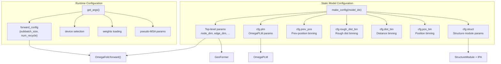
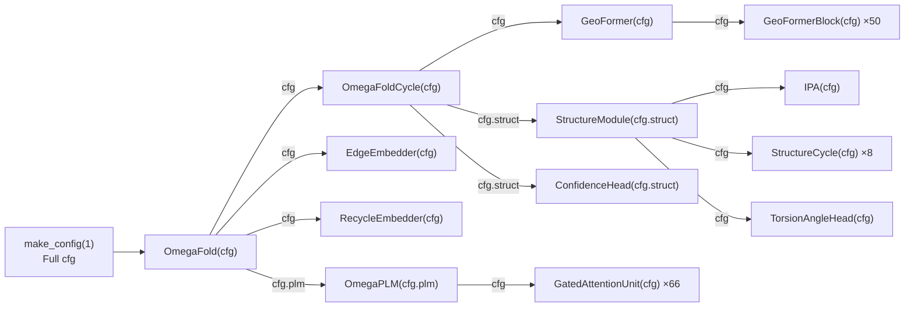

---
slug:13-configuration-reference
blog_type:normal
---

OmegaFold 的行为由两个不同的配置层控制：**静态模型配置**定义神经网络架构（在加载权重时固定），**运行时配置**控制推理执行过程（可在每次预测时调整）。理解这两个配置层之间的边界至关重要——未经重新训练而修改静态配置将产生无效输出，而运行时配置则提供了权衡速度、内存和质量的合法手段。

## 配置架构

系统通过两条独立的管线生成配置，并在模型实例化时汇合。**静态配置**由 [`make_config()`](omegafold/config.py#L43-L111) 根据模型索引生成，产生一个 `argparse.Namespace` 树，并向下层叠传递至每个子模块。**运行时配置**由 [`get_args()`](omegafold/pipeline.py#L304-L429) 从命令行参数组装而成，产生一个扁平的 `argparse.Namespace`，并以 `fwd_cfg` 的形式流入前向传播过程。

每个 OmegaFold 模块均继承自 [`OFModule`](omegafold/modules.py#L171-L190)，该基类将 `self.cfg` 存储为 `argparse.Namespace`。子模块接收完整配置的*局部*子集——例如，`OmegaPLM` 接收 `cfg.plm`，`StructureModule` 接收 `cfg.struct`——确保每个组件仅可见与其自身架构相关的参数。

来源：[config.py](omegafold/config.py#L1-L122), [modules.py](omegafold/modules.py#L171-L190), [pipeline.py](omegafold/pipeline.py#L304-L429)

## 静态模型配置

函数 [`make_config(model_idx)`](omegafold/config.py#L43-L111) 构建完整的架构命名空间。该函数接受 `model_idx` ∈ {1, 2}，其中模型 2 额外启用结构嵌入器（`struct_embedder=True`），用于在循环期间基于模板进行边特征增强。两个模型的其他所有参数均相同。

### 顶层参数

这些参数定义了主要的表征维度和 GeoFormer 主干行为，并在 `OmegaFold`、`GeoFormer` 及各嵌入模块间共享。

| 参数 | 默认值 | 类型 | 消费者 | 描述 |
|---|---|---|---|---|
| `alphabet_size` | 21 | int | `EdgeEmbedder` | 氨基酸标记数量（20种标准氨基酸 + 1种未知） |
| `node_dim` | 256 | int | `GeoFormer`, `RecycleEmbedder`, `OmegaFold` | 节点（单一表征）隐藏维度 |
| `edge_dim` | 128 | int | `GeoFormer`, `RecycleEmbedder`, `OmegaFold` | 边（成对表征）隐藏维度 |
| `relpos_len` | 32 | int | `EdgeEmbedder` | 单侧相对位置编码窗口（总计 = 2×32+1 = 65 个分箱） |
| `c` | 16 | int | `StructEmbedder` | 结构嵌入的基础通道维度 |
| `geo_num_blocks` | 50 | int | `GeoFormer` | 主干中 GeoFormer 块的数量 |
| `gating` | True | bool | `GeoFormerBlock` | 启用门控注意力输出投影 |
| `attn_c` | 32 | int | `GeoFormerBlock` | 每个头的注意力键/查询维度 |
| `attn_n_head` | 8 | int | `GeoFormerBlock` | GeoFormer 中的注意力头数 |
| `transition_multiplier` | 4 | int | `GeoFormerBlock` | 转换层内部维度 = `node_dim × multiplier` |
| `activation` | `"ReLU"` | str | `GeoFormerBlock` | 转换层的激活函数 |
| `opm_dim` | 32 | int | `GeoFormerBlock` | 外积（Node2Edge）的投影维度 |
| `geom_count` | 2 | int | `GeoFormerBlock` | 每个块的几何注意力层数 |
| `geom_c` | 32 | int | `GeoFormerBlock` | 每个头的几何注意力通道维度 |
| `geom_head` | 4 | int | `GeoFormerBlock` | 几何注意力头数 |
| `struct_embedder` | `model_idx == 2` | bool | `RecycleEmbedder` | 为模板结构输入启用 `PairStructEmbedder` |

来源：[config.py](omegafold/config.py#L46-L111), [geoformer.py](omegafold/geoformer.py#L49-L87), [embedders.py](omegafold/embedders.py#L116-L138)

### OmegaPLM 参数 (`cfg.plm`)

这些参数控制预训练的蛋白质语言模型——一个门控注意力单元（GAU）编码器。该 PLM 在循环开始前运行**一次**，生成维度为 `node=1280` 的节点嵌入，随后将其线性投影至主干的 `node_dim=256`。

| 参数 | 默认值 | 描述 |
|---|---|---|
| `alphabet_size` | 23 | 标记词汇表大小（20种氨基酸 + gap + 未知 + mask） |
| `node` | 1280 | PLM 隐藏维度（嵌入及层间宽度） |
| `padding_idx` | 21 | `nn.Embedding` 的填充标记索引 |
| `edge` | 66 | GAU 层数（亦决定堆叠的边输出通道数） |
| `proj_dim` | 2560 | GAU 中值/门控分割的投影维度（`1280 × 2`） |
| `attn_dim` | 256 | GAU 注意力键/查询维度 |
| `num_head` | 1 | GAU 注意力头数 |
| `num_relpos` | 129 | GAU 注意力偏置的相对位置编码分箱数 |
| `masked_ratio` | 0.12 | 训练时的掩码率，用于微调的 dropout 缩放 |

PLM 的层数通过 `cfg.plm.edge = 66` 设置，这看起来可能有悖直觉——它控制的是 [`OmegaPLMLayer`](omegafold/omegaplm.py#L121-L159) 实例的数量，每个实例包含一个 [`GatedAttentionUnit`](omegafold/omegaplm.py#L56-L118)。`masked_ratio` 在推理时不应用，但用于通过 [`_get_finetuning_scale()`](omegafold/omegaplm.py#L222-L243) 计算标记 dropout 校正缩放比例。

来源：[config.py](omegafold/config.py#L48-L58), [omegaplm.py](omegafold/omegaplm.py#L162-L219)

### 分箱参数

OmegaFold 将连续的几何量离散化为软分箱以进行嵌入。三个独立的分箱配置控制着不同的输入模态：

| 配置组 | 参数 | 默认值 | 消费者 | 用途 |
|---|---|---|---|---|
| `cfg.prev_pos` | `first_break`, `last_break`, `num_bins`, `ignore_index` | 3.25, 20.75, 16, 0 | `RecycleEmbedder.dgram` | 将上一循环的残基间距离离散化，用于循环边输入 |
| `cfg.rough_dist_bin` | `x_min`, `x_max`, `x_bins` | 3.25, 20.75, 16 | `StructEmbedder.rough_dist_bin` | 结构嵌入器中的粗粒度成对距离编码（模型 2） |
| `cfg.dist_bin` | `x_min`, `x_max`, `x_bins` | 2, 65, 64 | `StructEmbedder.dist_bin` | 结构嵌入器中的细粒度成对距离编码（模型 2） |
| `cfg.pos_bin` | `x_min`, `x_max`, `x_bins` | -32, 32, 64 | `StructEmbedder.pos_bin` | 结构嵌入器中的局部坐标系位置编码（模型 2） |

注意，`prev_pos` 使用 [`Val2Bins`](omegafold/embedders.py#L347-L364)（硬分箱，对超出范围的值使用 `ignore_index`），而结构嵌入器分箱使用 `Val2ContBins`（软连续分箱）。设计上，`prev_pos.first_break` 和 `prev_pos.last_break` 与 `rough_dist_bin.x_min` 和 `rough_dist_bin.x_max` 相匹配——两者捕获相同的粗距离区间。

来源：[config.py](omegafold/config.py#L62-L82), [embedders.py](omegafold/embedders.py#L225-L328)

### 结构模块参数 (`cfg.struct`)

这些参数控制不变点注意力（IPA）结构模块和扭转角预测头。结构模块接收 `cfg.struct` 作为其局部配置，实例化为 [`StructureModule(cfg.struct)`](omegafold/decode.py#L316-L329)。

| 参数 | 默认值 | 描述 |
|---|---|---|
| `node_dim` | 384 | 结构模块内部的节点表征维度（与主干的 256 不同） |
| `edge_dim` | 128 | 边表征维度（与主干匹配） |
| `num_cycle` | 8 | 每次循环迭代中 IPA 结构循环的次数 |
| `num_transition` | 3 | 每次 IPA 结构循环中的转换层数 |
| `num_head` | 12 | IPA 注意力头数 |
| `num_point_qk` | 4 | 每个头的点查询/键向量数（3D 几何注意力） |
| `num_point_v` | 8 | 每个头的点值向量数 |
| `num_scalar_qk` | 16 | 每个头的标量查询/键维度 |
| `num_scalar_v` | 16 | 每个头的标量值维度 |
| `num_channel` | 128 | 扭转角残差块的隐藏通道维度 |
| `num_residual_block` | 2 | `TorsionAngleHead` 中的残差块数量 |
| `hidden_dim` | 128 | 隐藏维度（保留参数，当前在主路径中未使用） |
| `num_bins` | 50 | 置信度/距离图预测的分箱数 |

结构模块的 `node_dim=384` 大于 GeoFormer 主干的 `node_dim=256`——一个 [`node_final_proj`](omegafold/geoformer.py#L146) 线性层在 GeoFormer 输出处弥合了这一维度差异。

来源：[config.py](omegafold/config.py#L94-L108), [decode.py](omegafold/decode.py#L44-L90), [decode.py](omegafold/decode.py#L200-L252), [decode.py](omegafold/decode.py#L316-L392)

## 运行时（前向）配置

前向配置控制执行行为而不改变模型权重。它在 [`get_args()`](omegafold/pipeline.py#L422-L425) 中构造为扁平命名空间，并作为 `fwd_cfg` 关键字参数贯穿整个调用栈。

| 参数 | 命令行标志 | 默认值 | 描述 |
|---|---|---|---|
| `subbatch_size` | `--subbatch_size` | `None`（完整序列） | 沿查询维度将注意力计算分块为指定大小的块。较小的值会降低 GPU 内存占用，但代价是速度变慢。为 `None` 时，使用完整序列长度。 |
| `num_recycle` | `--num_cycle` | 10 | 循环迭代次数。每次迭代重新运行 GeoFormer 主干 + 结构模块，并反馈上一次的预测结果。更多的循环次数可提升质量，但运行时间也会线性增加。 |

<CgxTip>`subbatch_size` 参数是处理长序列时控制内存的主要手段。将其设置为 256 或 512 允许在 16GB 显存的 GPU 上预测超过 1000 个残基的序列，但速度会降低约 2-3 倍。此参数由 [`attention()`](omegafold/modules.py#L104-L164) 函数中对查询拆分的分块循环所消费。</CgxTip>

来源：[pipeline.py](omegafold/pipeline.py#L422-L425), [modules.py](omegafold/modules.py#L104-L164)

## 命令行界面

所有命令行参数均在 [`get_args()`](omegafold/pipeline.py#L316-L429) 中定义。下表记录了每个标志、其默认值及作用。

| 标志 | 类型 | 默认值 | 描述 |
|---|---|---|---|
| `input_file` | 位置参数 | — | 输入 FASTA 文件的路径（支持 `~` 展开） |
| `output_dir` | 位置参数 | — | 输出 PDB 文件的目录（若不存在则创建；支持 `~` 展开） |
| `--num_cycle` | int | 10 | 循环迭代次数（映射为 `fwd_cfg.num_recycle`） |
| `--subbatch_size` | int | None | 节省内存的注意力计算的子批次大小（映射为 `fwd_cfg.subbatch_size`） |
| `--device` | str | auto | 计算设备：`cpu`、`cuda`、`cuda:N`、`mps` 或自动检测 |
| `--weights_file` | str | `~/.cache/omegafold_ckpt/model.pt` | 缓存模型权重的本地路径 |
| `--weights` | str | `https://helixon.s3.amazonaws.com/release1.pt` | 下载权重的 URL |
| `--model` | int | 1 | 模型变体：**1** = 标准，**2** = 带结构嵌入器 |
| `--pseudo_msa_mask_rate` | float | 0.12 | 生成伪 MSA 行的掩码率 |
| `--num_pseudo_msa` | int | 15 | 每次循环迭代生成的伪 MSA 序列数 |
| `--allow_tf32` | bool | True | 在 Ampere+ 架构 GPU 上启用 TF32 精度以加速矩阵乘法 |

### 设备自动检测逻辑

当未指定 `--device` 时，[`_get_device()`](omegafold/pipeline.py#L271-L301) 按优先级顺序选择加速器：**CUDA** → **MPS** (Apple Silicon) → **CPU**。指定不可用的设备将引发 `ValueError`。

### 模型变体路由

`--model` 标志同时控制两件事：

1. **权重下载 URL**：模型 1 → `release1.pt`，模型 2 → `release2.pt`
2. **静态配置**：`make_config(model_idx)` 设置 `struct_embedder = (model_idx == 2)`

模型 2 在 `RecycleEmbedder` 内启用 [`PairStructEmbedder`](omegafold/embedders.py#L331-L344)，该模块将上一循环预测的坐标和帧中的成对结构信息编码进边表征。这因额外的嵌入路径会显著增加内存开销。

### 精度控制

[`_set_precision()`](omegafold/pipeline.py#L59-L75) 基于 PyTorch 版本配置 TF32 行为。对于 PyTorch < 1.12，它直接设置 `cuda.matmul.allow_tf32` 和 `cudnn.allow_tf32`。对于 PyTorch ≥ 1.12，当启用 TF32 时，它调用 `torch.set_float32_matmul_precision("high")`，否则调用 `"highest"` 以使用严格 FP32。

<CgxTip>当 `--allow_tf32=True`（默认）时，Ampere+ 架构 GPU 使用 TF32 进行矩阵乘法，速度提升约 3 倍，但尾数从 23 位减少至 10 位。对于数值精度要求严格的敏感基准测试，请使用 `--allow_tf32=False` 禁用此功能。</CgxTip>

来源：[pipeline.py](omegafold/pipeline.py#L59-L75), [pipeline.py](omegafold/pipeline.py#L316-L429), [pipeline.py](omegafold/pipeline.py#L271-L301)

## 配置在架构中的流转

下图展示了每个配置作用域如何从根 `OmegaFold` 模块向下分发至叶组件。每个箭头代表一个配置子命名空间被传递至子模块的构造函数中。

注意 `cfg.struct` 是如何在 `StructureModule` 和 `ConfidenceHead` 之间共享的，而 `cfg`（完整命名空间）被传递给 `GeoFormer`、`EdgeEmbedder` 和 `RecycleEmbedder`——这些模块直接访问 `node_dim`、`edge_dim` 和 `struct_embedder` 等顶层键。

来源：[model.py](omegafold/model.py#L52-L133), [config.py](omegafold/config.py#L43-L111)

## 按模块划分的参数汇总

为便于快速参考，下表将每个静态配置参数映射至消费它的模块。

| 参数 | 消费模块 |
|---|---|
| `alphabet_size` | `EdgeEmbedder`, (顶层) |
| `node_dim` | `OmegaFold`, `GeoFormerBlock`, `RecycleEmbedder`, `EdgeEmbedder` |
| `edge_dim` | `OmegaFold`, `GeoFormerBlock`, `RecycleEmbedder`, `EdgeEmbedder` |
| `relpos_len` | `EdgeEmbedder` |
| `c` | `StructEmbedder`, `PairStructEmbedder` |
| `geo_num_blocks` | `GeoFormer` |
| `gating` | `GeoFormerBlock` (注意力门控) |
| `attn_c` | `GeoFormerBlock` (注意力每头维度) |
| `attn_n_head` | `GeoFormerBlock` |
| `transition_multiplier` | `GeoFormerBlock` |
| `activation` | `GeoFormerBlock` |
| `opm_dim` | `GeoFormerBlock` (外积模块) |
| `geom_count` | `GeoFormerBlock` |
| `geom_c` | `GeoFormerBlock` |
| `geom_head` | `GeoFormerBlock` |
| `struct_embedder` | `RecycleEmbedder` |
| `plm.*` | `OmegaPLM`, `GatedAttentionUnit` |
| `prev_pos.*` | `RecycleEmbedder` (距离图) |
| `rough_dist_bin.*` | `StructEmbedder` |
| `dist_bin.*` | `StructEmbedder` |
| `pos_bin.*` | `StructEmbedder` |
| `struct.*` | `StructureModule`, `IPA`, `StructureCycle`, `TorsionAngleHead`, `ConfidenceHead` |

来源：[config.py](omegafold/config.py#L46-L111), [model.py](omegafold/model.py#L118-L133), [geoformer.py](omegafold/geoformer.py#L43-L87), [omegaplm.py](omegafold/omegaplm.py#L56-L76), [decode.py](omegafold/decode.py#L44-L90), [embedders.py](omegafold/embedders.py#L225-L364)

---

**下一步**：关于调整 `subbatch_size` 及设备内存的策略，请参阅[内存优化策略](14-memory-optimization-strategies)。关于 `num_recycle` 如何驱动迭代精炼，请参阅[循环与迭代精炼](11-recycling-and-iterative-refinement)。