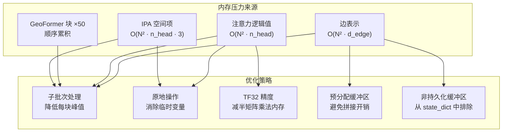
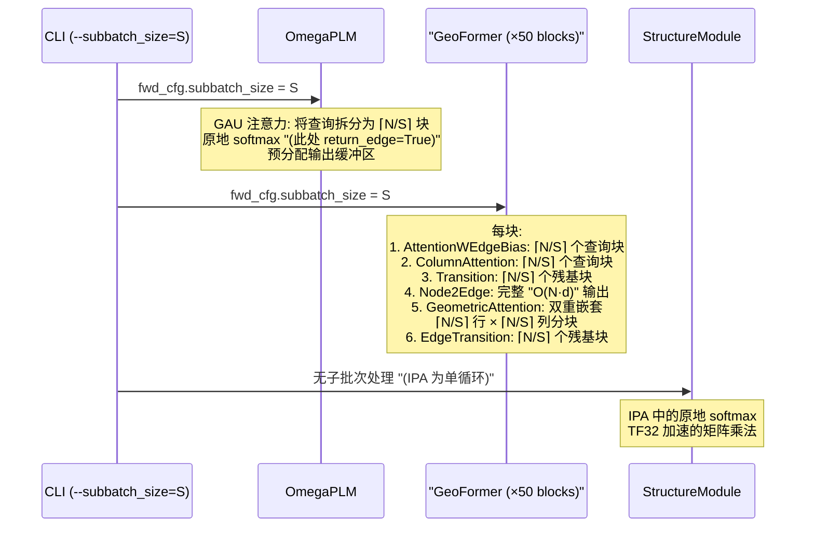

---
slug:14-memory-optimization-strategies
blog_type:normal
---


OmegaFold 旨在单 GPU 环境下进行推理，此类环境中 GPU 内存（VRAM）是最稀缺的资源。代码库采用了分层防御策略——架构层的**子批次处理**、内核层的**原地算术**以及硬件层的**精度控制**——从而能够在不发生 OOM（内存不足）错误的情况下，折叠包含多达数千个残基的蛋白质。本文将剖析每种策略，追溯其在代码库中的传播路径，并量化涉及的权衡取舍。

## 内存压力全景

蛋白质结构预测的计算复杂度与序列长度呈二次方关系：仅边表示就占据 O(N²) 的内存，而注意力逻辑值又以额外的 O(N²·H) 因子加剧了这一消耗，其中 H 为头数。对于具有默认配置（`edge_dim=128`，`attn_n_head=8`）的 1000 残基链，在 fp32 精度下仅边张量就消耗约 488 MB 内存，每个头单次注意力逻辑值矩阵额外增加约 30 MB。50 块 GeoFormer 通过在顺序块评估期间保持节点和边张量同时活跃，进一步放大了这种压力。以下策略构成了针对此压力特征的协同应对方案。



来源：[config.py](/omegafold/config.py#L46-L109)，[modules.py](/omegafold/modules.py#L69-L164)，[geoformer.py](/omegafold/geoformer.py#L89-L137)

## 子批次处理：核心杠杆

**子批次处理**是 OmegaFold 的核心内存缩减机制。该机制并非一次性计算完整查询长度 N 的注意力，而是将查询维度拆分为大小为 `subbatch_size` 的块，并独立处理每个块。这会将峰值注意力内存从 O(N²) 降低至 O(subbatch_size × N)，当 `subbatch_size ≪ N` 时，这将带来显著的内存缩减。

### 子批次循环机制

核心实现位于 `attention()` 函数中。它使用 `torch.empty` 预分配完整的输出张量，然后对由 `torch.Tensor.split()` 生成的查询块进行迭代：

```python
# 预分配输出——避免 列表-追加-拼接 模式
output = torch.empty(*batch_shape, q_length, v_dim, **factory_kwargs)

for i, q_i in enumerate(query.split(subbatch_size, dim=-2)):
    start, end = i * subbatch_size, (i + 1) * subbatch_size
    # 切片对应的偏置行
    if bias.shape[-2] != q_length:
        b_i = bias
    else:
        b_i = bias[..., start:end, :]
    # 仅计算此块的注意力
    res, attn = _attention(q_i, key, scale, value, b_i, ...)
    output[..., start:end, :] = res  # 写入预分配缓冲区
```

其核心洞见在于**键和值张量永不拆分**——仅查询被分块。这意味着每个子批次仍会关注完整的键值上下文，从而在数学上保持与非子批次计算的等价性。偏置张量沿查询维度进行切片以与之匹配。

来源：[modules.py](/omegafold/modules.py#L104-L164)

### 子批次在架构中的传播

子批次处理并非仅在单点应用；它通过一个承载 `subbatch_size` 的 `fwd_cfg` 命名空间对象，从 CLI 一路传播至每个注意力和过渡调用中：

| 组件 | 子批次目标 | 机制 |
|---|---|---|
| `Attention._get_attn_out` | QKV 注意力的查询维度 | `fwd_cfg.subbatch_size` 传递给 `modules.attention()` |
| `Transition.forward` | 前馈网络的残基维度 | `x.split(subbatch_size, dim=0)` 循环 |
| `GeometricAttention._get_attended` | 通过 `_get_sharded_stacked` 处理的边行 | 边表示的嵌套分片 |
| `GeometricAttention._get_gated` | 行与列双维度 | **双重嵌套**分片循环 |
| `GatedAttentionUnit.forward` | OmegaPLM 中的 GAU 注意力 | `subbatch_size=fwd_cfg.subbatch_size` |

`Transition` 类同样将子批次处理应用于其前馈网络：沿残基维度拆分输入，并在将其传入共享线性层之前独立归一化每个块。

来源：[modules.py](/omegafold/modules.py#L204-L216)，[modules.py](/omegafold/modules.py#L466-L494)，[modules.py](/omegafold/modules.py#L607-L669)，[omegaplm.py](/omegafold/omegaplm.py#L96-L118)

### GeometricAttention 中的双重嵌套分片

`GeometricAttention` 模块引入了一种尤为精妙的模式。由于边表示的形状为 `[N, N, d_edge]`——在两个维度上均呈二次方增长——简单的查询侧子批次处理已不敷使用。取而代之，`_get_sharded_stacked` 生成将行切片及其转置进行堆叠的块：

```python
def _get_sharded_stacked(edge_repr, subbatch_size):
    while start < edge_repr.shape[-2]:
        yield start, end, torch.stack(
            [edge_repr[start:end],
             edge_repr.transpose(-2, -3)[start:end]], dim=-1
        )
```

随后，`_get_gated` 方法采用**双重嵌套循环**：外层循环对行分片，内层循环对列分片。每对 (row_chunk, col_chunk) 计算门控输出的一个分块，直接写入预分配的 `gated` 张量的 `[s_row:e_row, s_col:e_col]` 位置。这会将门控计算的峰值内存从 O(N²·d) 降低至 O(subbatch_size²·d)——该计算是整个模型中内存消耗最大的路径。

来源：[modules.py](/omegafold/modules.py#L551-L567)，[modules.py](/omegafold/modules.py#L638-L669)

### CLI 控制与默认值

`subbatch_size` 参数作为 CLI 参数暴露，默认值为 `None`，解析为完整的序列长度（即不进行子批次处理）。参数帮助文本明确陈述了此权衡：*"越小越慢，GRAM 需求越低"*：

```
--subbatch_size SUBBATCH_SIZE
    子批次大小，越小越慢，
    GRAM 需求越低。默认为整个
    序列长度。
```

当 `subbatch_size` 为 `None` 时，每个调用点都会回退至 `q_length`（完整的查询维度），从而有效禁用分块并以最大内存全速运行。

来源：[pipeline.py](/omegafold/pipeline.py#L347-L357)，[pipeline.py](/omegafold/pipeline.py#L422-L425)

## 原地操作

子批次处理缩减了峰值分配大小，而**原地操作**则通过复用现有张量存储来减少总分配次数。OmegaFold 在两种粒度上应用原地语义：逐元素算术和激活函数。

### 原地 Softmax

`modules.py` 中的 `softmax()` 函数在 `in_place=True` 时实现了一条完全原地的路径：

```python
if in_place:
    max_val = torch.max(x, dim=dim, keepdim=True)[0]
    torch.sub(x, max_val, out=x)       # x -= max_val
    torch.exp(x, out=x)                # x = exp(x)
    summed = torch.sum(x, dim=dim, keepdim=True)
    x /= summed                        # x /= sum
    return x
```

每一步都会回写至原始张量 `x`，而非分配新张量。此逻辑在标准注意力路径中 `return_edge=False`（即计算后不再需要注意力权重）时被调用，这是推理期间的常见情况。当 `return_edge=True` 时，则改用非原地的 `torch.softmax()`，因为必须保留原始逻辑值以用于边缩减。

来源：[modules.py](/omegafold/modules.py#L39-L66)，[modules.py](/omegafold/modules.py#L93-L101)

### 原地层归一化

`torch_utils.py` 中的 `normalize()` 工具提供了一条原地路径，无需分配单独的输出张量即可计算层归一化：

```python
if in_place:
    dim = list(range(len(inputs.shape))[-len(normalized_shape):])
    inputs -= inputs.mean(dim=dim, keepdim=True)
    inputs *= torch.rsqrt(inputs.var(dim=dim, keepdim=True) + 1e-5)
    return inputs
```

此方法在 `OmegaFold.deep_sequence_embed()` 中以 `in_place=True` 被调用，用于在投影前归一化 PLM 节点和边表示——此时原始未归一化的值已不再需要。

来源：[utils/torch_utils.py](/omegafold/utils/torch_utils.py#L53-L83)，[model.py](/omegafold/model.py#L225-L231)

### Transition 中的原地激活

`Transition` 模块尝试以 `inplace=True` 创建其激活函数：

```python
try:
    act = getattr(nn, activation)(inplace=True)
except TypeError:
    act = getattr(nn, activation)()
```

`try/except` 处理了不支持 `inplace` 参数的激活类。对于 `ReLU`（默认值），此操作成功，启用了融合的原地 ReLU，从而避免为激活分配单独的输出张量。

来源：[modules.py](/omegafold/modules.py#L198-L202)

### 原地 IPA Softmax

结构解码器中的 `InvariantPointAttention` 模块在其注意力权重计算中显式请求原地 softmax：

```python
attn_w = modules.softmax(logits, dim=-2, in_place=True)
```

此操作是安全的，因为 IPA 不返回边级别的注意力信息——逻辑值纯粹是中间结果。

来源：[decode.py](/omegafold/decode.py#L135-L135)

## 预分配输出缓冲区

代码库中的一种常见模式是使用 `torch.empty()` **预分配输出张量**，并通过切片将结果写入其中，而非在 Python 列表中累积块后再调用 `torch.cat()`。这避免了两个内存陷阱：(1) 拼接前同时存储多个块张量的开销；(2) `cat()` 期间发生的双倍分配（源数据与目标数据同时驻留内存）。

此模式出现在三种不同上下文中：

| 位置 | 分配 | 写入模式 |
|---|---|---|
| `attention()` | `torch.empty(*batch_shape, q_length, v_dim)` | `output[..., start:end, :] = res` |
| `GeometricAttention._get_attended` | `torch.empty(*shape, n_axis)` | `attended[s:e] = result` |
| `GeometricAttention._get_gated` | `torch.empty(*shape[:2], n_axis, d_edge)` | `gated[s_row:e_row, s_col:e_col] = tile` |

来源：[modules.py](/omegafold/modules.py#L137-L163)，[modules.py](/omegafold/modules.py#L613-L636)，[modules.py](/omegafold/modules.py#L639-L669)

## 非持久化缓冲区

`Val2ContBins` 和 `Val2Bins` 模块对其预计算的查找表（偏移量和断点）使用带有 `persistent=False` 的 `register_buffer`。这将其从 `state_dict()` 中排除，减小了模型检查点的大小，更重要的是，确保了这些张量在权重序列化期间不会被重复创建：

```python
self.register_buffer(
    "x_offset", torch.linspace(...), persistent=False
)
```

这些缓冲区在实例化时从配置常量重新推导，因此将它们存储在检查点中是冗余的。

来源：[modules.py](/omegafold/modules.py#L289-L295)，[modules.py](/omegafold/modules.py#L319-L323)

## 精度控制：TF32 与权重加载

### TF32 矩阵乘法精度

流水线暴露了 `--allow_tf32` 标志（默认为 `True`），在 Ampere+ GPU 上为矩阵乘法启用 TensorFloat-32 精度。TF32 使用 10 位尾数和 7 位指数，与 fp32 相比将矩阵乘法内存带宽减少约 2 倍，同时保持对推理而言可接受的数值行为：

```python
def _set_precision(allow_tf32: bool) -> None:
    if int(torch.__version__.split(".")[1]) < 12:
        cuda.matmul.allow_tf32 = allow_tf32
        cudnn.allow_tf32 = allow_tf32
    else:
        precision = "high" if allow_tf32 else "highest"
        torch.set_float32_matmul_precision(precision)
```

版本条件逻辑适应了 PyTorch 在 v1.12 中的 API 变更，当时各后端专属标志被 `torch.set_float32_matmul_precision()` 所取代。

来源：[pipeline.py](/omegafold/pipeline.py#L59-L76)，[pipeline.py](/omegafold/pipeline.py#L388-L391)

### CPU 优先权重加载

模型权重以 `map_location='cpu'` 加载，以避免在反序列化期间 GPU 内存出现潜在灾难性激增：

```python
return torch.load(weights_file, map_location='cpu')
```

若非如此，PyTorch 会直接在当前 CUDA 设备上反序列化，导致内存使用量暂时翻倍（读取期间 CPU 上的权重 + 传输期间 GPU 上的权重）。优先加载至 CPU 允许随后的 `model.load_state_dict()` 逐个传输参数，从而保持较低的峰值 GPU 利用率。

来源：[pipeline.py](/omegafold/pipeline.py#L268-L268)

## 策略交互与权衡总结

这些策略并非独立的开关——它们以复合收益的方式交互作用。下表概述了关键权衡：

| 策略 | 节省内存 | 速度代价 | 数学等价性 | 作用域 |
|---|---|---|---|---|
| 子批次处理 (注意力) | O(N²) → O(S·N) | 循环开销 + 内核启动 | **精确**（分块而非近似） | 所有注意力层 |
| 子批次处理 (Transition) | 每块 O(N·d·n) | 较小的循环开销 | **精确**（残基独立） | 前馈块 |
| 双重嵌套分片 | O(N²·d) → O(S²·d) | 多 O(N²/S²) 次内核启动 | **精确**（分块回写） | 仅 GeometricAttention |
| 原地 softmax | 约 50% 的逻辑值张量 | 可忽略 | **精确** | 当 `return_edge=False` 时 |
| 原地归一化 | 约 50% 的输入张量 | 可忽略 | ~数值（存在微小差异） | PLM 输出归一化 |
| 原地 ReLU | 约 50% 的激活张量 | 可忽略 | **精确** | Transition 块 |
| TF32 矩阵乘法 | 约 2 倍带宽缩减 | 无（更快） | ~1e-3 相对误差 | Ampere+ 上的所有矩阵乘法 |
| 预分配缓冲区 | 消除拼接开销 | 无 | **精确** | 注意力，GeometricAttention |
| CPU 权重加载 | 避免初始化时 GPU 激增 | 略慢的加载速度 | **精确** | 模型初始化 |
| 非持久化缓冲区 | 更小的检查点体积 | 无 | **精确** | Val2Bins，Val2ContBins |

<CgxTip>在选择 `subbatch_size` 时，最佳甜点通常介于 N/4 到 N/8 之间：此值足以将峰值 VRAM 减半或减至四分之一，同时又足够大以保持高 GPU 占用率。若设置低于 ~32，可能会因内核启动开销主导实际计算时间而导致显著减速。</CgxTip>

<CgxTip>原地归一化路径存在微小的数值差异（代码中通过注释 *"这似乎会在结果中产生微小差异"* 承认了这一点）。对于推理而言这是可接受的，但若你需要逐位精确的可复现性，请确保对所有归一化调用使用 `in_place=False`。</CgxTip>

来源：[modules.py](/omegafold/modules.py#L39-L164)，[modules.py](/omegafold/modules.py#L551-L669)，[utils/torch_utils.py](/omegafold/utils/torch_utils.py#L53-L83)，[pipeline.py](/omegafold/pipeline.py#L59-L76)，[pipeline.py](/omegafold/pipeline.py#L268-L268)，[pipeline.py](/omegafold/pipeline.py#L347-L357)

## 综合运用：推理内存流

下图追溯了在长度为 N、子批次大小为 S 的蛋白质单次前向传播期间，这些策略如何协同工作：



StructureModule 未接收子批次处理，因为 IPA 在单一残基序列上操作（无批次维度可供拆分），且 8 个结构循环是顺序执行而非并行——内存会在迭代间自然释放。

来源：[model.py](/omegafold/model.py#L135-L203)，[geoformer.py](/omegafold/geoformer.py#L89-L137)，[decode.py](/omegafold/decode.py#L255-L313)

## 按序列长度推荐配置

基于边表示的 O(N²) 内存特征和子批次注意力的 O(S·N) 特征，下表提供了实用指南：

| 序列长度 | 推荐 `--subbatch_size` | 近似 VRAM (fp32) | 近似 VRAM (TF32) | 备注 |
|---|---|---|---|---|
| < 300 | 默认 | ~4 GB | ~3 GB | 无需子批次处理 |
| 300–600 | 128 | ~6 GB | ~4.5 GB | 轻度子批次处理 |
| 600–1000 | 64 | ~8 GB | ~6 GB | 中度子批次处理 |
| 1000–2000 | 32 | ~10 GB | ~7.5 GB | 激进子批次处理；预计 2–3× 减速 |
| > 2000 | 16 | ~12 GB | ~9 GB | 极限子批次处理；显著减速 |

以上为 V100/A100 级 GPU 的近似数值。实际消耗取决于具体的模型变体（模型 1 与模型 2）及回收迭代次数（`--num_cycle`）。

有关进一步的配置细节，请参阅[配置参考](13-configuration-reference)。子批次机制本身的算法视角详见[注意力与子批次](8-attention-and-subbatching)，而 GeometricAttention 的双重嵌套分片则在[几何注意力](10-geometric-attention)中解释。