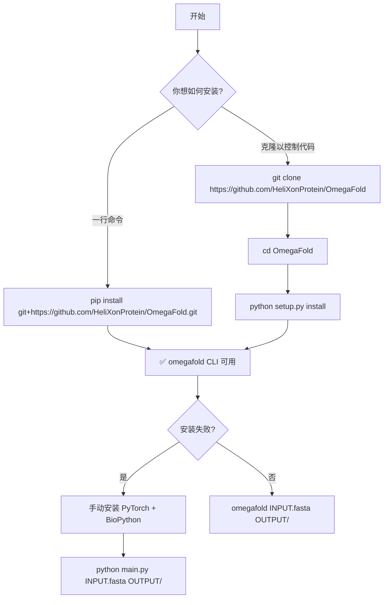
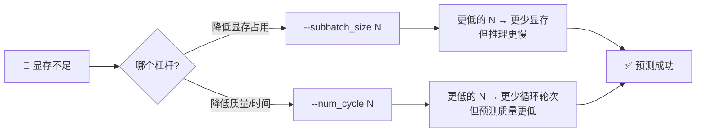

---
slug:2-quick-start
blog_type:normal
---


五7??2GB?D>=81@2655//-5E2&:$69E5!=, .,3*"+5分钟'$ 分钟内让 OmegaFold 跑起来 — 从安装到预测你的第一个蛋白质结构。本页将引导你完成每一个具体步骤：配置环境、安装软件包、准备输入、运行推理以及解读输出。无需深度学习专业知识。

## 前置要求

OmegaFold 的**依赖极简** — 仅需 PyTorch 和 BioPython — 但版本限制非常严格。安装前，请确认你的环境符合以下要求。

| 要求 | 规格 | 备注 |
|---|---|---|
| **Python** | 3.8、3.9 或 3.10 | **不**支持其他版本 |
| **PyTorch** | 1.12.0+cu113 | 通过 `setup.py` 绑定；CUDA 11.3 构建版本 |
| **BioPython** | 最新版 | 用于 PDB 文件 I/O |
| **GPU** | 支持 CUDA 的 NVIDIA GPU | 也支持 CPU 和 Apple MPS（速度较慢） |
| **GPU 显存** | 建议 ≥16 GB | A100 80 GB 最高可处理 4096 个残基 |

安装时，配置脚本会将 PyTorch 固定为 CUDA 11.3 的 wheel 包，因此系统中必须已安装兼容的 NVIDIA 驱动（≥465.19）。在 macOS 上，需安装**最新的 PyTorch nightly 版本**以启用 MPS（Apple Silicon）加速。

来源: [setup.py](setup.py#L7-L23), [requirements.txt](requirements.txt#L1-L3)

## 安装

有两条安装路径，请根据你的工作流选择合适的方式。



### 选项 A — 通过 pip 安装（推荐）

```bash
pip install git+https://github.com/HeliXonProtein/OmegaFold.git
```

此命令会全局注册 `omegafold` 控制台脚本，你可以在任何目录下调用它。

### 选项 B — 克隆并安装

```bash
git clone https://github.com/HeliXonProtein/OmegaFold
cd OmegaFold
python setup.py install
```

### 选项 C — 手动回退（若安装失败）

由于 OmegaFold 仅使用 PyTorch 和 BioPython，你完全可以跳过正式的安装流程：

```bash
pip install torch biopython   # 根据你的 CUDA 版本调整 torch 的安装
git clone https://github.com/HeliXonProtein/OmegaFold
cd OmegaFold
python main.py INPUT_FILE.fasta OUTPUT_DIRECTORY
```

这也是**推荐 macOS 用户使用的路径**，他们可能需要 PyTorch nightly 构建版本来支持 MPS。`main.py` 入口会直接委托给与 CLI 相同的 `main()` 函数。

来源: [README.md](README.md#L43-L94), [main.py](main.py#L1-L7), [setup.py](setup.py#L25-L38)

## 准备输入

OmegaFold 接受标准的 **FASTA 文件**作为输入。每个序列条目由一个标题行（以 `>` 或 `:` 为前缀）和随后的若干行氨基酸字母组成。单个 FASTA 文件可以包含多个序列 — OmegaFold 将为所有序列预测结构。

创建一个名为 `my_proteins.fasta` 的文件：

```fasta
>Protein_A
MKTAYIAKQRQISFVKSHFSRQLEERLGLIEVQAVYLQTFFIVQEFVVT
>Protein_B
GGGSGGGSGGGSGGGS
:Custom_Header_Protein
ACDEFGHIKLMNPQRSTVWY
```

**FASTA 文件的核心规则：**

| 规则 | 详情 |
|---|---|
| 标题前缀 | 必须以 `>` 或 `:` 开头 |
| 氨基酸字母 | 标准 20 种残基；未知残基映射为 `X`（索引 20） |
| 模糊代码 | `Z→E`、`B→D`、`U→C`（内部自动替换） |
| 间隔字符 | `-` 被视为未知（索引 21） |
| 多行序列 | 允许 — 连续的非标题行将被拼接 |
| 多条序列 | 允许 — 每条序列生成独立的输出 PDB 文件 |

来源: [pipeline.py](omegafold/pipeline.py#L93-L180)

## 运行你的第一次预测

### 基本命令

```bash
omegafold my_proteins.fasta output_results/
```

这样就完成了。OmegaFold 将会：

1. **首次运行时自动下载模型权重**（保存至 `~/.cache/omegafold_ckpt/model.pt`）
2. 从 FASTA 文件中**读取所有序列**，按长度排序（最短的优先）
3. 带置信度分数**预测 3D 结构**
4. 将每个序列的**写入一个 PDB 文件**至输出目录

### 从源码运行（未通过 pip 安装）

```bash
python main.py my_proteins.fasta output_results/
```

### 使用模型 2

OmegaFold 提供两种模型变体。模型 2 额外启用了一个结构嵌入器，并使用不同的预训练权重：

```bash
omegafold my_proteins.fasta output_results/ --model 2
```

来源: [omegafold/__main__.py](omegafold/__main__.py#L40-L98), [pipeline.py](omegafold/pipeline.py#L396-L412)

## 命令行选项

除了两个位置参数外，所有选项均为可选。以下是完整参考：

| 标志 | 默认值 | 类型 | 描述 |
|---|---|---|---|
| `input_file` | *(必填)* | 路径 | 输入 FASTA 文件的路径（支持 `~` 展开） |
| `output_dir` | *(必填)* | 路径 | PDB 文件的输出目录（若不存在则会创建） |
| `--model` | `1` | int | 模型变体：`1` 或 `2` |
| `--num_cycle` | `10` | int | 循环迭代次数（越多 = 质量越好，速度越慢） |
| `--subbatch_size` | *序列长度* | int | 用于内存-时间权衡的子批次大小（越低 = 显存占用越少，速度越慢） |
| `--device` | *自动检测* | str | 强制指定设备：`cuda`、`cpu`、`mps` 或 `cuda:N` |
| `--weights_file` | `~/.cache/omegafold_ckpt/model.pt` | str | 模型权重的本地路径 |
| `--weights` | S3 URL | str | 下载权重的 URL |
| `--num_pseudo_msa` | `15` | int | 每次循环生成的伪 MSA 行数 |
| `--pseudo_msa_mask_rate` | `0.12` | float | 伪 MSA 生成的掩码率 |
| `--allow_tf32` | `True` | bool | 在 Ampere+ GPU 上启用 TF32 以加速矩阵乘法 |

来源: [pipeline.py](omegafold/pipeline.py#L304-L392)

## 理解输出

对于 FASTA 文件中的每条序列，OmegaFold 会在输出目录中生成一个 **PDB 文件**。文件名源自 FASTA 标题（路径分隔符会被替换为 `-`）。

**每个 PDB 文件包含的内容：**

- **原子坐标** — atom14 表示中所有重原子的预测 3D 坐标
- **B 因子列** — 被重新用于保存 **pLDDT 置信度分数 × 100**（范围 0–100）。数值越高，表示预测越可信

置信度解读遵循标准的 pLDDT 评估尺度：

| pLDDT 范围 | 置信度水平 | 典型区域 |
|---|---|---|
| 90–100 | 极高 | 高度有序的核心，稳定的二级结构 |
| 70–90 | 可信 | 整体可靠的局部结构 |
| 50–70 | 较低 | 可能无结构或无序 |
| 0–50 | 极低 | 极可能无序或预测失败 |

来源: [pipeline.py](omegafold/pipeline.py#L183-L239), [omegafold/__main__.py](omegafold/__main__.py#L86-L93)

## 内存与性能调优

最常见的实际挑战是处理长序列时 GPU 显存不足。OmegaFold 提供了两个调节杠杆：



### 子批次大小 — 显存旋钮

`--subbatch_size` 控制单个注意力子批次中处理的残基对数量。默认值等于完整序列长度（速度最快，显存占用最大）。如果遇到 OOM（显存不足）：

1. 将子批次大小从默认值**减半**后重试
2. 继续减半，直到预测成功
3. 在 A100 80 GB 显存上，设置 `--subbatch_size 448` 可以处理高达 **4096 个残基**的序列

### 循环次数 — 质量旋钮

`--num_cycle` 控制循环迭代次数。更多循环通常会提升结构质量，但会增加运行时间。默认值 10 是一个很好的平衡；若进行探索性运行，将其减少至 4–6 可加快推理速度。

**示例：在显存受限的 GPU 上预测长序列**

```bash
omegafold long_protein.fasta results/ --subbatch_size 224 --num_cycle 6
```

来源: [README.md](README.md#L17-L34), [pipeline.py](omegafold/pipeline.py#L343-L357)

## 设备选择

OmegaFold 会按以下优先级自动检测最佳可用加速器：**CUDA → MPS → CPU**。你可以使用 `--device` 覆盖此设置：

| 命令 | 目标设备 |
|---|---|
| `omegafold ... --device cuda` | 第一个可用 GPU |
| `omegafold ... --device cuda:1` | 第二个 GPU |
| `omegafold ... --device mps` | Apple Silicon MPS |
| `omegafold ... --device cpu` | 仅使用 CPU（速度慢，无显存限制） |

<CgxTip>首次运行时，模型权重（约 1 GB）会从 AWS S3 下载到 `~/.cache/omegafold_ckpt/`。后续运行将从缓存中加载。若要使用自定义权重，请传入 `--weights_file /path/to/model.pt`。</CgxTip>

来源: [pipeline.py](omegafold/pipeline.py#L271-L301), [pipeline.py](omegafold/pipeline.py#L242-L268)

## 故障排除

| 问题 | 原因 | 解决方案 |
|---|---|---|
| `Python X.X is not supported` | Python 版本不在 3.8–3.10 范围内 | 使用 Python 3.8、3.9 或 3.10 |
| `Device cuda is not available` | CUDA/PyTorch 不匹配 | 重新安装正确 CUDA 版本的 PyTorch |
| 预测期间出现 `RuntimeError` | GPU 显存不足 | 降低 `--subbatch_size`（减半后重试） |
| 权重下载失败 | 网络/防火墙问题 | 手动下载：`wget <url>`，然后使用 `--weights_file` |
| CPU 推理缓慢 | CPU 本身速度较慢 | 使用 GPU；或降低 `--num_cycle` 以获得更快（但质量较低）的结果 |
| 未找到 `omegafold` 命令 | pip 安装未注册 | 改为在代码库根目录下使用 `python main.py` |

## 接下来去哪里

现在你已经能够预测结构了，接下来可以深入了解该流水线：

- **[输入和输出格式](3-input-and-output-formats)** — 详细的 FASTA 解析规则与 PDB 输出结构
- **[架构概览](4-architecture-overview)** — OmegaPLM、GeoFormer 和结构模块如何构成完整的流水线
- **[配置参考](13-configuration-reference)** — 每个模型组件的详尽参数参考
- **[内存优化策略](14-memory-optimization-strategies)** - 在有限显存中装载大蛋白质的高级技巧