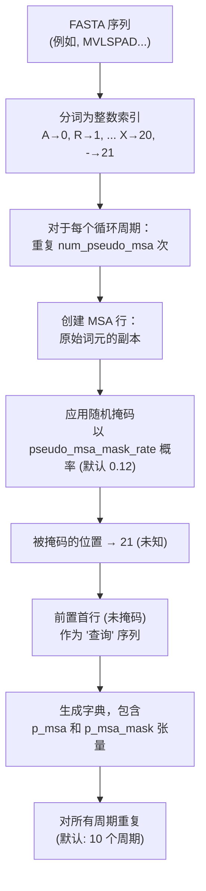
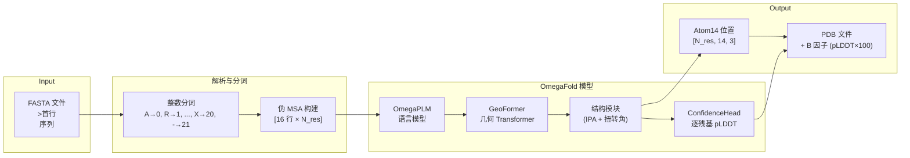

---
slug:3-input-and-output-formats
blog_type:normal
---


OmegaFold 通过两个定义明确的格式边界，在原始蛋白质序列与原子级分辨率的 3D 结构之间架起了桥梁：你提供的 **FASTA 输入**与模型生成的 **PDB 输出**。理解这些格式——包括它们的约束条件、两者之间发生的内部转换，以及置信度信息的编码方式——对于有效使用 OmegaFold 并正确解释其预测结果至关重要。

## 输入格式：FASTA 文件

OmegaFold 接受标准 **FASTA 格式**的蛋白质序列，这是生物信息学中最常见的文件格式之一。每个序列条目由一个以 `>` 或 `:` 为前缀的**首行**，以及随后的一行或多行氨基酸字母组成。解析器会将首行读取为链标识符（用于命名输出文件），并将后续所有非首行拼接成一个单一的序列字符串。

```
>protein_A
MVLSPADKTNVKAAWGKVGAHAGEYGAEALERMFLSFPTTKTYFPHFDL
SGSAQVKGHGKKVADALTNAVAHVDDMPNALSALSDLHAHKLRVDPVNFK
:protein_B
MKVAPVLGFTAVHPVIEQVNGRFAQYYVEQGPAEAAVLKTGAK
```

首行前缀决定了输出文件名——对于上面的示例，OmegaFold 会在输出目录中生成 `protein_A.pdb` 和 `protein_B.pdb`。当首行超过文件系统的名称长度限制（通过 `os.pathconf` 检测）时，OmegaFold 会回退到诸如 `0th chain.pdb` 这样的通用名称。序列在处理前会**按长度排序**（最短的优先），这可能会影响预测结果出现的顺序。

来源：[pipeline.py](omegafold/pipeline.py#L118-L180)，[__main__.py](omegafold/__main__.py#L57-L67)

### 支持的氨基酸字符

OmegaFold 根据其内部的 22 符号字母表对每个残基字符进行分词：**20 种标准氨基酸**（索引 0–19）、代表未知残基的 **X**（索引 20），以及代表缺口的 **`-`**（索引 21，在掩码处理时与 X 同等对待）。在分词之前，三个模糊的 IUPAC 编码会进行自动替换：

| 模糊编码 | 映射为 | 原因 |
|---|---|---|
| **Z** (Glu/Gln) | **E** (Glu) | 选择谷氨酸作为代表 |
| **B** (Asp/Asn) | **D** (Asp) | 选择天冬氨酸作为代表 |
| **U** (硒半胱氨酸) | **C** (Cys) | 以半胱氨酸作为最接近的结构类似物 |

任何不属于 20 种标准氨基酸的字符都将被映射到索引 20 的 **X**（未知）。硬断言保证所有词元都落在有效范围 0–21 内；包含完全无法识别字符的序列将在输入时报错。

来源：[pipeline.py](omegafold/pipeline.py#L150-L157)，[residue_constants.py](omegafold/utils/protein_utils/residue_constants.py#L374-L385)

### 从 FASTA 到伪 MSA：内部输入转换

OmegaFold 并不直接将原始 FASTA 序列输入模型。相反，`fasta2inputs` 会构建一个**伪多重序列比对（pseudo-MSA）**——一种合成 MSA，用于模拟进化耦合信息，而无需进行真实的 MSA 数据库搜索。这是 OmegaFold 的一项核心架构决策。转换过程如下：



每条链最终生成的数据结构是一个**字典列表**（每个循环周期对应一个字典），每个字典包含：

| 键 | 形状 | 描述 |
|---|---|---|
| `p_msa` | `[num_pseudo_msa + 1, num_res]` | 分词后的 MSA。第 0 行是未掩码的查询序列；第 1–N 行是随机掩码后的副本。 |
| `p_msa_mask` | `[num_pseudo_msa + 1, num_res]` | 二进制掩码。第 0 行全为 1（查询始终有效）；第 1–N 行指示未掩码的位置。 |

在默认设置下（`num_pseudo_msa=15`、`pseudo_msa_mask_rate=0.12`、`num_cycle=10`），每条链生成 10 个周期输入，每个周期包含一个 16 行的伪 MSA（1 行查询 + 15 行掩码副本）。掩码操作**默认是确定性的**——以序列长度为种子的 `torch.Generator` 确保了对于相同输入，不同运行间的结果可复现。

<CgxTip>伪 MSA 是使 OmegaFold 成为**单序列预测器**的核心创新：与需要从序列数据库中获取真实 MSA 的 AlphaFold2 不同，OmegaFold 通过 OmegaPLM 语言模型在内部合成 MSA。`num_pseudo_msa` 和 `pseudo_msa_mask_rate` 参数控制着这种合成信号的丰富度。</CgxTip>

来源：[pipeline.py](omegafold/pipeline.py#L93-L180)，[model.py](omegafold/model.py#L153-L165)

## 输出格式：PDB 文件

对于输入 FASTA 中的每条链，OmegaFold 会向输出目录写入一个 **PDB 文件**。PDB 格式是结构生物学中用于原子坐标的标准格式，OmegaFold 的输出与下游工具（PyMOL、Chimera、Rosetta 等）完全兼容。

### 坐标表示：Atom14

OmegaFold 的结构模块以 **atom14 表示**生成坐标——这是一种紧凑的逐残基编码，为每种氨基酸类型分配最多 14 个原子槽位。这比完整的 atom37 表示（为所有残基中每种可能的原子名称都分配一个槽位）更密集，但比 atom14 常见的替代方案更明确。从残基类型到 atom14 名称的映射定义在 `restype_name_to_atom14_names` 中：

| 残基 | Atom14 原子（非空槽位） | 数量 |
|---|---|---|
| GLY | N, CA, C, O | 4 |
| ALA | N, CA, C, O, CB | 5 |
| SER | N, CA, C, O, CB, OG | 6 |
| VAL | N, CA, C, O, CB, CG1, CG2 | 7 |
| TRP | N, CA, C, O, CB, CG, CD1, CD2, NE1, CE2, CE3, CZ2, CZ3, CH2 | 14 |
| UNK | *(全为空)* | 0 |

空的原子槽位（在名称列表中表示为 `""`）会被直接省略，不写入 PDB 输出——`save_pdb` 函数仅写入名称为非空字符串的原子。这意味着 PDB 文件精确包含了每种残基类型具有物理意义的原子。

来源：[residue_constants.py](omegafold/utils/protein_utils/residue_constants.py#L300-L368)，[pipeline.py](omegafold/pipeline.py#L183-L239)

### 置信度分数作为 B 因子

OmegaFold 将逐残基的置信度编码为 PDB 文件中的 **B 因子**（也称为温度因子）。这也是 AlphaFold2 使用的标准惯例。流水线在写入前会将原始 pLDDT 置信度值乘以 100：

```python
b_factors = output["confidence"] * 100
```

pLDDT（预测局部距离差异测试）分数在输出 PDB 中的范围为 **0 到 100**，其中：

| pLDDT 范围 | 置信度水平 | 典型解释 |
|---|---|---|
| 90–100 | 极高 | 实验级质量的骨架，可靠的侧链 |
| 70–90 | 较高 | 总体良好的骨架，部分侧链存在不确定性 |
| 50–70 | 较低 | 不可靠——可能是无序或未结构化的区域 |
| 0–50 | 极低 | 可能是无序的；不要信任该预测 |

pLDDT 由 `ConfidenceHead` 模块按残基计算，该模块对分桶的逻辑值应用 softmax，并计算期望的分桶中心——这与 AlphaFold2 的方法直接类似。系统还会通过 `get_all_confidence` 计算一个**整体置信度**分数，该方法以 15Å 内 Cα 邻居的数量为权重，聚合逐残基的 pLDDT 值。此整体分数在内部用于在循环迭代中选择最佳预测。

来源：[pipeline.py](omegafold/pipeline.py#L86-L93)，[confidence.py](omegafold/confidence.py#L39-L117)

### PDB 文件结构细节

`save_pdb` 函数使用 BioPython 的 `StructureBuilder` 构建 PDB 文件，遵循以下约定：

- **结构 ID**：`0`
- **模型 ID**：可通过 `model` 参数配置（默认为 `0`）
- **链 ID**：`A`（可通过 `init_chain` 配置）
- **残基编号**：从 0 开始顺序编号，与输入序列顺序一致
- **插入码**：空格字符（`" "`）
- **占用率**：所有原子均为 `1.0`
- **元素**：原子名称的首字符（例如，氮为 `N`，碳为 `C`）

掩码值为 `False` 或氨基酸索引为 21（未知/缺口）的残基会被**跳过**——它们根本不会出现在输出 PDB 中。这确保了 PDB 仅包含有效的、已预测的残基。

来源：[pipeline.py](omegafold/pipeline.py#L208-L239)

## 完整数据流总结

下图展示了从 FASTA 输入到 PDB 输出的端到端转换，包括所有中间表示：



## CLI 输入/输出参数

两个位置参数和关键的格式相关标志汇总如下：

| 参数 | 类型 | 默认值 | 描述 |
|---|---|---|---|
| `input_file` | 位置参数 | — | 输入 FASTA 文件的路径（支持 `~` 展开） |
| `output_dir` | 位置参数 | — | 输出 PDB 文件的目录（若不存在则创建；支持 `~` 展开） |
| `--num_pseudo_msa` | int | 15 | 伪 MSA 的行数（不含查询行） |
| `--pseudo_msa_mask_rate` | float | 0.12 | 每行伪 MSA 中被掩码残基的比例 |
| `--num_cycle` | int | 10 | 循环迭代次数（每次产生一个完整的伪 MSA 输入） |

输出目录结构与输入相对应：每个 FASTA 首行成为 `output_dir` 中的一个 `.pdb` 文件名。如果 `output_dir` 不存在，则会自动创建。

来源：[pipeline.py](omegafold/pipeline.py#L304-L429)，[README.md](README.md#L62-L119)

## 常见陷阱与提示

- **多行序列**：FASTA 解析器能正确处理分散在多行的序列——首行之后的所有非首行都会被拼接。然而，序列内部绝不能出现空行。
- **小写字母**：所有序列字符在分词前都会被转换为**大写**，因此小写输入是有效的。
- **缺口字符**：`-` 字符被视为未知（索引 21），并在输出 PDB 中被掩码排除。这对于输入带有缺口的已比对序列非常有用。
- **输出覆盖**：如果输出目录中已存在同名 PDB 文件，它将被静默覆盖。
- **内存与超长序列**：序列按长度排序（最短的优先）。如果长序列导致内存不足错误，OmegaFold 会记录该失败并跳至下一条链，而不会崩溃。

<CgxTip>要检查预测结果的逐残基置信度，可在任意分子查看器中加载 PDB 文件并按 B 因子着色。B 因子低于 50（pLDDT < 0.5）的区域应被视为无序——这些区域通常对应于模型具有低确定性的本质上未结构化区域或环。</CgxTip>

来源：[pipeline.py](omegafold/pipeline.py#L120-L134)，[__main__.py](omegafold/__main__.py#L73-L82)

---

**下一步**：现在你已经了解了输入与输出的内容，接下来可以探索 OmegaFold 如何将伪 MSA 转换为原子坐标，详见[架构概述](4-architecture-overview)；或者深入了解驱动单序列方法的语言模型，详见[OmegaPLM 语言模型](5-omegaplm-language-model)。关于伪 MSA 掩码率和循环次数如何影响预测质量的详细信息，请参阅[循环与迭代优化](11-recycling-and-iterative-refinement)和[置信度估计 (pLDDT)](12-confidence-estimation-plddt)。