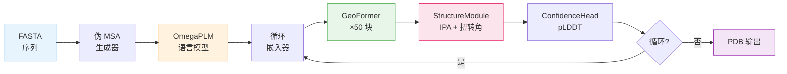
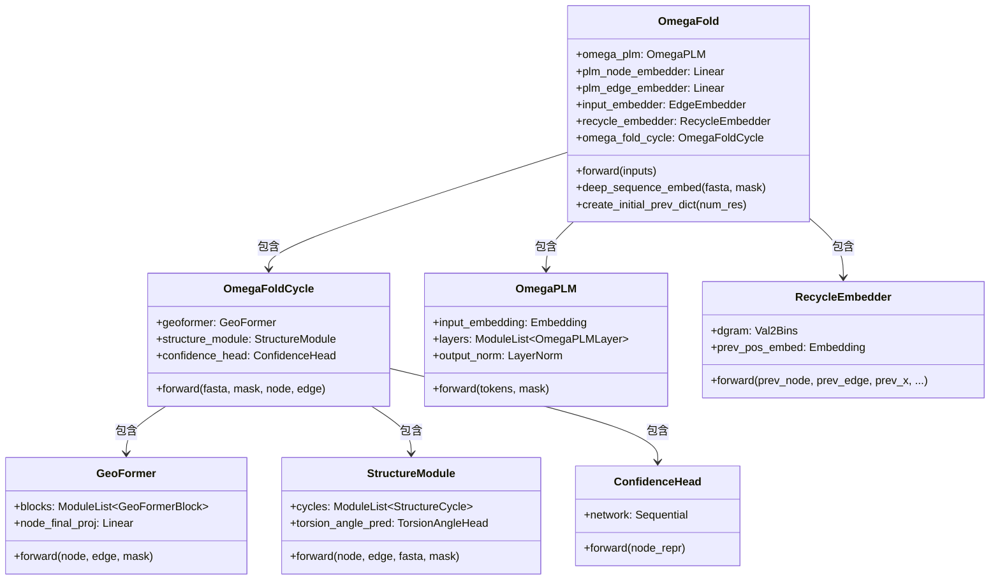

---
slug:4-architecture-overview
blog_type:normal
---


OmegaFold 是一个蛋白质结构预测系统，它通过深度迭代的多阶段神经架构，将氨基酸序列直接映射到三维原子坐标。与 AlphaFold2 依赖从大型序列数据库中提取的共进化 MSA 输入不同，OmegaFold 仅使用**单序列蛋白质语言模型**，结合几何 Transformer 和不变点注意力（IPA）结构解码器，即可实现极具竞争力的准确率。这一架构决策消除了 MSA 搜索的计算瓶颈，从而实现更快的推理速度，且无需依赖外部数据库。系统通过四个主要阶段处理 FASTA 输入——嵌入、语言建模、几何推理和结构解码——并在多次循环迭代中重复执行，以迭代优化表征与三维坐标。

来源: [model.py](omegafold/model.py#L118-L134), [__main__.py](omegafold/__main__.py#L40-L98)

## 高层数据流

端到端推理流程通过以下阶段将原始氨基酸序列转换为 PDB 文件。在顶层，`model.py` 中的 `OmegaFold` 类统筹整个计算过程：它首先运行预训练的 OmegaPLM 语言模型，以提取逐残基（节点）和成对（边）表征，随后进入循环回路，在每次迭代中，将前一轮的预测结果反馈给 GeoFormer 主干网络和 StructureModule 解码器。最终选择具有最高置信度得分（基于 pLDDT）的循环作为输出结果。



每次循环迭代从前一轮接收四个反馈信号：节点表征（`prev_node`）、边表征（`prev_edge`）、atom14 坐标（`prev_x`）和骨架帧（`prev_frames`）。在首次循环中，这些信号被初始化为零和恒等帧，随后在后续迭代中逐步携带结构先验信息。

来源: [model.py](omegafold/model.py#L153-L203), [model.py](omegafold/model.py#L236-L264)

## 核心架构组件

OmegaFold 模型由五个紧密集成的组件构成，每个组件位于独立的模块文件中。下表总结了它们的功能、输入/输出签名以及配置驱动的超参数。

| 组件 | 模块文件 | 主要功能 | 输入 | 输出 |
|-----------|------------|--------------|-------|--------|
| **OmegaPLM** | `omegaplm.py` | 单序列蛋白质语言模型 | 分词序列 + 掩码 | 节点表征 `[N, 1280]`，边表征 `[N, N, 66]` |
| **GeoFormer** | `geoformer.py` | 几何 Transformer 主干网络 | 节点 + 边表征 | 更新后的节点 + 边表征 |
| **StructureModule** | `decode.py` | 基于 IPA 的三维坐标解码 | 节点 + 边表征 + 帧 | Atom14 位置 `[N, 14, 3]` |
| **ConfidenceHead** | `confidence.py` | 逐残基 pLDDT 预测 | 最终节点表征 | pLDDT 分数 `[N]` |
| **RecycleEmbedder** | `embedders.py` | 反馈信号整合 | 上一轮循环输出 | 增强后的节点 + 边表征 |

来源: [omegaplm.py](omegafold/omegaplm.py#L162-L219), [geoformer.py](omegafold/geoformer.py#L140-L180), [decode.py](omegafold/decode.py#L316-L392), [confidence.py](omegafold/confidence.py#L124-L146), [embedders.py](omegafold/embedders.py#L347-L408)

## 组件交互图

下图说明了单个 `OmegaFoldCycle` 内的类组合与方法调用关系。`OmegaFold` 父类持有 `omega_plm` 和 `OmegaFoldCycle`，而 `OmegaFoldCycle` 本身又组合了 `GeoFormer`、`StructureModule` 和 `ConfidenceHead`。箭头指示 forward 方法的调用方向和数据流。



来源: [model.py](omegafold/model.py#L52-L112), [model.py](omegafold/model.py#L118-L134)

## OmegaFoldCycle：内循环架构

单个 **OmegaFoldCycle** 封装了从几何到结构的核心转换过程。给定（已由语言模型和循环嵌入器丰富的）节点和边表征，它将依次经历三个阶段：(1) GeoFormer 通过 50 个交错的注意力、过渡和几何注意力块来精炼表征；(2) StructureModule 通过基于迭代 IPA 的骨架帧更新和扭转角预测来解码三维坐标；(3) ConfidenceHead 生成逐残基的 pLDDT 估计值。该循环返回结构输出（atom14 位置、帧、掩码）以及携带下一次循环迭代反馈信号的 `prev_dict`。

`model.py` 中的 `OmegaFoldCycle.forward` 方法明确展示了这一数据流：GeoFormer 的输出被拆分为循环路径的节点表征和结构路径的节点表征（通过 `node_final_proj` 投影），StructureModule 消耗投影后的节点及边表征，而 ConfidenceHead 则对最终的节点表征进行评分。

来源: [model.py](omegafold/model.py#L52-L112), [geoformer.py](omegafold/geoformer.py#L43-L180)

## 表征轨道：节点与边

两条并行的**表征轨道**贯穿整个架构，类似于 AlphaFold2 的配对和 MSA 表征，但具有根本不同的语义：

- **节点表征**（`node_repr`）：维度为 `node_dim=256` 的逐残基特征向量。它编码每个氨基酸的局部化学和结构上下文。此轨道由 OmegaPLM 初始化，经循环机制丰富，并最终被 StructureModule 消耗。

- **边表征**（`edge_repr`）：形状为 `[num_res, num_res, edge_dim]`（其中 `edge_dim=128`）的成对特征张量。它捕获残基对之间的关系信息——距离先验、接触模式和几何约束。此轨道由 OmegaPLM 的聚合注意力图加上 `EdgeEmbedder`（相对位置编码 + 氨基酸对嵌入）进行初始化，随后由 GeoFormer 块精炼。

`deep_sequence_embed` 方法统筹此初始化过程：OmegaPLM 生成维度为 1280 的原始节点特征和维度为 66 的边特征，随后通过 `plm_node_embedder` 和 `plm_edge_embedder` 分别将其投影到目标维度 256 和 128，并在投影前应用层归一化。

来源: [model.py](omegafold/model.py#L205-L234), [config.py](omegafold/config.py#L46-L111)

## 伪 MSA：无需数据库的序列多样性

一项关键的架构创新是**伪 MSA 生成**策略。OmegaFold 并不查询外部数据库以寻找同源序列，而是通过以 12% 的比率（`mask_rate=0.12`）随机掩码输入序列，在每个循环周期中生成 `num_pseudo_msa=15` 个掩码变体，从而构建出一个合成 MSA。每个变体将掩码位置替换为未知词元（索引 21），以此模拟真实 MSA 所提供的进化多样性。伪 MSA 的形状为 `[num_pseudo_msa + 1, num_res]`，其中第一行为未掩码的原始序列。

此方法在 `pipeline.fasta2inputs` 中实现，它生成 `num_cycle` 组伪 MSA（每次循环迭代一组），每组均具有独立绘制的掩码。当 `deterministic=True` 时，使用设定种子的随机生成器以确保可复现性。

来源: [pipeline.py](omegafold/pipeline.py#L93-L180), [config.py](omegafold/config.py#L57-L58)

## 循环与迭代精炼

循环机制是驱动逐步精炼的外层循环。在 `num_cycle=10` 次迭代中（可通过 `--num_cycle` 配置），完整的 OmegaFoldCycle 会使用上一轮迭代的反馈（通过 `RecycleEmbedder` 注入）重新执行。该嵌入器将三个反馈信号添加至当前循环的表征中：

1. **上一轮节点表征**：通过 LayerNorm 添加至当前节点轨道，携带来自上一轮已学习的结构上下文。
2. **上一轮边表征**：通过 LayerNorm 添加至当前边轨道，传播成对的结构先验。
3. **上一轮位置距离直方图**：由上一轮的伪 beta 坐标计算出的残基间距离，通过 `Val2Bins` 进行分箱并嵌入，为边轨道提供显式的几何先验。

对于模型变体 2（`struct_embedder=True`），额外的 `PairStructEmbedder` 将来自上一轮循环 atom14 位置和 8 帧表征的细粒度结构信息编码至边轨道中，包括成对距离分箱和局部帧坐标分箱。

所有循环完成后，选择具有最高总体 pLDDT 置信度得分的迭代作为最终预测，实现最佳 N 选一策略。

来源: [model.py](omegafold/model.py#L159-L203), [embedders.py](omegafold/embedders.py#L347-L408), [confidence.py](omegafold/confidence.py#L39-L93)

## 配置与模型变体

OmegaFold 通过 `make_config(model_idx)` 支持两种模型变体，主要通过 `struct_embedder` 标志进行区分：

| 参数 | 模型 1 | 模型 2 | 描述 |
|-----------|---------|---------|-------------|
| `struct_embedder` | `False` | `True` | 在循环中启用 `PairStructEmbedder` |
| `node_dim` | 256 | 256 | 节点表征维度 |
| `edge_dim` | 128 | 128 | 边表征维度 |
| `geo_num_blocks` | 50 | 50 | GeoFormer Transformer 块数 |
| `plm.node` | 1280 | 1280 | OmegaPLM 隐藏层维度 |
| `plm.edge` | 66 | 66 | OmegaPLM 层数（= 边维度） |
| `struct.num_cycle` | 8 | 8 | IPA 结构循环次数 |
| `struct.num_head` | 12 | 12 | IPA 注意力头数 |
| `struct.node_dim` | 384 | 384 | StructureModule 节点维度 |

模型 2 的 `PairStructEmbedder` 编码了来自上一轮循环的原子级几何细节——包括分箱至 64 个连续区间的成对原子距离、分箱至 64 个位置区间的局部帧坐标，以及氨基酸对嵌入——从而以额外的内存和计算开销为代价，提供了更丰富的结构先验。

来源: [config.py](omegafold/config.py#L43-L111), [embedders.py](omegafold/embedders.py#L225-L345)

## 项目结构

```
omegafold/
├── __init__.py          # 包初始化，导出 OmegaFold & make_config
├── __main__.py          # 入口点：模型构建 + 推理循环
├── confidence.py        # ConfidenceHead (pLDDT) + 聚合评分
├── config.py            # 静态配置 (make_config)
├── decode.py            # StructureModule, IPA, TorsionAngleHead
├── embedders.py         # EdgeEmbedder, RoPE, RelPos, RecycleEmbedder, StructEmbedder
├── geoformer.py         # GeoFormer 主干网络 (50 块)
├── model.py             # OmegaFold + OmegaFoldCycle (顶层统筹)
├── modules.py           # 可复用神经构建块 (Attention, Transition, 等)
├── omegaplm.py          # OmegaPLM 语言模型 (GAU 层)
├── pipeline.py          # I/O：FASTA 解析，PDB 保存，CLI 参数，权重加载
└── utils/
    ├── __init__.py
    ├── protein_utils/   # 残基常量，氨基酸映射
    └── torch_utils.py   # 几何工具 (AAFrame, 归一化, 掩码)
```

来源: [model.py](omegafold/model.py#L1-L38), [pipeline.py](omegafold/pipeline.py#L1-L42)

## 与 AlphaFold2 的关键设计差异

将 OmegaFold 的架构与 AlphaFold2 进行对比最能加深理解：OmegaFold 从中汲取了重要灵感，但在关键之处有所分野：

| 方面 | AlphaFold2 | OmegaFold |
|--------|-----------|-----------|
| **序列输入** | 来自 HHblits/Jackhmmer 的真实 MSA | 伪 MSA（掩码单序列） |
| **语言模型** | 无（仅有 MSA + 配对表征） | OmegaPLM（基于 GAU，66 层） |
| **主干网络** | Evoformer（48 块，MSA+配对注意力） | GeoFormer（50 块，节点+边+几何注意力） |
| **位置编码** | 相对位置嵌入 | RoPE（旋转位置嵌入） |
| **结构解码器** | IPA + 骨架更新 + 扭转角 | IPA + 骨架更新 + 扭转角（相同） |
| **循环反馈** | 上一轮 MSA + 配对表征 + 位置 | 上一轮节点 + 边表征 + 位置 + 帧 |
| **置信度** | pLDDT + PAE | 仅 pLDDT |
| **外部依赖** | MSA 搜索数据库 | 无 |

最具决定性的分野在于用预训练语言模型替代了真实的 MSA 输入。OmegaPLM 在预训练期间学习进化模式，并在推理时将其编码至节点和边表征中，从而消除了运行时数据库搜索的需要。OmegaPLM 内部的 GAU（门控注意力单元）架构进一步区别于标准的多头注意力，它将查询-键-值计算融合进带有 SiLU 门控的单次投影中，实现了更高的参数效率。

<CgxTip>`deep_sequence_embed` 方法在对 OmegaPLM 输出进行线性投影前应用了**层归一化**——这是一个微妙但重要的设计选择，它稳定了从语言模型的 1280 维空间到 GeoFormer 的 256 维节点空间的表征转移。此归一化通过 `utils.normalize`（原地操作）及随后的 `plm_node_embedder` / `plm_edge_embedder` 线性层实现。</CgxTip>

<CgxTip>`modules.attention` 中的**子批处理**机制将查询维度切分为 `subbatch_size` 大小的块，独立地针对完整的键值集处理每个块。这是主要的内存优化策略：降低 `subbatch_size` 会减少 GPU 峰值内存，代价是增加额外的内核启动。它由 `--subbatch_size` CLI 参数控制，并通过 `fwd_cfg` 传递至模型中的每次注意力调用。</CgxTip>

来源: [model.py](omegafold/model.py#L205-L234), [omegaplm.py](omegafold/omegaplm.py#L56-L118), [modules.py](omegafold/modules.py#L104-L164)

## 下一步

现在你已了解整体架构，可以深入探索各个组件：

- **[OmegaPLM 语言模型](5-omegaplm-language-model)** — 替代 MSA 输入的基于 GAU 的预训练语言模型
- **[GeoFormer Transformer](6-geoformer-transformer)** — 具备行、列和几何注意力的 50 块几何主干网络
- **[结构模块与 IPA](7-structure-module-and-ipa)** — 不变点注意力与扭转角解码
- **[循环与迭代精炼](11-recycling-and-iterative-refinement)** — 反馈信号如何驱动渐进式精度提升
- **[内存优化策略](14-memory-optimization-strategies)** — 子批处理及其他内存节省技术