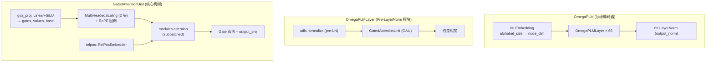

---
slug:5-omegaplm-language-model
blog_type:normal
---


**OmegaPLM** 是 OmegaFold 流程核心的蛋白质语言模型主干网络——一个预训练编码器，将原始氨基酸 token 序列转换为丰富的逐残基（节点）和成对（边）表示。与传统的多头自注意力 Transformer 不同，OmegaPLM 基于 **门控注意力单元 (Gated Attention Units, GAU)** 构建，这是一种单头注意力变体，它将门控、投影和相对位置编码融合到一个精简的模块中。最终形成一个 66 层的编码器，生成供下游 [GeoFormer Transformer](6-geoformer-transformer) 使用的序列和成对表示。

## 架构概述

OmegaPLM 遵循三层类继承结构，每一层封装了不同级别的抽象：



**数据流**：输入 token → 嵌入查找 → 66 个带有残差连接的堆叠 GAU 层 → 输出 LayerNorm → (node, edges) 元组。

来源：[omegaplm.py](/omegafold/omegaplm.py#L162-L219), [modules.py](/omegafold/modules.py#L104-L164)

## GatedAttentionUnit — 核心机制

`GatedAttentionUnit` 是每个 OmegaPLM 层的计算引擎。它摒弃了标准的 Q/K/V 投影模式，通过单一融合线性投影后接 SiLU 激活函数，生成 **门控**、**值** 和 **基础** 向量：

```
[gates, values, base] = SiLU(Linear(node))  →  拆分为 (proj_dim, proj_dim, attn_dim)
```

随后，`base` 张量通过具有 2 个头的 `MultiHeadedScaling` 被拆分为 **查询** 和 **键**。关键的是，**旋转位置嵌入** 作为回调 (`on_out_ready`) 直接注入到 `MultiHeadedScaling` 内部，因此查询和键在进入注意力内核之前就已经进行了旋转编码。这种设计确保了位置信息融入注意力 logits 中，而无需为 Q 和 K 添加独立的位置偏置项。

注意力计算本身接收：

| 输入 | 来源 | 用途 |
|-------|--------|---------|
| `query`, `key` | MultiHeadedScaling + RoPE | 内容与位置混合的 Q 和 K |
| `value` | 直接来自 gva_proj 拆分 | 待聚合的信息 |
| `scale` | `_get_qk_scaling` (依赖序列长度) | 按序列长度进行 Logit 缩放 |
| `bias` | `mask2bias` + `RelPosEmbedder` | 掩码 + 相对位置偏置 |

输出按元素进行门控（`node = attention_output * gates`），然后通过 `output_proj` 投影回节点维度。这种门控机制允许模型按特征通道动态抑制或放大注意力输出——这是对标准线性输出投影的一种更具表达力的替代方案。

来源：[omegaplm.py](/omegafold/omegaplm.py#L56-L118), [embedders.py](/omegafold/embedders.py#L141-L200)

## Pre-LayerNorm 和残差结构

每个 `OmegaPLMLayer` 实现了 **pre-LayerNorm** 配置——即在 GAU 计算之前应用归一化，而非之后：

```
shortcut = node
node = normalize(node)          # pre-LayerNorm (无权重)
node, edge = GAU(node, ...)     # 核心计算
node = node + shortcut          # 残差连接
```

所使用的归一化是 **无权重 LayerNorm**（无可学习的 γ/β 参数），通过调用 `F.layer_norm` 并将 weight 和 bias 设为 `None` 的 `utils.normalize` 实现。此设计选择减少了参数量，并与在深度 Transformer 编码器中观察到的 pre-norm 训练稳定性优势相一致。

来源：[omegaplm.py](/omegafold/omegaplm.py#L121-L159), [torch_utils.py](/omegafold/utils/torch_utils.py#L53-L83)

## 依赖序列长度的 QK 缩放

OmegaPLM 采用了源自 Su 等人理论分析的 **序列长度感知的 logit 缩放** 策略（参考自 `kexue.fm/archives/8823`）。缩放因子计算如下：

```
scale = log(clamp(N, min=4e-5)) / (log(512) × √attn_dim)
```

其中 `N` 是有效（未掩码）残基的数量。该公式用考虑了随序列长度增加而导致的注意力 logits 熵增的缩放，取代了标准的 `1/√d` 缩放。其实际效果是 **较长的序列获得更平缓的注意力分布**，从而防止所有权重集中在少数位置上的注意力崩塌现象。

缩放因子被广播为 `[..., 1, 1]` 形状，因此它在一个序列内的所有查询-键对中均匀应用。

来源：[omegaplm.py](/omegafold/omegaplm.py#L39-L50)

## 用于微调的 Token Dropout 缩放

当 OmegaPLM 处理掩码输入时（如推理期间的伪 MSA 方案），会对嵌入的 token 应用一个 **补偿性缩放** 因子，以抵消由掩码引起的分布偏移。遵循 Rives 等人 (2021) 的方法，缩放公式为：

```
scale = (1 - masked_ratio_train) / (1 - masked_ratio_observed)
```

其中 `masked_ratio_train` 是训练时的掩码率（默认 0.12），`masked_ratio_observed` 是推理时实际观察到的掩码率。索引等于 21 的 token 被计为掩码。当所有 token 均被掩码时，保护机制将观察到的比率钳制为 0.99，以防止除零错误。这确保了即使掩码模式与训练时不同，嵌入仍能保持在原有分布上。

来源：[omegaplm.py](/omegafold/omegaplm.py#L222-L243)

## 输出：节点和边表示

OmegaPLM 产生两个输出，作为所有下游处理的基础：

- **节点表示** — 形状为 `[seq_len, 1280]`。一种逐残基嵌入，捕获来自完整序列的上下文信息。在最终的 `output_norm` LayerNorm 之后生成。
- **边表示** — 形状为 `[66, seq_len, seq_len]`。一堆成对的注意力图，每层一个。每层的边是批次维度上的 **求和规约的注意力 logits**（通过 `edge_reduction='sum'`）。在所有层之后，边在批次维度上求平均：`edges /= (mask.any(-1).sum() + 1e-5)`。

边表示尤其值得注意——OmegaPLM 不是从外积构造成对特征，而是从每一层 **直接提取注意力矩阵**。这些矩阵捕获了模型在每个深度最强烈关注哪些残基对，提供了丰富的类进化耦合信号。

来源：[omegaplm.py](/omegafold/omegaplm.py#L184-L219)

## 配置和默认参数

OmegaPLM 在 `cfg.plm` 命名空间下进行配置。下表列出了所有参数及其默认值：

| 参数 | 默认值 | 描述 |
|-----------|---------|-------------|
| `alphabet_size` | 23 | Token 词表大小 (20 种氨基酸 + 间隔 + 未知 + 掩码) |
| `node` | 1280 | 节点（逐残基）嵌入维度 |
| `padding_idx` | 21 | 嵌入填充索引 (间隔 token) |
| `edge` | 66 | GAU 层数 (也是边输出堆叠大小) |
| `proj_dim` | 2560 | 门控和值投影维度 (2 × node) |
| `attn_dim` | 256 | 注意力 Q/K 维度 |
| `num_head` | 1 | 在当前 GAU 设计中未使用 (遗留参数) |
| `num_relpos` | 129 | 相对位置嵌入词表大小 |
| `masked_ratio` | 0.12 | 训练时的 token 掩码率 |

<CgxTip>`proj_dim` 为 2560 (2×node) 意味着 GVA 投影在 SiLU 拆分之前总共输出 `2560 + 2560 + 256 = 5376` 个通道。这个单一的大型投影替代了标准注意力的三个独立 Q/K/V 线性层，减少了内核启动开销，同时增加了每层的参数量。</CgxTip>

来源：[config.py](/omegafold/config.py#L48-L58)

## 集成至 OmegaFold 流程

在 `OmegaFold.deep_sequence_embed` 中，OmegaPLM 的输出通过两个投影步骤桥接到下游的 [GeoFormer Transformer](6-geoformer-transformer)：

1. **节点投影**：`plm_node_embedder` — 一个线性层，将 `1280 → 256` (node_dim) 映射，在无权重归一化之后应用。
2. **边投影**：`plm_edge_embedder` — 一个线性层，将边张量从 `[layers, seq, seq]` 重排为 `[seq, seq, layers]` 并归一化后，映射 `66 → 128` (edge_dim)。

投影之后，`EdgeEmbedder` 进一步用氨基酸对嵌入和相对位置编码增强边表示。这种从 PLM 的高维空间 (1280/2560) 到 GeoFormer 工作空间 (256/128) 的降维是一个经过深思熟虑的设计——PLM 在编码期间提取最大的表征能力，而结构模块则在更精简的、聚焦于几何的空间中运行。

<CgxTip>边重排 `.permute(1, 2, 0)` 将层堆叠的注意力图重新排列为逐对特征向量，允许线性投影学习 *所有层注意力模式的压缩摘要*，而不是独立处理每一层。</CgxTip>

来源：[model.py](/omegafold/model.py#L205-L234), [model.py](/omegafold/model.py#L126-L133)

## 对比：GAU 与标准多头注意力

| 方面 | 标准多头注意力 (MHA) | OmegaPLM GAU |
|--------|-------------|--------------|
| 投影 | 3 个独立的线性层 (Q, K, V) | 1 个融合线性层 + 拆分 |
| 门控 | 可选 (通常缺失) | 必需 (SiLU 门控输出) |
| 位置编码 | 加至 Q/K 或作为偏置 | Q/K 上应用 RoPE + RelPos 偏置 |
| 输出 | 线性投影 | 门控乘法 + 线性投影 |
| 头数 | 多个 (通常为 4–16) | 2 (仅用于 Q/K 拆分) |
| QK 缩放 | `1/√d` (常数) | `log(N) / (log(512)·√d)` (长度自适应) |
| 边输出 | 通常不产生 | 每层提取注意力 logits |
| 归一化 | Post-LN 或 Pre-LN | Pre-LN (无权重) |

来源：[omegaplm.py](/omegafold/omegaplm.py#L56-L118), [modules.py](/omegafold/modules.py#L69-L101)

---

**下一步**：了解 OmegaPLM 的节点和边输出如何由 [GeoFormer Transformer](6-geoformer-transformer) 处理，以细化用于结构解码的成对表示。有关驱动 GAU 注意力的神经构建块，请参见 [注意力与子批处理](8-attention-and-subbatching) 和 [嵌入与 RoPE](9-embeddings-and-rope)。