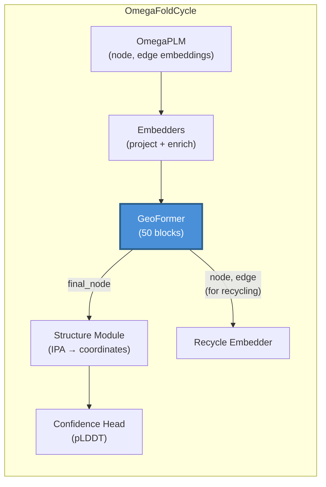
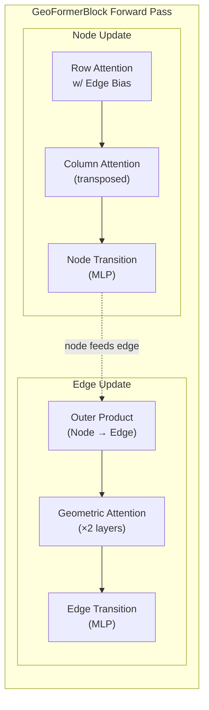

---
slug:6-geoformer-transformer
blog_type:normal
---


**GeoFormer** 是 OmegaFold 的核心几何 Transformer 主干网络——它是连接蛋白质语言模型序列理解与结构模块 3D 坐标生成的桥梁。它运行在双轨表示（节点表示残基，边表示残基对）之上，并通过精心编排的注意力、几何推理和前馈变换序列，迭代优化这两种表示。在默认配置下包含 **50 个重复块**，GeoFormer 构成了 OmegaFold 计算深度的主体，也是从序列嵌入中学习成对空间关系的主要机制。

来源: [geoformer.py](/omegafold/geoformer.py#L17-L19), [model.py](/omegafold/model.py#L52-L58)

## 在 OmegaFold 中的架构角色

GeoFormer 位于每个 `OmegaFoldCycle` 的核心。语言模型 [OmegaPLM](5-omegaplm-language-model) 生成初始的节点和边表示，这些表示在进入 GeoFormer 之前由嵌入器进行投影和丰富。随后，GeoFormer 在其内部块中迭代优化这些表示，产生三个输出：**循环节点**和**循环边**表示（在后续的循环迭代中反馈回去），以及**最终节点**表示（投影至结构模块的维度，用于通过 [Structure Module and IPA](7-structure-module-and-ipa) 进行 3D 坐标预测）。



`OmegaFoldCycle.forward` 中的调用约定展示了三路输出拆分：`prev_node, edge_repr, node_repr = self.geoformer(...)`，其中 `prev_node` 和 `edge_repr` 喂入循环，而 `node_repr`（投影后）喂入结构模块。

来源: [model.py](/omegafold/model.py#L90-L95), [model.py](/omegafold/model.py#L57-L58)

## 双轨表示

GeoFormer 运行在两个互补的表示轨道上，编码不同层级的结构信息：

| 轨道 | 张量形状 | 语义 | 维度（默认） |
|-------|-------------|-----------|---------------------|
| **Node** | `[num_res, node_dim]` | 逐残基特征（局部结构、溶剂暴露度、二级结构信号） | 256 |
| **Edge** | `[num_res, num_res, edge_dim]` | 成对特征（残基对之间的距离、方向、接触信息） | 128 |

**节点轨道**捕捉每个残基“对自身的认知”，而**边轨道**捕捉每对残基“对彼此关系的认知”。这两个轨道之间的交互——节点通知边，边偏置节点的注意力——是 GeoFormer 设计的决定性特征。

来源: [geoformer.py](/omegafold/geoformer.py#L89-L106), [config.py](/omegafold/config.py#L59-L60)

## GeoFormerBlock：核心迭代单元

每个 `GeoFormerBlock` 是一个完整的优化步骤。前向传播遵循严格的**节点优先，边其次**的顺序，其中节点表示通过三个子阶段更新后，边表示再通过三个子阶段更新：



### 阶段 1：带边偏置的行注意力

第一个操作是 `AttentionWEdgeBias`，这是一种多头注意力机制，其中**边表示作为注意力逻辑值的成对偏置**。这是关键的耦合点，成对空间信息直接调制哪些残基彼此关注。边张量通过线性层从 `edge_dim` (128) 投影到 `n_head` (8) 维，然后与掩码偏置一起作为偏置加到注意力逻辑值上。注意力本身使用**门控**（基于并行查询投影的 sigmoid）来控制信息流。

来源: [geoformer.py](/omegafold/geoformer.py#L51-L57), [modules.py](/omegafold/modules.py#L497-L548)

### 阶段 2：列注意力

在行注意力之后，第二次注意力传递在**转置的**节点表示上操作。转置交换了序列维度轴，有效地计算残基矩阵“列”方向的注意力。节点张量和掩码均被转置，计算注意力后，结果转置回来并作为残差相加。这种双向注意力模式确保每个残基从成对表示的两个方向获取信息，增强了模型捕捉对称关系的能力。

来源: [geoformer.py](/omegafold/geoformer.py#L128-L137), [geoformer.py](/omegafold/geoformer.py#L58-L66)

### 阶段 3：节点过渡

一个带有 4× 扩展因子 (256 → 1024 → 256) 和 ReLU 激活的两层前馈网络（过渡）独立处理每个残基的表示。过渡在 MLP 之前应用层归一化，并支持 [subbatching](8-attention-and-subbatching) 以实现长序列的内存高效处理。

来源: [geoformer.py](/omegafold/geoformer.py#L67-L71), [modules.py](/omegafold/modules.py#L193-L216)

### 阶段 4：外积（节点 → 边通信）

`Node2Edge` 模块将信息从节点轨道转移到边轨道。它计算投影节点表示的学习外积：每个节点被投影到 `opm_dim * 2` (64) 维，拆分为左右因子，并通过 einsum 计算它们与形状为 `[proj_dim, proj_dim, out_dim]` 的学习权重张量的外积。通过掩码乘积的归一化（ε = 1e-3 以保证稳定性）确保输出尺度适中。这是将局部逐残基信息组合以更新成对特征的机制。

来源: [geoformer.py](/omegafold/geoformer.py#L72-L74), [modules.py](/omegafold/modules.py#L341-L372)

### 阶段 5：几何注意力

这是架构上最具特色的组件。由 `geom_count`（默认为 2）层 `GeometricAttention` 堆叠作用于边表示。每层 `GeometricAttention` 结合了**两种互补机制**：

1. **注意力路径**：在边矩阵上的标准多头注意力（具有 2 个轴用于行/列对称性），其中偏置项由边表示本身计算得出。输出通过加上其转置来对称化（`attended[..., 0] + attended[..., 1].T`）。

2. **门控路径**：GLU 门控的外积机制。边表示被拆分为行和列激活（通过带有切片权重的独立 GLU 投影），计算它们的外积，进行投影，并由 sigmoid 控制的信号进行门控。该路径提供了行方向与列方向边特征之间的学习乘法交互。

两条路径的和作为几何注意力的输出返回。这种双路径设计允许几何注意力同时捕捉全局上下文（通过注意力）和局部成对结构（通过门控外积）。

来源: [geoformer.py](/omegafold/geoformer.py#L75-L82), [modules.py](/omegafold/modules.py#L569-L706)

### 阶段 6：边过渡

结构与节点过渡相同：一个带有 ReLU 激活和层归一化的两层 MLP (128 → 512 → 128)，独立应用于每个边表示，并支持子批处理。

来源: [geoformer.py](/omegafold/geoformer.py#L83-L87)

## 完整的 GeoFormer：块堆叠与输出投影

顶层 `GeoFormer` 类按顺序堆叠了 `geo_num_blocks`（默认 **50**）个 `GeoFormerBlock` 实例。在所有块完成后，最终的线性投影（`node_final_proj`）将节点表示从 `node_dim` (256) 映射到 `struct.node_dim` (384)，即结构模块期望的维度。三个返回值用于不同目的：

| 输出 | 形状 | 目的地 | 用途 |
|--------|-------|-------------|---------|
| `node_repr` | `[num_res, node_dim]` | 循环嵌入器 | 用于下一次循环迭代的节点状态 |
| `edge_repr` | `[num_res, num_res, edge_dim]` | 循环嵌入器 + 结构模块 | 用于循环和 IPA 的成对状态 |
| `final_node` | `[num_res, struct.node_dim]` | 结构模块 | 用于 3D 坐标预测的投影节点 |

来源: [geoformer.py](/omegafold/geoformer.py#L140-L180)

## 配置参考

所有 GeoFormer 超参数均定义在顶层配置命名空间中：

| 参数 | 默认值 | 描述 |
|-----------|---------|-------------|
| `node_dim` | 256 | 节点（逐残基）表示的维度 |
| `edge_dim` | 128 | 边（成对）表示的维度 |
| `geo_num_blocks` | 50 | `GeoFormerBlock` 迭代的次数 |
| `attn_n_head` | 8 | 行/列注意力中的注意力头数 |
| `attn_c` | 32 | 行/列注意力中每个头的维度 |
| `gating` | True | 是否在注意力输出上应用 sigmoid 门控 |
| `transition_multiplier` | 4 | 过渡层中的 MLP 扩展因子 |
| `activation` | "ReLU" | 过渡层中的激活函数 |
| `opm_dim` | 32 | 外积 (Node2Edge) 中的投影维度 |
| `geom_count` | 2 | 每个块中 GeometricAttention 的层数 |
| `geom_c` | 32 | 几何注意力中每个头的维度 |
| `geom_head` | 4 | 几何注意力中的头数 |
| `struct.node_dim` | 384 | `node_final_proj` 的输出维度 |

来源: [config.py](/omegafold/config.py#L46-L109)

## 残差连接与归一化策略

GeoFormerBlock 全程采用一致的**残差连接**模式：每个子模块的输出被*相加*到其输入中（`node_repr += self.attention_w_edge_bias(...)`），而不是替换。这创建了一条深残差高速公路，使梯度能够流经所有 50 个块。关键的是，**无权重层归一化**（`utils.normalize`，即没有学习缩放/偏移的 `F.layer_norm`）应用于每个子模块计算*之前*——在注意力输入处、过渡之前以及外积内部。这种“预归一化”残差设计在不增加每层可学习归一化参数的情况下，稳定了极深架构的训练。

<CgxTip>普遍使用无权重的 `normalize()` 而非 `nn.LayerNorm` 是一个有意的设计选择：它减少了 50 个块中的参数量，同时仍提供归一化带来的数值稳定性益处。如果需要，学习到的缩放可以被吸收到随后的线性投影中。</CgxTip>

来源: [geoformer.py](/omegafold/geoformer.py#L108-L126), [utils/torch_utils.py](/omegafold/utils/torch_utils.py#L53-L83)

## 内存感知计算：子批处理

GeoFormerBlock 中的多个操作支持**子批处理**——沿序列维度将计算拆分为更小的块，以限制峰值内存使用。`Transition.forward` 沿 `dim=0` 拆分输入，独立处理每个子批。`GeometricAttention` 模块使用 `_get_sharded_stacked` 对注意力路径和门控路径进行分片，以内存高效的块生成边张量的堆叠行/列视图。子批大小在推理时通过 `fwd_cfg.subbatch_size` 控制，允许用户在长序列上权衡吞吐量与内存，而无需修改模型架构。

<CgxTip>在 GeometricAttention 中，子批处理尤为重要，因为边张量在序列长度上是 O(n²) 的。`_get_sharded_stacked` 生成器产出形状为 `[subbatch_size, num_res, edge_dim, 2]` 的块（堆叠的行 + 列视图），从而避免了完整 n²×n² 注意力矩阵的具体化。</CgxTip>

来源: [modules.py](/omegafold/modules.py#L551-L566), [modules.py](/omegafold/modules.py#L607-L636), [modules.py](/omegafold/modules.py#L193-L216)

## 数据流总结

穿过单个 `GeoFormerBlock` 的完整数据流，附有张量维度注释（对于具有 *N* 个残基的蛋白质）：

```
Input:  node [N, 256],  edge [N, N, 128],  mask [N]

── Node Track ──
1. Row Attention w/ Edge Bias:  node += Attn(normalize(node), bias=proj(normalize(edge)))
2. Column Attention:            node += Attn(normalize(nodeᵀ), mask=maskᵀ)ᵀ
3. Node Transition:             node += MLP(normalize(node))            [256→1024→256]

── Edge Track ──
4. Outer Product:               edge += OuterProd(normalize(node), mask) [256→64→128]
5. Geometric Attention (×2):    edge += GeomAttn(normalize(edge), mask)
6. Edge Transition:             edge += MLP(normalize(edge))            [128→512→128]

Output: node [N, 256],  edge [N, N, 128]
```

在 50 个此类块之后，`GeoFormer` 应用 `node_final_proj`：一个将 `[N, 256] → [N, 384]` 映射到结构模块的线性层，并返回三元组 `(node, edge, final_node)`。

来源: [geoformer.py](/omegafold/geoformer.py#L89-L126), [geoformer.py](/omegafold/geoformer.py#L174-L180)

## 后续去向

GeoFormer 的子模块均值得深入探究。带有边偏置和子批处理的注意力机制在 [Attention and Subbatching](8-attention-and-subbatching) 中涵盖，几何注意力的双路径架构在 [Geometric Attention](10-geometric-attention) 中详述，归一化/嵌入基础在 [Embeddings and RoPE](9-embeddings-and-rope) 中。要了解 GeoFormer 的输出如何喂入 3D 结构预测，请前往 [Structure Module and IPA](7-structure-module-and-ipa)。有关跨多个循环重新运行 GeoFormer 的迭代优化循环，请参见 [Recycling and Iterative Refinement](11-recycling-and-iterative-refinement)。