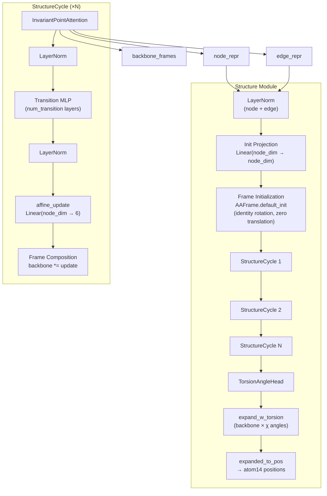

---
slug:7-structure-module-and-ipa
blog_type:normal
---


**结构模块**是 OmegaFold 的最终解码阶段——该组件将抽象的隐式表征转换为具体的 3D 原子坐标。其核心是**不变点注意力**，这是一种具备几何感知能力的注意力机制，直接在 SE(3) 坐标系上运算，确保模型的预测对蛋白质的全局旋转和平移具有等变性。这些组件共同实现了 Jumper et al. (2021) 补充材料算法 20 中描述的迭代主链精修与扭转角解码。

来源：[decode.py](omegafold/decode.py#L1-L399), [aaframe.py](omegafold/utils/protein_utils/aaframe.py#L1-L973)

## 架构概述

结构模块位于每个 OmegaFold 循环周期的末端，消费由 [GeoFormer Transformer](6-geoformer-transformer) 生成的节点与边表征。它的职责有两个：(1) 通过 IPA 驱动的更新，迭代精修一组逐残基的主链坐标系（旋转 + 平移）；(2) 预测逐残基的扭转角，这些扭转角与主链坐标系结合后，可生成完整的 atom14 坐标。



来源：[decode.py](omegafold/decode.py#L316-L392), [decode.py](omegafold/decode.py#L255-L313)

## 不变点注意力 (IPA)

IPA 在标准多头注意力的基础上扩展了一个**几何通道**，该通道以坐标系等变的方式推理 3D 空间关系。原始注意力纯粹从标量查询和键计算 logit 项，而 IPA 引入了第三个 logit 来源：将查询点和键点映射到共享全局坐标系后，它们之间的**欧几里得距离的平方**。

### 三分量 Logit 架构

注意力 logits 是三个独立缩放项的总和：

| Logit 项 | 计算方式 | 权重 | 不变性 |
|---|---|---|---|
| **标量** | 每个头的 ⟨q_scalar, k_scalar⟩ | √(1 / (3 · num_scalar_qk)) | 置换等变 |
| **边 (2D 偏置)** | 每个头的 Linear(edge_repr) | √(1/3) | 依赖配对 |
| **点** | 每个头的 −‖q_point − k_point‖² | √(1 / (3 · ⁹⁄₂ · num_point_qk)) | SE(3) 不变 |

**点项**是关键创新。查询和键向量被投影为 3D 点，然后通过 `AAFrame.transform()` 从其局部残基坐标系转换至**全局坐标系**。由于全局坐标系中点之间的平方距离对该全局坐标系的选择具有不变性（应用于所有坐标系的任何 SE(3) 变换都会相消），因此所得的 logits——以及随后的注意力权重——对蛋白质的**全局刚性运动具有不变性**。

来源：[decode.py](omegafold/decode.py#L44-L152)

### 点 Logit 计算详解

点投影将每个残基的节点表征映射为 `num_head × num_point_qk` 个 3D 向量。这些向量最初定义在残基的**局部坐标系**中（以 Cα 为中心，以主链方向为轴）。`AAFrame.transform()` 方法应用残基的旋转矩阵和平移向量，将这些局部点转换为全局坐标：

```
global_point = R_local→global · local_point + t_local→global
```

然后在所有头和点维度上计算平方距离 `‖q_point_i − k_point_j‖²`。一个**可训练的逐头权重**（经 `softplus` 处理以确保为正）调制每个头的点 logit 贡献，允许模型学习每个头应执行多少空间推理。

来源：[decode.py](omegafold/decode.py#L124-L130), [aaframe.py](omegafold/utils/protein_utils/aaframe.py#L414-L479)

### 多通道输出聚合

在对键进行 softmax 操作后，IPA 在最终投影前聚合**四个不同的输出通道**：

1. **标量值** — 标量值投影的注意力加权求和，形状为 `[num_res, num_head, num_scalar_v]`
2. **点值** — 点值投影的注意力加权求和，通过 `AAFrame.position_in_frame()` **重新表达在查询残基的局部坐标系中**，形状为 `[num_res, num_head, num_point_v, 3]`
3. **点范数** — 局部坐标系点值的 L2 范数，形状为 `[num_res, num_head, num_point_v]`
4. **边值** — 边表征的注意力加权求和，形状为 `[num_res, num_head, edge_dim]`

这四个通道沿特征维度展平并拼接，产生大小为 `num_head × (num_scalar_v + num_point_v × 4 + edge_dim)` 的向量，随后通过输出线性层投影回 `node_dim`。同时包含点坐标及其范数，确保输出能够捕获基于方向和距离的信息。

来源：[decode.py](omegafold/decode.py#L138-L152)

### 方差归一化

每个 logit 项都通过其方差的逆平方根进行缩放，遵循 Vaswani et al. (2017) 的原则。点项的方差设为 `9/2 · num_point_qk`（9/2 因子源于 3D 中高斯平方距离的方差），标量项的方差设为 `num_scalar_qk`，边项的方差设为 1。整体的 `1/√3` 因子解释了对三个 logit 项求和的情况，防止组合后的 logit 幅度随项数增加而增长。

来源：[decode.py](omegafold/decode.py#L84-L89)

## AAFrame 几何原语

`AAFrame` 类封装了一个 **SE(3) 变换**——一个旋转矩阵和一个平移向量——并带有一个指示坐标系有效性的关联掩码。它是 IPA 和结构模块共同依赖的几何骨架。

### 核心操作

| 操作 | 实现 | 描述 |
|---|---|---|
| **变换** | `R · p + t` | 将坐标系应用于局部点 → 全局点 |
| **组合** | `R₁R₂, t₁ + R₁t₂` | 通过 `__mul__` 链接两个坐标系 |
| **在坐标系中定位** | `R⁻ᵀ(p − t)` | 在局部坐标系中表示全局点 |
| **从张量构建** | 6D → 四元数 → R, 3D → t | 将仿射更新解码为坐标系 |
| **从扭转角构建** | sin/cos → R_x(θ) | 由扭转角生成绕 x 轴的旋转 |
| **转 Å / nm** | 将平移缩放 10 或 0.1 | 坐标的单位转换 |

**坐标系组合**操作 (`_combine_transformation`) 被广泛使用：在每个 `StructureCycle` 中用于更新主链坐标系 (`backbone_frames * frame_update`)，以及在 `expand_w_torsion` 中沿 χ 角梯子链式构建侧链坐标系。

<CgxTip>`from_tensor` 类方法将 6 维仿射更新向量解码为坐标系：前 3 个分量被解释为旋转（为数值稳定性通过 quaternion_to_matrix 转换），后 3 个分量作为以纳米为单位的平移。这正是 StructureCycle 的 `affine_update` 线性层生成坐标系更新的机制。</CgxTip>

来源：[aaframe.py](omegafold/utils/protein_utils/aaframe.py#L57-L297), [aaframe.py](omegafold/utils/protein_utils/aaframe.py#L414-L479), [aaframe.py](omegafold/utils/protein_utils/aaframe.py#L610-L685)

## StructureCycle：主链精修的单次迭代

每个 `StructureCycle` 执行一次迭代主链更新。其流程严格按顺序执行：

1. **IPA 更新**：`node_repr += IPA(node_repr, edge_repr, backbone_frames)` — 节点表征通过 IPA 输出进行原位更新，融入了对当前主链构型的几何推理
2. **输入 LayerNorm**：对更新后的节点表征进行归一化
3. **Transition MLP**：一堆 `num_transition` 个线性层，中间夹带 ReLU 激活函数，外加一个**残差连接** — `node_repr += transition(node_repr)` — 提供了无瓶颈的信息通路
4. **更新 LayerNorm**：在 transition 后进行归一化
5. **仿射更新**：从 `node_dim` 到 6 维的线性投影，通过 `AAFrame.from_tensor` 解码为 SE(3) 坐标系更新
6. **坐标系组合**：`backbone_frames = backbone_frames * frame_update` — 当前主链坐标系与预测的更新进行组合，生成精修后的主链方向和位置

IPA 步骤（步骤 1）中的残差连接至关重要：它确保初始节点表征永远不会被丢弃，IPA 充当**校正项**而非替代项。

来源：[decode.py](omegafold/decode.py#L255-L313)

## StructureModule：完整解码流水线

`StructureModule` 编排了完整的坐标生成过程：

### 初始化阶段

该模块首先对节点和边表征应用 **LayerNorm**，然后通过 `init_proj` 投影节点表征。主链坐标系使用 `AAFrame.default_init` 进行初始化，该方法将每个残基置于原点并使用恒等旋转——即 Jumper et al. (2021) 提出的所谓“黑洞初始化”。这确保了第一次 IPA 迭代在一个退化但几何定义良好的状态下运行。

来源：[decode.py](omegafold/decode.py#L316-L367)

### 迭代精修阶段

初始化后的主链坐标系和节点表征被传入 `num_cycle` 个顺序执行的 `StructureCycle` 层。每个循环同时精修表征和坐标系，逐步将蛋白质从退化的初始状态“展开”为物理上合理的主链轨迹。

来源：[decode.py](omegafold/decode.py#L369-L372)

### 扭转角预测

在最后一个循环之后，`TorsionAngleHead` 为每个残基预测 **7 个 sin-cos 扭转角对**（ω, φ, ψ, χ₁–χ₄）。该预测头同时接收**最终**和**初始**节点表征——这种双输入设计允许网络推理精修期间发生的变化，同时保留对原始几何信息的访问。预测采用残差块架构：两个输入投影（每个表征一个），求和后接 `num_residual_block` 个残差块（每个：Linear → ReLU → Linear → ReLU + skip），最后经过一个线性层输出 14 个结果并重塑为 `[7, 2]`，再进行稳健归一化。

来源：[decode.py](omegafold/decode.py#L200-L252), [decode.py](omegafold/decode.py#L374-L386)

### 坐标系扩展与 Atom14 生成

预测的扭转角用于通过 `expand_w_torsion` 将每个主链坐标系扩展为 **8 个逐残基子坐标系**（主链 + 7 个扭转角驱动的坐标系）。这实现了 AlphaFold2 补充材料中的算法 24：主链坐标系与残基类型特定的默认坐标系及扭转角旋转进行组合，并沿侧链依次链接（χ₁ → χ₂ → χ₃ → χ₄）。最后，`expanded_to_pos` 利用逐残基类型的原子到坐标系分配及刚体群位置，将这些坐标系映射为 **atom14 位置**。

<CgxTip>`expand_w_torsion` 方法通过连续组合链接侧链坐标系：`chi2_frame_to_backb = chi1_frame_to_backb * chi2_frame_to_frame`。这种组合结构反映了侧链旋转异构体的物理现实——每个后续 χ 角都是相对于由所有先前角度建立的坐标系来定义的。</CgxTip>

来源：[decode.py](omegafold/decode.py#L381-L392), [aaframe.py](omegafold/utils/protein_utils/aaframe.py#L716-L798)

## 在 OmegaFold 流水线中的集成

`StructureModule` 在 `OmegaFoldCycle` 内部被调用，紧接在 [GeoFormer Transformer](6-geoformer-transformer) 生成其更新的节点和边表征之后。该模块接收 `node_repr[..., 0, :, :]`（选择第一行 MSA）和完整的边表征。其输出——`final_atom_positions`、`final_atom_mask` 和 `final_frames`——被返回至循环回路，其中 `final_frames` 和 `final_atom_positions` 将作为下一个循环的 [回收与迭代精修](11-recycling-and-iterative-refinement) 的 `prev_frames` 和 `prev_x` 输入。

| 输出 | 形状 | 消费者 |
|---|---|---|
| `final_atom_positions` | `[num_res, 14, 3]` | 循环回路 (`prev_x`)，置信度预测头 |
| `final_atom_mask` | `[num_res, 14]` | 输出处理 |
| `final_frames` | `[num_res, 8, ...]` | 循环回路 (`prev_frames`) |
| `node_repr` | `[num_res, node_dim]` | [置信度估计 (pLDDT)](12-confidence-estimation-plddt) |

来源：[model.py](omegafold/model.py#L52-L112)

## 关键设计原则

| 原则 | 实现 | 优势 |
|---|---|---|
| **SE(3) 等变性** | IPA logit 项是坐标系不变的；输出点被重新局部化 | 预测与坐标系无关 |
| **迭代精修** | 从黑洞初始化开始进行多次 StructureCycles | 渐进展开避免陷入局部极小值 |
| **双输入扭转角预测** | 最终 + 初始节点表征 | 保留精修前的信息 |
| **方差缩放 logits** | 每个通道 1/√(variance · num_terms) | 防止通道间 logit 爆炸 |
| **残差连接** | IPA 和 transition 均使用加性跳跃连接 | 深层循环中稳定的梯度流 |

来源：[decode.py](omegafold/decode.py#L44-L392)

## 后续步骤

- 了解该模块的主链坐标系如何通过 [回收与迭代精修](11-recycling-and-iterative-refinement) 反馈回模型
- 在 [几何注意力](10-geometric-attention) 中详细了解几何原语
- 查看最终节点表征如何评分：[置信度估计 (pLDDT)](12-confidence-estimation-plddt)
- 在 [配置参考](13-configuration-reference) 中配置结构模块参数