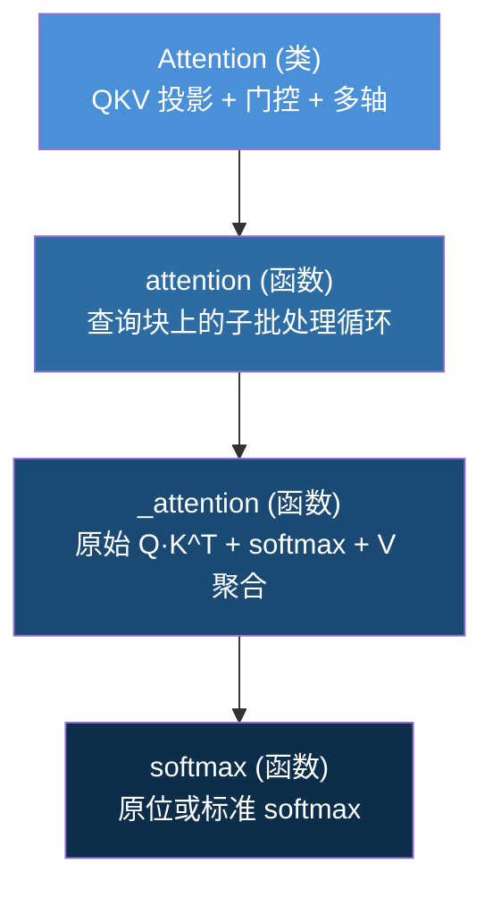
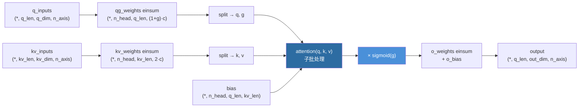

---
slug:8-attention-and-subbatching
blog_type:normal
---


OmegaFold 的注意力子系统是 **OmegaPLM 语言模型**和 **GeoFormer Transformer** 共享的计算骨干。该实现的独特之处在于紧密集成了**子批处理**——一种感知内存的执行策略，它将查询维度拆分为更小的块，依次计算每个块的注意力，从而无论序列长度如何，都能限制 GPU 峰值内存。本页将剖析其三层架构：底层 `_attention` 内核、子批处理 `attention` 调度器，以及将 QKV 投影、门控和多轴支持组合在一起的高层 `Attention` 模块。

来源：[modules.py](omegafold/modules.py#L69-L164), [omegaplm.py](omegafold/omegaplm.py#L56-L118), [geoformer.py](omegafold/geoformer.py#L43-L137)

## 注意力计算层级

注意力实现遵循三层设计——每一层在将核心数学运算委托给下层的同时，增加特定功能：



| 层级 | 职责 | 内存范围 | 核心特性 |
|---|---|---|---|
| `_attention` | 带偏置的原始缩放点积 | 完整的 Q×K 注意力矩阵 | 原位 softmax 优化 |
| `attention` | 子批处理调度器 | 每个块仅 `subbatch_size × K` | 沿序列维度拆分查询 |
| `Attention` (类) | 完整模块：投影、注意力、门控、输出 | 委托给 `attention` | 多轴、门控、输出投影 |

来源：[modules.py](omegafold/modules.py#L39-L164), [modules.py](omegafold/modules.py#L375-L494)

## 核心内核：`_attention`

基础计算是带有加性偏置项的标准**缩放点积注意力**。该实现使用 `einsum` 进行 QK 和 AV 收缩，这与 PyTorch 中的批量矩阵乘法内核完美对应：

```
logits[..., i, j] = (query[..., i, d] * scale) * key[..., j, d]  +  bias[..., i, j]
attn   = softmax(logits, dim=-1)
out    = attn[..., i, j] * value[..., j, d']
```

一个显著的优化：当 `return_edge=False`（常见情况）时，softmax 的计算是**原位**进行的——减去最大值、求指数和归一化均直接覆写 `logits` 张量，将注意力矩阵的中间内存减半。当请求边 logits 时（如在 OmegaPLM 中用于成对边表示），则改用标准 `torch.softmax` 以保留原始张量。

<CgxTip>原位 softmax 路径 (`in_place=True`) 避免了为归一化注意力权重分配第二个张量。对于长度为 *N* 的序列，这节省了 O(N²) 个浮点数值——当 *N* 较大且不需要 `return_edge` 时，这一节省十分显著。</CgxTip>

来源：[modules.py](omegafold/modules.py#L39-L101)

## 子批处理：内存受限的注意力

`attention` 函数将 `_attention` 封装在**查询拆分循环**中，这是 OmegaFold 中核心的内存优化。它不再一次性具化完整的 `[q_length, k_length]` 注意力矩阵，而是对查询序列的块进行迭代：

```python
for i, q_i in enumerate(query.split(subbatch_size, dim=-2)):
    start, end = i * subbatch_size, (i + 1) * subbatch_size
    b_i = bias[..., start:end, :]          # 为当前块切片偏置
    res, attn = _attention(q_i, key, scale, value, b_i, ...)
    output[..., start:end, :] = res        # 将结果写入预分配的输出
```

**键和值张量从未被拆分**——每个查询块都关注完整的键值集。这保持了与标准注意力的数学等价性，同时将中间注意力矩阵的大小限制在 `[subbatch_size, k_length]`。当 `subbatch_size` 等于 `q_length`（默认值）时，循环仅执行一次，其行为与非批处理注意力完全相同。

### 代码库中的子批处理

子批处理并不局限于注意力函数。相同的模式出现在多个模块中，每个模块都沿着对内存最关键的维度进行拆分：

| 模块 | 拆分维度 | 预分配输出 | 使用位置 |
|---|---|---|---|
| `attention()` | 查询序列维度 (`-2`) | `torch.empty(..., q_length, v_dim)` | OmegaPLM, GeoFormer |
| `Transition.forward()` | 批次维度 (`0`) | `torch.empty_like(x)` | GeoFormer 节点/边转换 |
| `GeometricAttention._get_attended()` | 边行维度 | 通过分片循环 `torch.empty(..., n_axis)` | GeoFormer 几何注意力 |
| `GeometricAttention._get_gated()` | 行 × 列 (嵌套) | 通过分片循环 `torch.empty(...)` | GeoFormer 门控路径 |

`GeometricAttention._get_gated` 中的嵌套子批处理尤为重要：它拆分了边表示 `[num_res, num_res, d_edge]` 的行和列维度，为外积计算产生一个 **subbatch × subbatch** 的分块——这是 GeoFormer 块中内存消耗最大的操作。

来源：[modules.py](omegafold/modules.py#L104-L164), [modules.py](omegafold/modules.py#L204-L216), [modules.py](omegafold/modules.py#L607-L669)

## `Attention` 类：投影、门控与多轴

`Attention` 类是 OmegaPLM 和 GeoFormer 都使用的全功能模块。它在子批处理 `attention` 函数的基础上增加了三项功能：

### 1. 融合 QKV 投影与逐头偏置

该类没有为 Q、K、V 分别使用线性层，而是使用**单一融合权重张量**，通过 `einsum` 将输入同时投影到所有头：

- `qg_weights: [q_dim, n_axis, n_head, (1+gating) * c]` —— 生成查询（以及可选的门控）
- `kv_weights: [kv_dim, n_axis, n_head, 2 * c]` —— 生成键和值
- `qg_bias / kv_bias` —— 逐头、逐轴偏置（此处无逐位置偏置；位置信息通过 `bias` 参数传入）

`n_axis` 维度实现了**多轴注意力**——同一模块可以通过将轴作为额外批次维度，在单次前向传播中处理多个几何轴（例如，几何注意力中的 3 个空间轴）。

### 2. 门控机制

当 `gating=True` 时，查询投影在生成实际查询的同时，还会生成一个额外的 `c` 维块。该块经过 sigmoid 函数形成逐元素门控：

```python
q, g = qg.split(self.c, dim=-1)    # 拆分查询-门控
attn_out = attention(q, k, v, ...)  # 标准注意力
attn_out *= torch.sigmoid(g)        # 应用门控
```

门控允许模型逐头和逐位置地动态抑制注意力输出，这对于结构模块的 IPA 以及并非所有头都应等权贡献的 GeoFormer 几何注意力至关重要。

### 3. 带逐轴偏置的输出投影

经注意力处理的输出通过 `o_weights: [n_axis, n_head, c, out_dim]` 和逐轴输出偏置 `o_bias: [out_dim, n_axis]` 投影回 `out_dim`。`einsum('...rhqc,rhco->...qor', attn_out, self.o_weights)` 跨头和逐头通道进行收缩，将多头输出合并为单一表示。

### 形状流转图



来源：[modules.py](omegafold/modules.py#L375-L494)

## 边偏置集成：`AttentionWEdgeBias`

GeoFormer 的行和列注意力层使用 `AttentionWEdgeBias`，这是一个轻量级封装器，从两个来源构建注意力偏置：

1. **边表示投影**：`proj_edge_bias` 将边特征 `[q_len, kv_len, d_edge]` 映射为 `[n_head, q_len, kv_len]`——这直接将成对结构信息编码进注意力 logits。
2. **掩码偏置**：残基有效性掩码通过 `mask2bias`（将 1 映射为 0，0 映射为 −1e9）转换，并加到边偏置上，确保无效位置获得可忽略的注意力权重。

这种模式——**习得的成对偏置 + 掩码偏置**——是蛋白质结构模型将几何先验注入注意力的标准方案。

来源：[modules.py](omegafold/modules.py#L497-L548), [torch_utils.py](omegafold/utils/torch_utils.py#L39-L50)

## 子批次大小配置

`subbatch_size` 不是模型参数——它是通过 `fwd_cfg`（前向配置命名空间）传入的**运行时推理配置**。这种设计将模型的习得参数与其执行策略分离开来：

| 上下文 | 默认值 | 覆盖路径 |
|---|---|---|
| `Attention._get_attn_out` | `q.shape[-4]` (完整序列) | `fwd_cfg.subbatch_size` |
| CLI 参数 `--subbatch_size` | `None` (自动) | 推理时的命令行 |
| `Transition.forward` | `x.shape[-2]` (完整长度) | `fwd_cfg.subbatch_size` |
| `GeometricAttention` | 完整边长度 | `fwd_cfg.subbatch_size` |

当 `fwd_cfg` 为 `None` 或 `subbatch_size` 未设置时，系统默认在一次传播中处理完整序列——这与标准注意力在数学上完全等价。CLI 标志 `--subbatch_size` 提供了用户级控制：较小的值以牺牲吞吐量为代价换取更低的 GPU 内存占用，从而能够在更长序列或内存受限的硬件上进行推理。

<CgxTip>对于长度为 *N*、头维度为 *c* 的序列，峰值注意力内存为 O(subbatch_size × N × c)。设置 `subbatch_size = N // k` 会将峰值内存大约降低 *k* 倍，代价是 *k* 次顺序迭代。最优值需在可用显存与 Python 循环开销之间进行权衡。</CgxTip>

来源：[modules.py](omegafold/modules.py#L478-L480), [pipeline.py](omegafold/pipeline.py#L348-L357)

## 支持注意力的实用函数

来自 `torch_utils.py` 的两个实用函数对注意力流程至关重要：

**`mask2bias(mask, inf=1e9)`** 将二进制掩码（1=有效，0=无效）转换为加性偏置（0=有效，−1e9=无效）。这是在没有条件逻辑的情况下实现掩码注意力的标准技术——softmax 自然会将无效位置的权重趋近于零。该函数在 `AttentionWEdgeBias` 和 `OmegaPLM.forward` 中均有使用。

**`normalize(inputs, in_place=False)`** 实现了无权重层归一化。原位变体直接在输入张量上减去均值并乘以标准差的倒数。这在 OmegaPLM（预归一化架构）和 GeoFormer 的每次注意力投影之前都会被调用，遵循预 LayerNorm Transformer 模式。

来源：[torch_utils.py](omegafold/utils/torch_utils.py#L39-L83)

## 消费者如何使用注意力 API

两个主要消费者——**OmegaPLM** 和 **GeoFormer**——以不同方式调用注意力机制：

**OmegaPLM** 在通过其 `GatedAttentionUnit` 手动投影 Q、K、V 之后，直接调用 `attention` *函数*（而非 `Attention` 类）。它还请求 `return_edge=True` 以提取成对注意力 logits 作为边表示供下游使用。QK 缩放遵循长度依赖公式：`log(num_res) / (log(512) * attn_dim^0.5)`，参考自 [Su 等人](https://kexue.fm/archives/8823)。

**GeoFormer** 使用 `Attention` *类*（行注意力通过 `AttentionWEdgeBias`，列注意力直接使用），将所有投影逻辑委托给该模块。它不从注意力中返回边 logits——相反，边更新来自独立的 `Node2Edge` 外积模块和 `GeometricAttention`。

来源：[omegaplm.py](omegafold/omegaplm.py#L56-L118), [geoformer.py](omegafold/geoformer.py#L43-L137)

---

理解注意力内核和子批处理机制，为探索两个相关主题奠定了基础：位置信息如何通过[嵌入与 RoPE](9-embeddings-and-rope) 进入注意力偏置，以及 `GeometricAttention` 如何在[几何注意力](10-geometric-attention)中将子批处理模式扩展至三角形边表示。有关子批次大小如何与其他运行时参数交互的全貌，请参阅[配置参考](13-configuration-reference)和[内存优化策略](14-memory-optimization-strategies)。