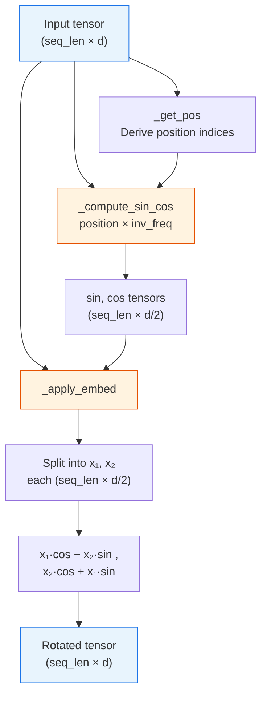
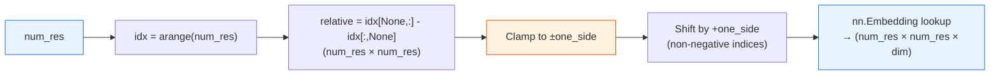
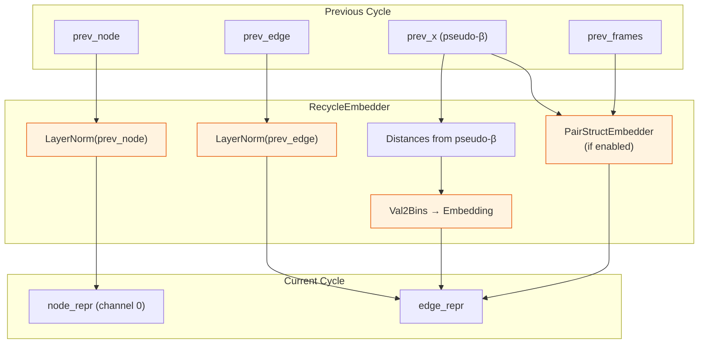
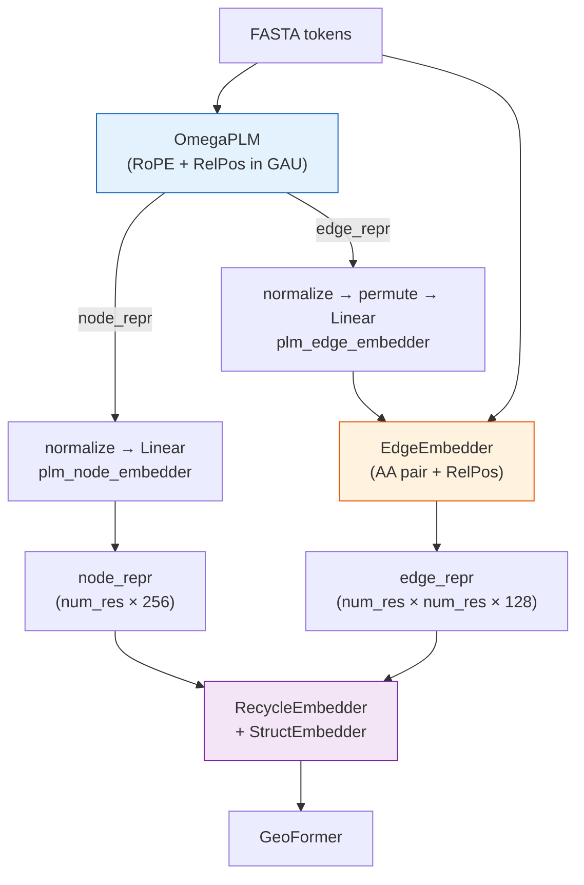

---
slug:9-embeddings-and-rope
blog_type:normal
---


OmegaFold 的嵌入子系统通过四种互补策略，在原始氨基酸序列与学习到的几何表示之间建立了桥梁：**旋转位置嵌入** 将绝对位置结构注入到 OmegaPLM 语言模型的注意力机制中；**相对位置嵌入** 为 OmegaPLM 和边表示提供距离感知偏置；**EdgeEmbedder** 仅从一级序列构建残基对特征；**StructEmbedder/RecycleEmbedder** 将先前迭代的结构信号传递至后续循环。这些模块共同确保每个下游 Transformer 层的输入都已编码了空间与位置先验——这是从序列准确预测 3D 结构的先决条件。

来源: [embedders.py](omegafold/embedders.py#L1-L31), [model.py](omegafold/model.py#L1-L30)

## 旋转位置嵌入

**旋转位置嵌入** 将 token 位置编码为特征空间中的旋转，从而产生在序列轴上自然具备平移等变性的注意力分数。与加性位置编码（正弦或学习式）不同，RoPE 在计算每个 token 的查询和键向量的点积之前，对其应用一个**旋转矩阵**，因此相对位置 *m − n* 直接从内积几何中产生，而非来自显式的位置信号。OmegaFold 实现了 Su 等人 (2021) 的公式，其中位置 *p* 在频率索引 *i* 处的旋转为：

> θᵢ(p) = p · 10000^(−2i/d)

`RoPE` 类在构造时预计算**逆频率**缓冲区 `inv_freq`，将 `i ∈ [0, d/2)` 的值 `10000^(−2i/d)` 存储为非持久化缓冲区（它会在设备转移时重新生成，而不是随模型权重一起序列化）。在前向传播时，该类为输入张量中的每个位置 *p* 导出正弦值 `p · inv_freq`，然后将实际旋转委托给 `_apply_embed`。



`_apply_embed` 中的核心旋转操作通过将输入向量 **x** ∈ ℝᵈ 拆分为两半 **x₁**, **x₂** ∈ ℝᵈ/² 并计算：

| 输出部分 | 公式 |
|---|---|
| 前半部分 | **x₁** · cos(θ) − **x₂** · sin(θ) |
| 后半部分 | **x₂** · cos(θ) + **x₁** · sin(θ) |

这正是独立应用于 d/2 个二维子空间的 2D 旋转块 `[cos, −sin; sin, cos]`——这是 RoPE 的决定性特征。`seq_dim` 参数将旋转推广到多维空间索引（例如 2D 网格），这要求指定的维度在张量形状中是**连续的**。在旋转之前，`_apply_embed` 通过在空间轴周围插入单一维度来广播 sin/cos 张量，使其与输入的完整维度对齐。

<CgxTip>RoPE 的 `inv_freq` 缓冲区通过 `persistent=False` 注册，这意味着它**不会**出现在 `state_dict()` 中。加载预训练检查点时，该缓冲区会从 `__init__` 重建——因此，如果在训练和推理之间更改了 `input_dim`，将隐式产生不正确的位置编码。务必确保 `attn_dim` 与检查点的配置相匹配。</CgxTip>

来源: [embedders.py](omegafold/embedders.py#L141-L198), [embedders.py](omegafold/embedders.py#L67-L110)

### 门控注意力单元中的 RoPE

RoPE 并未应用于 OmegaFold 的每个注意力层——它专门用于 OmegaPLM 语言模型的**门控注意力单元 (GAU)** 中。`GatedAttentionUnit` 将其输入投影到维度为 `attn_dim`（默认 256）的 `base` 向量中，然后通过 `MultiHeadedScaling` 传递该向量，后者产生两个头（查询和键），并通过 `on_out_ready` 回调对每个头应用 RoPE：

```python
self.multi_headed_scaling = modules.MultiHeadedScaling(
    cfg.attn_dim,
    num_heads=2,
    on_out_ready=lambda x: self.rope(x, x.ndim - 3)
)
self.rope = embedders.RoPE(cfg.attn_dim)
```

回调 `lambda x: self.rope(x, x.ndim - 3)` 指定**倒数第三**维为序列维度——这考虑了 `MultiHeadedScaling` 生成的 `(num_heads, seq_len, attn_dim)` 布局。由于 RoPE 在查询和键的点积*之前*应用于两者，因此产生的注意力逻辑仅依赖于 token 之间的**相对位置**，而非它们的绝对索引——这实现了无需重新训练的长度泛化。

来源: [omegaplm.py](omegafold/omegaplm.py#L48-L66), [omegaplm.py](omegafold/omegaplm.py#L68-L103)

## 相对位置嵌入

虽然 RoPE 在 OmegaPLM 的 GAU 内提供隐式的相对位置信号，但 OmegaFold 还采用了一种**显式**的相对位置嵌入——`RelPosEmbedder`——它直接对注意力逻辑施加偏置。该类扩展了 `nn.Embedding` 并实现了 Jumper 等人 (2021，补充算法 4) 的 **relpos** 算法：计算相对残基索引 `j − i` 的矩阵，将每个值截断到 `[−one_side, +one_side]` 范围内，通过偏移 `one_side` 获得非负索引，最后查找相应的嵌入向量。



`num_embeddings` 参数（在 OmegaPLM 中默认为 129，由 `num_relpos * 2 + 1` 派生）定义了截断范围。相隔超过 64 个位置的残基对都会映射到相同的边界嵌入——这提供了一种**局部性先验**，防止远距离对收到不同的位置信号，这在生物学上是合理的，因为蛋白质中的残基接触绝大多数沿序列是局部的。

### RelPos 的双重用途

`RelPosEmbedder` 在 OmegaFold 的架构中具有两种不同的作用：

| 消费者 | 目的 | 维度 | 集成方式 |
|---|---|---|---|
| `EdgeEmbedder` | 将成对位置偏置注入边表示 | `edge_dim` (128) | 加至边张量 |
| `GatedAttentionUnit` | 对 GAU 注意力逻辑施加偏置 | 1 (标量) | 加至注意力偏置 |

在 GAU 中，`RelPosEmbedder` 产生一个**标量**偏置（`embedding_dim=1`），与掩码派生的偏置一起直接加到注意力逻辑中。与 RoPE 的全向量旋转相比，这是一种轻量级的位置信号——两者是互补的：RoPE 修改查询/键*向量*（影响相似度的计算方式），而 `RelPosEmbedder` 修改注意力*逻辑*（影响哪些位置先验地获得更多或更少的注意力）。

来源: [embedders.py](omegafold/embedders.py#L201-L229), [omegaplm.py](omegafold/omegaplm.py#L58-L59)

## 边表示嵌入器

`EdgeEmbedder` 仅从一级氨基酸序列构建初始的成对边表示。它组合三个加性项来构建 `(num_res × num_res × edge_dim)` 张量：

1. **行氨基酸嵌入** — `proj_i(fasta_sequence).unsqueeze(-2)` 将每个残基的嵌入在 *j* 轴上广播
2. **列氨基酸嵌入** — `proj_j(fasta_sequence).unsqueeze(-3)` 在 *i* 轴上广播
3. **相对位置嵌入** — `relpos(num_res)` 提供上述的距离依赖偏置

这种构建方式类似于 AlphaFold2 的成对输入嵌入，但使用了**两个独立的嵌入表**（`proj_i` 和 `proj_j`）而不是单一共享表，允许模型学习非对称的残基对特征。生成的边张量是加性的——它作为 `out` 参数传递，并累加到已存在的任何边表示上，从而能够通过 `RecycleEmbedder` 与先前循环的特征无缝组合。

来源: [embedders.py](omegafold/embedders.py#L116-L138)

## 结构嵌入器

`StructEmbedder`（及其对称变体 `PairStructEmbedder`）将来自上一预测周期的**3D 结构信息**编码到边表示中。当启用时（配置中 `model_idx == 2`），它处理三个几何通道：

| 通道 | 输入 | 编码 | 目的 |
|---|---|---|---|
| 粗粒度距离 | 原子对距离 | `Val2ContBins` → `Linear` | 粗粒度距离信号 |
| 细粒度距离 | 原子对距离 | `Val2ContBins` → `Linear` | 细粒度距离信号 |
| 局部位置 | 局部坐标系中的原子位置 | `Val2ContBins` → `Linear` | 坐标系相对位置编码 |

每个通道都使用 `Val2ContBins`——一种软分箱机制，通过高斯核将连续标量值转换为**基于分箱的概率分布**，而非硬量化。分箱中心从 `x_min` 到 `x_max` 均匀分布，每个输入值通过到分箱中心的指数化平方距离映射为 softmax（扩展系数为 `0.5 / (bin_size × 0.2)²`）。这种可微分箱保留了穿过距离特征的梯度流。

这三个通道通过氨基酸对嵌入 `aa_embedding(fasta₁ × 21 + fasta₂)` 的双线性交互进行组合，随后通过一个学习到的双线性投影（`linear_z_weights`）从 `(c, c)` 映射到 `edge_dim`。这会产生一个 `(num_res × num_res × edge_dim)` 张量，在循环嵌入器中加到边表示上。

来源: [embedders.py](omegafold/embedders.py#L232-L340), [modules.py](omegafold/modules.py#L279-L310)

## 循环嵌入器

`RecycleEmbedder` 将**先前预测周期**的信息融合到当前周期的节点和边表示中。它执行三个关键操作：

1. **节点循环** — LayerNorm 归一化的先前节点特征被加到当前节点表示的**首个循环通道**（`node_repr[..., 0, :, :]`）中
2. **距离 gram 嵌入** — 上一周期伪 β 位置的残基间距离通过 `Val2Bins`（硬量化）进行分箱，并通过 `prev_pos_embed` 查找
3. **边循环** — LayerNorm 归一化的先前边特征被加到当前边表示中
4. **可选结构嵌入** — 当 `cfg.struct_embedder` 为 `True` 时，`PairStructEmbedder` 根据先前的原子位置和坐标架计算几何特征



硬分箱（`Val2Bins`，用于距离 gram）和软分箱（`Val2ContBins`，用于 `StructEmbedder`）之间的区别是经过深思熟虑的：距离 gram 是仅有 16 个分箱的粗粒度信号（配置中 `num_bins=16`），而结构距离需要更细粒度且对梯度友好的表示。这种循环机制正是 OmegaFold 能够实现迭代精化的基础——完整的周期动态请参见[循环与迭代精化](11-recycling-and-iterative-refinement)。

来源: [embedders.py](omegafold/embedders.py#L343-L414)

## 完整流程中的嵌入数据流

下图追溯了在 `OmegaFold.forward` 方法中所有嵌入模块的组合方式，从原始 FASTA token 直到结构模块的输入：



序列为：OmegaPLM 生成初始节点/边特征 → 将其归一化并投影到 GeoFormer 的维度 → `EdgeEmbedder` 添加氨基酸对和相对位置信号 → `RecycleEmbedder` 融合上一周期的信息 → 丰富的表示进入 GeoFormer。每种嵌入都贡献了独特的归纳偏置——RoPE 提供注意力中的序列顺序感知，RelPos 提供局部性先验，氨基酸对提供残基化学先验，结构嵌入提供跨周期的几何一致性。

<CgxTip>`EdgeEmbedder.forward` 的签名将 `out` 作为**可变参数**（通过 `+=` 原地加法）。这意味着必须在调用 `EdgeEmbedder` **之前**分配 PLM 投影后的边表示，并且该方法返回的是同一个张量对象。调试时需注意，边表示会被原地修改——在调用前对其进行快照将无法保留原始值。</CgxTip>

来源: [model.py](omegafold/model.py#L207-L237), [model.py](omegafold/model.py#L94-L107)

## 配置摘要

嵌入模块由以下配置参数控制（默认值来自 `make_config(model_idx=1)`）：

| 参数 | 默认值 | 模块 | 描述 |
|---|---|---|---|
| `plm.attn_dim` | 256 | `RoPE` | 旋转嵌入的输入维度（必须为偶数） |
| `plm.num_relpos` | 129 | `RelPosEmbedder` (GAU) | GAU 偏置中相对位置分箱的数量 |
| `relpos_len` | 32 | `RelPosEmbedder` (Edge) | 单侧截断范围 → 总共 65 个分箱 |
| `alphabet_size` | 21 | `EdgeEmbedder` | 氨基酸字母表（20 种标准氨基酸 + 1 种未知） |
| `node_dim` | 256 | `RecycleEmbedder` | 节点表示的维度 |
| `edge_dim` | 128 | `EdgeEmbedder`, `RecycleEmbedder` | 边表示的维度 |
| `prev_pos.num_bins` | 16 | `RecycleEmbedder` | 距离 gram 的硬分箱数量 |
| `struct_embedder` | `False` (模型 1) / `True` (模型 2) | `RecycleEmbedder` | 启用 3D 结构嵌入 |

来源: [config.py](omegafold/config.py#L48-L112)

## 设计原理：为何同时使用 RoPE 和 RelPos？

一个自然的问题是，为什么 OmegaFold **同时**使用 RoPE（通过向量旋转的隐式相对位置）和 RelPos（通过逻辑偏置的显式相对位置），而不是只选其一。答案在于它们的互补效应：

- **RoPE** 修改*表示空间*——它旋转查询和键向量，使它们的点积天然编码相对距离。这影响了相似度的**度量方式**，并且在注意力机制中完全可微。
- **RelPos** 修改*注意力分布*——它添加一个标量偏置，直接改变哪些位置会获得更多或更少的注意力。这影响了模型**关注何处**，与内容无关。

同时使用两者为模型提供了两个正交的位置感知自由度：RoPE 塑造了基于内容的相似度函数，而 RelPos 塑造了基于位置的注意力先验。经验表明，这种组合对于蛋白质序列尤为有效，其中局部相互作用（由 RelPos 的截断距离偏置捕获）在结构上很重要，但长程接触（由 RoPE 的全序列旋转捕获）在决定全局折叠方面同样发挥着关键作用。

来源: [embedders.py](omegafold/embedders.py#L141-L198), [omegaplm.py](omegafold/omegaplm.py#L48-L66)

## 下一步

- 了解 GAU 如何将这些嵌入与注意力集成 → [OmegaPLM 语言模型](5-omegaplm-language-model)
- 查看如何高效计算具有 RoPE 修改查询/键的注意力 → [注意力与子批处理](8-attention-and-subbatching)
- 了解循环嵌入如何驱动迭代精化 → [循环与迭代精化](11-recycling-and-iterative-refinement)
- 详细探索所有配置参数 → [配置参考](13-configuration-reference)