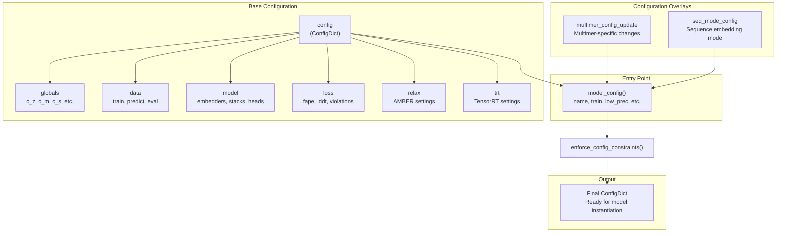
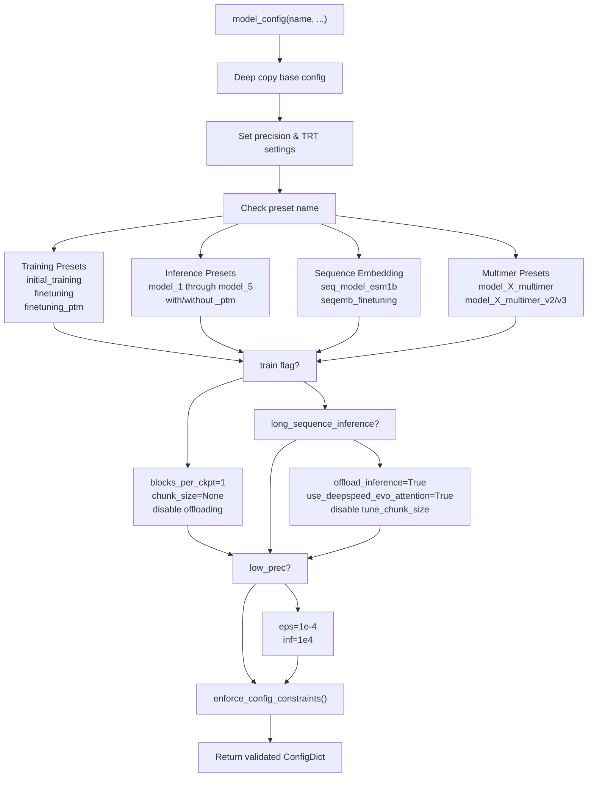
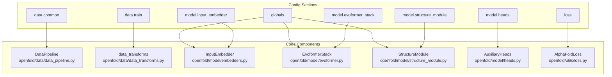
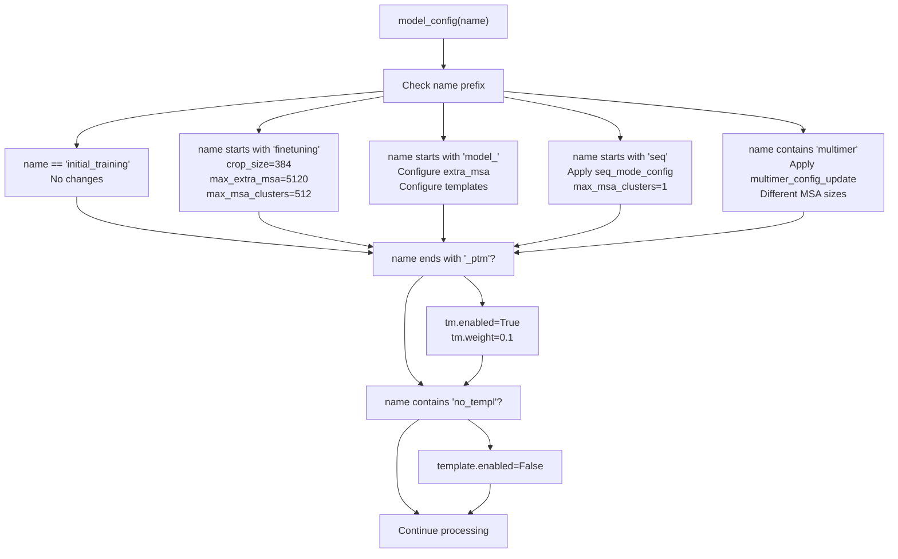
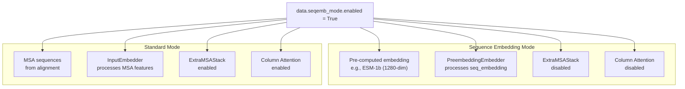

# Configuration System

> **Relevant source files**
> * [openfold/config.py](https://github.com/aqlaboratory/openfold/blob/56da08ec/openfold/config.py)
> * [openfold/model/dropout.py](https://github.com/aqlaboratory/openfold/blob/56da08ec/openfold/model/dropout.py)
> * [openfold/model/evoformer.py](https://github.com/aqlaboratory/openfold/blob/56da08ec/openfold/model/evoformer.py)

## Purpose and Scope

The Configuration System provides a centralized mechanism for managing all hyperparameters, architectural choices, and optimization settings in OpenFold. It defines model presets that match AlphaFold 2 paper specifications, controls data processing parameters, manages training and inference modes, and enables/disables various optimization kernels. The system is built on `ml_collections.ConfigDict` and provides validation to prevent incompatible settings.

For information about how the model uses these configurations, see [AlphaFold Model Overview](/aqlaboratory/openfold/5.2-alphafold-model-overview). For data processing configuration details, see [Data Transforms and Augmentation](/aqlaboratory/openfold/6.2-data-transforms-and-augmentation).

**Sources:** [openfold/config.py L1-L1014](https://github.com/aqlaboratory/openfold/blob/56da08ec/openfold/config.py#L1-L1014)

---

## Configuration Architecture Overview

The configuration system uses a hierarchical structure with a base configuration that gets modified by preset-specific updates. The main entry point is the `model_config()` function, which applies preset-specific modifications and enforces constraints.

### Configuration Hierarchy



**Diagram: Configuration System Architecture**

The base configuration defines all default values, which are then modified by preset names (e.g., "model_1_ptm", "finetuning") and configuration overlays for multimer or sequence embedding modes.

**Sources:** [openfold/config.py L85-L304](https://github.com/aqlaboratory/openfold/blob/56da08ec/openfold/config.py#L85-L304)

 [openfold/config.py L331-L798](https://github.com/aqlaboratory/openfold/blob/56da08ec/openfold/config.py#L331-L798)

 [openfold/config.py L800-L978](https://github.com/aqlaboratory/openfold/blob/56da08ec/openfold/config.py#L800-L978)

 [openfold/config.py L981-L1013](https://github.com/aqlaboratory/openfold/blob/56da08ec/openfold/config.py#L981-L1013)

---

## Main Entry Point: model_config()

The `model_config()` function at [openfold/config.py L85-L304](https://github.com/aqlaboratory/openfold/blob/56da08ec/openfold/config.py#L85-L304)

 is the primary interface for creating model configurations. It takes a preset name and optional flags, applies the appropriate modifications, and returns a validated `ConfigDict`.

### Function Signature

```python
def model_config(    name,                                      # Preset name    train=False,                               # Training vs inference    low_prec=False,                            # Lower precision settings    long_sequence_inference=False,             # Optimize for long sequences    use_deepspeed_evoformer_attention=False,   # DeepSpeed kernel    use_cuequivariance_attention=False,        # cuEquivariance kernels    use_cuequivariance_multiplicative_update=False,    precision="tf32",                          # Precision mode    trt_mode=None,                             # TensorRT mode    trt_engine_dir=None,                       # TensorRT engine path    trt_num_profiles=1,                        # TensorRT profiles    trt_optimization_level=3,                  # TensorRT optimization    trt_max_sequence_len=640,                  # TensorRT max length)
```

### Configuration Processing Flow



**Diagram: model_config() Processing Flow**

The function processes configurations in stages: copying the base config, applying preset-specific changes, applying mode-specific settings (training/long_sequence/low_prec), and enforcing constraints.

**Sources:** [openfold/config.py L85-L304](https://github.com/aqlaboratory/openfold/blob/56da08ec/openfold/config.py#L85-L304)

---

## Base Configuration Structure

The base configuration at [openfold/config.py L331-L798](https://github.com/aqlaboratory/openfold/blob/56da08ec/openfold/config.py#L331-L798)

 is a nested `ConfigDict` with five major sections: `data`, `globals`, `model`, `loss`, and `relax`. Each section controls a specific aspect of the system.

### Configuration Sections and Their Purposes

| Section | Purpose | Key Subsections |
| --- | --- | --- |
| `data.common` | Features expected in input batches, MSA/template settings | `feat`, `masked_msa`, `block_delete_msa`, `max_recycling_iters` |
| `data.train` | Training data processing | `crop_size`, `max_msa_clusters`, `max_extra_msa`, `block_delete_msa` |
| `data.predict` | Inference data processing | `fixed_size`, `max_msa_clusters`, `max_template_hits` |
| `data.eval` | Validation data processing | Similar to predict but with `supervised=True` |
| `globals` | Field references, optimization flags | `c_z`, `c_m`, `c_s`, `use_lma`, `use_flash`, `use_deepspeed_evo_attention` |
| `model` | Model architecture parameters | `input_embedder`, `evoformer_stack`, `structure_module`, `heads` |
| `loss` | Loss function weights and parameters | `fape`, `distogram`, `plddt_loss`, `violation`, `tm` |
| `relax` | AMBER relaxation settings | `max_iterations`, `tolerance`, `stiffness` |
| `trt` | TensorRT configuration | `mode`, `engine_dir`, `num_profiles`, `optimization_level` |

### Configuration to Model Component Mapping



**Diagram: Configuration Sections Map to Model Components**

Each configuration section directly controls the initialization and behavior of specific model components.

**Sources:** [openfold/config.py L331-L798](https://github.com/aqlaboratory/openfold/blob/56da08ec/openfold/config.py#L331-L798)

---

## Field References and Channel Dimensions

The configuration system uses `ml_collections.FieldReference` objects to define channel dimensions that are shared across multiple model components. This ensures consistency and makes it easy to modify dimensions globally.

### Core Field References

```markdown
c_z = mlc.FieldReference(128, field_type=int)   # Pair representation dimensionc_m = mlc.FieldReference(256, field_type=int)   # MSA representation dimensionc_t = mlc.FieldReference(64, field_type=int)    # Template embedding dimensionc_e = mlc.FieldReference(64, field_type=int)    # Extra MSA embedding dimensionc_s = mlc.FieldReference(384, field_type=int)   # Single representation dimension
```

These field references are defined at [openfold/config.py L307-L315](https://github.com/aqlaboratory/openfold/blob/56da08ec/openfold/config.py#L307-L315)

 and used throughout the configuration to ensure dimensional consistency.

### Field Reference Propagation

```mermaid
flowchart TD

C_Z["c_z = 128"]
C_M["c_m = 256"]
C_S["c_s = 384"]
C_T["c_t = 64"]
C_E["c_e = 64"]
GLOBALS_CZ["globals.c_z = c_z"]
GLOBALS_CM["globals.c_m = c_m"]
GLOBALS_CS["globals.c_s = c_s"]
INPUT_CZ["model.input_embedder.c_z = c_z"]
INPUT_CM["model.input_embedder.c_m = c_m"]
EVO_CZ["model.evoformer_stack.c_z = c_z"]
EVO_CM["model.evoformer_stack.c_m = c_m"]
EVO_CS["model.evoformer_stack.c_s = c_s"]
STRUCT_CZ["model.structure_module.c_z = c_z"]
STRUCT_CS["model.structure_module.c_s = c_s"]
TEMPL_CT["model.template.template_pair_stack.c_t = c_t"]
EXTRA_CE["model.extra_msa.extra_msa_stack.c_m = c_e"]
EXTRA_CZ["model.extra_msa.extra_msa_stack.c_z = c_z"]

C_Z --> GLOBALS_CZ
C_M --> GLOBALS_CM
C_S --> GLOBALS_CS
C_Z --> INPUT_CZ
C_M --> INPUT_CM
C_Z --> EVO_CZ
C_M --> EVO_CM
C_S --> EVO_CS
C_Z --> STRUCT_CZ
C_S --> STRUCT_CS
C_T --> TEMPL_CT
C_E --> EXTRA_CE
C_Z --> EXTRA_CZ

subgraph subGraph2 ["model Section"]
    INPUT_CZ
    INPUT_CM
    EVO_CZ
    EVO_CM
    EVO_CS
    STRUCT_CZ
    STRUCT_CS
    TEMPL_CT
    EXTRA_CE
    EXTRA_CZ
end

subgraph subGraph1 ["globals Section"]
    GLOBALS_CZ
    GLOBALS_CM
    GLOBALS_CS
end

subgraph subGraph0 ["Field References"]
    C_Z
    C_M
    C_S
    C_T
    C_E
end
```



**Diagram: Field Reference Propagation Through Configuration**

Field references ensure that channel dimensions are consistent across all model components that need to communicate with each other.

**Sources:** [openfold/config.py L307-L315](https://github.com/aqlaboratory/openfold/blob/56da08ec/openfold/config.py#L307-L315)

 [openfold/config.py L536-L710](https://github.com/aqlaboratory/openfold/blob/56da08ec/openfold/config.py#L536-L710)

---

## Configuration Presets

The configuration system provides multiple preset configurations that correspond to the models described in the AlphaFold 2 paper (Supplementary Tables 4 and 5).

### Training Presets

| Preset Name | Description | Key Settings |
| --- | --- | --- |
| `initial_training` | AF2 Suppl. Table 4, initial training | Base config with no modifications |
| `finetuning` | AF2 Suppl. Table 4, finetuning | `crop_size=384`, `max_extra_msa=5120`, `max_msa_clusters=512`, `violation.weight=1.0` |
| `finetuning_ptm` | Finetuning with pTM head | Same as finetuning + `tm.enabled=True`, `tm.weight=0.1` |
| `finetuning_no_templ` | Finetuning without templates | Same as finetuning + `template.enabled=False` |
| `finetuning_no_templ_ptm` | No templates with pTM | Combines no_templ and ptm settings |

**Sources:** [openfold/config.py L108-L143](https://github.com/aqlaboratory/openfold/blob/56da08ec/openfold/config.py#L108-L143)

### Inference Presets (Model 1-5)

The five model variants correspond to AlphaFold 2 Supplementary Table 5:

| Preset Name | Extra MSA | Templates | Template Torsions | Description |
| --- | --- | --- | --- | --- |
| `model_1` | 5120 | Yes | Yes | AF2 Model 1.1.1 |
| `model_2` | 1024 | Yes | Yes | AF2 Model 1.1.2 |
| `model_3` | 5120 | No | No | AF2 Model 1.2.1 |
| `model_4` | 5120 | No | No | AF2 Model 1.2.2 |
| `model_5` | 1024 | No | No | AF2 Model 1.2.3 |

Each model also has a `_ptm` variant that enables the predicted TM-score head:

* `model_1_ptm` through `model_5_ptm`

**Sources:** [openfold/config.py L145-L203](https://github.com/aqlaboratory/openfold/blob/56da08ec/openfold/config.py#L145-L203)

### Preset Processing Logic



**Diagram: Preset Name Processing Logic**

The function parses the preset name to determine which configuration modifications to apply.

**Sources:** [openfold/config.py L108-L266](https://github.com/aqlaboratory/openfold/blob/56da08ec/openfold/config.py#L108-L266)

---

## Multimer Configuration Updates

When the preset name contains "multimer", the `multimer_config_update` ConfigDict at [openfold/config.py L800-L978](https://github.com/aqlaboratory/openfold/blob/56da08ec/openfold/config.py#L800-L978)

 is merged into the base configuration. This update modifies numerous settings for protein complex prediction.

### Key Multimer Changes

| Configuration Path | Change | Reason |
| --- | --- | --- |
| `globals.is_multimer` | `True` | Enables multimer-specific code paths |
| `data.train.max_msa_clusters` | 508 | Larger MSA for complexes |
| `data.train.max_extra_msa` | 2048 | More extra MSA sequences |
| `data.train.crop_size` | 640 | Larger crops for complexes |
| `data.train.spatial_crop_prob` | 0.5 | Enable interface-aware cropping |
| `data.common.max_recycling_iters` | 20 | More recycling for complexes |
| `model.input_embedder.use_chain_relative` | `True` | Chain-aware embeddings |
| `model.evoformer_stack.opm_first` | `True` | Different operation order |
| `model.structure_module.trans_scale_factor` | 20 | Larger translation scale |
| `loss.fape.intra_chain_backbone` | Added | Separate intra-chain loss |
| `loss.fape.interface_backbone` | Added | Interface-specific loss |
| `loss.chain_center_of_mass.enabled` | `True` | Chain positioning loss |

### Multimer Feature Schema

The multimer update also defines a different feature schema with additional fields like `asym_id`, `entity_id`, `sym_id`, and `cluster_profile` at [openfold/config.py L806-L851](https://github.com/aqlaboratory/openfold/blob/56da08ec/openfold/config.py#L806-L851)

**Sources:** [openfold/config.py L800-L978](https://github.com/aqlaboratory/openfold/blob/56da08ec/openfold/config.py#L800-L978)

---

## Sequence Embedding Mode Configuration

For single-sequence inference without MSA generation, the `seq_mode_config` at [openfold/config.py L981-L1013](https://github.com/aqlaboratory/openfold/blob/56da08ec/openfold/config.py#L981-L1013)

 modifies the configuration to use pre-computed sequence embeddings (e.g., from ESM-1b).

### Sequence Embedding Mode Changes



**Diagram: Sequence Embedding Mode vs Standard Mode**

Sequence embedding mode bypasses MSA processing and uses a different embedder.

### Key Settings

| Configuration Path | Value | Effect |
| --- | --- | --- |
| `data.seqemb_mode.enabled` | `True` | Enable sequence embedding mode |
| `globals.seqemb_mode_enabled` | `True` | Global flag for code paths |
| `data.train.max_msa_clusters` | 1 | Only query sequence |
| `model.extra_msa.enabled` | `False` | Disable extra MSA stack |
| `model.evoformer_stack.no_column_attention` | `True` | No column attention needed |
| `model.preembedding_embedder.preembedding_dim` | 1280 | ESM-1b embedding dimension |

**Sources:** [openfold/config.py L981-L1013](https://github.com/aqlaboratory/openfold/blob/56da08ec/openfold/config.py#L981-L1013)

 [openfold/config.py L204-L230](https://github.com/aqlaboratory/openfold/blob/56da08ec/openfold/config.py#L204-L230)

---

## Global Settings and Optimization Flags

The `globals` section at [openfold/config.py L517-L544](https://github.com/aqlaboratory/openfold/blob/56da08ec/openfold/config.py#L517-L544)

 contains field references and flags that control optimization strategies and global behavior.

### Optimization Kernel Flags

These flags are mutually exclusive and control which attention kernel implementation to use:

| Flag | Description | Mutually Exclusive With | Best For |
| --- | --- | --- | --- |
| `use_lma` | Low-memory attention (Staats & Rabe algorithm) | `use_flash`, `use_deepspeed_evo_attention` | Very long sequences, CPU offloading |
| `use_flash` | FlashAttention kernel | `use_lma`, `use_deepspeed_evo_attention` | Short to medium sequences (<1000 residues) |
| `use_deepspeed_evo_attention` | DeepSpeed DS4Sci kernel | `use_lma`, `use_flash` | Long sequences, memory efficiency |
| `use_cuequivariance_attention` | cuEquivariance triangle attention | `use_lma`, `use_flash` | Triangle attention optimization |
| `use_cuequivariance_multiplicative_update` | cuEquivariance multiplicative update | None | Triangle multiplicative update optimization |

### Global Flags

| Flag | Default | Description |
| --- | --- | --- |
| `blocks_per_ckpt` | `None` | Number of Evoformer blocks per activation checkpoint (training only) |
| `chunk_size` | 4 | Inference subbatch size for memory efficiency |
| `offload_inference` | `False` | Offload intermediate tensors to CPU during inference |
| `eps` | 1e-8 | Numerical stability epsilon |

### Optimization Flag Enforcement

The `enforce_config_constraints()` function at [openfold/config.py L30-L83](https://github.com/aqlaboratory/openfold/blob/56da08ec/openfold/config.py#L30-L83)

 validates that:

1. Mutually exclusive options are not enabled simultaneously
2. Required packages are installed for enabled features
3. Dependent settings are consistent (e.g., `offload_inference` requires specific template settings)

```
mutually_exclusive_bools = [    ("model.template.average_templates", "model.template.offload_templates"),    ("globals.use_lma", "globals.use_flash", "globals.use_deepspeed_evo_attention"),    ("globals.use_lma", "globals.use_flash", "globals.use_cuequivariance_attention"),]
```

**Sources:** [openfold/config.py L30-L83](https://github.com/aqlaboratory/openfold/blob/56da08ec/openfold/config.py#L30-L83)

 [openfold/config.py L517-L544](https://github.com/aqlaboratory/openfold/blob/56da08ec/openfold/config.py#L517-L544)

---

## Training vs Inference Mode Differences

The `train` flag in `model_config()` triggers specific configuration changes optimized for training at [openfold/config.py L288-L294](https://github.com/aqlaboratory/openfold/blob/56da08ec/openfold/config.py#L288-L294)

### Training Mode Settings

| Setting | Training Value | Inference Value | Reason |
| --- | --- | --- | --- |
| `globals.blocks_per_ckpt` | 1 | `None` | Enable activation checkpointing |
| `globals.chunk_size` | `None` | 4 | No chunking during training |
| `globals.use_lma` | `False` | Variable | LMA only for inference |
| `globals.offload_inference` | `False` | Variable | No offloading during training |
| `model.template.average_templates` | `False` | `False` | Explicit template processing |
| `model.template.offload_templates` | `False` | Variable | No offloading during training |

### Long Sequence Inference Mode

When `long_sequence_inference=True` at [openfold/config.py L268-L277](https://github.com/aqlaboratory/openfold/blob/56da08ec/openfold/config.py#L268-L277)

 the configuration is optimized for sequences >1000 residues:

```
c.globals.offload_inference = Truec.globals.use_deepspeed_evo_attention = True if not c.globals.use_lma else Falsec.model.template.offload_inference = Truec.model.template.template_pair_stack.tune_chunk_size = Falsec.model.extra_msa.extra_msa_stack.tune_chunk_size = Falsec.model.evoformer_stack.tune_chunk_size = False
```

**Sources:** [openfold/config.py L268-L294](https://github.com/aqlaboratory/openfold/blob/56da08ec/openfold/config.py#L268-L294)

---

## Data Configuration Schema

The `data.common.feat` section at [openfold/config.py L343-L408](https://github.com/aqlaboratory/openfold/blob/56da08ec/openfold/config.py#L343-L408)

 defines the expected shape schema for all features in input batches. This schema uses placeholder strings for dynamic dimensions.

### Dynamic Dimension Placeholders

```
NUM_RES = "num residues placeholder"NUM_MSA_SEQ = "msa placeholder"NUM_EXTRA_SEQ = "extra msa placeholder"NUM_TEMPLATES = "num templates placeholder"
```

### Example Feature Shapes

| Feature Name | Shape | Description |
| --- | --- | --- |
| `aatype` | `[NUM_RES]` | Amino acid type indices |
| `msa_feat` | `[NUM_MSA_SEQ, NUM_RES, None]` | MSA features (25 or 49 channels) |
| `target_feat` | `[NUM_RES, None]` | Target sequence features (22 channels) |
| `template_all_atom_positions` | `[NUM_TEMPLATES, NUM_RES, None, None]` | Template atom coordinates |
| `extra_msa` | `[NUM_EXTRA_SEQ, NUM_RES]` | Extra MSA sequences |

The data transforms use these shapes to validate and process features correctly.

**Sources:** [openfold/config.py L326-L408](https://github.com/aqlaboratory/openfold/blob/56da08ec/openfold/config.py#L326-L408)

---

## Loss Configuration

The `loss` section at [openfold/config.py L725-L795](https://github.com/aqlaboratory/openfold/blob/56da08ec/openfold/config.py#L725-L795)

 defines weights and parameters for all loss components used during training.

### Loss Component Weights

| Loss Component | Config Path | Default Weight | Purpose |
| --- | --- | --- | --- |
| FAPE (Frame Aligned Point Error) | `loss.fape.weight` | 1.0 | Primary structure loss |
| pLDDT | `loss.plddt_loss.weight` | 0.01 | Per-residue confidence |
| Masked MSA | `loss.masked_msa.weight` | 2.0 | MSA reconstruction |
| Distogram | `loss.distogram.weight` | 0.3 | Distance distribution |
| Supervised Chi | `loss.supervised_chi.weight` | 1.0 | Side-chain torsion angles |
| Violations | `loss.violation.weight` | 0.0 (0.03 for multimer) | Structural violations |
| TM-score | `loss.tm.weight` | 0.0 (0.1 if enabled) | Predicted TM-score |
| Experimentally Resolved | `loss.experimentally_resolved.weight` | 0.0 (0.01 for finetuning) | Resolution prediction |

### Preset-Specific Loss Weights

Different presets modify loss weights:

* **Initial Training**: All defaults
* **Finetuning**: `violation.weight=1.0`, `experimentally_resolved.weight=0.01`
* **PTM Models**: `tm.weight=0.1`, `tm.enabled=True`
* **Multimer**: `violation.weight=0.03`, `tm.weight=0.1`, `chain_center_of_mass.weight=0.05`

**Sources:** [openfold/config.py L725-L795](https://github.com/aqlaboratory/openfold/blob/56da08ec/openfold/config.py#L725-L795)

---

## Using Configurations in Code

### Creating a Configuration

```javascript
from openfold.config import model_config # Create a configuration for inference with model 1config = model_config("model_1") # Create a configuration for trainingconfig = model_config("finetuning", train=True) # Create a configuration for long sequence inferenceconfig = model_config("model_3", long_sequence_inference=True) # Create a configuration with custom optimizationconfig = model_config(    "model_2_ptm",    use_deepspeed_evoformer_attention=True,    precision="bf16")
```

### Accessing Configuration Values

```markdown
# Access nested configuration valuesmsa_channels = config.globals.c_m  # 256pair_channels = config.globals.c_z  # 128num_blocks = config.model.evoformer_stack.no_blocks  # 48 # Check optimization flagsuse_flash = config.globals.use_flashuse_deepspeed = config.globals.use_deepspeed_evo_attention # Get data processing parametersmax_msa = config.data.predict.max_msa_clusterscrop_size = config.data.train.crop_size
```

### Modifying Configurations

```javascript
# Create a base configurationconfig = model_config("model_3") # Modify specific settingsconfig.globals.chunk_size = 8config.data.predict.max_msa_clusters = 256config.model.evoformer_stack.no_blocks = 24 # Re-enforce constraints after modificationsfrom openfold.config import enforce_config_constraintsenforce_config_constraints(config)
```

### Configuration in Model Initialization

The `AlphaFold` class and other model components receive the configuration and extract relevant parameters:

```python
class EvoformerStack(nn.Module):    def __init__(self, **config):        super().__init__()        self.blocks_per_ckpt = config["blocks_per_ckpt"]        c_m = config["c_m"]        c_z = config["c_z"]        no_blocks = config["no_blocks"]        # ... use config values to initialize submodules
```

**Sources:** [openfold/model/evoformer.py L776-L882](https://github.com/aqlaboratory/openfold/blob/56da08ec/openfold/model/evoformer.py#L776-L882)

---

## TensorRT Configuration

The `trt` section at [openfold/config.py L334-L340](https://github.com/aqlaboratory/openfold/blob/56da08ec/openfold/config.py#L334-L340)

 controls TensorRT compilation settings for optimized inference.

### TensorRT Settings

| Setting | Default | Description |
| --- | --- | --- |
| `trt.mode` | `None` | TensorRT mode: `None`, `"torch_compile"`, or `"tensorrt"` |
| `trt.engine_dir` | `None` | Directory for cached TensorRT engines |
| `trt.num_profiles` | 1 | Number of optimization profiles for dynamic shapes |
| `trt.optimization_level` | 3 | TensorRT builder optimization level (0-5) |
| `trt.max_sequence_len` | 640 | Maximum sequence length for TensorRT optimization |

These settings are set via the `model_config()` function parameters and control how the model is compiled for inference optimization.

**Sources:** [openfold/config.py L334-L340](https://github.com/aqlaboratory/openfold/blob/56da08ec/openfold/config.py#L334-L340)

 [openfold/config.py L94-L106](https://github.com/aqlaboratory/openfold/blob/56da08ec/openfold/config.py#L94-L106)

---

## Configuration Best Practices

### For Inference

1. **Choose the appropriate preset**: Use `model_1` through `model_5` based on template availability and computational budget
2. **Enable optimization kernels**: Set `use_deepspeed_evoformer_attention=True` for long sequences
3. **Use long sequence mode**: Enable `long_sequence_inference=True` for proteins >1000 residues
4. **Adjust chunk size**: Increase `chunk_size` if you have sufficient GPU memory

### For Training

1. **Start with appropriate preset**: Use `initial_training` or `finetuning` based on training stage
2. **Enable checkpointing**: The `train=True` flag automatically sets `blocks_per_ckpt=1`
3. **Adjust crop size**: Use smaller `crop_size` for initial training, larger for finetuning
4. **Set loss weights**: Modify loss weights in the config based on training objectives

### For Multimer

1. **Use multimer presets**: Always use presets with "multimer" in the name for protein complexes
2. **Increase MSA limits**: Multimer configs automatically set higher MSA cluster limits
3. **Enable interface losses**: The multimer config enables chain_center_of_mass and interface FAPE losses

**Sources:** [openfold/config.py L85-L304](https://github.com/aqlaboratory/openfold/blob/56da08ec/openfold/config.py#L85-L304)

---

## Configuration Validation and Constraints

The `enforce_config_constraints()` function at [openfold/config.py L30-L83](https://github.com/aqlaboratory/openfold/blob/56da08ec/openfold/config.py#L30-L83)

 performs validation to prevent invalid configurations.

### Constraint Checks

1. **Mutually Exclusive Options**: Ensures only one attention kernel is enabled
2. **Package Availability**: Checks that required packages are installed for enabled features
3. **Dependent Settings**: Validates that dependent settings are consistent

### Error Examples

```markdown
# This will raise an error:config = model_config("model_1")config.globals.use_flash = Trueconfig.globals.use_lma = Trueenforce_config_constraints(config)# ValueError: Only one of globals.use_lma, globals.use_flash, # globals.use_deepspeed_evo_attention may be set at a time # This will raise an error if FlashAttention is not installed:config = model_config("model_1")config.globals.use_flash = Trueenforce_config_constraints(config)# ValueError: use_flash requires that FlashAttention is installed
```

### Automatic Constraint Application

The `enforce_config_constraints()` function also applies automatic fixes for dependent settings:

```
if config.globals.offload_inference and not config.model.template.average_templates:    config.model.template.offload_templates = True
```

**Sources:** [openfold/config.py L30-L83](https://github.com/aqlaboratory/openfold/blob/56da08ec/openfold/config.py#L30-L83)