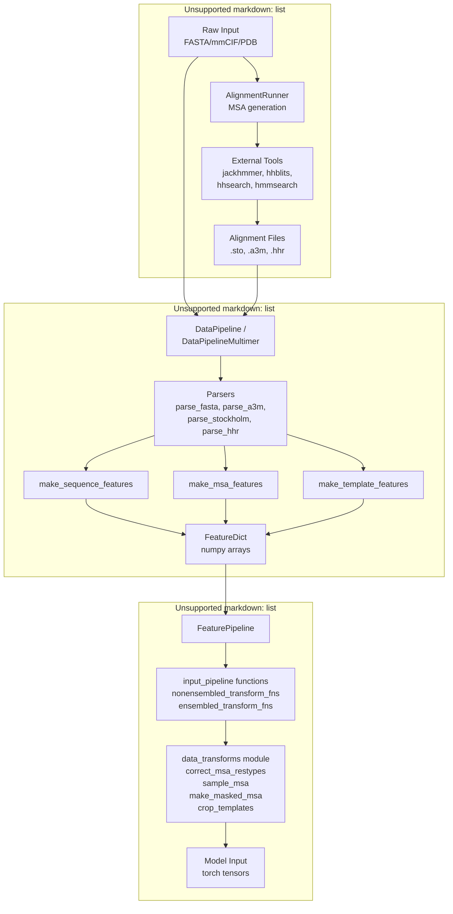
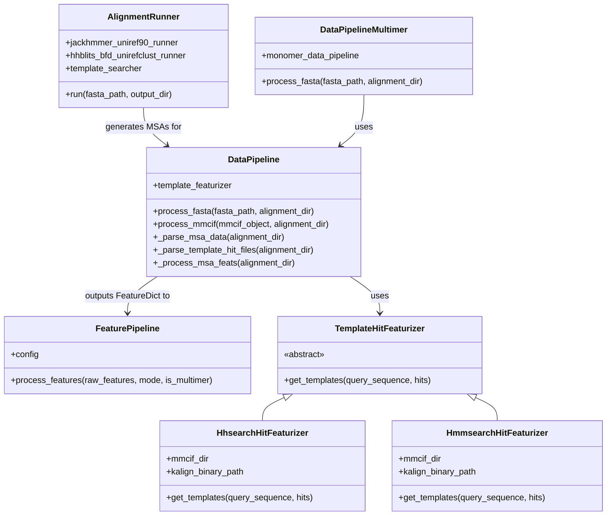
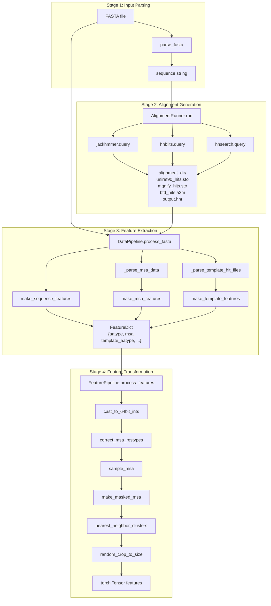
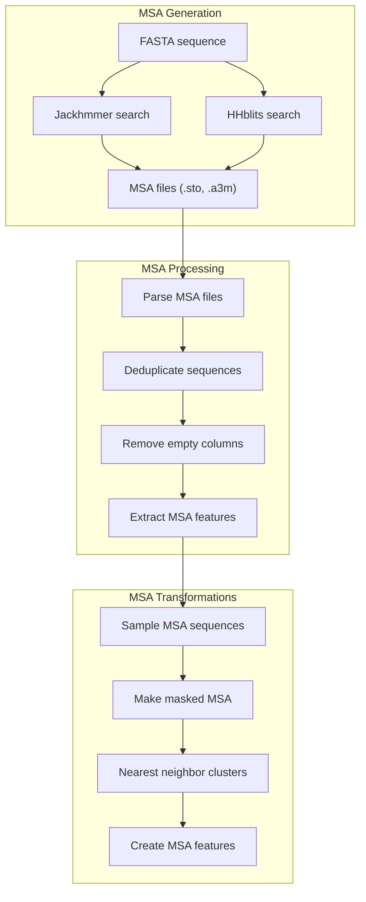
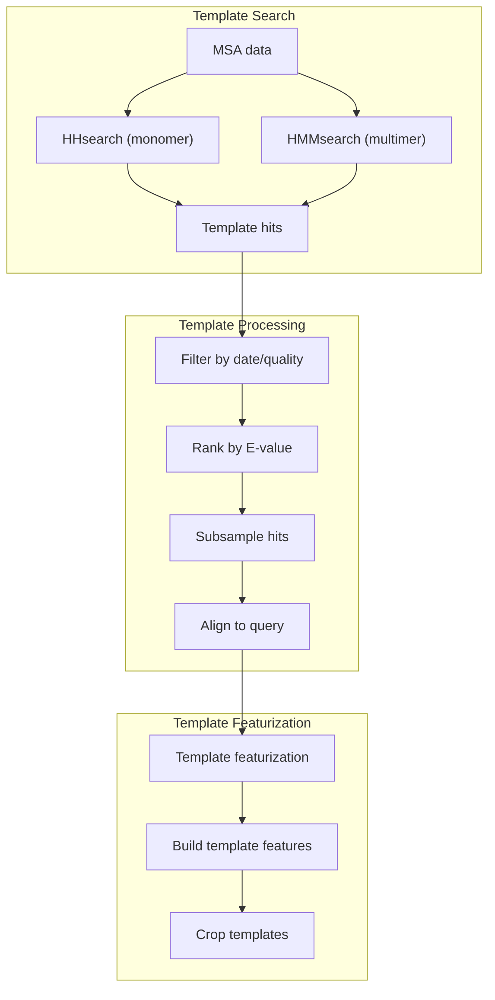
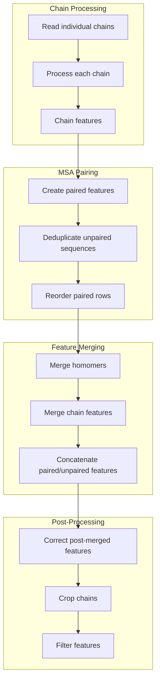

# Data Processing Pipeline

> **Relevant source files**
> * [README.md](https://github.com/aqlaboratory/openfold/blob/56da08ec/README.md?plain=1)
> * [openfold/data/data_pipeline.py](https://github.com/aqlaboratory/openfold/blob/56da08ec/openfold/data/data_pipeline.py)
> * [openfold/data/data_transforms.py](https://github.com/aqlaboratory/openfold/blob/56da08ec/openfold/data/data_transforms.py)
> * [openfold/data/input_pipeline.py](https://github.com/aqlaboratory/openfold/blob/56da08ec/openfold/data/input_pipeline.py)
> * [openfold/data/templates.py](https://github.com/aqlaboratory/openfold/blob/56da08ec/openfold/data/templates.py)
> * [run_pretrained_openfold.py](https://github.com/aqlaboratory/openfold/blob/56da08ec/run_pretrained_openfold.py)
> * [scripts/generate_mmcif_cache.py](https://github.com/aqlaboratory/openfold/blob/56da08ec/scripts/generate_mmcif_cache.py)
> * [scripts/precompute_alignments.py](https://github.com/aqlaboratory/openfold/blob/56da08ec/scripts/precompute_alignments.py)
> * [scripts/utils.py](https://github.com/aqlaboratory/openfold/blob/56da08ec/scripts/utils.py)
> * [tests/test_data/features.pkl](https://github.com/aqlaboratory/openfold/blob/56da08ec/tests/test_data/features.pkl)
> * [tests/test_data_transforms.py](https://github.com/aqlaboratory/openfold/blob/56da08ec/tests/test_data_transforms.py)

The data processing pipeline transforms raw protein data (sequences, structures, MSAs) into the standardized tensor format required by the AlphaFold model. The pipeline handles both monomer and multimer predictions, supports training and inference modes, and manages the complex workflow of MSA generation, template search, and feature extraction.

## System Architecture

The data processing system consists of three major subsystems that work sequentially:

**High-level Data Processing Architecture**



Sources:

* [openfold/data/data_pipeline.py L334-L475](https://github.com/aqlaboratory/openfold/blob/56da08ec/openfold/data/data_pipeline.py#L334-L475)
* [openfold/data/data_pipeline.py L706-L914](https://github.com/aqlaboratory/openfold/blob/56da08ec/openfold/data/data_pipeline.py#L706-L914)
* [openfold/data/feature_pipeline.py L1-L153](https://github.com/aqlaboratory/openfold/blob/56da08ec/openfold/data/feature_pipeline.py#L1-L153)
* [run_pretrained_openfold.py L63-L175](https://github.com/aqlaboratory/openfold/blob/56da08ec/run_pretrained_openfold.py#L63-L175)

## Key Components

The pipeline is organized into several specialized components, each handling a specific aspect of data processing:

| Component | Purpose | Key Classes/Functions | Details |
| --- | --- | --- | --- |
| **MSA Generation** | Generate multiple sequence alignments | `AlignmentRunner``Jackhmmer`, `HHBlits` | See [MSA and Template Processing](/aqlaboratory/openfold/6.3-msa-and-template-processing) |
| **Data Pipeline** | Convert raw data to FeatureDict | `DataPipeline``DataPipelineMultimer` | See [Data Pipeline and Feature Generation](/aqlaboratory/openfold/6.1-data-pipeline-and-feature-generation) |
| **Feature Pipeline** | Apply transforms to features | `FeaturePipeline``np_example_to_features` | See [Data Pipeline and Feature Generation](/aqlaboratory/openfold/6.1-data-pipeline-and-feature-generation) |
| **Data Transforms** | Augmentation and normalization | `data_transforms` module`data_transforms_multimer` module | See [Data Transforms and Augmentation](/aqlaboratory/openfold/6.2-data-transforms-and-augmentation) |
| **Template Processing** | Search and featurize templates | `HhsearchHitFeaturizer``HmmsearchHitFeaturizer` | See [MSA and Template Processing](/aqlaboratory/openfold/6.3-msa-and-template-processing) |
| **Multimer Processing** | Handle multi-chain proteins | `msa_pairing` module`feature_processing_multimer` module | See [Multimer-Specific Processing](/aqlaboratory/openfold/6.4-multimer-specific-processing) |

**Core Classes and Their Relationships**



Sources:

* [openfold/data/data_pipeline.py L334-L475](https://github.com/aqlaboratory/openfold/blob/56da08ec/openfold/data/data_pipeline.py#L334-L475)
* [openfold/data/data_pipeline.py L706-L914](https://github.com/aqlaboratory/openfold/blob/56da08ec/openfold/data/data_pipeline.py#L706-L914)
* [openfold/data/data_pipeline.py L938-L1138](https://github.com/aqlaboratory/openfold/blob/56da08ec/openfold/data/data_pipeline.py#L938-L1138)
* [openfold/data/feature_pipeline.py L132-L153](https://github.com/aqlaboratory/openfold/blob/56da08ec/openfold/data/feature_pipeline.py#L132-L153)
* [openfold/data/templates.py L738-L1068](https://github.com/aqlaboratory/openfold/blob/56da08ec/openfold/data/templates.py#L738-L1068)

## Data Flow

The pipeline processes data through several distinct stages, each transforming the representation progressively:

**End-to-End Data Flow**



### FeatureDict Structure

The `FeatureDict` is the intermediate representation between raw data and model input. It contains numpy arrays with standardized shapes:

| Feature Name | Shape | Description |
| --- | --- | --- |
| `aatype` | `[N_res, 21]` or `[N_res]` | One-hot or integer amino acid types |
| `residue_index` | `[N_res]` | Residue indices (0 to N_res-1) |
| `msa` | `[N_seq, N_res]` | MSA sequences (integer encoded) |
| `deletion_matrix_int` | `[N_seq, N_res]` | Deletion counts in MSA |
| `template_aatype` | `[N_templ, N_res, 22]` | Template amino acid types |
| `template_all_atom_positions` | `[N_templ, N_res, 37, 3]` | Template atom coordinates |
| `template_all_atom_mask` | `[N_templ, N_res, 37]` | Template atom masks |

Sources:

* [run_pretrained_openfold.py L63-L175](https://github.com/aqlaboratory/openfold/blob/56da08ec/run_pretrained_openfold.py#L63-L175)
* [openfold/data/data_pipeline.py L864-L914](https://github.com/aqlaboratory/openfold/blob/56da08ec/openfold/data/data_pipeline.py#L864-L914)
* [openfold/data/data_pipeline.py L111-L130](https://github.com/aqlaboratory/openfold/blob/56da08ec/openfold/data/data_pipeline.py#L111-L130)
* [openfold/data/data_pipeline.py L224-L261](https://github.com/aqlaboratory/openfold/blob/56da08ec/openfold/data/data_pipeline.py#L224-L261)
* [openfold/data/feature_pipeline.py L79-L128](https://github.com/aqlaboratory/openfold/blob/56da08ec/openfold/data/feature_pipeline.py#L79-L128)

## MSA and Template Processing

Multiple Sequence Alignments (MSAs) and structural templates are critical components of AlphaFold's accuracy. OpenFold provides robust processing for both:

### MSA Processing

MSAs are generated using tools like Jackhmmer and HHblits, then processed to extract evolutionarily relevant information:



Sources:

* [openfold/data/data_pipeline.py L477-L562](https://github.com/aqlaboratory/openfold/blob/56da08ec/openfold/data/data_pipeline.py#L477-L562)
* [openfold/data/data_pipeline.py L224-L259](https://github.com/aqlaboratory/openfold/blob/56da08ec/openfold/data/data_pipeline.py#L224-L259)
* [openfold/data/data_transforms_multimer.py L75-L125](https://github.com/aqlaboratory/openfold/blob/56da08ec/openfold/data/data_transforms_multimer.py#L75-L125)
* [openfold/data/data_transforms_multimer.py L129-L183](https://github.com/aqlaboratory/openfold/blob/56da08ec/openfold/data/data_transforms_multimer.py#L129-L183)
* [openfold/data/data_transforms_multimer.py L257-L294](https://github.com/aqlaboratory/openfold/blob/56da08ec/openfold/data/data_transforms_multimer.py#L257-L294)

Key MSA processing steps include:

1. Sequence alignment using external tools
2. Parsing alignment files (.sto, .a3m)
3. Deduplication and filtering
4. Feature extraction (insertions, deletions, conservation)
5. Sampling and cropping for fixed-size inputs
6. BERT-style masking for masked MSA prediction

### Template Processing

Template structures are found and processed to provide structural priors:



Sources:

* [openfold/data/data_pipeline.py L500-L518](https://github.com/aqlaboratory/openfold/blob/56da08ec/openfold/data/data_pipeline.py#L500-L518)
* [openfold/data/data_pipeline.py L46-L63](https://github.com/aqlaboratory/openfold/blob/56da08ec/openfold/data/data_pipeline.py#L46-L63)
* [openfold/data/data_pipeline.py L159-L167](https://github.com/aqlaboratory/openfold/blob/56da08ec/openfold/data/data_pipeline.py#L159-L167)
* [openfold/data/data_pipeline.py L405-L413](https://github.com/aqlaboratory/openfold/blob/56da08ec/openfold/data/data_pipeline.py#L405-L413)

Template processing includes:

1. Finding template structures using HHsearch (monomer) or HMMsearch (multimer)
2. Filtering by release date and quality metrics
3. Ranking and selecting the top templates
4. Aligning templates to the target sequence
5. Extracting template features (atom positions, amino acid types, masks)

## Multimer Data Processing

For multi-chain proteins (multimers), OpenFold implements specialized processing:



Sources:

* [openfold/data/msa_pairing.py L56-L88](https://github.com/aqlaboratory/openfold/blob/56da08ec/openfold/data/msa_pairing.py#L56-L88)
* [openfold/data/msa_pairing.py L181-L232](https://github.com/aqlaboratory/openfold/blob/56da08ec/openfold/data/msa_pairing.py#L181-L232)
* [openfold/data/msa_pairing.py L356-L457](https://github.com/aqlaboratory/openfold/blob/56da08ec/openfold/data/msa_pairing.py#L356-L457)
* [openfold/data/feature_processing_multimer.py L50-L83](https://github.com/aqlaboratory/openfold/blob/56da08ec/openfold/data/feature_processing_multimer.py#L50-L83)
* [openfold/data/feature_processing_multimer.py L87-L116](https://github.com/aqlaboratory/openfold/blob/56da08ec/openfold/data/feature_processing_multimer.py#L87-L116)

Key multimer processing steps include:

1. Processing each chain individually
2. Pairing MSA sequences across chains based on species
3. Merging identical chains (homomers) efficiently
4. Combining features from all chains
5. Special handling for template features across chains
6. Cropping the combined features to manageable sizes

## Data Transformations

The data undergoes various transformations to prepare it for model input:

### Non-ensembled Transforms

Applied once to the input data:

* Converting data types (e.g., 64-bit integers)
* Creating MSA profiles
* Creating target features
* Making atom masks

### Ensembled Transforms

Applied multiple times for recycling:

* MSA sampling
* MSA masking for BERT-style training
* MSA clustering
* Cropping to fixed size

These transformations are implemented in `data_transforms.py` and `data_transforms_multimer.py`.

Sources:

* [openfold/data/input_pipeline_multimer.py L36-L45](https://github.com/aqlaboratory/openfold/blob/56da08ec/openfold/data/input_pipeline_multimer.py#L36-L45)
* [openfold/data/input_pipeline_multimer.py L48-L113](https://github.com/aqlaboratory/openfold/blob/56da08ec/openfold/data/input_pipeline_multimer.py#L48-L113)
* [openfold/data/data_transforms_multimer.py L75-L125](https://github.com/aqlaboratory/openfold/blob/56da08ec/openfold/data/data_transforms_multimer.py#L75-L125)
* [openfold/data/data_transforms_multimer.py L257-L294](https://github.com/aqlaboratory/openfold/blob/56da08ec/openfold/data/data_transforms_multimer.py#L257-L294)

## Training Data Handling

For training, the pipeline includes additional components for data filtering, batching, and augmentation:

### Filtering

Training data undergoes both deterministic and stochastic filtering:

```markdown
# Deterministic filtersresolution_filter(resolution, max_resolution)aa_count_filter(seqs, max_single_aa_prop) # Stochastic filters# Prefer diverse sequences (inversely proportional to cluster size)# Prefer medium-length chains
```

### Batching and Recycling

The `OpenFoldDataLoader` handles batching and adds batch properties like recycling iterations:

```markdown
# Add number of recycling iterationsrecycling_probs = [1. / (max_iters + 1) for _ in range(max_iters + 1)]# Or use the maximum number of recycling iterations by defaultrecycling_probs = [0. for _ in range(max_iters + 1)]recycling_probs[-1] = 1.
```

Sources:

* [openfold/data/data_modules.py L507-L532](https://github.com/aqlaboratory/openfold/blob/56da08ec/openfold/data/data_modules.py#L507-L532)
* [openfold/data/data_modules.py L560-L595](https://github.com/aqlaboratory/openfold/blob/56da08ec/openfold/data/data_modules.py#L560-L595)
* [openfold/data/data_modules.py L708-L713](https://github.com/aqlaboratory/openfold/blob/56da08ec/openfold/data/data_modules.py#L708-L713)
* [openfold/data/data_modules.py L762-L845](https://github.com/aqlaboratory/openfold/blob/56da08ec/openfold/data/data_modules.py#L762-L845)

## Summary

The OpenFold data processing pipeline is a sophisticated system that:

1. Loads protein data from various formats
2. Generates and processes MSAs and templates
3. Extracts and transforms features for model input
4. Handles both monomer and multimer proteins
5. Provides specialized functionality for training data

This pipeline is critical for achieving high-quality protein structure predictions, as it prepares the complex evolutionary and structural information needed by the model.

Sources:

* [openfold/data/data_pipeline.py](https://github.com/aqlaboratory/openfold/blob/56da08ec/openfold/data/data_pipeline.py)
* [openfold/data/feature_pipeline.py](https://github.com/aqlaboratory/openfold/blob/56da08ec/openfold/data/feature_pipeline.py)
* [openfold/data/data_modules.py](https://github.com/aqlaboratory/openfold/blob/56da08ec/openfold/data/data_modules.py)