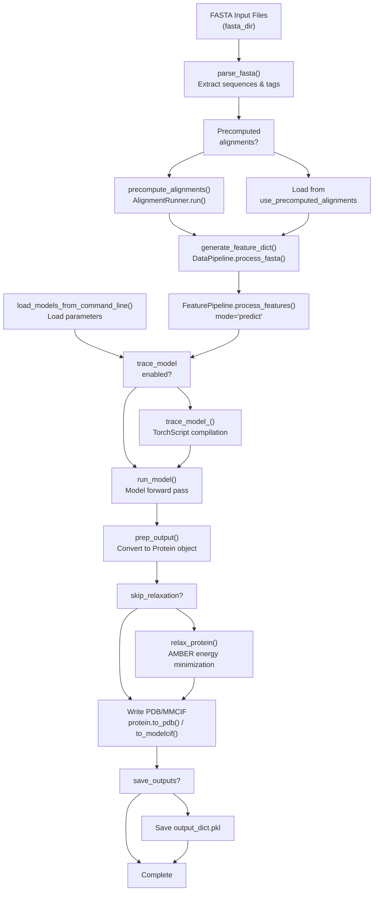
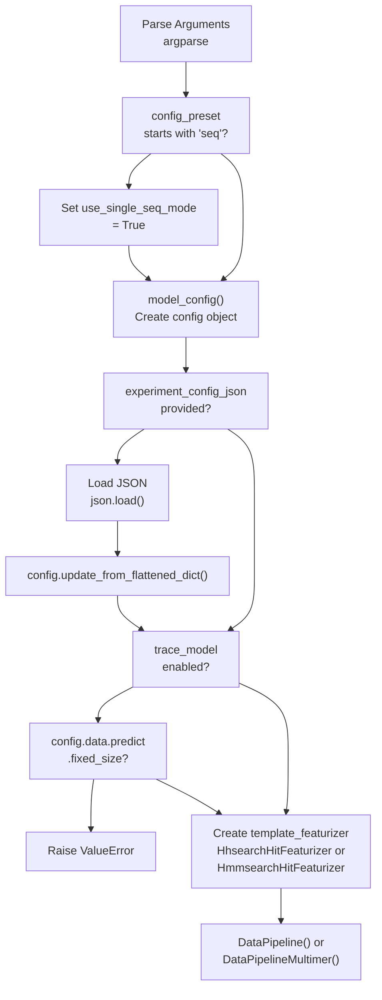
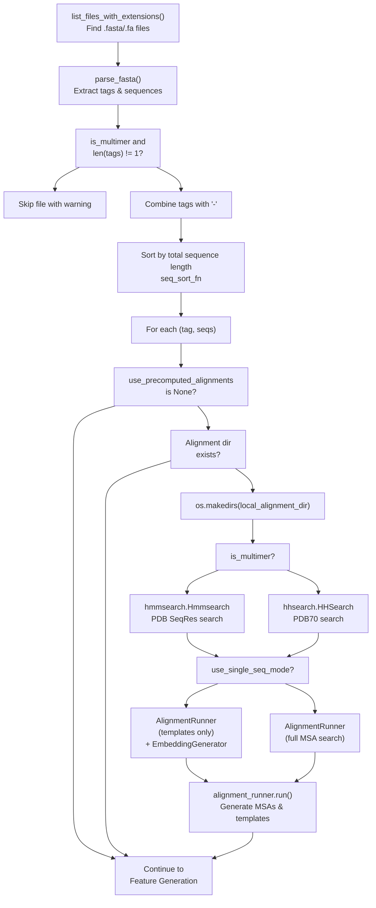
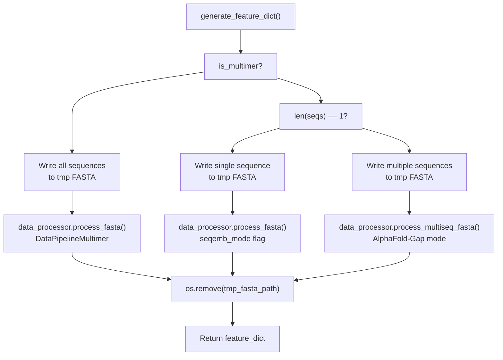
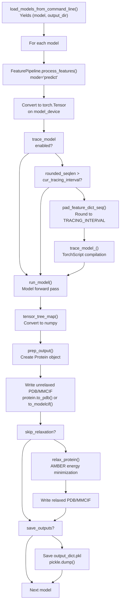

# Inference Pipeline Overview

> **Relevant source files**
> * [README.md](https://github.com/aqlaboratory/openfold/blob/56da08ec/README.md?plain=1)
> * [docs/source/Inference.md](https://github.com/aqlaboratory/openfold/blob/56da08ec/docs/source/Inference.md?plain=1)
> * [docs/source/Multimer_Inference.md](https://github.com/aqlaboratory/openfold/blob/56da08ec/docs/source/Multimer_Inference.md?plain=1)
> * [docs/source/Single_Sequence_Inference.md](https://github.com/aqlaboratory/openfold/blob/56da08ec/docs/source/Single_Sequence_Inference.md?plain=1)
> * [docs/source/conf.py](https://github.com/aqlaboratory/openfold/blob/56da08ec/docs/source/conf.py)
> * [openfold/data/data_pipeline.py](https://github.com/aqlaboratory/openfold/blob/56da08ec/openfold/data/data_pipeline.py)
> * [openfold/data/templates.py](https://github.com/aqlaboratory/openfold/blob/56da08ec/openfold/data/templates.py)
> * [run_pretrained_openfold.py](https://github.com/aqlaboratory/openfold/blob/56da08ec/run_pretrained_openfold.py)
> * [scripts/generate_mmcif_cache.py](https://github.com/aqlaboratory/openfold/blob/56da08ec/scripts/generate_mmcif_cache.py)
> * [scripts/precompute_alignments.py](https://github.com/aqlaboratory/openfold/blob/56da08ec/scripts/precompute_alignments.py)
> * [scripts/utils.py](https://github.com/aqlaboratory/openfold/blob/56da08ec/scripts/utils.py)

This page provides a detailed explanation of OpenFold's inference pipeline, centered around the `run_pretrained_openfold.py`() script. It covers the complete workflow from FASTA input to predicted structure output, including command-line arguments, data processing steps, and model execution.

For specific inference modes and their configurations, see [Monomer Inference](/aqlaboratory/openfold/3.2-monomer-inference), [Multimer Inference](/aqlaboratory/openfold/3.3-multimer-inference), and [Single Sequence (SoloSeq) Inference](/aqlaboratory/openfold/3.4-single-sequence-(soloseq)-inference). For performance optimization strategies, see [Performance Optimization](/aqlaboratory/openfold/3.6-performance-optimization).

## Script Entry Point

The inference pipeline is executed via the `run_pretrained_openfold.py` script, which serves as the primary command-line interface for structure prediction. The script orchestrates alignment generation, feature processing, model loading, and structure prediction.

**Main Entry Point**: `run_pretrained_openfold.py:397-541`()

**Core Execution Function**: `run_pretrained_openfold.py:177-395`()

Sources: [run_pretrained_openfold.py L1-L542](https://github.com/aqlaboratory/openfold/blob/56da08ec/run_pretrained_openfold.py#L1-L542)

## High-Level Inference Workflow



Sources: [run_pretrained_openfold.py L177-L395](https://github.com/aqlaboratory/openfold/blob/56da08ec/run_pretrained_openfold.py#L177-L395)

 [openfold/utils/script_utils.py](https://github.com/aqlaboratory/openfold/blob/56da08ec/openfold/utils/script_utils.py)

## Command-Line Arguments

The script accepts numerous command-line arguments organized into functional categories. All arguments are parsed in `run_pretrained_openfold.py:397-528`().

### Required Arguments

| Argument | Type | Description |
| --- | --- | --- |
| `fasta_dir` | Path | Directory containing FASTA files (one sequence per file) |
| `template_mmcif_dir` | Path | Directory of template MMCIF files |

### Database Paths

Added via `scripts/utils.py:13-65`(). Required if alignments are not precomputed:

| Argument | Purpose |
| --- | --- |
| `--uniref90_database_path` | UniRef90 MSA generation |
| `--mgnify_database_path` | MGnify MSA generation |
| `--bfd_database_path` | BFD MSA generation |
| `--uniref30_database_path` | UniRef30 (multimer) |
| `--uniclust30_database_path` | Uniclust30 (monomer) |
| `--uniprot_database_path` | Uniprot (multimer) |
| `--pdb70_database_path` | PDB70 template search (monomer) |
| `--pdb_seqres_database_path` | PDB SeqRes template search (multimer) |

### Binary Paths

Bioinformatics tool executables, defaulting to conda environment's `bin/` directory:

| Argument | Tool | Default Location |
| --- | --- | --- |
| `--jackhmmer_binary_path` | Jackhmmer | `$CONDA_PREFIX/bin/jackhmmer` |
| `--hhblits_binary_path` | HHBlits | `$CONDA_PREFIX/bin/hhblits` |
| `--hhsearch_binary_path` | HHSearch | `$CONDA_PREFIX/bin/hhsearch` |
| `--hmmsearch_binary_path` | HMMSearch | `$CONDA_PREFIX/bin/hmmsearch` |
| `--hmmbuild_binary_path` | HMMBuild | `$CONDA_PREFIX/bin/hmmbuild` |
| `--kalign_binary_path` | Kalign | `$CONDA_PREFIX/bin/kalign` |

### Model Configuration

| Argument | Type | Default | Description |
| --- | --- | --- | --- |
| `--config_preset` | str | `"model_1"` | Model configuration (model_1-5, *_ptm, *_multimer_v3, seq_model_esm1b_ptm) |
| `--jax_param_path` | Path | Auto | Path to JAX/AlphaFold parameters (.npz) |
| `--openfold_checkpoint_path` | Path | None | Path to OpenFold checkpoint (.pt or DeepSpeed dir) |
| `--model_device` | str | `"cpu"` | Device for inference (e.g., "cuda:0") |

### Inference Options

| Argument | Default | Description |
| --- | --- | --- |
| `--use_precomputed_alignments` | None | Directory with precomputed MSAs/templates |
| `--use_single_seq_mode` | False | Enable SoloSeq mode (ESM-1b embeddings) |
| `--use_custom_template` | False | Use all MMCIF files as templates |
| `--skip_relaxation` | False | Skip AMBER relaxation |
| `--save_outputs` | False | Save full model outputs (embeddings, etc.) |
| `--cif_output` | False | Output ModelCIF instead of PDB |

### Performance Options

| Argument | Default | Description |
| --- | --- | --- |
| `--trace_model` | False | Convert to TorchScript for batch jobs |
| `--long_sequence_inference` | False | Enable memory optimizations for long sequences |
| `--use_deepspeed_evoformer_attention` | False | Use DeepSpeed attention kernel |
| `--use_cuequivariance_attention` | False | Use cuEquivariance attention kernel |
| `--use_cuequivariance_multiplicative_update` | False | Use cuEquivariance multiplicative update |
| `--precision` | `"tf32"` | Precision mode (tf32/fp32/fp16/bf16) |

### TensorRT Options

For TensorRT acceleration (see [Performance Optimization](/aqlaboratory/openfold/3.6-performance-optimization)):

| Argument | Description |
| --- | --- |
| `--trt_mode` | "build" to create engine, "run" to use existing |
| `--trt_engine_dir` | Directory for .onnx and .plan files |
| `--trt_max_sequence_len` | Maximum sequence length (default: 640) |
| `--trt_num_profiles` | Number of optimization profiles (1, 2, or 4) |
| `--trt_optimization_level` | Optimization level 0-5 (default: 3) |

### Other Options

| Argument | Type | Default | Description |
| --- | --- | --- | --- |
| `--output_dir` | Path | cwd | Output directory |
| `--output_postfix` | str | None | Postfix for output filenames |
| `--data_random_seed` | int | Random | Random seed for reproducibility |
| `--cpus` | int | 4 | CPUs for alignment tools |
| `--multimer_ri_gap` | int | 200 | Residue index gap for multimers |
| `--subtract_plddt` | bool | False | Output (100 - pLDDT) in B-factor |
| `--experiment_config_json` | Path | None | JSON with custom config overrides |

Sources: [run_pretrained_openfold.py L397-L528](https://github.com/aqlaboratory/openfold/blob/56da08ec/run_pretrained_openfold.py#L397-L528)

 [scripts/utils.py L13-L65](https://github.com/aqlaboratory/openfold/blob/56da08ec/scripts/utils.py#L13-L65)

## Detailed Execution Flow

### 1. Configuration and Setup



**Key Code Locations**:

* Config creation: `run_pretrained_openfold.py:184-196`()
* Template featurizer setup: `run_pretrained_openfold.py:211-235`()
* Data pipeline creation: `run_pretrained_openfold.py:236-242`()

Sources: [run_pretrained_openfold.py L177-L242](https://github.com/aqlaboratory/openfold/blob/56da08ec/run_pretrained_openfold.py#L177-L242)

 [openfold/config.py](https://github.com/aqlaboratory/openfold/blob/56da08ec/openfold/config.py)

### 2. Input Processing and Alignment Generation



**Key Functions**:

* `precompute_alignments()`: `run_pretrained_openfold.py:63-122`()
* `AlignmentRunner.__init__()`: `openfold/data/data_pipeline.py:336-476`()
* `AlignmentRunner.run()`: `openfold/data/data_pipeline.py:477-562`()

**Output Files** (per sequence in `alignment_dir/{tag}/`):

* `uniref90_hits.sto` - UniRef90 alignments
* `mgnify_hits.sto` - MGnify alignments
* `small_bfd_hits.sto` or `bfd_uni*_hits.a3m` - BFD/UniRef30/Uniclust30 alignments
* `uniprot_hits.sto` - Uniprot alignments (multimer)
* `hhsearch_output.hhr` - HHSearch template hits (monomer)
* `hmm_output.sto` - HMMSearch template hits (multimer)

Sources: [run_pretrained_openfold.py L63-L122](https://github.com/aqlaboratory/openfold/blob/56da08ec/run_pretrained_openfold.py#L63-L122)

 [openfold/data/data_pipeline.py L334-L562](https://github.com/aqlaboratory/openfold/blob/56da08ec/openfold/data/data_pipeline.py#L334-L562)

### 3. Feature Generation



**Feature Dictionary Contents** (from DataPipeline):

* **Sequence features**: `aatype`, `residue_index`, `seq_length`, `sequence`
* **MSA features**: `msa`, `deletion_matrix_int`, `num_alignments`, `msa_species_identifiers`
* **Template features**: `template_aatype`, `template_all_atom_positions`, `template_all_atom_mask`, `template_domain_names`, `template_sequence`, `template_sum_probs`
* **SoloSeq mode**: `seq_embedding` (ESM-1b embeddings)

**Key Code**:

* Feature generation wrapper: `run_pretrained_openfold.py:129-170`()
* `DataPipeline.process_fasta()`: `openfold/data/data_pipeline.py:864-914`()
* MSA parsing: `openfold/data/data_pipeline.py:714-764`()
* Template parsing: `openfold/data/data_pipeline.py:766-811`()

Sources: [run_pretrained_openfold.py L129-L170](https://github.com/aqlaboratory/openfold/blob/56da08ec/run_pretrained_openfold.py#L129-L170)

 [openfold/data/data_pipeline.py L706-L914](https://github.com/aqlaboratory/openfold/blob/56da08ec/openfold/data/data_pipeline.py#L706-L914)

### 4. Model Loading and Execution



**Key Functions**:

* Model loading: `openfold/utils/script_utils.py` - `load_models_from_command_line()`
* Feature processing: `openfold/data/feature_pipeline.py` - `FeaturePipeline.process_features()`
* Model execution: `openfold/utils/script_utils.py` - `run_model()`
* Output preparation: `openfold/utils/script_utils.py` - `prep_output()`
* Relaxation: `openfold/utils/script_utils.py` - `relax_protein()`

**Tracing Behavior**:

* Sequences rounded to intervals of 50 residues: `run_pretrained_openfold.py:125-126`()
* Models traced lazily on first encounter of each length
* Significant compilation overhead, beneficial for batch jobs

Sources: [run_pretrained_openfold.py L290-L395](https://github.com/aqlaboratory/openfold/blob/56da08ec/run_pretrained_openfold.py#L290-L395)

 [openfold/utils/script_utils.py](https://github.com/aqlaboratory/openfold/blob/56da08ec/openfold/utils/script_utils.py)

## Output Structure

### Directory Layout

```markdown
output_dir/
├── alignments/                    # Generated if alignments not precomputed
│   └── {tag}/
│       ├── uniref90_hits.sto
│       ├── mgnify_hits.sto
│       ├── bfd_*_hits.a3m
│       ├── hhsearch_output.hhr    # Monomer only
│       └── hmm_output.sto         # Multimer only
│
├── predictions_{model_name}/      # One per model/parameter set
│   ├── {tag}_{config_preset}_unrelaxed.pdb
│   ├── {tag}_{config_preset}_relaxed.pdb      # If relaxation enabled
│   ├── {tag}_{config_preset}_output_dict.pkl  # If save_outputs enabled
│   └── ...
│
└── timings.json                   # Timing information
```

### Output Files

**PDB/MMCIF Files**:

* Generated by: `run_pretrained_openfold.py:366-377`()
* Format: Standard PDB or ModelCIF (if `--cif_output` specified)
* B-factor column: Contains pLDDT confidence scores (or 100 - pLDDT if `--subtract_plddt`)
* Chain identifiers: Sequential letters (A, B, C, ...) for multimers

**Output Dictionary** (if `--save_outputs`):

* Full model outputs including embeddings
* Keys depend on model configuration
* Saved via pickle: `run_pretrained_openfold.py:387-394`()
* Useful for analysis but large file size

### Protein Object Structure

Created by `prep_output()` function, contains:

* `aatype`: Amino acid type indices
* `atom_positions`: Cartesian coordinates (N_res × N_atoms × 3)
* `atom_mask`: Validity mask for atoms
* `residue_index`: Residue numbering
* `b_factors`: pLDDT confidence scores
* `chain_index`: Chain identifiers (multimers)

Sources: [run_pretrained_openfold.py L356-L394](https://github.com/aqlaboratory/openfold/blob/56da08ec/run_pretrained_openfold.py#L356-L394)

 [openfold/np/protein.py](https://github.com/aqlaboratory/openfold/blob/56da08ec/openfold/np/protein.py)

## Key Data Transformations

### FASTA → Feature Dictionary

**Pipeline**: Raw sequence → MSA → Features → Processed Features

1. **Sequence parsing**: Extract amino acid sequences from FASTA
2. **Alignment generation**: Create MSAs via Jackhmmer, HHBlits, HHSearch/HMMSearch
3. **Feature extraction**: Parse alignments into numpy arrays
4. **Template processing**: Extract structural features from template MMCIF files
5. **Data transforms**: Apply normalization, sampling, masking, cropping

**Key Classes**:

* `AlignmentRunner`: `openfold/data/data_pipeline.py:334-562`()
* `DataPipeline`: `openfold/data/data_pipeline.py:706-914`()
* `FeaturePipeline`: `openfold/data/feature_pipeline.py`

### Feature Dictionary → Model Input

**Pipeline**: Feature dict → Tensor dict → Model

Transformations by `FeaturePipeline.process_features()`:

1. **Corrections**: Fix residue types, template alignments
2. **Sampling**: Sample MSA depth, apply BERT-style masking
3. **Clustering**: Create MSA clusters for computational efficiency
4. **Cropping**: Limit sequence length and MSA depth
5. **Shape fixing**: Pad to fixed sizes (if `fixed_size=True`)
6. **Ensembling**: Add ensemble/recycling dimensions

**Output Shape** (typical for N_res residues, N_msa MSA rows):

* `target_feat`: (N_res, 22)
* `msa_feat`: (N_msa, N_res, 49)
* `msa_mask`: (N_msa, N_res)
* `seq_mask`: (N_res,)
* `aatype`: (N_res,) [multimer] or one-hot [monomer]
* `template_*`: Various shapes for template features

Sources: [openfold/data/feature_pipeline.py](https://github.com/aqlaboratory/openfold/blob/56da08ec/openfold/data/feature_pipeline.py)

 [openfold/data/data_transforms.py](https://github.com/aqlaboratory/openfold/blob/56da08ec/openfold/data/data_transforms.py)

### Model Output → PDB File

**Pipeline**: Model dict → Protein object → PDB text

1. **Extract final prediction**: Take last recycling iteration
2. **Convert representations**: Transform from model's internal format
3. **Apply structural transformations**: Convert frames to atom positions
4. **Create Protein object**: Package into standard structure
5. **Serialize**: Convert to PDB/MMCIF format

**Optional**: AMBER relaxation between steps 4 and 5 for energy minimization

Sources: [openfold/utils/script_utils.py](https://github.com/aqlaboratory/openfold/blob/56da08ec/openfold/utils/script_utils.py)

 [openfold/np/protein.py](https://github.com/aqlaboratory/openfold/blob/56da08ec/openfold/np/protein.py)

## Execution Modes

### Standard Inference

Default behavior for typical structure prediction:

* Full MSA generation via sequence databases
* Template search enabled
* Single model execution
* AMBER relaxation enabled

**Command Pattern**:

```
python run_pretrained_openfold.py \    fasta_dir/ \    template_mmcif_dir/ \    --config_preset model_1_ptm \    --model_device cuda:0 \    --output_dir output/
```

### Precomputed Alignments

Skip MSA generation by providing pre-generated alignments:

* Faster execution
* Reproducible across runs
* Useful for batch processing

**Flag**: `--use_precomputed_alignments alignments/`

### Single Sequence Mode

MSA-free prediction using ESM-1b embeddings:

* No database search required
* Faster but potentially lower accuracy
* Limited to 1022 residues

**Activation**:

* `--config_preset seq_model_esm1b_ptm`
* Or `--use_single_seq_mode`

See [Single Sequence (SoloSeq) Inference](/aqlaboratory/openfold/3.4-single-sequence-(soloseq)-inference) for details.

### Batch Processing with Tracing

Optimize for large-scale inference:

* TorchScript compilation via `--trace_model`
* Models compiled once per sequence length (50-residue intervals)
* Requires `config.data.predict.fixed_size = True`
* Significant speedup after initial compilation

**Tracing Logic**: `run_pretrained_openfold.py:334-345`()

### Long Sequence Mode

Memory-optimized settings for sequences > 1000 residues:

* CPU offloading enabled
* Template averaging/offloading
* Low-memory attention (LMA)
* Chunking disabled

**Flag**: `--long_sequence_inference`

See [Performance Optimization](/aqlaboratory/openfold/3.6-performance-optimization) for details.

Sources: [run_pretrained_openfold.py L177-L395](https://github.com/aqlaboratory/openfold/blob/56da08ec/run_pretrained_openfold.py#L177-L395)

 [docs/source/Inference.md L1-L195](https://github.com/aqlaboratory/openfold/blob/56da08ec/docs/source/Inference.md?plain=1#L1-L195)

## Error Handling and Edge Cases

### Missing Alignments

If alignment generation fails:

* Warning logged: `scripts/precompute_alignments.py:43-46`()
* Sequence skipped
* Continue with remaining sequences

### Multiple Sequences in Monomer Mode

If FASTA contains multiple sequences but multimer mode not enabled:

* Warning printed: `run_pretrained_openfold.py:270-274`()
* File skipped
* Use `--config_preset *_multimer_v3` for complexes

### GPU Memory Exhaustion

If OOM occurs during inference:

* Consider `--long_sequence_inference`
* Reduce MSA depth via `--experiment_config_json`
* Use CPU offloading
* Enable memory-efficient kernels (DeepSpeed, cuEquivariance)

### Template Processing Failures

Templates may fail to process due to:

* Missing MMCIF files
* Sequence mismatches
* Invalid structure data

Handled gracefully with empty template features: `openfold/data/templates.py:93-108`()

Sources: [run_pretrained_openfold.py L269-L274](https://github.com/aqlaboratory/openfold/blob/56da08ec/run_pretrained_openfold.py#L269-L274)

 [scripts/precompute_alignments.py L29-L48](https://github.com/aqlaboratory/openfold/blob/56da08ec/scripts/precompute_alignments.py#L29-L48)

 [openfold/data/templates.py L83-L108](https://github.com/aqlaboratory/openfold/blob/56da08ec/openfold/data/templates.py#L83-L108)

## Configuration and Customization

### Model Presets

Available via `--config_preset`. Each preset defines complete model behavior:

**Monomer Presets**:

* `model_1`, `model_2`: With templates, no pTM
* `model_1_ptm`, `model_2_ptm`: With templates, with pTM
* `model_3`, `model_4`, `model_5`: No templates, no pTM
* `model_3_ptm`, `model_4_ptm`, `model_5_ptm`: No templates, with pTM

**Multimer Presets**:

* `model_1_multimer_v3` through `model_5_multimer_v3`

**SoloSeq Presets**:

* `seq_model_esm1b_ptm`

Defined in: `openfold/config.py`

### Custom Configuration

Override any config value via JSON:

```
--experiment_config_json custom_config.json
```

**Example JSON**:

```json
{    "globals.chunk_size": 4,    "globals.use_flash": true,    "model.evoformer_stack.no_blocks": 48}
```

Applied via: `run_pretrained_openfold.py:198-201`()

### Parameter Selection

**Priority order**:

1. Explicit `--openfold_checkpoint_path` or `--jax_param_path`
2. Auto-selection from `openfold/resources/params/params_{config_preset}.npz`
3. Falls back to defaults if available

**Parameter matching**: `run_pretrained_openfold.py:530-534`()

Sources: [run_pretrained_openfold.py L184-L201](https://github.com/aqlaboratory/openfold/blob/56da08ec/run_pretrained_openfold.py#L184-L201)

 [openfold/config.py](https://github.com/aqlaboratory/openfold/blob/56da08ec/openfold/config.py)

## Related Components

### Data Pipeline

For detailed information on feature generation, MSA processing, and template handling, see:

* [Data Pipeline and Feature Generation](/aqlaboratory/openfold/6.1-data-pipeline-and-feature-generation)
* [MSA and Template Processing](/aqlaboratory/openfold/6.3-msa-and-template-processing)
* [Data Transforms and Augmentation](/aqlaboratory/openfold/6.2-data-transforms-and-augmentation)

### Model Architecture

The inference pipeline feeds processed features into the model described in:

* [AlphaFold Model Overview](/aqlaboratory/openfold/5.2-alphafold-model-overview)
* [Configuration System](/aqlaboratory/openfold/5.1-configuration-system)
* [Loss Functions](/aqlaboratory/openfold/5.6-loss-functions) (for confidence metrics)

### Training vs Inference

For comparison of inference and training workflows, see:

* [Training Pipeline](/aqlaboratory/openfold/4.1-training-pipeline)

Sources: Documentation structure