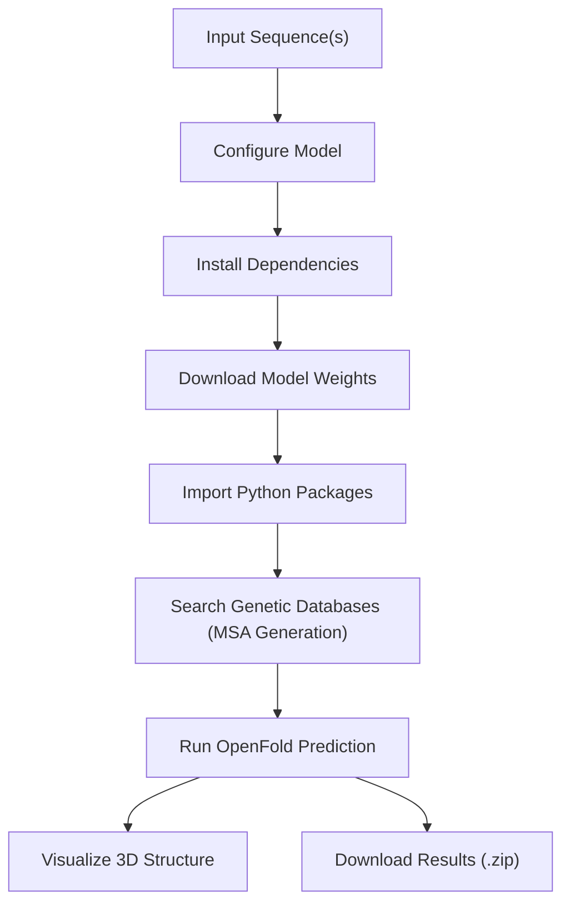
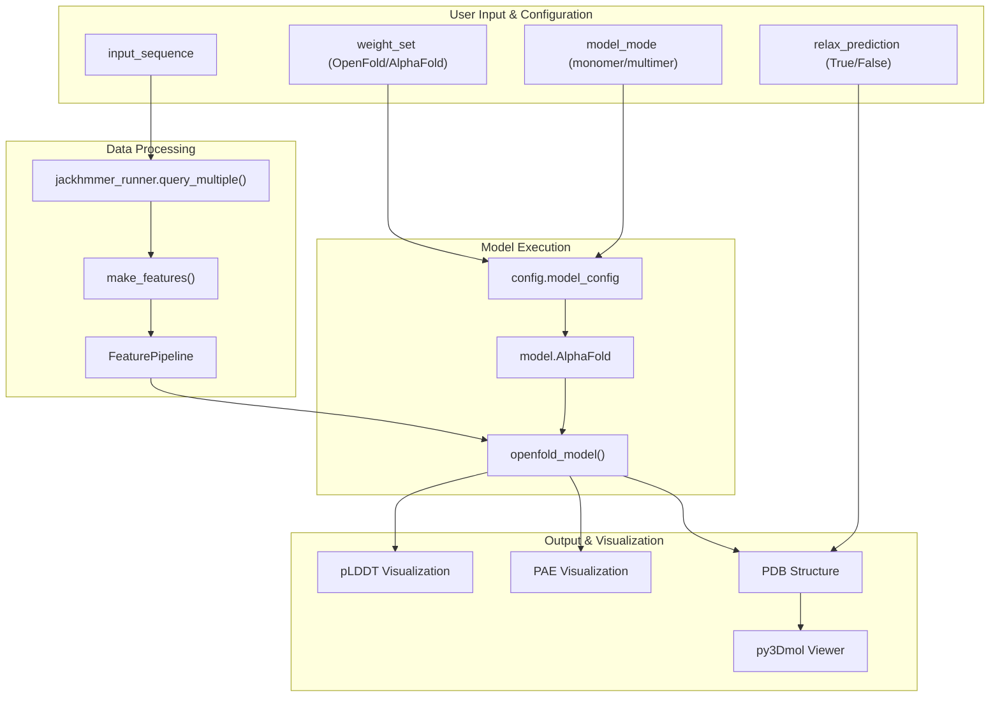
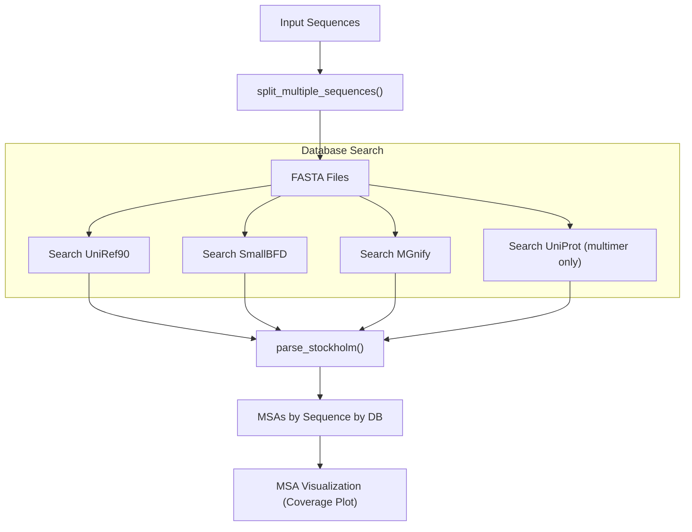
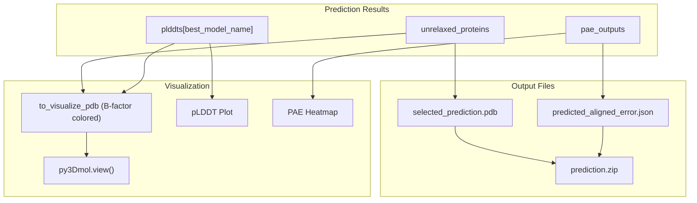

# Jupyter Notebook Interface

> **Relevant source files**
> * [notebooks/OpenFold.ipynb](https://github.com/aqlaboratory/openfold/blob/56da08ec/notebooks/OpenFold.ipynb)
> * [notebooks/environment.yml](https://github.com/aqlaboratory/openfold/blob/56da08ec/notebooks/environment.yml)
> * [openfold/resources/__init__.py](https://github.com/aqlaboratory/openfold/blob/56da08ec/openfold/resources/__init__.py)
> * [scripts/download_openfold_params_gdrive.sh](https://github.com/aqlaboratory/openfold/blob/56da08ec/scripts/download_openfold_params_gdrive.sh)
> * [scripts/download_openfold_params_huggingface.sh](https://github.com/aqlaboratory/openfold/blob/56da08ec/scripts/download_openfold_params_huggingface.sh)

The OpenFold Jupyter Notebook interface provides an interactive way to run protein structure predictions using OpenFold's PyTorch implementation, without requiring extensive command-line knowledge. This interface is particularly useful for quick predictions, visualization, and experimentation with different model configurations. For command-line inference options, see [Monomer Inference](/aqlaboratory/openfold/3.1-inference-pipeline-overview), [Multimer Inference](/aqlaboratory/openfold/3.2-monomer-inference), or [Single Sequence Inference](/aqlaboratory/openfold/3.3-multimer-inference).

## Overview

The OpenFold notebook (`OpenFold.ipynb`) is adapted from DeepMind's official AlphaFold Colab and provides a user-friendly interface for predicting protein structures. The notebook guides users through the entire process from sequence input to 3D structure visualization.

Sources: [notebooks/OpenFold.ipynb L2-L133](https://github.com/aqlaboratory/openfold/blob/56da08ec/notebooks/OpenFold.ipynb#L2-L133)

## Getting Started

### Prerequisites

The notebook is designed to run in Google Colab or any Jupyter environment with GPU support. The environment requirements are handled automatically by the notebook setup cells, including:

* PyTorch
* OpenMM and PDBFixer for molecular simulation
* HH-suite and HMMER for sequence alignments
* Visualization libraries (py3Dmol)

Sources: [notebooks/OpenFold.ipynb L88-L137](https://github.com/aqlaboratory/openfold/blob/56da08ec/notebooks/OpenFold.ipynb#L88-L137)

 [notebooks/environment.yml L1-L18](https://github.com/aqlaboratory/openfold/blob/56da08ec/notebooks/environment.yml#L1-L18)

### Input Parameters

The notebook accepts the following user configuration:

| Parameter | Description | Options |
| --- | --- | --- |
| `input_sequence` | Amino acid sequence(s) to fold | Single sequence or multiple sequences separated by colons (`:`) |
| `weight_set` | Parameter weights to use | "OpenFold" or "AlphaFold" |
| `model_mode` | Prediction mode | "monomer" or "multimer" |
| `relax_prediction` | Whether to apply AMBER relaxation | True/False |

Sources: [notebooks/OpenFold.ipynb L42-L84](https://github.com/aqlaboratory/openfold/blob/56da08ec/notebooks/OpenFold.ipynb#L42-L84)

## Notebook Workflow

Sources: [notebooks/OpenFold.ipynb L274-L433](https://github.com/aqlaboratory/openfold/blob/56da08ec/notebooks/OpenFold.ipynb#L274-L433)

 [notebooks/OpenFold.ipynb L441-L798](https://github.com/aqlaboratory/openfold/blob/56da08ec/notebooks/OpenFold.ipynb#L441-L798)

### 1. Environment Setup

The notebook automatically installs all required dependencies and downloads the appropriate model weights based on the selected `weight_set`. For AlphaFold weights, they are fetched from Google Storage. For OpenFold weights, they are downloaded either from AWS S3 or HuggingFace, depending on the setup.

Sources: [notebooks/OpenFold.ipynb L88-L186](https://github.com/aqlaboratory/openfold/blob/56da08ec/notebooks/OpenFold.ipynb#L88-L186)

 [scripts/download_openfold_params_gdrive.sh L1-L68](https://github.com/aqlaboratory/openfold/blob/56da08ec/scripts/download_openfold_params_gdrive.sh#L1-L68)

 [scripts/download_openfold_params_huggingface.sh L1-L33](https://github.com/aqlaboratory/openfold/blob/56da08ec/scripts/download_openfold_params_huggingface.sh#L1-L33)

### 2. MSA Generation

Multiple Sequence Alignment (MSA) generation is a critical step for accurate structure prediction:

The notebook searches against several genetic databases:

* UniRef90
* SmallBFD (a compact version of BFD)
* MGnify
* UniProt (only for multimer heteromer predictions)

After collecting MSAs, the notebook displays a visualization of MSA coverage, showing the per-residue count of non-gap amino acids.

Sources: [notebooks/OpenFold.ipynb L274-L427](https://github.com/aqlaboratory/openfold/blob/56da08ec/notebooks/OpenFold.ipynb#L274-L427)

### 3. Structure Prediction

The prediction process involves:

1. **Feature Processing**: Converting sequence and MSA data into model-compatible features
2. **Model Configuration**: Setting up the AlphaFold model with the selected parameters
3. **Model Execution**: Running the prediction with recycling iterations
4. **Structure Refinement**: Optional AMBER relaxation to improve physical plausibility

The notebook supports both monomer (single-chain) and multimer (multi-chain) prediction modes, as well as two weight sets:

* **OpenFold weights**: Trained by the OpenFold team with PyTorch
* **AlphaFold weights**: Original weights from DeepMind, converted for use in OpenFold

Sources: [notebooks/OpenFold.ipynb L441-L664](https://github.com/aqlaboratory/openfold/blob/56da08ec/notebooks/OpenFold.ipynb#L441-L664)

### 4. Visualization and Results

After prediction, the notebook provides:

1. **3D Structure Visualization**: Interactive 3D model colored by confidence (pLDDT)
2. **Confidence Metrics**: * pLDDT (per-residue confidence) plot * PAE (Predicted Aligned Error) matrix for assessing domain relationships
3. **Downloadable Results**: * PDB file of the predicted structure * JSON file with PAE data * All outputs bundled in a zip file

Sources: [notebooks/OpenFold.ipynb L666-L797](https://github.com/aqlaboratory/openfold/blob/56da08ec/notebooks/OpenFold.ipynb#L666-L797)

## Model Configuration Options

### Weight Sets

The notebook offers two sets of model parameters:

1. **AlphaFold weights** (`weight_set = 'AlphaFold'`): * Original DeepMind parameters * Support for both monomer and multimer prediction * Downloaded from Google Storage
2. **OpenFold weights** (`weight_set = 'OpenFold'`): * Parameters trained in the PyTorch implementation * Currently only supports monomer prediction * Downloaded from AWS S3 or HuggingFace

Sources: [notebooks/OpenFold.ipynb L154-L185](https://github.com/aqlaboratory/openfold/blob/56da08ec/notebooks/OpenFold.ipynb#L154-L185)

### Model Modes

Two model modes are available:

1. **Monomer mode** (`model_mode = 'monomer'`): * For single protein chains * Uses models: finetuning_3-5.pt, finetuning_ptm_2.pt, finetuning_no_templ_ptm_1.pt (OpenFold weights) or model_1-5 (AlphaFold weights)
2. **Multimer mode** (`model_mode = 'multimer'`): * For protein complexes with multiple chains * Uses model_1-5_multimer_v3 (AlphaFold weights only) * Requires sequences separated by colons in the input

Sources: [notebooks/OpenFold.ipynb L53-L82](https://github.com/aqlaboratory/openfold/blob/56da08ec/notebooks/OpenFold.ipynb#L53-L82)

 [notebooks/OpenFold.ipynb L461-L471](https://github.com/aqlaboratory/openfold/blob/56da08ec/notebooks/OpenFold.ipynb#L461-L471)

## Limitations

When using the notebook, be aware of the following limitations:

1. The notebook uses a reduced MSA search (subset of full BFD database)
2. No template information is used in predictions
3. Multimer mode only works with AlphaFold weights
4. Running time depends on sequence length and allocated GPU resources
5. For very large proteins or complexes, the notebook may run out of memory

Sources: [notebooks/OpenFold.ipynb L10-L38](https://github.com/aqlaboratory/openfold/blob/56da08ec/notebooks/OpenFold.ipynb#L10-L38)

## Example Usage

To use the notebook:

1. Execute the input cell, providing your protein sequence(s) and selecting configuration options
2. Run the setup cells to install dependencies and download model weights
3. Execute the MSA generation cell and inspect the coverage plot
4. Run the prediction cell and wait for inference to complete
5. Explore the 3D visualization and confidence metrics
6. Download the results for further analysis

For detailed information about interpreting the results, the pLDDT and PAE metrics provided in the visualization can help assess prediction confidence and reliability.

Sources: [notebooks/OpenFold.ipynb L267-L271](https://github.com/aqlaboratory/openfold/blob/56da08ec/notebooks/OpenFold.ipynb#L267-L271)

 [notebooks/OpenFold.ipynb L663-L797](https://github.com/aqlaboratory/openfold/blob/56da08ec/notebooks/OpenFold.ipynb#L663-L797)