# MSA and Template Processing

> **Relevant source files**
> * [README.md](https://github.com/aqlaboratory/openfold/blob/56da08ec/README.md?plain=1)
> * [openfold/data/data_pipeline.py](https://github.com/aqlaboratory/openfold/blob/56da08ec/openfold/data/data_pipeline.py)
> * [openfold/data/templates.py](https://github.com/aqlaboratory/openfold/blob/56da08ec/openfold/data/templates.py)
> * [run_pretrained_openfold.py](https://github.com/aqlaboratory/openfold/blob/56da08ec/run_pretrained_openfold.py)
> * [scripts/generate_mmcif_cache.py](https://github.com/aqlaboratory/openfold/blob/56da08ec/scripts/generate_mmcif_cache.py)
> * [scripts/precompute_alignments.py](https://github.com/aqlaboratory/openfold/blob/56da08ec/scripts/precompute_alignments.py)
> * [scripts/utils.py](https://github.com/aqlaboratory/openfold/blob/56da08ec/scripts/utils.py)

## Purpose and Scope

This document details how OpenFold processes Multiple Sequence Alignments (MSAs) and template structures, which are critical inputs for accurate protein structure prediction. It covers the tools used to generate MSAs and find templates, the transformations applied to prepare this data for the model, and how these components integrate into the overall data pipeline. For information about how this data is used in the core model architecture, see [Model Architecture](/aqlaboratory/openfold/5-model-architecture).

## Overview

Protein structure prediction in OpenFold depends on two key sources of evolutionary information:

1. **Multiple Sequence Alignments (MSAs)**: Collections of related protein sequences that reveal patterns of conservation and covariation, highlighting which amino acids are structurally or functionally important.
2. **Template Structures**: Previously determined 3D structures of proteins with sequence similarity to the query protein, providing structural priors.

The processing of these information sources involves several sequential steps, coordinated by the `AlignmentRunner` and `DataPipeline` classes:

**MSA and Template Processing Pipeline**

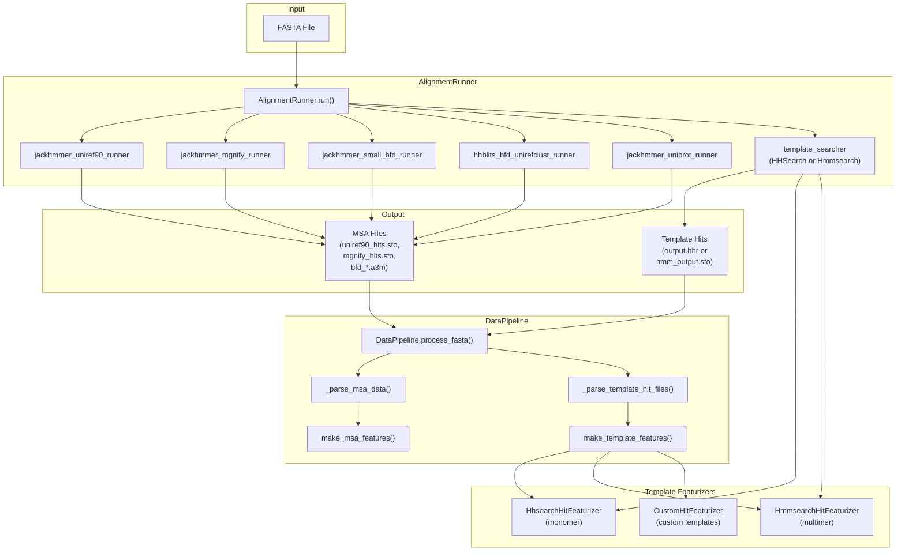

Sources: [openfold/data/data_pipeline.py L334-L563](https://github.com/aqlaboratory/openfold/blob/56da08ec/openfold/data/data_pipeline.py#L334-L563)

 [openfold/data/data_pipeline.py L706-L914](https://github.com/aqlaboratory/openfold/blob/56da08ec/openfold/data/data_pipeline.py#L706-L914)

 [openfold/data/templates.py L228-L235](https://github.com/aqlaboratory/openfold/blob/56da08ec/openfold/data/templates.py#L228-L235)

 [openfold/data/templates.py L930-L1011](https://github.com/aqlaboratory/openfold/blob/56da08ec/openfold/data/templates.py#L930-L1011)

 [openfold/data/templates.py L1014-L1096](https://github.com/aqlaboratory/openfold/blob/56da08ec/openfold/data/templates.py#L1014-L1096)

 [run_pretrained_openfold.py L63-L123](https://github.com/aqlaboratory/openfold/blob/56da08ec/run_pretrained_openfold.py#L63-L123)

## MSA Generation and Processing

### The AlignmentRunner Class

MSA generation is coordinated by the `AlignmentRunner` class, which manages multiple search tools and databases. The runner is configured based on the available databases and whether the prediction is for monomer or multimer mode.

**AlignmentRunner Class Structure**

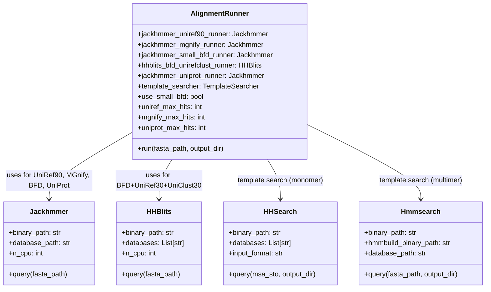

Sources: [openfold/data/data_pipeline.py L334-L476](https://github.com/aqlaboratory/openfold/blob/56da08ec/openfold/data/data_pipeline.py#L334-L476)

 [openfold/data/data_pipeline.py L477-L562](https://github.com/aqlaboratory/openfold/blob/56da08ec/openfold/data/data_pipeline.py#L477-L562)

 [openfold/data/tools/hhsearch.py](https://github.com/aqlaboratory/openfold/blob/56da08ec/openfold/data/tools/hhsearch.py)

 [openfold/data/tools/hmmsearch.py](https://github.com/aqlaboratory/openfold/blob/56da08ec/openfold/data/tools/hmmsearch.py)

### MSA Generation Databases

The `AlignmentRunner.run()` method generates MSAs by querying multiple sequence databases in a specific order:

| Database | Tool | Purpose | Output File | Max Hits |
| --- | --- | --- | --- | --- |
| UniRef90 | Jackhmmer | Primary MSA generation | `uniref90_hits.sto` | 10,000 |
| MGnify | Jackhmmer | Environmental sequences | `mgnify_hits.sto` | 5,000 |
| BFD (small) | Jackhmmer | Deep sequence search | `small_bfd_hits.sto` | unlimited |
| BFD+UniRef30+UniClust30 | HHBlits | Deep sequence search | `bfd_uniref_hits.a3m` or `bfd_uniclust_hits.a3m` | unlimited |
| UniProt (multimer) | Jackhmmer | Multimer-specific MSA | `uniprot_hits.sto` | 50,000 |

The choice between small BFD (Jackhmmer) and full BFD (HHBlits) depends on the `use_small_bfd` parameter, controlled by whether `bfd_database_path` is provided without `uniref30_database_path` or `uniclust30_database_path`.

Sources: [openfold/data/data_pipeline.py L388-L404](https://github.com/aqlaboratory/openfold/blob/56da08ec/openfold/data/data_pipeline.py#L388-L404)

 [openfold/data/data_pipeline.py L483-L562](https://github.com/aqlaboratory/openfold/blob/56da08ec/openfold/data/data_pipeline.py#L483-L562)

 [run_pretrained_openfold.py L99-L111](https://github.com/aqlaboratory/openfold/blob/56da08ec/run_pretrained_openfold.py#L99-L111)

### MSA File Formats and Parsing

Generated MSAs are stored in two formats:

1. **Stockholm (.sto)**: Used by Jackhmmer output * Parsed by `parsers.parse_stockholm()` * Contains sequence headers with taxonomic information
2. **A3M (.a3m)**: Used by HHBlits output * Parsed by `parsers.parse_a3m()` * Compact format with lowercase letters for insertions

The `DataPipeline._parse_msa_data()` method reads these files and converts them into `parsers.Msa` objects containing sequences, deletion matrices, and descriptions.

Sources: [openfold/data/data_pipeline.py L714-L764](https://github.com/aqlaboratory/openfold/blob/56da08ec/openfold/data/data_pipeline.py#L714-L764)

 [openfold/data/parsers.py](https://github.com/aqlaboratory/openfold/blob/56da08ec/openfold/data/parsers.py)

### MSA Feature Construction

The `make_msa_features()` function converts parsed MSAs into feature tensors:

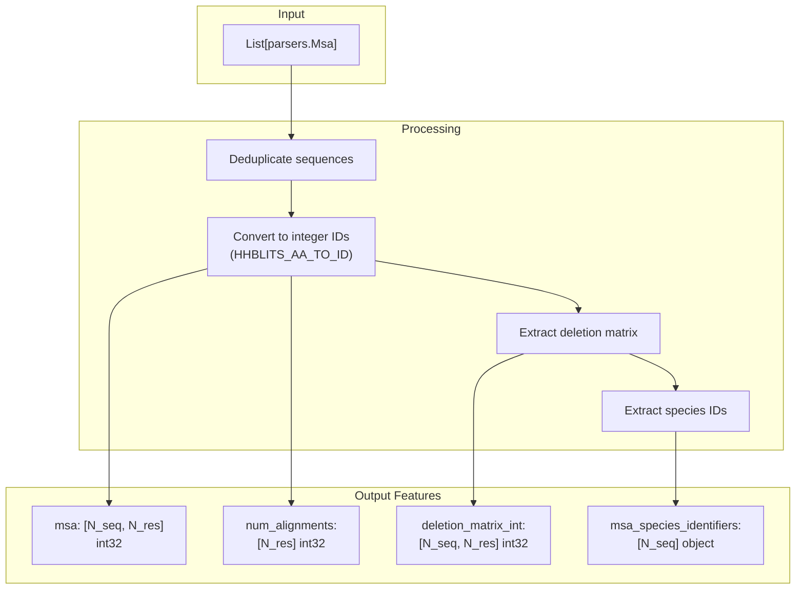

Sources: [openfold/data/data_pipeline.py L224-L261](https://github.com/aqlaboratory/openfold/blob/56da08ec/openfold/data/data_pipeline.py#L224-L261)

### MSA Data Structure

MSAs in OpenFold are represented as tensors with specific features:

| Feature Name | Description | Dimensions |
| --- | --- | --- |
| `msa` | Sequences in the alignment | `[num_seq, seq_length]` |
| `deletion_matrix` | Deletion indicators | `[num_seq, seq_length]` |
| `msa_mask` | Mask for positions in MSA | `[num_seq, seq_length]` |
| `msa_row_mask` | Mask for entire rows | `[num_seq]` |
| `bert_mask` | Mask for BERT training | `[num_seq, seq_length]` |
| `true_msa` | Original MSA before masking | `[num_seq, seq_length]` |

The MSA is stored as integer tokens representing amino acids, with additional tokens for gaps (21) and unknown residues (20).

Sources: [openfold/data/data_transforms.py L36-L43](https://github.com/aqlaboratory/openfold/blob/56da08ec/openfold/data/data_transforms.py#L36-L43)

### MSA Transformations

MSAs undergo several transformations before being fed into the model:

1. **Sample MSA** (`sample_msa`): Reduces the MSA size by selecting a subset of sequences. * Preserves the query sequence (first row) * Randomly samples remaining sequences * Option to keep remaining sequences as "extra_msa"
2. **Clustering** (`nearest_neighbor_clusters`, `summarize_clusters`): Groups similar sequences and summarizes them. * Calculates sequence similarity using weighted Hamming distance * Assigns each sequence to its closest cluster * Creates cluster profiles and deletion means
3. **MSA Masking** (`make_masked_msa`): Masks portions of the MSA for BERT-style training. * Replaces residues with [MASK] token, unknown amino acids, or profile samples * Used during training for the masked MSA prediction task
4. **MSA Featurization** (`make_msa_feat`): Converts the MSA into feature tensors. * One-hot encodes sequences * Computes deletion statistics * Creates cluster profiles

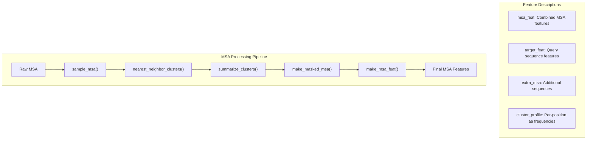

Sources: [openfold/data/data_transforms.py L185-L229](https://github.com/aqlaboratory/openfold/blob/56da08ec/openfold/data/data_transforms.py#L185-L229)

 [openfold/data/data_transforms.py L290-L376](https://github.com/aqlaboratory/openfold/blob/56da08ec/openfold/data/data_transforms.py#L290-L376)

 [openfold/data/data_transforms.py L452-L501](https://github.com/aqlaboratory/openfold/blob/56da08ec/openfold/data/data_transforms.py#L452-L501)

 [openfold/data/data_transforms.py L544-L591](https://github.com/aqlaboratory/openfold/blob/56da08ec/openfold/data/data_transforms.py#L544-L591)

 [openfold/data/input_pipeline.py L70-L126](https://github.com/aqlaboratory/openfold/blob/56da08ec/openfold/data/input_pipeline.py#L70-L126)

## Template Search and Processing

### Template Search: HHSearch vs HMMSearch

OpenFold uses different template search strategies depending on whether it is running in monomer or multimer mode:

**Template Search Mode Selection**

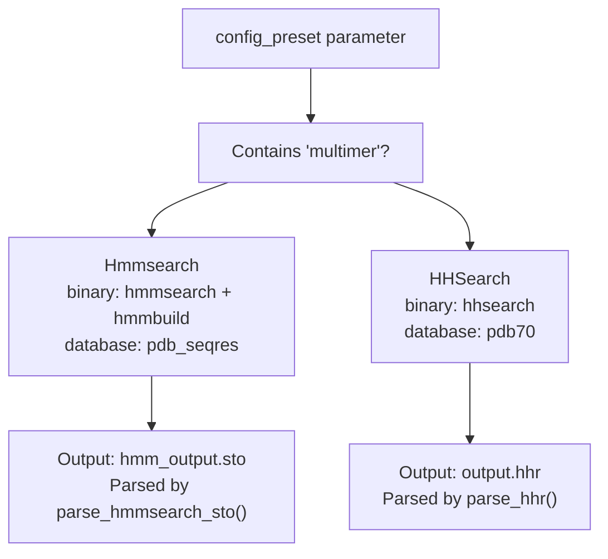

Sources: [run_pretrained_openfold.py L76-L86](https://github.com/aqlaboratory/openfold/blob/56da08ec/run_pretrained_openfold.py#L76-L86)

 [openfold/data/data_pipeline.py L766-L810](https://github.com/aqlaboratory/openfold/blob/56da08ec/openfold/data/data_pipeline.py#L766-L810)

#### HHSearch (Monomer Mode)

* **Input Format**: A3M alignment format (Stockholm MSA converted to A3M)
* **Database**: PDB70 (clustered at 70% sequence identity)
* **Search Method**: HMM-HMM comparison
* **Output Format**: HHR (HHSearch result format)
* **Parsing**: `parsers.parse_hhr()` extracts `TemplateHit` objects

Key characteristics:

* More sensitive for finding remote homologs
* Uses profile-profile comparison
* Returns probability scores and E-values
* Template hits include alignment indices for mapping query to template positions

Sources: [openfold/data/tools/hhsearch.py](https://github.com/aqlaboratory/openfold/blob/56da08ec/openfold/data/tools/hhsearch.py)

 [openfold/data/parsers.py](https://github.com/aqlaboratory/openfold/blob/56da08ec/openfold/data/parsers.py)

#### HMMSearch (Multimer Mode)

* **Input Format**: FASTA sequence
* **Database**: PDB seqres (full sequence database)
* **Search Method**: Profile HMM search against database
* **Output Format**: Stockholm alignment in `hmm_output.sto`
* **Parsing**: `parsers.parse_hmmsearch_sto()` extracts hits

Key characteristics:

* Builds HMM profile using `hmmbuild`
* Searches using `hmmsearch`
* Returns hits with bit scores and E-values
* More comprehensive search for multimer templates

Sources: [openfold/data/tools/hmmsearch.py](https://github.com/aqlaboratory/openfold/blob/56da08ec/openfold/data/tools/hmmsearch.py)

 [openfold/data/parsers.py](https://github.com/aqlaboratory/openfold/blob/56da08ec/openfold/data/parsers.py)

 [openfold/data/data_pipeline.py L786-L791](https://github.com/aqlaboratory/openfold/blob/56da08ec/openfold/data/data_pipeline.py#L786-L791)

### TemplateHit Data Structure

Template search results are represented as `TemplateHit` objects:

| Field | Type | Description |
| --- | --- | --- |
| `name` | `str` | Template identifier (PDB ID + chain, e.g., "5xxx_A") |
| `aligned_cols` | `int` | Number of aligned columns |
| `sum_probs` | `float` | Sum of alignment probabilities (confidence score) |
| `query` | `str` | Aligned query sequence with gaps |
| `hit_sequence` | `str` | Aligned template sequence with gaps |
| `indices_query` | `List[int]` | Query position for each alignment column |
| `indices_hit` | `List[int]` | Template position for each alignment column |
| `index` | `int` | Rank in search results |

Sources: [openfold/data/parsers.py](https://github.com/aqlaboratory/openfold/blob/56da08ec/openfold/data/parsers.py)

### Custom Template Mode

OpenFold also supports using custom templates via the `CustomHitFeaturizer`:

```markdown
# Initialize custom template featurizertemplate_featurizer = templates.CustomHitFeaturizer(    mmcif_dir=args.template_mmcif_dir,    max_template_date="9999-12-31",  # dummy, not used    max_hits=-1,  # dummy, not used    kalign_binary_path=args.kalign_binary_path)
```

In this mode:

* No template search is performed
* mmCIF files in `template_mmcif_dir` are directly used as templates
* Useful for providing specific structural templates
* Enabled with `--use_custom_template` flag

Sources: [run_pretrained_openfold.py L211-L217](https://github.com/aqlaboratory/openfold/blob/56da08ec/run_pretrained_openfold.py#L211-L217)

 [openfold/data/templates.py L1151-L1237](https://github.com/aqlaboratory/openfold/blob/56da08ec/openfold/data/templates.py#L1151-L1237)

### Template Feature Extraction

Template features are extracted through a multi-step process coordinated by template featurizer classes.

**Template Featurizer Class Hierarchy**

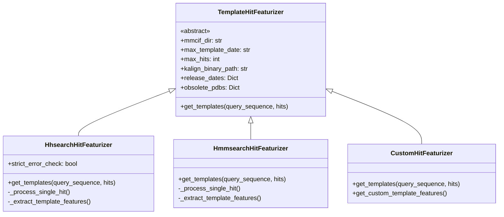

Sources: [openfold/data/templates.py L930-L1011](https://github.com/aqlaboratory/openfold/blob/56da08ec/openfold/data/templates.py#L930-L1011)

 [openfold/data/templates.py L1014-L1096](https://github.com/aqlaboratory/openfold/blob/56da08ec/openfold/data/templates.py#L1014-L1096)

 [openfold/data/templates.py L1151-L1237](https://github.com/aqlaboratory/openfold/blob/56da08ec/openfold/data/templates.py#L1151-L1237)

### Template Feature Extraction Pipeline

The template featurizer processes hits through several stages:

**Template Processing Flow**

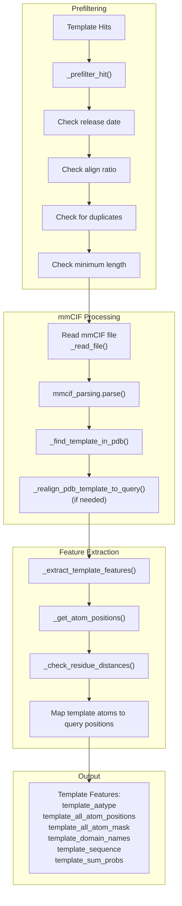

Sources: [openfold/data/templates.py L780-L815](https://github.com/aqlaboratory/openfold/blob/56da08ec/openfold/data/templates.py#L780-L815)

 [openfold/data/templates.py L826-L910](https://github.com/aqlaboratory/openfold/blob/56da08ec/openfold/data/templates.py#L826-L910)

 [openfold/data/templates.py L548-L705](https://github.com/aqlaboratory/openfold/blob/56da08ec/openfold/data/templates.py#L548-L705)

### Template Prefiltering

Before processing mmCIF files, template hits are prefiltered using `_assess_hhsearch_hit()` to eliminate unsuitable templates:

| Filter | Criterion | Threshold |
| --- | --- | --- |
| **Release Date** | Template release date must be before cutoff | `max_template_date` parameter |
| **Alignment Ratio** | Aligned columns / query length | min_align_ratio ≥ 0.1 |
| **Duplicate Detection** | Template is subsequence of query | max_subsequence_ratio < 0.95 |
| **Minimum Length** | Template sequence length | ≥ 10 residues |

Filters raise specific exceptions (`DateError`, `AlignRatioError`, `DuplicateError`, `LengthError`) that are caught and logged.

Sources: [openfold/data/templates.py L220-L289](https://github.com/aqlaboratory/openfold/blob/56da08ec/openfold/data/templates.py#L220-L289)

### Template Sequence Alignment

If the template sequence in the PDB differs from the hit sequence, realignment is performed using Kalign:

1. **Sequence Matching**: `_find_template_in_pdb()` tries to match the hit sequence to chains in the mmCIF: * Exact match in chain ID and sequence * Exact match in sequence only * Fuzzy match with 'X' as wildcard
2. **Realignment**: If sequences differ, `_realign_pdb_template_to_query()` aligns the old and new sequences: * Uses Kalign binary * Requires ≥90% sequence identity * Updates the query-to-template mapping

Sources: [openfold/data/templates.py L292-L363](https://github.com/aqlaboratory/openfold/blob/56da08ec/openfold/data/templates.py#L292-L363)

 [openfold/data/templates.py L366-L502](https://github.com/aqlaboratory/openfold/blob/56da08ec/openfold/data/templates.py#L366-L502)

### Template Feature Tensors

The final template features returned by `_extract_template_features()` include:

| Feature | Shape | Description |
| --- | --- | --- |
| `template_aatype` | `[N_res, 22]` | One-hot encoded amino acid types |
| `template_all_atom_positions` | `[N_res, 37, 3]` | All-atom coordinates (atom37 representation) |
| `template_all_atom_mask` | `[N_res, 37]` | Mask for present atoms |
| `template_domain_names` | `[]` | String identifier (e.g., "5xxx_a") |
| `template_sequence` | `[]` | Template sequence string |
| `template_sum_probs` | `[1]` | Confidence score from search |

For queries with no templates, `empty_template_feats()` returns zero-filled arrays.

Sources: [openfold/data/templates.py L548-L705](https://github.com/aqlaboratory/openfold/blob/56da08ec/openfold/data/templates.py#L548-L705)

 [openfold/data/templates.py L93-L108](https://github.com/aqlaboratory/openfold/blob/56da08ec/openfold/data/templates.py#L93-L108)

 [openfold/data/data_pipeline.py L46-L63](https://github.com/aqlaboratory/openfold/blob/56da08ec/openfold/data/data_pipeline.py#L46-L63)

## Integration in the DataPipeline

The `DataPipeline` class coordinates MSA and template feature generation:

**DataPipeline Architecture**

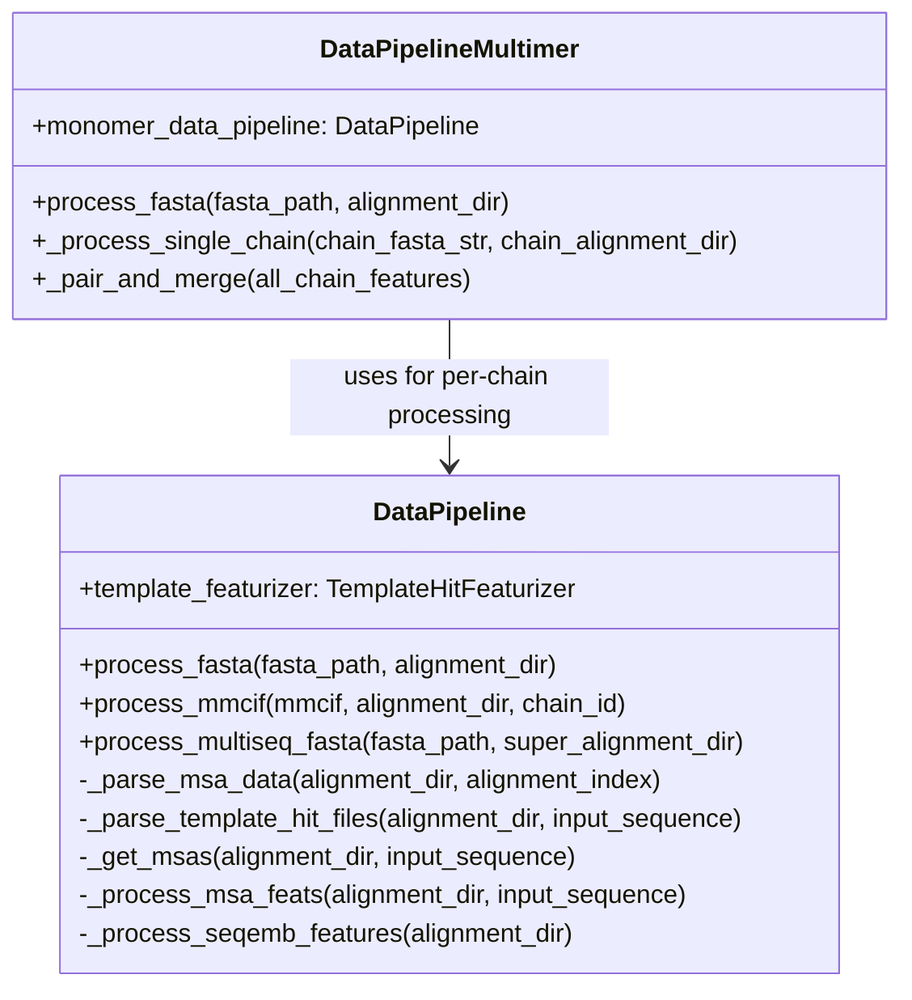

Sources: [openfold/data/data_pipeline.py L706-L914](https://github.com/aqlaboratory/openfold/blob/56da08ec/openfold/data/data_pipeline.py#L706-L914)

 [openfold/data/data_pipeline.py L1013-L1202](https://github.com/aqlaboratory/openfold/blob/56da08ec/openfold/data/data_pipeline.py#L1013-L1202)

### DataPipeline Processing Flow

The `DataPipeline.process_fasta()` method processes a single sequence:

**process_fasta() Execution Flow**

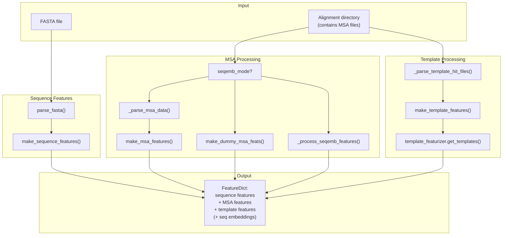

Sources: [openfold/data/data_pipeline.py L864-L914](https://github.com/aqlaboratory/openfold/blob/56da08ec/openfold/data/data_pipeline.py#L864-L914)

### Multimer Pipeline

For multimer predictions, `DataPipelineMultimer` processes each chain separately, then pairs and merges features:

1. **Per-Chain Processing**: Uses `DataPipeline` to process each chain's MSA and templates
2. **Chain Pairing**: `msa_pairing.create_paired_features()` matches sequences between chains
3. **Feature Merging**: Combines chain features with assembly information

The multimer pipeline adds additional features like `asym_id`, `sym_id`, `entity_id` to distinguish between chains.

Sources: [openfold/data/data_pipeline.py L1013-L1202](https://github.com/aqlaboratory/openfold/blob/56da08ec/openfold/data/data_pipeline.py#L1013-L1202)

 [openfold/data/msa_pairing.py](https://github.com/aqlaboratory/openfold/blob/56da08ec/openfold/data/msa_pairing.py)

### Integration with Inference Script

The inference script (`run_pretrained_openfold.py`) orchestrates the complete workflow:

**Inference Workflow Integration**

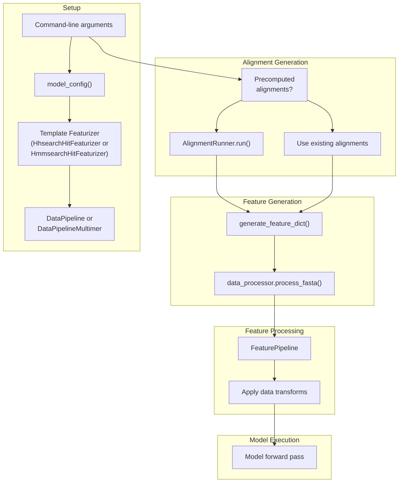

Sources: [run_pretrained_openfold.py L63-L170](https://github.com/aqlaboratory/openfold/blob/56da08ec/run_pretrained_openfold.py#L63-L170)

 [run_pretrained_openfold.py L177-L395](https://github.com/aqlaboratory/openfold/blob/56da08ec/run_pretrained_openfold.py#L177-L395)

## Complete Code Structure Map

The following diagram maps the MSA and template processing workflow to specific code entities:

**Code Entity Mapping**

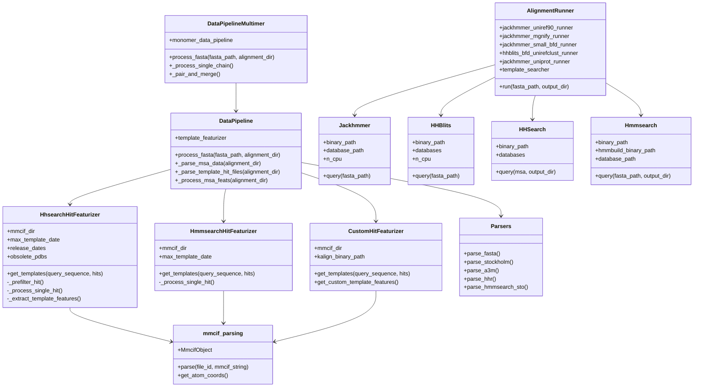

Sources: [openfold/data/data_pipeline.py L334-L563](https://github.com/aqlaboratory/openfold/blob/56da08ec/openfold/data/data_pipeline.py#L334-L563)

 [openfold/data/data_pipeline.py L706-L914](https://github.com/aqlaboratory/openfold/blob/56da08ec/openfold/data/data_pipeline.py#L706-L914)

 [openfold/data/data_pipeline.py L1013-L1202](https://github.com/aqlaboratory/openfold/blob/56da08ec/openfold/data/data_pipeline.py#L1013-L1202)

 [openfold/data/templates.py L930-L1096](https://github.com/aqlaboratory/openfold/blob/56da08ec/openfold/data/templates.py#L930-L1096)

 [openfold/data/templates.py L1151-L1237](https://github.com/aqlaboratory/openfold/blob/56da08ec/openfold/data/templates.py#L1151-L1237)

 [openfold/data/tools/jackhmmer.py](https://github.com/aqlaboratory/openfold/blob/56da08ec/openfold/data/tools/jackhmmer.py)

 [openfold/data/tools/hhblits.py](https://github.com/aqlaboratory/openfold/blob/56da08ec/openfold/data/tools/hhblits.py)

 [openfold/data/tools/hhsearch.py](https://github.com/aqlaboratory/openfold/blob/56da08ec/openfold/data/tools/hhsearch.py)

 [openfold/data/tools/hmmsearch.py](https://github.com/aqlaboratory/openfold/blob/56da08ec/openfold/data/tools/hmmsearch.py)

 [openfold/data/parsers.py](https://github.com/aqlaboratory/openfold/blob/56da08ec/openfold/data/parsers.py)

 [openfold/data/mmcif_parsing.py](https://github.com/aqlaboratory/openfold/blob/56da08ec/openfold/data/mmcif_parsing.py)

## Key Configuration and Command-Line Options

### AlignmentRunner Configuration

The `AlignmentRunner` is configured through command-line arguments or script parameters:

| Parameter | Description | Default |
| --- | --- | --- |
| `jackhmmer_binary_path` | Path to jackhmmer executable | `{CONDA_PREFIX}/bin/jackhmmer` |
| `hhblits_binary_path` | Path to hhblits executable | `{CONDA_PREFIX}/bin/hhblits` |
| `hhsearch_binary_path` | Path to hhsearch executable | `{CONDA_PREFIX}/bin/hhsearch` |
| `hmmsearch_binary_path` | Path to hmmsearch executable | `{CONDA_PREFIX}/bin/hmmsearch` |
| `hmmbuild_binary_path` | Path to hmmbuild executable | `{CONDA_PREFIX}/bin/hmmbuild` |
| `uniref90_database_path` | Path to UniRef90 database | Required |
| `mgnify_database_path` | Path to MGnify database | Optional |
| `bfd_database_path` | Path to BFD database | Optional |
| `uniref30_database_path` | Path to UniRef30 database | Optional |
| `uniclust30_database_path` | Path to UniClust30 database | Optional |
| `uniprot_database_path` | Path to UniProt database (multimer) | Optional |
| `pdb70_database_path` | Path to PDB70 database (monomer) | Required for templates |
| `pdb_seqres_database_path` | Path to PDB seqres (multimer) | Required for multimer templates |
| `cpus` | Number of CPUs for alignment tools | 4 |

Sources: [scripts/utils.py L13-L65](https://github.com/aqlaboratory/openfold/blob/56da08ec/scripts/utils.py#L13-L65)

 [openfold/data/data_pipeline.py L336-L387](https://github.com/aqlaboratory/openfold/blob/56da08ec/openfold/data/data_pipeline.py#L336-L387)

### Template Featurizer Configuration

Template featurizers require additional parameters:

| Parameter | Description | Default |
| --- | --- | --- |
| `template_mmcif_dir` | Directory containing mmCIF template files | Required |
| `max_template_date` | Maximum release date for templates | Current date |
| `kalign_binary_path` | Path to kalign executable | `{CONDA_PREFIX}/bin/kalign` |
| `release_dates_path` | Path to PDB release dates JSON | Optional |
| `obsolete_pdbs_path` | Path to obsolete PDB mappings | Optional |
| `max_templates` | Maximum number of templates to use | From config |
| `use_custom_template` | Use custom templates without search | False |

Sources: [run_pretrained_openfold.py L210-L243](https://github.com/aqlaboratory/openfold/blob/56da08ec/run_pretrained_openfold.py#L210-L243)

 [openfold/data/templates.py L930-L966](https://github.com/aqlaboratory/openfold/blob/56da08ec/openfold/data/templates.py#L930-L966)

### Model Configuration Parameters

The model configuration controls template usage:

| Parameter | Location | Default |
| --- | --- | --- |
| `data.common.max_recycling_iters` | Model config | 3 |
| `data.predict.max_templates` | Predict config | 4 |
| `data.common.use_templates` | Common config | True |
| `data.common.use_template_torsion_angles` | Common config | True |

These can be overridden using the `--experiment_config_json` flag with a JSON file containing flattened config paths.

Sources: [run_pretrained_openfold.py L198-L201](https://github.com/aqlaboratory/openfold/blob/56da08ec/run_pretrained_openfold.py#L198-L201)

 [openfold/config.py](https://github.com/aqlaboratory/openfold/blob/56da08ec/openfold/config.py)

## Conclusion

MSA and template processing are critical components of the OpenFold pipeline that prepare evolutionary information for the neural network model. The system uses a combination of established bioinformatics tools (Jackhmmer, HHBlits, HHSearch) and specialized data transformations to extract and format this information. The processing is organized into nonensembled transformations (applied once) and ensembled transformations (potentially applied multiple times with different random seeds). This carefully engineered pipeline ensures that the model receives high-quality evolutionary information, which is essential for accurate protein structure prediction.