# Memory Optimization for Training

> **Relevant source files**
> * [openfold/config.py](https://github.com/aqlaboratory/openfold/blob/56da08ec/openfold/config.py)
> * [openfold/data/data_modules.py](https://github.com/aqlaboratory/openfold/blob/56da08ec/openfold/data/data_modules.py)
> * [openfold/model/dropout.py](https://github.com/aqlaboratory/openfold/blob/56da08ec/openfold/model/dropout.py)
> * [openfold/model/evoformer.py](https://github.com/aqlaboratory/openfold/blob/56da08ec/openfold/model/evoformer.py)
> * [openfold/utils/loss.py](https://github.com/aqlaboratory/openfold/blob/56da08ec/openfold/utils/loss.py)
> * [train_openfold.py](https://github.com/aqlaboratory/openfold/blob/56da08ec/train_openfold.py)

## Purpose and Scope

This document explains memory optimization strategies for training OpenFold models on limited GPU memory. It covers activation checkpointing, chunking, distributed training, precision settings, and specialized attention kernels. For inference-specific optimizations including sequence offloading and long-sequence handling, see [Performance Optimization](/aqlaboratory/openfold/3.6-performance-optimization). For the overall training pipeline and PyTorch Lightning integration, see [Training Pipeline](/aqlaboratory/openfold/4.1-training-pipeline). For data loading and filtering strategies, see [Data Loading and Filtering](/aqlaboratory/openfold/4.2-data-loading-and-filtering).

The techniques described here enable training on consumer-grade GPUs or scaling to larger models and batch sizes on high-end hardware. Most optimizations are controlled through configuration flags and command-line arguments to `train_openfold.py`.

---

## Training Configuration Overview

Memory optimization in OpenFold is controlled through three primary mechanisms: configuration presets, command-line arguments, and DeepSpeed configuration files.

### Configuration Entry Points

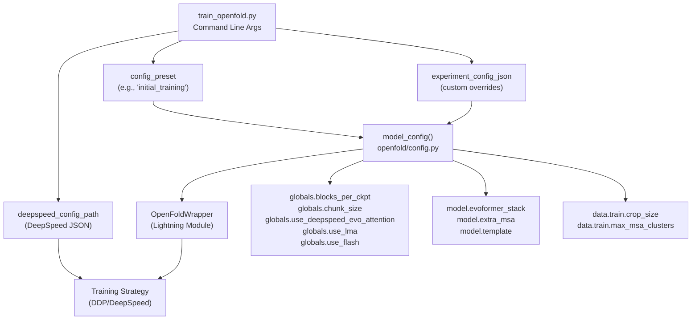

**Key Configuration Points for Memory:**

| Configuration | Purpose | Default (Training) | Impact |
| --- | --- | --- | --- |
| `blocks_per_ckpt` | Activation checkpointing frequency | `1` | Higher = less memory, slower |
| `chunk_size` | Sub-batch processing size | `None` (disabled) | Lower = less memory, slower |
| `precision` | Mixed precision mode | `"bf16"` | Lower precision = less memory |
| `use_deepspeed_evo_attention` | Memory-efficient attention | `False` | Reduces attention memory |
| `crop_size` | Maximum sequence length | `256` (initial), `384` (finetuning) | Lower = less memory |
| `max_msa_clusters` | MSA depth | `128` (initial), `512` (finetuning) | Lower = less memory |

**Sources:** [train_openfold.py L291-L303](https://github.com/aqlaboratory/openfold/blob/56da08ec/train_openfold.py#L291-L303)

 [openfold/config.py L85-L304](https://github.com/aqlaboratory/openfold/blob/56da08ec/openfold/config.py#L85-L304)

---

## Activation Checkpointing

Activation checkpointing (gradient checkpointing) trades compute for memory by recomputing activations during the backward pass instead of storing them. OpenFold implements this at the Evoformer block level.

### Checkpointing Architecture

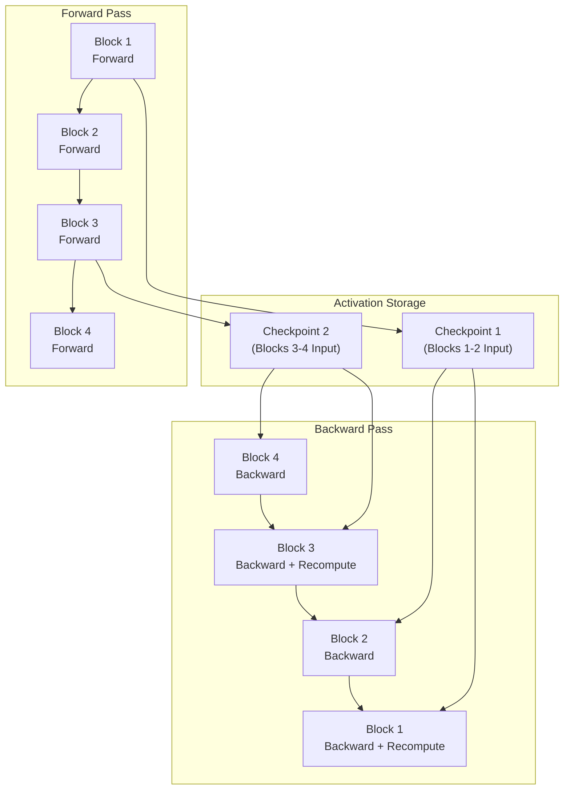

### Implementation Details

**Checkpoint Block Execution:**

The `checkpoint_blocks` function in `openfold/utils/checkpointing.py` groups consecutive Evoformer blocks and applies PyTorch's checkpointing:

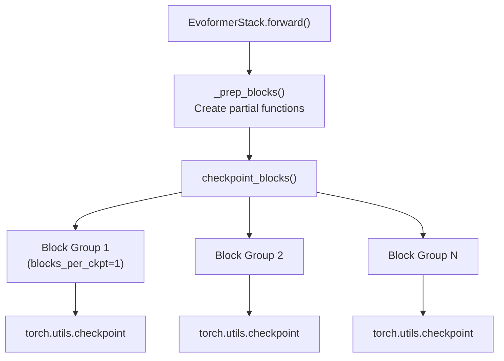

**Configuration:**

```css
# In config.py"globals": {    "blocks_per_ckpt": 1,  # Checkpoint every 1 block (most memory-efficient)} # Training mode automatically sets thisif train:    c.globals.blocks_per_ckpt = 1
```

**Memory-Compute Tradeoff:**

| `blocks_per_ckpt` | Memory Savings | Compute Overhead | Use Case |
| --- | --- | --- | --- |
| `None` | 0% (no checkpointing) | 0% | Small models, abundant memory |
| `1` | ~80% | ~33% | Default training, limited memory |
| `4` | ~50% | ~20% | Balanced approach |
| `48` (all blocks) | ~20% | ~10% | Large memory, faster training |

**ExtraMSA Special Handling:**

The ExtraMSAStack has additional fine-grained checkpointing control with a `ckpt` parameter per block:

* MSA row attention is always cloned before checkpointing to avoid in-place modification issues
* Column attention and remaining operations are wrapped in a checkpointed function
* Set `ckpt=False` per block to disable for that block specifically

**Sources:** [openfold/model/evoformer.py L1052-L1060](https://github.com/aqlaboratory/openfold/blob/56da08ec/openfold/model/evoformer.py#L1052-L1060)

 [openfold/model/evoformer.py L760-L764](https://github.com/aqlaboratory/openfold/blob/56da08ec/openfold/model/evoformer.py#L760-L764)

 [openfold/config.py L288-L293](https://github.com/aqlaboratory/openfold/blob/56da08ec/openfold/config.py#L288-L293)

---

## Chunking and Sub-batching

Chunking divides large tensors into smaller sub-batches for processing, reducing peak memory usage at the cost of increased compute time. OpenFold uses chunking extensively throughout the model.

### Chunking Flow

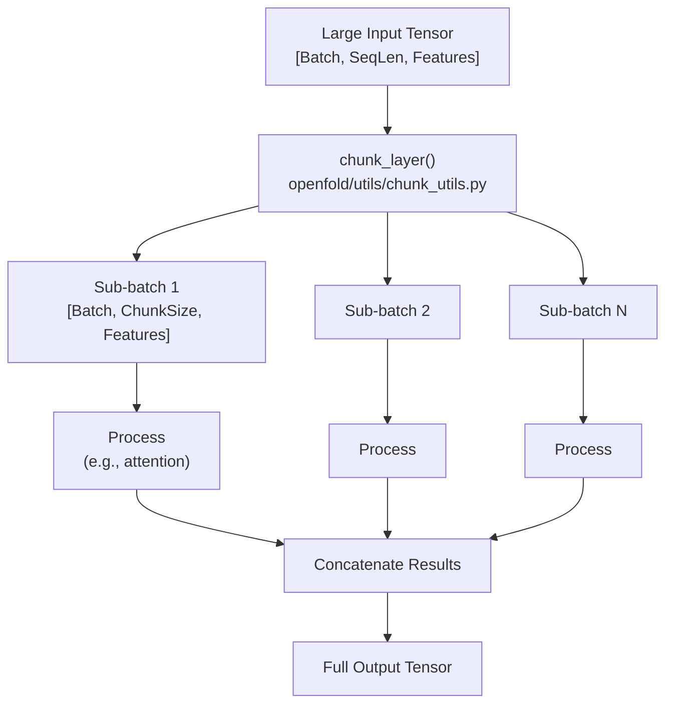

### Chunk Size Configuration

**Static Chunk Size:**

```css
# In config.py"globals": {    "chunk_size": 4,  # Process 4 residues at a time} # Training disables chunking by defaultif train:    c.globals.chunk_size = None  # No chunking during training
```

**Dynamic Chunk Size Tuning:**

OpenFold can automatically tune chunk size based on available memory:

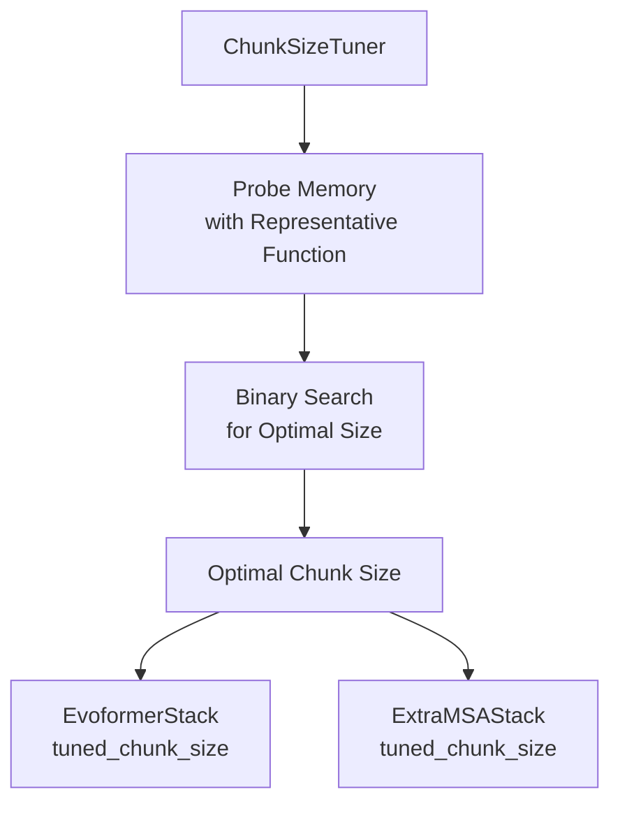

**Where Chunking is Applied:**

| Module | Chunk Dimension | Configuration Flag |
| --- | --- | --- |
| MSA Transition | Sequence | `chunk_size` |
| Pair Transition | Sequence | `chunk_size` |
| Outer Product Mean | MSA rows | `chunk_size` |
| Triangle Attention | Sequence | `_attn_chunk_size` |
| MSA Row Attention | Sequence | `_attn_chunk_size` |
| Template Stack | Templates × Sequence | `chunk_size` |

**Implementation Example - MSA Transition:**

```python
# openfold/model/evoformer.pydef forward(self, m, mask=None, chunk_size=None):    if chunk_size is not None:        m = self._chunk(m, mask, chunk_size)    else:        m = self._transition(m, mask)    return m def _chunk(self, m, mask, chunk_size):    return chunk_layer(        self._transition,        {"m": m, "mask": mask},        chunk_size=chunk_size,        no_batch_dims=len(m.shape[:-2]),    )
```

**Sources:** [openfold/model/evoformer.py L878-L881](https://github.com/aqlaboratory/openfold/blob/56da08ec/openfold/model/evoformer.py#L878-L881)

 [openfold/model/evoformer.py L921-L937](https://github.com/aqlaboratory/openfold/blob/56da08ec/openfold/model/evoformer.py#L921-L937)

 [openfold/model/evoformer.py L84-L94](https://github.com/aqlaboratory/openfold/blob/56da08ec/openfold/model/evoformer.py#L84-L94)

---

## Distributed Training with DeepSpeed

DeepSpeed enables training on multiple GPUs with advanced memory optimization through ZeRO (Zero Redundancy Optimizer) stages and memory-efficient attention kernels.

### DeepSpeed Integration Architecture

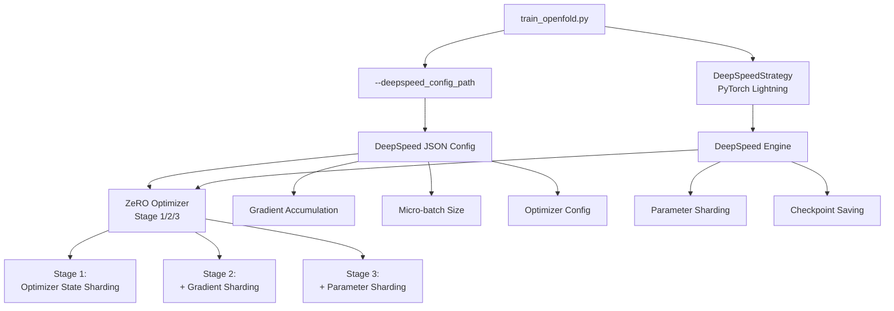

### DeepSpeed Configuration Structure

**Command Line Usage:**

```
python train_openfold.py \    train_data_dir/ \    train_alignment_dir/ \    template_mmcif_dir/ \    output_dir/ \    2021-09-30 \    --deepspeed_config_path deepspeed_config.json \    --precision bf16-mixed \    --gpus 8 \    --num_nodes 2
```

**Example DeepSpeed Configuration:**

```json
{  "train_micro_batch_size_per_gpu": 1,  "gradient_accumulation_steps": 1,  "optimizer": {    "type": "Adam",    "params": {      "lr": 1e-3,      "betas": [0.9, 0.999],      "eps": 1e-5    }  },  "zero_optimization": {    "stage": 2,    "offload_optimizer": {      "device": "cpu"    },    "contiguous_gradients": true,    "overlap_comm": true  },  "bf16": {    "enabled": true  }}
```

### ZeRO Stages Comparison

| Stage | Shards | Memory Reduction | Communication Overhead | Use Case |
| --- | --- | --- | --- | --- |
| **Stage 0** | None | 0% (baseline) | Minimal | Debugging, small models |
| **Stage 1** | Optimizer states | ~4x | Low | Most training runs |
| **Stage 2** | + Gradients | ~8x | Moderate | Limited GPU memory |
| **Stage 3** | + Parameters | ~Linear with #GPUs | High | Extremely large models |

**CPU Offloading:**

```json
{  "zero_optimization": {    "stage": 2,    "offload_optimizer": {      "device": "cpu",      "pin_memory": true    },    "offload_param": {      "device": "cpu",      "pin_memory": true    }  }}
```

### Checkpoint Handling

DeepSpeed checkpoints require special loading:

```markdown
# Load DeepSpeed checkpoint (train_openfold.py)if os.path.isdir(args.resume_from_ckpt):    # DeepSpeed checkpoint directory    sd = zero_to_fp32.get_fp32_state_dict_from_zero_checkpoint(        args.resume_from_ckpt    )else:    # Regular PyTorch checkpoint    sd = torch.load(args.resume_from_ckpt)
```

**Checkpoint Directory Structure:**

```markdown
checkpoint_dir/
├── latest                    # Points to current checkpoint tag
├── global_step123/
│   ├── zero_pp_rank_0_mp_rank_00_model_states.pt
│   ├── zero_pp_rank_1_mp_rank_00_model_states.pt
│   └── ...
```

**Sources:** [train_openfold.py L416-L428](https://github.com/aqlaboratory/openfold/blob/56da08ec/train_openfold.py#L416-L428)

 [train_openfold.py L271-L282](https://github.com/aqlaboratory/openfold/blob/56da08ec/train_openfold.py#L271-L282)

 [train_openfold.py L306-L314](https://github.com/aqlaboratory/openfold/blob/56da08ec/train_openfold.py#L306-L314)

---

## Mixed Precision Training

Mixed precision training uses lower-precision floating-point formats (FP16, BF16) to reduce memory usage and accelerate computation while maintaining model quality.

### Precision Format Comparison

| Format | Bits | Range | Precision | Memory | Speed | Stability |
| --- | --- | --- | --- | --- | --- | --- |
| **FP32** | 32 | ±3.4e38 | High | 4 bytes | 1x (baseline) | High |
| **TF32** | 19 | ±3.4e38 | Medium | 4 bytes* | 1.5-2x | High |
| **BF16** | 16 | ±3.4e38 | Low | 2 bytes | 2-3x | Medium-High |
| **FP16** | 16 | ±65,504 | Medium | 2 bytes | 2-3x | Low |

*TF32 uses FP32 storage but reduced precision in computation

### Precision Configuration Flow

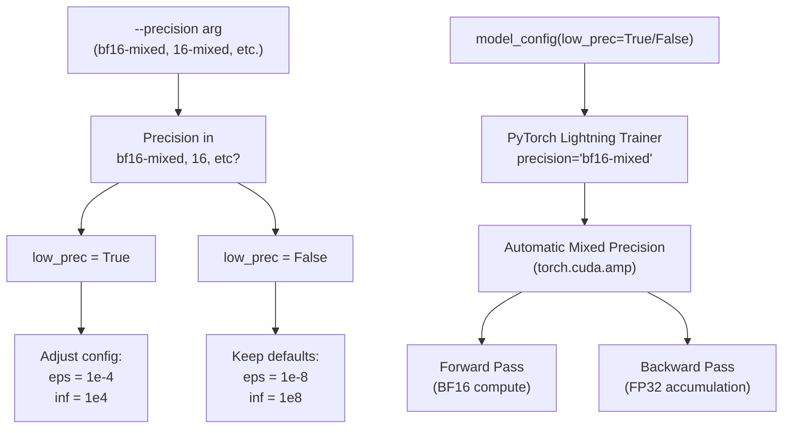

### Configuration in Code

**Setting Precision:**

```markdown
# Command lineparser.add_argument("--precision", type=str, default='bf16') # In model_config() (openfold/config.py)is_low_precision = args.precision in [    "bf16-mixed", "16", "bf16", "16-true", "16-mixed", "bf16-mixed"] config = model_config(    args.config_preset,     train=True,     low_prec=is_low_precision,) # Adjust numerical constants for stabilityif low_prec:    c.globals.eps = 1e-4    set_inf(c, 1e4)
```

**PyTorch Lightning Integration:**

```markdown
trainer = pl.Trainer(    precision='bf16-mixed',  # or '16-mixed', '32', etc.    # ... other args)
```

### Numerical Stability Adjustments

Lower precision requires careful tuning of epsilon and infinity constants to prevent:

* Underflow in normalization layers
* Overflow in softmax operations
* NaN propagation in attention

**Impact on Model Components:**

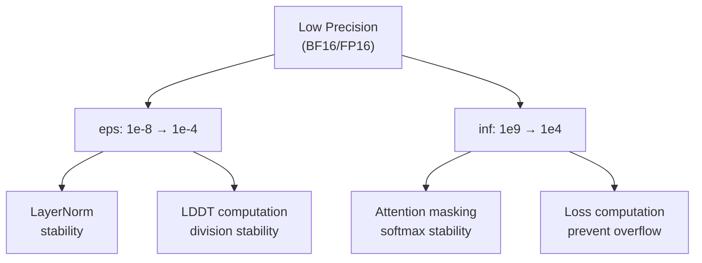

**Sources:** [train_openfold.py L288-L295](https://github.com/aqlaboratory/openfold/blob/56da08ec/train_openfold.py#L288-L295)

 [openfold/config.py L296-L300](https://github.com/aqlaboratory/openfold/blob/56da08ec/openfold/config.py#L296-L300)

 [train_openfold.py L667-L668](https://github.com/aqlaboratory/openfold/blob/56da08ec/train_openfold.py#L667-L668)

---

## Memory-Efficient Attention Kernels

OpenFold supports multiple optimized attention implementations that trade off memory usage, speed, and compatibility.

### Attention Kernel Options

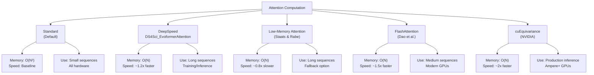

### Configuration and Mutual Exclusivity

**Global Configuration:**

```css
# In config.py globals section"globals": {    "use_deepspeed_evo_attention": False,  # DeepSpeed kernel    "use_lma": False,                       # Low-memory attention    "use_flash": False,                     # FlashAttention    "use_cuequivariance_attention": False,  # cuEquivariance    "use_cuequivariance_multiplicative_update": False,}
```

**Mutual Exclusivity Enforcement:**

The configuration system ensures only one attention mode is active:

```
mutually_exclusive_bools = [    (        "globals.use_lma",        "globals.use_flash",        "globals.use_deepspeed_evo_attention"    ),    (        "globals.use_lma",        "globals.use_flash",        "globals.use_cuequivariance_attention",    ),]
```

### Kernel Application in Model

Different attention types are applied at different locations:

| Module | Standard | DeepSpeed | LMA | FlashAttention | cuEquivariance |
| --- | --- | --- | --- | --- | --- |
| MSA Row Attention | ✓ | ✓ | ✓ | ✗ | ✓ |
| MSA Column Attention | ✓ | ✓ | ✓ | ✓ | ✓ |
| Triangle Attention (Starting) | ✓ | ✓ | ✓ | ✗ | ✓ |
| Triangle Attention (Ending) | ✓ | ✓ | ✓ | ✗ | ✓ |
| Triangle Multiplicative Update | ✓ | ✗ | ✗ | ✗ | ✓ |

**Propagation Through Model:**

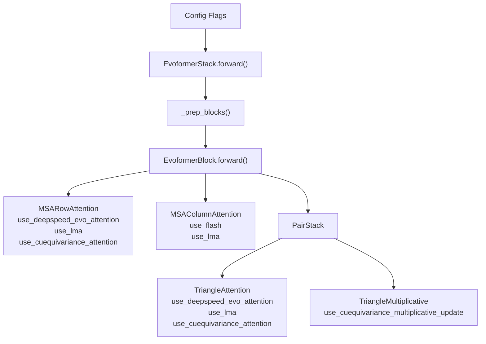

### Long Sequence Inference Mode

A special configuration preset automatically enables optimal memory settings:

```markdown
# In model_config()if long_sequence_inference:    assert(not train)    c.globals.offload_inference = True    c.globals.use_deepspeed_evo_attention = True  # Default for long sequences    c.globals.use_flash = False    c.model.template.offload_inference = True    # Disable chunk size tuning    c.model.template.template_pair_stack.tune_chunk_size = False    c.model.extra_msa.extra_msa_stack.tune_chunk_size = False    c.model.evoformer_stack.tune_chunk_size = False
```

**Sources:** [openfold/config.py L39-L83](https://github.com/aqlaboratory/openfold/blob/56da08ec/openfold/config.py#L39-L83)

 [openfold/config.py L268-L277](https://github.com/aqlaboratory/openfold/blob/56da08ec/openfold/config.py#L268-L277)

 [openfold/model/evoformer.py L994-L1023](https://github.com/aqlaboratory/openfold/blob/56da08ec/openfold/model/evoformer.py#L994-L1023)

---

## In-place Operations and Cache Management

In-place operations modify tensors directly instead of creating copies, reducing memory allocations. OpenFold uses this extensively during inference.

### In-place Operation Flow

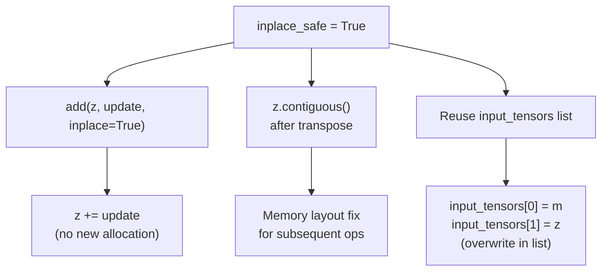

### In-place Safety Conditions

In-place operations are only safe when:

1. Not in training mode (gradients would be corrupted)
2. Not tracing for ONNX/TorchScript export
3. No need to preserve original tensor values

**Implementation Example:**

```sql
# In EvoformerBlock (openfold/model/evoformer.py)if (_offload_inference and inplace_safe):    input_tensors = _offloadable_inputselse:    input_tensors = [m, z] # Later operations reuse the listif (not inplace_safe):    input_tensors = [m, z]  # Create new list    del m, z  # Delete references # Process with in-place updatesz = self.pair_stack(    z=input_tensors[1],    inplace_safe=inplace_safe,    # ...) # Overwrite list entryinput_tensors[1] = z
```

### Cache Management

**Explicit CUDA Cache Clearing:**

```python
# EvoformerStack configuration"clear_cache_between_blocks": False  # Set to True if needed # Implementationif(self.clear_cache_between_blocks):    def block_with_cache_clear(block, *args, **kwargs):        torch.cuda.empty_cache()        return block(*args, **kwargs)        blocks = [partial(block_with_cache_clear, b) for b in blocks]
```

**When to Clear Cache:**

| Scenario | Clear Cache | Reason |
| --- | --- | --- |
| Training | ✗ | Performance overhead too high |
| Short sequences | ✗ | Fragmentation not significant |
| Long sequences (>2000) | ✓ | Prevents OOM from fragmentation |
| Low memory (<40GB) | ✓ | More fragmentation likely |

### Inference Offloading Pattern

For extreme memory savings during inference, tensors can be offloaded to CPU between operations:

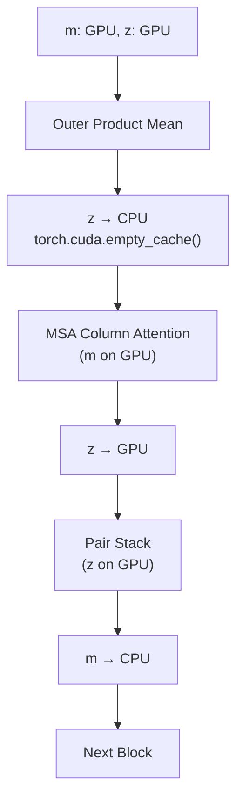

**Reference Counting:**

The offloading code carefully manages Python reference counts to ensure tensors can be moved:

```markdown
if (_offload_inference and inplace_safe):    # Ensure only one reference exists (the list)    del m, z    assert (sys.getrefcount(input_tensors[1]) == 2)    input_tensors[1] = input_tensors[1].cpu()    m, z = input_tensors
```

**Sources:** [openfold/model/evoformer.py L456-L542](https://github.com/aqlaboratory/openfold/blob/56da08ec/openfold/model/evoformer.py#L456-L542)

 [openfold/model/evoformer.py L914-L919](https://github.com/aqlaboratory/openfold/blob/56da08ec/openfold/model/evoformer.py#L914-L919)

 [openfold/utils/tensor_utils.py

NaN-NaN](https://github.com/aqlaboratory/openfold/blob/56da08ec/openfold/utils/tensor_utils.py#LNaN-LNaN)

---

## Data Pipeline Memory Optimization

The data loading pipeline includes several memory optimizations through filtering, sampling, and preprocessing.

### Stochastic Filtering Architecture

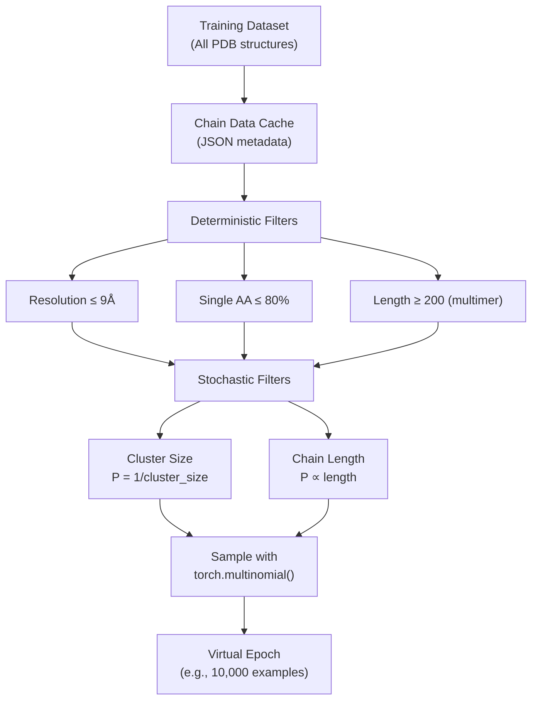

### Filter Implementation

**Deterministic Filtering:**

```python
# OpenFoldDataset.deterministic_train_filter()def deterministic_train_filter(    cache_entry,    max_resolution: float = 9.,    max_single_aa_prop: float = 0.8,) -> bool:    resolution = cache_entry.get("resolution", None)    seqs = [cache_entry["seq"]]        return all([        resolution_filter(resolution, max_resolution),        aa_count_filter(seqs, max_single_aa_prop)    ])
```

**Stochastic Filtering:**

```python
def get_stochastic_train_filter_prob(cache_entry) -> float:    probabilities = []        # Cluster size filter (reduce redundancy)    cluster_size = cache_entry.get("cluster_size", None)    if cluster_size is not None and cluster_size > 0:        probabilities.append(1 / cluster_size)        # Length-based sampling (favor longer sequences)    chain_length = len(cache_entry["seq"])    probabilities.append((1 / 512) * (max(min(chain_length, 512), 256)))        # Multiply probabilities    return math.prod(probabilities)
```

### Cropping and MSA Sampling

**Spatial Cropping:**

Reduces sequence length to fit in memory:

```markdown
# data.train configuration"crop": True,"crop_size": 256,  # or 384 for finetuning"spatial_crop_prob": 0.0,  # 0.5 for multimer"interface_threshold": None,  # 10.0 for multimer
```

**Cropping Strategy:**

| Mode | Crop Size | Strategy | Purpose |
| --- | --- | --- | --- |
| Initial Training | 256 | Random | Memory efficiency |
| Finetuning | 384 | Random | Larger receptive field |
| Multimer | 640 | Interface-aware (50%) | Preserve complex interfaces |

**MSA Depth Control:**

```markdown
"max_msa_clusters": 128,    # Clustered MSA rows"max_extra_msa": 1024,      # Extra MSA rows"max_templates": 4,         # Template structures
```

**Memory Impact:**

```
Memory ∝ (crop_size² × max_msa_clusters) + (crop_size² × max_extra_msa)
```

Reducing `max_msa_clusters` from 512 to 128 reduces MSA memory by 4x.

### DataLoader Configuration

```markdown
# data.data_module.data_loaders"batch_size": 1,         # Usually 1 due to memory constraints"num_workers": 16,        # Parallel data loading"pin_memory": True,       # Faster CPU→GPU transfer
```

**Gradient Accumulation Alternative:**

Instead of large batches, use gradient accumulation:

```markdown
python train_openfold.py \    --accumulate_grad_batches 8 \    # Effective batch size = 1 × 8 = 8
```

**Sources:** [openfold/data/data_modules.py L559-L595](https://github.com/aqlaboratory/openfold/blob/56da08ec/openfold/data/data_modules.py#L559-L595)

 [openfold/data/data_modules.py L684-L753](https://github.com/aqlaboratory/openfold/blob/56da08ec/openfold/data/data_modules.py#L684-L753)

 [openfold/config.py L487-L506](https://github.com/aqlaboratory/openfold/blob/56da08ec/openfold/config.py#L487-L506)

---

## Configuration Examples

### Example 1: Memory-Constrained Training (24GB GPU)

```
python train_openfold.py \    train_data_dir/ \    train_alignment_dir/ \    template_mmcif_dir/ \    output_dir/ \    2021-09-30 \    --config_preset initial_training \    --precision bf16-mixed \    --gpus 1 \    --max_epochs 10 \    --train_epoch_len 1000 \    --accumulate_grad_batches 16
```

**Effective Configuration:**

* Crop size: 256 residues
* MSA clusters: 128
* Extra MSA: 1024
* Checkpointing: Every block (`blocks_per_ckpt=1`)
* Precision: BF16 mixed
* No chunking during training

**Memory Breakdown:**

* Model parameters: ~4GB
* MSA activations: ~8GB
* Pair activations: ~6GB
* Gradients + optimizer: ~6GB
* Total: ~24GB

### Example 2: Multi-GPU Training with DeepSpeed (8×40GB GPUs)

**DeepSpeed Configuration (`ds_config.json`):**

```json
{  "train_micro_batch_size_per_gpu": 1,  "gradient_accumulation_steps": 4,  "optimizer": {    "type": "Adam",    "params": {      "lr": 1e-3,      "eps": 1e-5    }  },  "scheduler": {    "type": "WarmupLR",    "params": {      "warmup_min_lr": 0,      "warmup_max_lr": 1e-3,      "warmup_num_steps": 1000    }  },  "zero_optimization": {    "stage": 2,    "contiguous_gradients": true,    "overlap_comm": true,    "reduce_scatter": true,    "reduce_bucket_size": 5e8,    "allgather_bucket_size": 5e8  },  "bf16": {    "enabled": true  },  "steps_per_print": 100}
```

**Command:**

```
python train_openfold.py \    train_data_dir/ \    train_alignment_dir/ \    template_mmcif_dir/ \    output_dir/ \    2021-09-30 \    --config_preset finetuning \    --deepspeed_config_path ds_config.json \    --precision bf16-mixed \    --gpus 8 \    --num_nodes 1 \    --max_epochs 5 \    --train_epoch_len 10000 \    --checkpoint_every_epoch
```

**Scaling:**

* Effective batch size: 1 × 4 × 8 = 32
* Parameter memory: ~0.5GB per GPU (ZeRO-2)
* Training throughput: ~8x single GPU

### Example 3: Finetuning with Custom Config

**Custom Configuration (`custom_config.json`):**

```json
{  "globals.blocks_per_ckpt": 2,  "model.evoformer_stack.clear_cache_between_blocks": true,  "data.train.crop_size": 320,  "data.train.max_msa_clusters": 256,  "data.train.max_extra_msa": 2048,  "loss.violation.weight": 1.0,  "loss.fape.weight": 2.0}
```

**Command:**

```
python train_openfold.py \    train_data_dir/ \    train_alignment_dir/ \    template_mmcif_dir/ \    output_dir/ \    2021-09-30 \    --config_preset finetuning \    --experiment_config_json custom_config.json \    --resume_from_ckpt pretrained_model.pt \    --resume_model_weights_only true \    --precision bf16-mixed \    --gpus 4 \    --num_nodes 1
```

### Example 4: Memory-Optimized Inference (Simulating Training Setup)

For testing memory-optimized configurations without full training:

```javascript
# In Python scriptfrom openfold.config import model_config config = model_config(    "finetuning",    train=True,    low_prec=True,) # Override for testingconfig.globals.blocks_per_ckpt = 4  # Less aggressive than trainingconfig.globals.chunk_size = 32      # Enable chunking for testingconfig.data.train.crop_size = 256 # Use with modelfrom openfold.model.model import AlphaFoldmodel = AlphaFold(config)
```

**Sources:** [train_openfold.py L469-L703](https://github.com/aqlaboratory/openfold/blob/56da08ec/train_openfold.py#L469-L703)

 [openfold/config.py L108-L143](https://github.com/aqlaboratory/openfold/blob/56da08ec/openfold/config.py#L108-L143)

 [train_openfold.py L296-L299](https://github.com/aqlaboratory/openfold/blob/56da08ec/train_openfold.py#L296-L299)

---

## Summary

OpenFold provides a comprehensive suite of memory optimization techniques:

1. **Activation Checkpointing**: Reduces memory by 80% with 33% compute overhead
2. **Chunking**: Flexible sub-batching with automatic tuning
3. **DeepSpeed ZeRO**: 4-8x memory reduction for distributed training
4. **Mixed Precision**: 2x memory savings with BF16
5. **Optimized Kernels**: Memory-efficient attention implementations
6. **In-place Operations**: Eliminates redundant allocations during inference
7. **Data Filtering**: Intelligent sampling reduces dataset size
8. **Gradient Accumulation**: Simulates large batches without memory cost

These techniques can be combined for extreme memory efficiency, enabling training on consumer hardware or scaling to very large models on HPC systems.