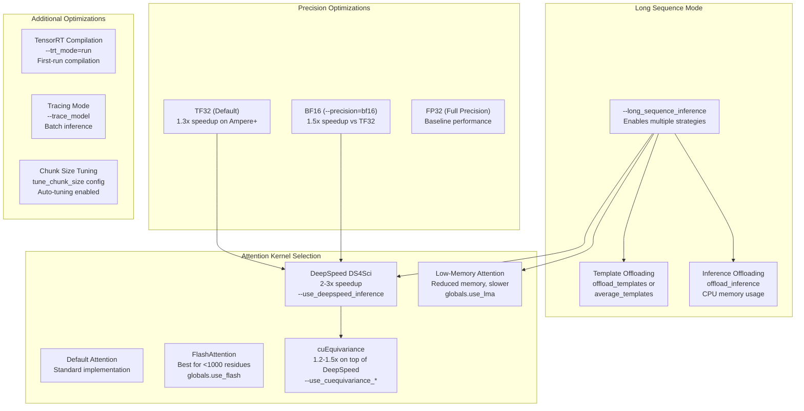
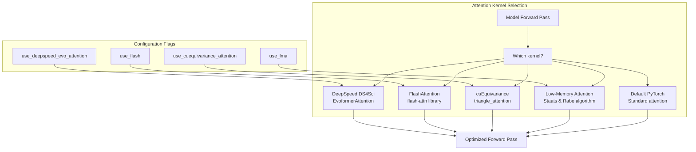
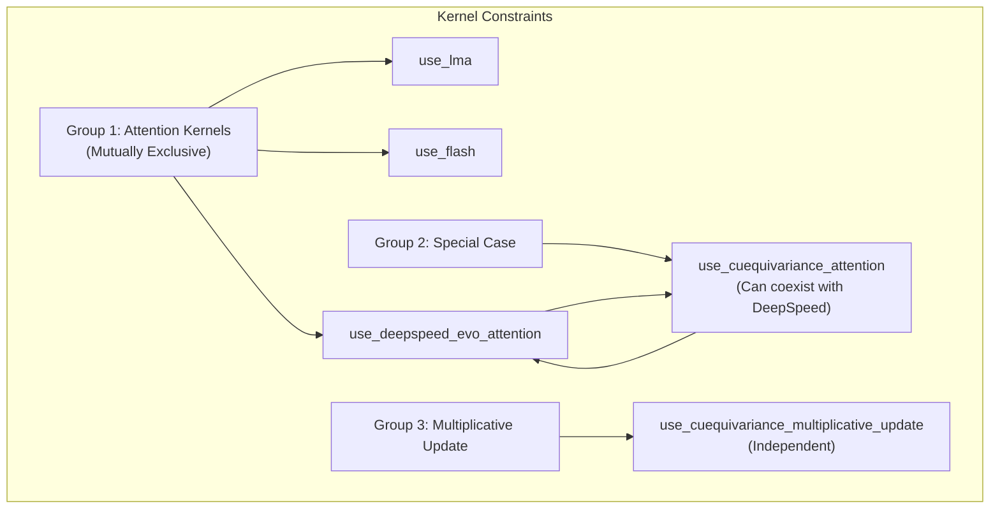
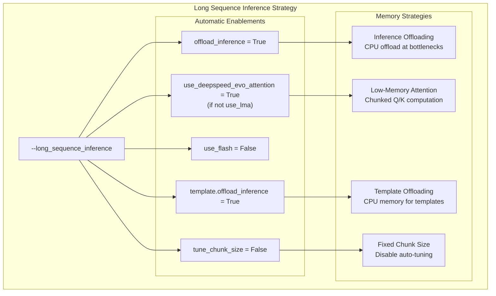

# Performance Optimization

> **Relevant source files**
> * [docs/source/Inference.md](https://github.com/aqlaboratory/openfold/blob/56da08ec/docs/source/Inference.md?plain=1)
> * [docs/source/Multimer_Inference.md](https://github.com/aqlaboratory/openfold/blob/56da08ec/docs/source/Multimer_Inference.md?plain=1)
> * [docs/source/Single_Sequence_Inference.md](https://github.com/aqlaboratory/openfold/blob/56da08ec/docs/source/Single_Sequence_Inference.md?plain=1)
> * [docs/source/conf.py](https://github.com/aqlaboratory/openfold/blob/56da08ec/docs/source/conf.py)
> * [openfold/config.py](https://github.com/aqlaboratory/openfold/blob/56da08ec/openfold/config.py)
> * [openfold/model/dropout.py](https://github.com/aqlaboratory/openfold/blob/56da08ec/openfold/model/dropout.py)
> * [openfold/model/evoformer.py](https://github.com/aqlaboratory/openfold/blob/56da08ec/openfold/model/evoformer.py)

This page describes performance optimization techniques for OpenFold inference, including precision settings, optimized attention kernels, TensorRT compilation, and memory management strategies for long sequences. These optimizations can reduce inference time, memory usage, or both, depending on hardware capabilities and sequence length.

For information about the overall inference workflow, see [Inference Pipeline Overview](/aqlaboratory/openfold/3.1-inference-pipeline-overview). For training-specific optimizations, see [Memory Optimization for Training](/aqlaboratory/openfold/4.3-memory-optimization-for-training).

## Overview of Optimization Strategies

OpenFold supports multiple optimization strategies that can be combined to achieve desired performance characteristics:



**Optimization Strategy Decision Tree**

Sources: [docs/source/Inference.md L144-L194](https://github.com/aqlaboratory/openfold/blob/56da08ec/docs/source/Inference.md?plain=1#L144-L194)

 [openfold/config.py L85-L304](https://github.com/aqlaboratory/openfold/blob/56da08ec/openfold/config.py#L85-L304)

## Precision Settings

### TF32 (TensorFloat-32)

TF32 is available on NVIDIA Ampere and later GPUs. It uses 8 exponent bits (like FP32) and 10 mantissa bits (like FP16), providing approximately 1.3x speedup with minimal accuracy impact.

**Enabling TF32:**

TF32 is controlled via PyTorch environment settings. Add this to your inference script or set the `--precision` flag:

```javascript
import torchtorch.backends.cuda.matmul.allow_tf32 = Truetorch.backends.cudnn.allow_tf32 = True
```

The `--precision` argument in `run_pretrained_openfold.py` defaults to `"tf32"` when not specified.

**Configuration:**

* Command line: `--precision=tf32` (default)
* Config field: `config.precision = "tf32"`

Sources: [docs/source/Inference.md L146-L156](https://github.com/aqlaboratory/openfold/blob/56da08ec/docs/source/Inference.md?plain=1#L146-L156)

 [openfold/config.py L93-L101](https://github.com/aqlaboratory/openfold/blob/56da08ec/openfold/config.py#L93-L101)

### BF16 (Brain Float 16)

BF16 uses 1 sign bit, 8 exponent bits (same range as FP32), and 7 mantissa bits. It provides approximately 1.5x speedup compared to TF32 when applied to Evoformer and ExtraMSA stacks.

**Enabling BF16:**

Command line: `--precision=bf16`

This applies BF16 precision casting to:

* EvoformerStack
* ExtraMSAStack

**Configuration:**

* Command line: `--precision=bf16`
* Config field: `config.precision = "bf16"`
* Low precision epsilon: Set automatically when `low_prec=True` in [openfold/config.py L296-L300](https://github.com/aqlaboratory/openfold/blob/56da08ec/openfold/config.py#L296-L300)

**Precision Comparison Table:**

| Precision | Sign Bits | Exponent Bits | Mantissa Bits | Speedup vs FP32 | Memory | Use Case |
| --- | --- | --- | --- | --- | --- | --- |
| FP32 | 1 | 8 | 23 | 1.0x | 4 bytes | Baseline |
| TF32 | 1 | 8 | 10 | ~1.3x | 4 bytes | Default for Ampere+ |
| BF16 | 1 | 8 | 7 | ~1.5x | 2 bytes | Fast inference |
| FP16 | 1 | 5 | 10 | ~1.5x | 2 bytes | Not recommended (unstable) |

Sources: [docs/source/Inference.md L158-L163](https://github.com/aqlaboratory/openfold/blob/56da08ec/docs/source/Inference.md?plain=1#L158-L163)

 [openfold/config.py L88-L300](https://github.com/aqlaboratory/openfold/blob/56da08ec/openfold/config.py#L88-L300)

## Attention Kernel Optimizations

OpenFold supports multiple attention kernel implementations that can significantly improve performance. These kernels are mutually exclusive (only one can be active at a time) except for cuEquivariance, which can fall back to other kernels.



**Kernel Selection in Code**

Sources: [openfold/config.py L39-L534](https://github.com/aqlaboratory/openfold/blob/56da08ec/openfold/config.py#L39-L534)

### DeepSpeed DS4Sci EvoformerAttention

The DeepSpeed DS4Sci_EvoformerAttention kernel is a memory-efficient attention implementation developed through the OpenFold-DeepSpeed4Science collaboration. It provides 2-3x speedup without significant additional memory overhead.

**Enabling DeepSpeed:**

Command line: `--use_deepspeed_inference`

Config: Add to `--experiment_config_json`:

```json
{"globals.use_deepspeed_evo_attention": true}
```

Or enable automatically with `--long_sequence_inference`

**Requirements:**

* DeepSpeed package installed
* `deepspeed.ops.deepspeed4science` module available
* Checked at runtime in [openfold/config.py L65-L72](https://github.com/aqlaboratory/openfold/blob/56da08ec/openfold/config.py#L65-L72)

**Usage in Evoformer:**

The kernel is passed through the forward call chain:

* [openfold/model/evoformer.py L439-L740](https://github.com/aqlaboratory/openfold/blob/56da08ec/openfold/model/evoformer.py#L439-L740)  - `use_deepspeed_evo_attention` parameter
* Applied in MSARowAttention, TriangleAttention modules

Sources: [docs/source/Inference.md L164-L169](https://github.com/aqlaboratory/openfold/blob/56da08ec/docs/source/Inference.md?plain=1#L164-L169)

 [openfold/config.py L65-L522](https://github.com/aqlaboratory/openfold/blob/56da08ec/openfold/config.py#L65-L522)

 [openfold/model/evoformer.py L184-L374](https://github.com/aqlaboratory/openfold/blob/56da08ec/openfold/model/evoformer.py#L184-L374)

### FlashAttention

FlashAttention is an IO-aware attention algorithm that works best for sequences with fewer than 1000 residues. It should be disabled for long sequences due to instability.

**Enabling FlashAttention:**

Config: Add to `--experiment_config_json`:

```json
{"globals.use_flash": true}
```

**Requirements:**

* `flash_attn` package installed
* Verified at [openfold/config.py L61-L63](https://github.com/aqlaboratory/openfold/blob/56da08ec/openfold/config.py#L61-L63)

**Limitations:**

* Not recommended for sequences >1000 residues
* Disabled automatically in `long_sequence_inference` mode [openfold/config.py L273](https://github.com/aqlaboratory/openfold/blob/56da08ec/openfold/config.py#L273-L273)
* Mutually exclusive with DeepSpeed and LMA

Sources: [docs/source/Inference.md L173](https://github.com/aqlaboratory/openfold/blob/56da08ec/docs/source/Inference.md?plain=1#L173-L173)

 [openfold/config.py L61-L529](https://github.com/aqlaboratory/openfold/blob/56da08ec/openfold/config.py#L61-L529)

### cuEquivariance Kernels

cuEquivariance provides optimized implementations of triangle attention and triangle multiplicative update operations. It can provide 1.2-1.5x speedup on top of DeepSpeed, with even greater gains for sequences >1000 residues. Importantly, cuEquivariance attention uses significantly less memory than default or DeepSpeed attention.

**Enabling cuEquivariance:**

Command line:

```
--use_cuequivariance_attention \--use_cuequivariance_multiplicative_update
```

Config:

```json
{  "globals.use_cuequivariance_attention": true,  "globals.use_cuequivariance_multiplicative_update": true}
```

**Requirements:**

* `cuequivariance_torch` package installed
* Validated at [openfold/config.py L74-L76](https://github.com/aqlaboratory/openfold/blob/56da08ec/openfold/config.py#L74-L76)

**Fallback Behavior:**

cuEquivariance falls back to DeepSpeed for shapes it doesn't efficiently support, so enabling both provides best coverage:

```
--use_deepspeed_inference \--use_cuequivariance_attention \--use_cuequivariance_multiplicative_update
```

**Operations Accelerated:**

* `triangle_attention` - Used in TriangleAttention modules
* `triangle_multiplicative_update` - Used in TriangleMultiplication modules

Sources: [docs/source/Inference.md L170-L172](https://github.com/aqlaboratory/openfold/blob/56da08ec/docs/source/Inference.md?plain=1#L170-L172)

 [openfold/config.py L74-L534](https://github.com/aqlaboratory/openfold/blob/56da08ec/openfold/config.py#L74-L534)

 [openfold/model/evoformer.py L186-L741](https://github.com/aqlaboratory/openfold/blob/56da08ec/openfold/model/evoformer.py#L186-L741)

### Low-Memory Attention (LMA)

LMA implements the Staats & Rabe algorithm that trades speed for reduced memory usage. It uses chunked query and key computation with configurable chunk sizes.

**Enabling LMA:**

Config: Add to `--experiment_config_json`:

```json
{"globals.use_lma": true}
```

Or enable automatically with `--long_sequence_inference`

**Default Chunk Sizes:**

* Query chunk: 1024
* Key chunk: 4096

These can be modified in [openfold/model/primitives.py](https://github.com/aqlaboratory/openfold/blob/56da08ec/openfold/model/primitives.py)

 for advanced users.

**When to Use:**

* Long sequence inference (>1000 residues)
* Memory-constrained scenarios
* Automatically enabled by `long_sequence_inference` flag

Sources: [docs/source/Inference.md L188](https://github.com/aqlaboratory/openfold/blob/56da08ec/docs/source/Inference.md?plain=1#L188-L188)

 [openfold/config.py L272-L525](https://github.com/aqlaboratory/openfold/blob/56da08ec/openfold/config.py#L272-L525)

### Mutual Exclusivity Constraints



**Kernel Compatibility Matrix**

| Kernel | use_lma | use_flash | use_deepspeed | use_cueq_attn | use_cueq_mult |
| --- | --- | --- | --- | --- | --- |
| **use_lma** | ✓ | ✗ | ✗ | ✗ | ✓ |
| **use_flash** | ✗ | ✓ | ✗ | ✗ | ✓ |
| **use_deepspeed** | ✗ | ✗ | ✓ | ✓ | ✓ |
| **use_cueq_attn** | ✗ | ✗ | ✓ | ✓ | ✓ |
| **use_cueq_mult** | ✓ | ✓ | ✓ | ✓ | ✓ |

Enforcement in [openfold/config.py L39-L59](https://github.com/aqlaboratory/openfold/blob/56da08ec/openfold/config.py#L39-L59)

Sources: [openfold/config.py L39-L76](https://github.com/aqlaboratory/openfold/blob/56da08ec/openfold/config.py#L39-L76)

## TensorRT Compilation

OpenFold supports TensorRT lazy compilation for key modules, particularly the Evoformer. The engine is built on the first inference run and reused for subsequent runs.

**Enabling TensorRT:**

```
python run_pretrained_openfold.py \    ... \    --trt_mode=run \    --trt_engine_dir=/path/to/engines \    --trt_max_sequence_len=640 \    --trt_num_profiles=1 \    --trt_optimization_level=3
```

**Configuration Parameters:**

| Parameter | Default | Description |
| --- | --- | --- |
| `--trt_mode` | `None` | Set to `"run"` to enable TensorRT |
| `--trt_engine_dir` | `None` | Directory to store compiled engines |
| `--trt_num_profiles` | `1` | Number of optimization profiles |
| `--trt_optimization_level` | `3` | TensorRT optimization level (0-5) |
| `--trt_max_sequence_len` | `640` | Maximum sequence length for optimization |

**Configuration in Code:**

Set in [openfold/config.py L94-L99](https://github.com/aqlaboratory/openfold/blob/56da08ec/openfold/config.py#L94-L99)

:

```
c.trt.mode = trt_modec.trt.engine_dir = trt_engine_dirc.trt.num_profiles = trt_num_profilesc.trt.optimization_level = trt_optimization_levelc.trt.max_sequence_len = trt_max_sequence_len
```

**Behavior:**

* First run: Compiles TensorRT engine (lengthy process)
* Subsequent runs: Loads pre-compiled engine (fast)
* Can be combined with cuEquivariance for additional speedup

Sources: [docs/source/Inference.md L176](https://github.com/aqlaboratory/openfold/blob/56da08ec/docs/source/Inference.md?plain=1#L176-L176)

 [openfold/config.py L94-L340](https://github.com/aqlaboratory/openfold/blob/56da08ec/openfold/config.py#L94-L340)

## Tracing Mode

Tracing mode uses PyTorch's JIT tracing to compile the model, providing significant speedup for batch inference at the cost of a lengthy initial compilation.

**Enabling Tracing:**

```
python run_pretrained_openfold.py \    ... \    --trace_model
```

**Characteristics:**

* One-time compilation cost
* Massively improved runtimes for subsequent runs
* Best for large-scale batch inference
* Model must run with fixed input shapes during tracing

Sources: [docs/source/Inference.md L178-L179](https://github.com/aqlaboratory/openfold/blob/56da08ec/docs/source/Inference.md?plain=1#L178-L179)

## Memory Management for Long Sequences

For sequences longer than ~500 residues, memory becomes a critical constraint. OpenFold provides multiple strategies that can be combined.



**Long Sequence Mode Configuration**

Sources: [openfold/config.py L268-L277](https://github.com/aqlaboratory/openfold/blob/56da08ec/openfold/config.py#L268-L277)

### Automatic Long Sequence Mode

Enable all long-sequence optimizations at once:

```
python run_pretrained_openfold.py \    ... \    --long_sequence_inference
```

This automatically configures:

* `globals.offload_inference = True`
* `globals.use_deepspeed_evo_attention = True` (unless `use_lma` is set)
* `globals.use_flash = False`
* `model.template.offload_inference = True`
* `*.tune_chunk_size = False`

Implementation in [openfold/config.py L268-L277](https://github.com/aqlaboratory/openfold/blob/56da08ec/openfold/config.py#L268-L277)

Sources: [docs/source/Inference.md L184-L193](https://github.com/aqlaboratory/openfold/blob/56da08ec/docs/source/Inference.md?plain=1#L184-L193)

 [openfold/config.py L268-L277](https://github.com/aqlaboratory/openfold/blob/56da08ec/openfold/config.py#L268-L277)

### Template Memory Management

Templates are a major memory bottleneck for long sequences. OpenFold provides two mutually exclusive strategies:

**Option 1: Average Templates**

```json
{"model.template.average_templates": true}
```

* Averages individual template representations
* Memory-efficient approximation
* Slightly modified from AlphaFold-Multimer approach
* No significant performance difference observed

**Option 2: Offload Templates**

```json
{"model.template.offload_templates": true}
```

* Temporarily offloads template embeddings to CPU
* Exact computation (no approximation)
* Slightly slower than averaging
* Allows arbitrary number of templates

**Automatic Enforcement:**

If `offload_inference` is enabled and `average_templates` is false, the system automatically sets `offload_templates = True` in [openfold/config.py L78-L82](https://github.com/aqlaboratory/openfold/blob/56da08ec/openfold/config.py#L78-L82)

**Mutual Exclusivity:**

Enforced in [openfold/config.py L39-L43](https://github.com/aqlaboratory/openfold/blob/56da08ec/openfold/config.py#L39-L43)

 - only one can be enabled at a time.

Sources: [docs/source/Inference.md L187](https://github.com/aqlaboratory/openfold/blob/56da08ec/docs/source/Inference.md?plain=1#L187-L187)

 [openfold/config.py L39-L617](https://github.com/aqlaboratory/openfold/blob/56da08ec/openfold/config.py#L39-L617)

### Chunk Size Management

Chunking (AlphaFold 2 supplement section 1.11.8) divides computations into smaller pieces to reduce memory usage.

**Dynamic Tuning:**

By default, OpenFold automatically tunes chunk size:

```markdown
# Enabled by defaulttune_chunk_size = True
```

The ChunkSizeTuner starts with a minimum chunk size (from config) and dynamically adjusts based on available memory. Implementation in [openfold/model/evoformer.py L878-L881](https://github.com/aqlaboratory/openfold/blob/56da08ec/openfold/model/evoformer.py#L878-L881)

:

```
self.chunk_size_tuner = Noneif(tune_chunk_size):    self.chunk_size_tuner = ChunkSizeTuner(2048)
```

**Fixed Chunk Size:**

For long sequences, disable auto-tuning and use a fixed size:

```json
{  "globals.chunk_size": 4,  "model.evoformer_stack.tune_chunk_size": false,  "model.extra_msa.extra_msa_stack.tune_chunk_size": false,  "model.template.template_pair_stack.tune_chunk_size": false}
```

Automatically configured in long sequence mode at [openfold/config.py L275-L277](https://github.com/aqlaboratory/openfold/blob/56da08ec/openfold/config.py#L275-L277)

**Disabling Chunking:**

Set chunk size to `None`:

```json
{"globals.chunk_size": null}
```

Sources: [docs/source/Inference.md L181-L189](https://github.com/aqlaboratory/openfold/blob/56da08ec/docs/source/Inference.md?plain=1#L181-L189)

 [openfold/config.py L275-L324](https://github.com/aqlaboratory/openfold/blob/56da08ec/openfold/config.py#L275-L324)

 [openfold/model/evoformer.py L878-L881](https://github.com/aqlaboratory/openfold/blob/56da08ec/openfold/model/evoformer.py#L878-L881)

### Inference Offloading

The most aggressive memory reduction strategy, offloading activations to CPU at various bottlenecks.

**Enabling:**

```json
{"globals.offload_inference": true}
```

Or use `--long_sequence_inference`

**Offload Points:**

Implemented in [openfold/model/evoformer.py L344-L730](https://github.com/aqlaboratory/openfold/blob/56da08ec/openfold/model/evoformer.py#L344-L730)

:

* After Outer Product Mean computation
* Between MSA attention operations
* During pair stack processing
* Coordinated through `_offloadable_inputs` mechanism

**Memory Results:**

Using the most conservative settings (all strategies combined), OpenFold can run inference on 4600-residue complexes on a single A100 GPU.

Sources: [docs/source/Inference.md L190-L193](https://github.com/aqlaboratory/openfold/blob/56da08ec/docs/source/Inference.md?plain=1#L190-L193)

 [openfold/config.py L270-L535](https://github.com/aqlaboratory/openfold/blob/56da08ec/openfold/config.py#L270-L535)

 [openfold/model/evoformer.py L344-L495](https://github.com/aqlaboratory/openfold/blob/56da08ec/openfold/model/evoformer.py#L344-L495)

## Configuration Summary

### Command Line Flags Reference

| Flag | Effect | Typical Speedup | Memory Impact |
| --- | --- | --- | --- |
| `--precision=tf32` | Enable TF32 (default on Ampere+) | 1.3x | None |
| `--precision=bf16` | Enable BF16 precision | 1.5x | Reduced |
| `--use_deepspeed_inference` | DeepSpeed attention kernel | 2-3x | Minimal |
| `--use_cuequivariance_attention` | cuEquivariance triangle attention | +1.2-1.5x | Reduced |
| `--use_cuequivariance_multiplicative_update` | cuEquivariance triangle mult | +1.2-1.5x | None |
| `--trt_mode=run` | TensorRT compilation | Varies | None |
| `--trace_model` | PyTorch JIT tracing | Significant (batch) | None |
| `--long_sequence_inference` | All long-sequence strategies | Varies | Greatly reduced |

### Recommended Configurations

**Short Sequences (<500 residues):**

```
python run_pretrained_openfold.py \    ... \    --precision=bf16 \    --use_deepspeed_inference \    --use_cuequivariance_attention \    --use_cuequivariance_multiplicative_update
```

**Medium Sequences (500-1500 residues):**

```
python run_pretrained_openfold.py \    ... \    --precision=bf16 \    --use_deepspeed_inference \    --use_cuequivariance_attention \    --use_cuequivariance_multiplicative_update \    --experiment_config_json '{"model.template.offload_templates": true}'
```

**Long Sequences (>1500 residues):**

```
python run_pretrained_openfold.py \    ... \    --precision=bf16 \    --use_deepspeed_inference \    --use_cuequivariance_attention \    --use_cuequivariance_multiplicative_update \    --long_sequence_inference
```

**Batch Inference:**

```
python run_pretrained_openfold.py \    ... \    --precision=bf16 \    --use_deepspeed_inference \    --use_cuequivariance_attention \    --use_cuequivariance_multiplicative_update \    --trace_model
```

### Config Dict Settings

For programmatic configuration, key settings are located in [openfold/config.py L516-L544](https://github.com/aqlaboratory/openfold/blob/56da08ec/openfold/config.py#L516-L544)

:

```css
"globals": {    "blocks_per_ckpt": blocks_per_ckpt,          # None for inference    "chunk_size": chunk_size,                     # 4 by default    "use_deepspeed_evo_attention": False,    "use_lma": False,    "use_flash": False,    "use_cuequivariance_attention": False,    "use_cuequivariance_multiplicative_update": False,    "offload_inference": False,    "eps": eps,}
```

Template settings in [openfold/config.py L604-L617](https://github.com/aqlaboratory/openfold/blob/56da08ec/openfold/config.py#L604-L617)

:

```
"template": {    "average_templates": False,    "offload_templates": False,}
```

Sources: [openfold/config.py L85-L798](https://github.com/aqlaboratory/openfold/blob/56da08ec/openfold/config.py#L85-L798)

 [docs/source/Inference.md L144-L194](https://github.com/aqlaboratory/openfold/blob/56da08ec/docs/source/Inference.md?plain=1#L144-L194)