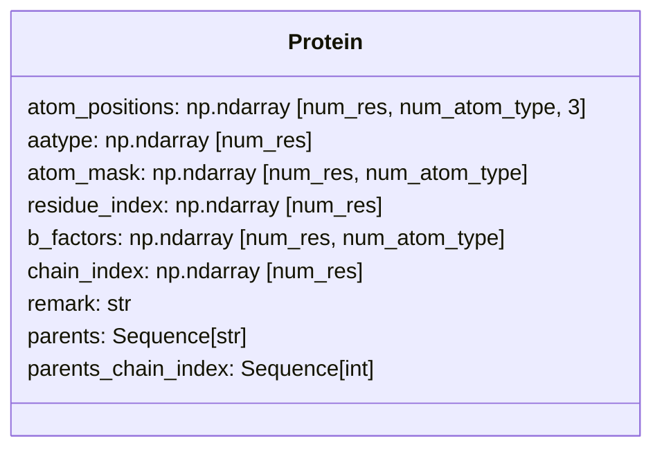
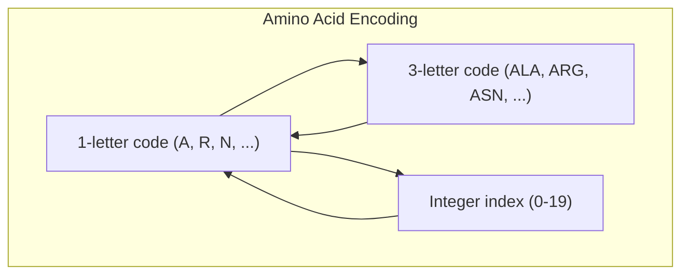
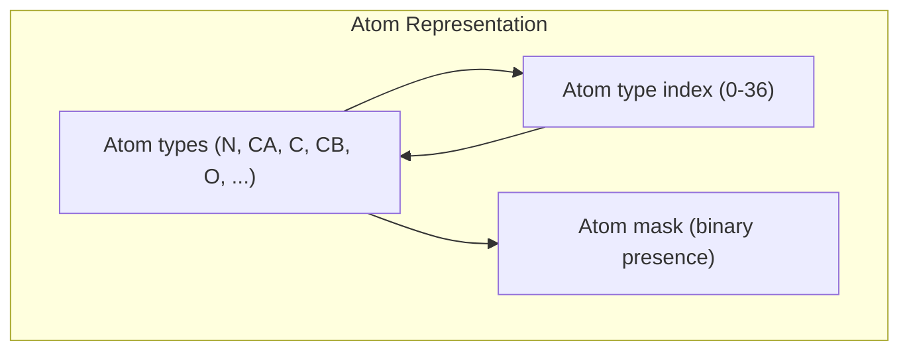
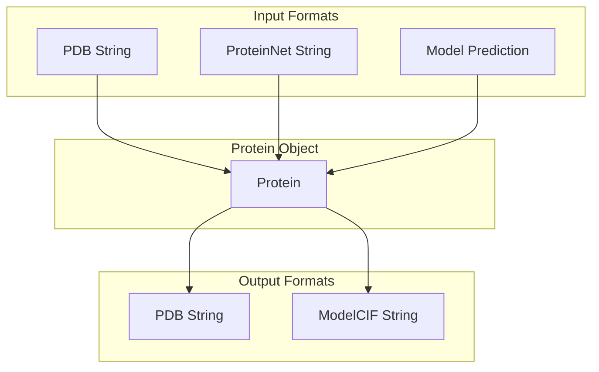
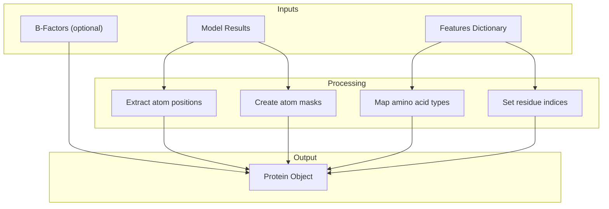
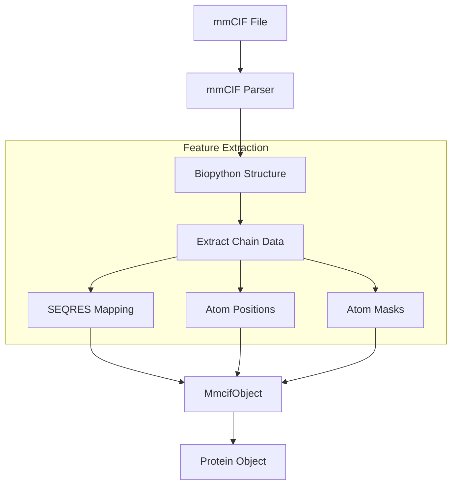
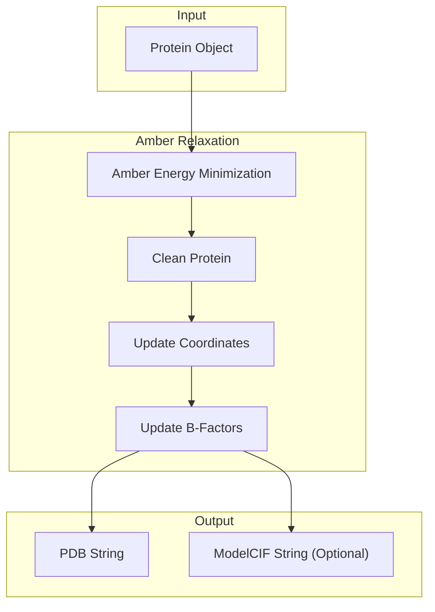
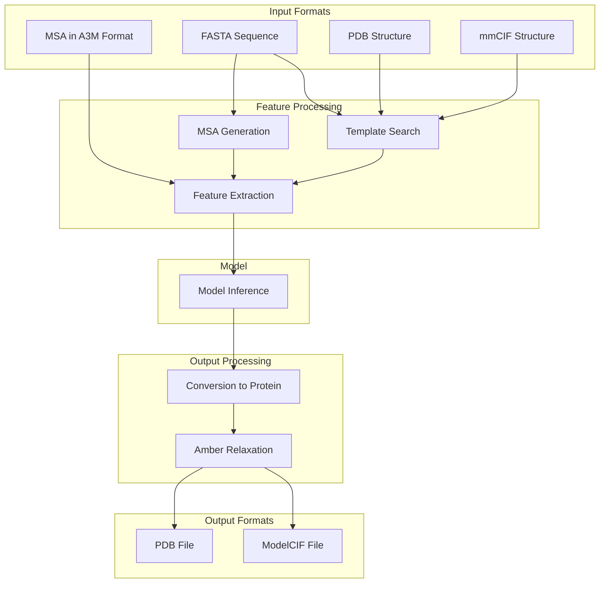
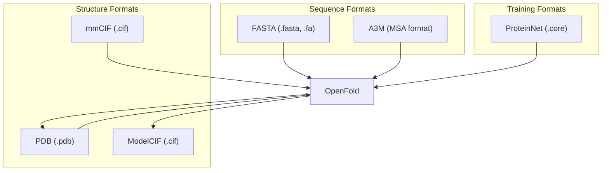

# Protein Representations

> **Relevant source files**
> * [openfold/data/data_transforms.py](https://github.com/aqlaboratory/openfold/blob/56da08ec/openfold/data/data_transforms.py)
> * [openfold/data/input_pipeline.py](https://github.com/aqlaboratory/openfold/blob/56da08ec/openfold/data/input_pipeline.py)
> * [openfold/model/outer_product_mean.py](https://github.com/aqlaboratory/openfold/blob/56da08ec/openfold/model/outer_product_mean.py)
> * [openfold/model/pair_transition.py](https://github.com/aqlaboratory/openfold/blob/56da08ec/openfold/model/pair_transition.py)
> * [openfold/model/structure_module.py](https://github.com/aqlaboratory/openfold/blob/56da08ec/openfold/model/structure_module.py)
> * [openfold/utils/feats.py](https://github.com/aqlaboratory/openfold/blob/56da08ec/openfold/utils/feats.py)
> * [tests/test_data/features.pkl](https://github.com/aqlaboratory/openfold/blob/56da08ec/tests/test_data/features.pkl)
> * [tests/test_data_transforms.py](https://github.com/aqlaboratory/openfold/blob/56da08ec/tests/test_data_transforms.py)

This document describes the protein data structures and representations used in OpenFold. It covers how proteins are stored internally, converted between different formats, and manipulated throughout the protein structure prediction pipeline. For information about how the feature pipeline processes protein data, see [Data Processing Pipeline](/aqlaboratory/openfold/6-data-processing-pipeline).

## Overview of Protein Representations

OpenFold uses specific data structures to represent proteins at various stages of the prediction pipeline. At the core is the `Protein` class, which encapsulates the key structural information of a protein.

Sources: [openfold/np/protein.py L45-L86](https://github.com/aqlaboratory/openfold/blob/56da08ec/openfold/np/protein.py#L45-L86)

## The Core Protein Data Structure

The `Protein` class is a dataclass (using Python's `@dataclasses.dataclass`) that stores all essential information about a protein structure:

* **atom_positions**: 3D coordinates of each atom in angstroms [num_res, num_atom_type, 3]
* **aatype**: Amino acid type for each residue, represented as integers between 0 and 20, where 20 is 'X' (unknown) [num_res]
* **atom_mask**: Binary mask indicating the presence of each atom (1.0 if present, 0.0 if not) [num_res, num_atom_type]
* **residue_index**: Residue indices as used in PDB (not necessarily continuous or 0-indexed) [num_res]
* **b_factors**: Temperature factors for each atom, representing displacement from mean position [num_res, num_atom_type]
* **chain_index**: Indices for multi-chain predictions [num_res]
* **remark**: Optional comment about the protein (included in output PDB files)
* **parents**: Templates used to generate the protein (for predictions)
* **parents_chain_index**: Chain corresponding to each parent

The dimensionality is defined by:

* `num_res`: Number of residues in the protein
* `num_atom_type`: Number of atom types (37 in OpenFold)

Sources: [openfold/np/protein.py L45-L86](https://github.com/aqlaboratory/openfold/blob/56da08ec/openfold/np/protein.py#L45-L86)

## Amino Acid and Atom Representations

### Amino Acid Types

OpenFold uses a standard ordering of amino acids for numerical encoding, defined in `residue_constants.py`:

The 20 standard amino acids are represented by integers 0-19, with 20 reserved for unknown residue type 'X':

| Integer | 1-letter | 3-letter |
| --- | --- | --- |
| 0 | A | ALA |
| 1 | R | ARG |
| 2 | N | ASN |
| ... | ... | ... |
| 19 | V | VAL |
| 20 | X | UNK |

Sources: [openfold/np/residue_constants.py L854-L879](https://github.com/aqlaboratory/openfold/blob/56da08ec/openfold/np/residue_constants.py#L854-L879)

### Atom Representation

OpenFold defines 37 atom types, allowing a fixed-size representation for every residue:

The first 5 atom types are:

* N: Backbone nitrogen
* CA: Alpha carbon
* C: Backbone carbon
* CB: Beta carbon
* O: Backbone oxygen

Each amino acid has a subset of these atoms, and the presence of each atom type is indicated by the `atom_mask` field in the `Protein` class.

Sources: [openfold/np/residue_constants.py L556-L596](https://github.com/aqlaboratory/openfold/blob/56da08ec/openfold/np/residue_constants.py#L556-L596)

## Protein Creation and Conversion

OpenFold provides several methods to create `Protein` objects from different sources:

### Creation from PDB String

`from_pdb_string()` parses a PDB file format string and extracts:

* Atom positions
* Amino acid types
* Atom masks
* Residue indices
* B-factors
* Chain information

It handles multi-chain proteins and ensures proper numbering.

Sources: [openfold/np/protein.py L89-L185](https://github.com/aqlaboratory/openfold/blob/56da08ec/openfold/np/protein.py#L89-L185)

### Creation from ProteinNet

`from_proteinnet_string()` creates a `Protein` from a ProteinNet format string, which contains sequence and structure information for training deep learning models.

Sources: [openfold/np/protein.py L188-L238](https://github.com/aqlaboratory/openfold/blob/56da08ec/openfold/np/protein.py#L188-L238)

### Creation from Model Prediction

`from_prediction()` assembles a `Protein` object from the feature dictionary and model outputs:

This function is used after model inference to convert the raw prediction outputs into a structured `Protein` object.

Sources: [openfold/np/protein.py L590-L636](https://github.com/aqlaboratory/openfold/blob/56da08ec/openfold/np/protein.py#L590-L636)

### Conversion to PDB

`to_pdb()` converts a `Protein` instance to a PDB format string:

* Creates ATOM records for each atom with positions
* Handles multiple chains
* Includes B-factors
* Adds TER records between chains
* Adds remarks and parent template information

Sources: [openfold/np/protein.py L321-L443](https://github.com/aqlaboratory/openfold/blob/56da08ec/openfold/np/protein.py#L321-L443)

### Conversion to ModelCIF

`to_modelcif()` converts a `Protein` to a ModelCIF format string. ModelCIF is a more modern format that:

* Properly represents macromolecular structure models
* Includes metadata about the prediction process
* Supports quality metrics (like pLDDT)
* Handles multiple polymer entities

Sources: [openfold/np/protein.py L446-L571](https://github.com/aqlaboratory/openfold/blob/56da08ec/openfold/np/protein.py#L446-L571)

## Protein Parsing from mmCIF Files

OpenFold includes functionality to parse protein structures from mmCIF files, which are the standard format used in the Protein Data Bank (PDB):

The mmCIF parsing workflow:

1. Parse the mmCIF file using Biopython
2. Extract polymer information for protein chains
3. Map residue sequences to structure
4. Create a `MmcifObject` containing the parsed data
5. Extract atom coordinates and masks
6. Convert to a `Protein` object when needed

Sources: [openfold/data/mmcif_parsing.py L78-L502](https://github.com/aqlaboratory/openfold/blob/56da08ec/openfold/data/mmcif_parsing.py#L78-L502)

### Atom Coordinate Extraction

The `get_atom_coords` function extracts atom coordinates from an mmCIF object for a specific chain:

* Locates the specified chain
* Maps the sequence to the structure
* Populates atom positions and masks arrays
* Handles special cases like selenium in MSE residues
* Corrects naming errors in certain residues (e.g., arginine NH1/NH2)

Sources: [openfold/data/mmcif_parsing.py L435-L502](https://github.com/aqlaboratory/openfold/blob/56da08ec/openfold/data/mmcif_parsing.py#L435-L502)

## Protein Relaxation

After structure prediction, OpenFold can use Amber relaxation to refine the predicted structures:

The relaxation process:

1. Run Amber energy minimization to resolve steric clashes
2. Create a clean PDB representation
3. Update the atomic coordinates with the minimized positions
4. Update B-factors from the original protein
5. Return either a PDB or ModelCIF string

Sources: [openfold/np/relax/relax.py L23-L99](https://github.com/aqlaboratory/openfold/blob/56da08ec/openfold/np/relax/relax.py#L23-L99)

 [openfold/utils/script_utils.py L232-L262](https://github.com/aqlaboratory/openfold/blob/56da08ec/openfold/utils/script_utils.py#L232-L262)

## Protein Representation in the OpenFold Pipeline

The following diagram shows how protein representations flow through the OpenFold prediction pipeline:

Sources: [openfold/utils/script_utils.py L150-L230](https://github.com/aqlaboratory/openfold/blob/56da08ec/openfold/utils/script_utils.py#L150-L230)

## Residue and Atom Constants

OpenFold defines various constants related to protein structure:

### Residue Properties

* **Chi angles**: Torsion angles that define side chain conformations
* **Atom positions**: Relative positions of atoms in each residue
* **Bond lengths and angles**: Standard values from literature

### Residue-Atom Mappings

Each residue type has a specific set of atoms. For example:

| Residue | Atoms |
| --- | --- |
| ALA | N, CA, C, CB, O |
| ARG | N, CA, C, CB, CG, CD, CZ, NE, O, NH1, NH2 |
| GLY | N, CA, C, O |

These mappings are used for:

* Creating atom masks
* Converting between different representations
* Setting up the structural modules in the neural network

Sources: [openfold/np/residue_constants.py L355-L404](https://github.com/aqlaboratory/openfold/blob/56da08ec/openfold/np/residue_constants.py#L355-L404)

## Data Exchange Formats

Beyond the internal `Protein` representation, OpenFold works with several file formats:

Sources: [openfold/data/tools/jackhmmer.py L31-L258](https://github.com/aqlaboratory/openfold/blob/56da08ec/openfold/data/tools/jackhmmer.py#L31-L258)

 [openfold/data/tools/hhsearch.py L27-L126](https://github.com/aqlaboratory/openfold/blob/56da08ec/openfold/data/tools/hhsearch.py#L27-L126)

 [scripts/unpack_proteinnet.py L1-L47](https://github.com/aqlaboratory/openfold/blob/56da08ec/scripts/unpack_proteinnet.py#L1-L47)

## Utility Functions for Protein Manipulation

OpenFold provides several utility functions for working with protein structures:

### Ideal Atom Mask

`ideal_atom_mask()` computes a mask based on the atoms that should be present in each amino acid according to its type, rather than the atoms that are actually present in the input structure.

Sources: [openfold/np/protein.py L574-L587](https://github.com/aqlaboratory/openfold/blob/56da08ec/openfold/np/protein.py#L574-L587)

### Chain Management

The PDB format supports up to 62 chains (A-Z, a-z, 0-9). OpenFold has utilities to:

* Assign chain IDs
* Validate chain counts
* Handle chain breaks in multi-chain proteins

Sources: [openfold/np/protein.py L39-L41](https://github.com/aqlaboratory/openfold/blob/56da08ec/openfold/np/protein.py#L39-L41)

 [openfold/np/protein.py L81-L86](https://github.com/aqlaboratory/openfold/blob/56da08ec/openfold/np/protein.py#L81-L86)

## Summary

OpenFold uses a comprehensive protein representation system to handle protein structures throughout the prediction pipeline:

1. The `Protein` class serves as the central data structure
2. Detailed residue and atom constants provide the foundation for structural representation
3. Various conversion functions enable interoperability with standard file formats (PDB, mmCIF)
4. Special processing for multi-chain proteins and templates
5. Integration with Amber relaxation for structure refinement

This representation system allows OpenFold to effectively process protein structures for both training and inference.