# Structure Module

> **Relevant source files**
> * [openfold/model/model.py](https://github.com/aqlaboratory/openfold/blob/56da08ec/openfold/model/model.py)
> * [openfold/model/outer_product_mean.py](https://github.com/aqlaboratory/openfold/blob/56da08ec/openfold/model/outer_product_mean.py)
> * [openfold/model/pair_transition.py](https://github.com/aqlaboratory/openfold/blob/56da08ec/openfold/model/pair_transition.py)
> * [openfold/model/structure_module.py](https://github.com/aqlaboratory/openfold/blob/56da08ec/openfold/model/structure_module.py)
> * [openfold/model/template.py](https://github.com/aqlaboratory/openfold/blob/56da08ec/openfold/model/template.py)
> * [openfold/model/triangular_attention.py](https://github.com/aqlaboratory/openfold/blob/56da08ec/openfold/model/triangular_attention.py)
> * [openfold/utils/feats.py](https://github.com/aqlaboratory/openfold/blob/56da08ec/openfold/utils/feats.py)
> * [openfold/utils/tensor_utils.py](https://github.com/aqlaboratory/openfold/blob/56da08ec/openfold/utils/tensor_utils.py)

## Purpose and Scope

The Structure Module is the final stage of the OpenFold model architecture that predicts 3D atomic coordinates from the refined MSA and pair representations produced by the Evoformer. It implements Algorithms 20-23 from the AlphaFold 2 supplement and converts abstract sequence representations into concrete 3D protein structures through geometric reasoning.

For information about the Evoformer processing that precedes this module, see [Evoformer Stack](/aqlaboratory/openfold/5.3-evoformer-stack). For details on loss functions applied to structure predictions, see [Loss Functions](/aqlaboratory/openfold/5.6-loss-functions). For protein representation formats (atom14, atom37, rigid frames), see [Protein Representations](/aqlaboratory/openfold/7-protein-representations).

---

## Architecture Overview

The Structure Module performs iterative 3D structure refinement through a series of blocks. Each block updates both the single representation and the 3D coordinates of the protein backbone and side chains.

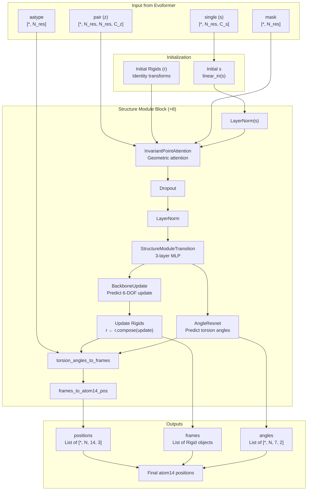

**Sources:** [openfold/model/structure_module.py L817-L936](https://github.com/aqlaboratory/openfold/blob/56da08ec/openfold/model/structure_module.py#L817-L936)

 [openfold/model/structure_module.py L937-L1068](https://github.com/aqlaboratory/openfold/blob/56da08ec/openfold/model/structure_module.py#L937-L1068)

---

## Class Structure and Entry Point

The `StructureModule` class serves as the main entry point, orchestrating all structure prediction operations.

| Component | Class | Purpose |
| --- | --- | --- |
| Main Module | `StructureModule` | Coordinates iterative refinement |
| Geometric Attention | `InvariantPointAttention` / `InvariantPointAttentionMultimer` | SE(3)-equivariant attention over 3D space |
| Backbone Update | `BackboneUpdate` / `QuatRigid` | Predicts rigid body transformations |
| Angle Prediction | `AngleResnet` | Predicts backbone and side-chain torsion angles |
| Single Update | `StructureModuleTransition` | MLP to update single representation |

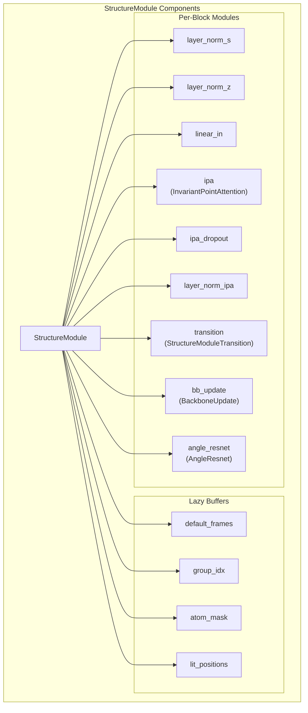

**Sources:** [openfold/model/structure_module.py L817-L936](https://github.com/aqlaboratory/openfold/blob/56da08ec/openfold/model/structure_module.py#L817-L936)

---

## Iterative Refinement Process

The Structure Module runs for `no_blocks` iterations (typically 8), where each block refines the structure prediction. The process maintains running state across blocks.

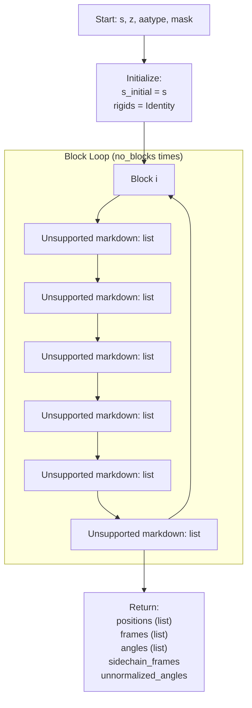

**Key Points:**

* Each block refines the previous block's structure
* The single representation `s` is updated additively
* Rigids (backbone frames) are updated compositionally via SE(3) transformations
* All intermediate predictions are stored for loss computation

**Sources:** [openfold/model/structure_module.py L937-L1068](https://github.com/aqlaboratory/openfold/blob/56da08ec/openfold/model/structure_module.py#L937-L1068)

 [openfold/model/structure_module.py L1069-L1180](https://github.com/aqlaboratory/openfold/blob/56da08ec/openfold/model/structure_module.py#L1069-L1180)

---

## InvariantPointAttention (IPA)

The InvariantPointAttention module is the core geometric reasoning component, implementing Algorithm 22. It performs attention in both feature space and 3D point space while maintaining SE(3) equivariance.

### Architecture

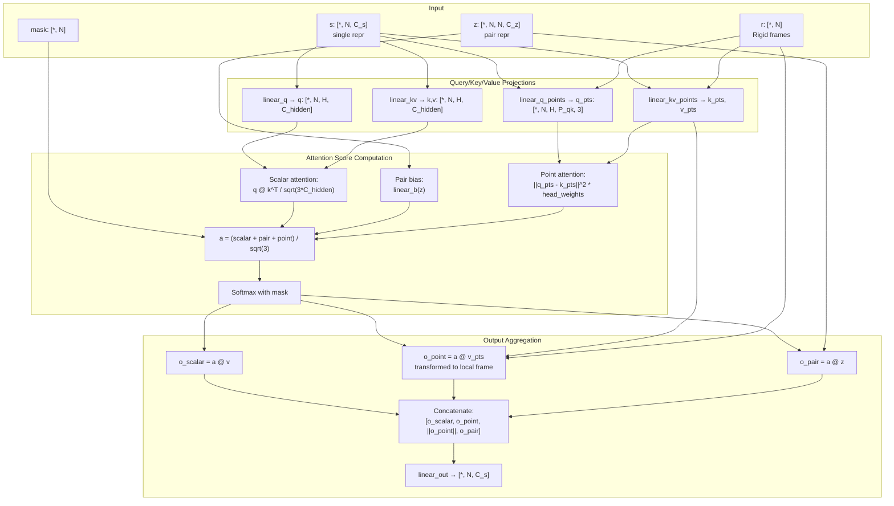

### Key Features

**Scalar Attention**: Standard multi-head attention over single representations

* Query, key, value projections from single representation
* Scaled dot-product attention with scaling factor `1/sqrt(3*C_hidden)`

**Point Attention**: Geometric attention over 3D points

* Projects query/key/value points into local coordinate frames of each residue
* Computes squared distances between query and key points: `||q_pts - k_pts||²`
* Weighted by learnable `head_weights` after softplus activation
* Scaling factor: `1/sqrt(3 * no_qk_points * 9/2)`

**Pair Bias**: Incorporates pairwise information from the Evoformer

* Linear projection of pair representation `z` → `[*, N, N, H]`
* Added to attention logits before softmax

**Attention Formula**:

```markdown
logits = scalar_attn + pair_bias + point_attn
logits = logits / sqrt(3)  # Normalize by 3 components
attention = softmax(logits + mask_bias)
```

**Output Aggregation**: Four components are concatenated:

1. `o_scalar`: Attention-weighted sum of value features
2. `o_point_x, o_point_y, o_point_z`: 3D coordinates of aggregated value points (in local frame)
3. `||o_point||`: Norm of aggregated points
4. `o_pair`: Attention-weighted sum of pair features

**Sources:** [openfold/model/structure_module.py L209-L508](https://github.com/aqlaboratory/openfold/blob/56da08ec/openfold/model/structure_module.py#L209-L508)

 [openfold/model/structure_module.py L513-L734](https://github.com/aqlaboratory/openfold/blob/56da08ec/openfold/model/structure_module.py#L513-L734)

---

## BackboneUpdate

The `BackboneUpdate` module predicts rigid body transformations to update backbone frames, implementing part of Algorithm 23.

### Monomer Implementation

In monomer mode, `BackboneUpdate` predicts a 6-dimensional update vector representing a rigid transformation:

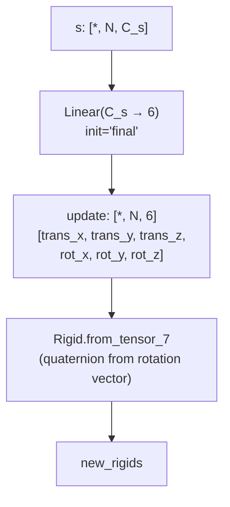

The 6-DOF update is converted to a rigid transformation:

* First 3 dimensions: translation vector
* Last 3 dimensions: rotation vector (converted to quaternion)

### Multimer Implementation

In multimer mode, `QuatRigid` is used instead, which directly predicts quaternion components with special initialization for numerical stability.

**Sources:** [openfold/model/structure_module.py L736-L764](https://github.com/aqlaboratory/openfold/blob/56da08ec/openfold/model/structure_module.py#L736-L764)

 [openfold/model/structure_module.py L1021-L1030](https://github.com/aqlaboratory/openfold/blob/56da08ec/openfold/model/structure_module.py#L1021-L1030)

---

## AngleResnet

The `AngleResnet` predicts torsion angles for the protein backbone and side chains, implementing Algorithm 20 (lines 11-14).

### Architecture

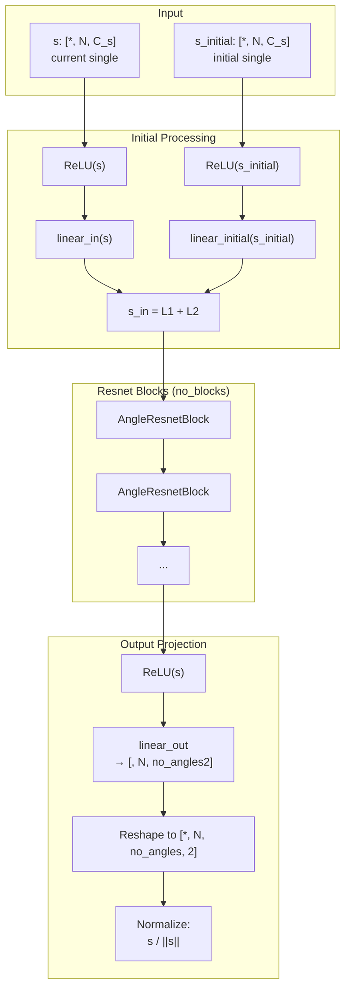

### AngleResnetBlock

Each resnet block is a simple two-layer MLP with residual connection:

```
s_out = s_in + linear_2(ReLU(linear_1(ReLU(s_in))))
```

### Output Format

For each residue, predicts `no_angles` (typically 7) torsion angles:

* **Backbone angles**: ω (omega), φ (phi), ψ (psi)
* **Side-chain angles**: χ₁, χ₂, χ₃, χ₄ (chi angles)

Each angle is represented as a 2D unit vector `[sin(θ), cos(θ)]` for numerical stability and differentiability.

**Returns:**

* `unnormalized_angles`: Raw predictions before normalization
* `angles`: Normalized unit vectors `[*, N, no_angles, 2]`

**Sources:** [openfold/model/structure_module.py L78-L162](https://github.com/aqlaboratory/openfold/blob/56da08ec/openfold/model/structure_module.py#L78-L162)

 [openfold/model/structure_module.py L50-L76](https://github.com/aqlaboratory/openfold/blob/56da08ec/openfold/model/structure_module.py#L50-L76)

---

## StructureModuleTransition

A multi-layer MLP that updates the single representation, implementing the transition in Algorithm 23 (lines 8-9).

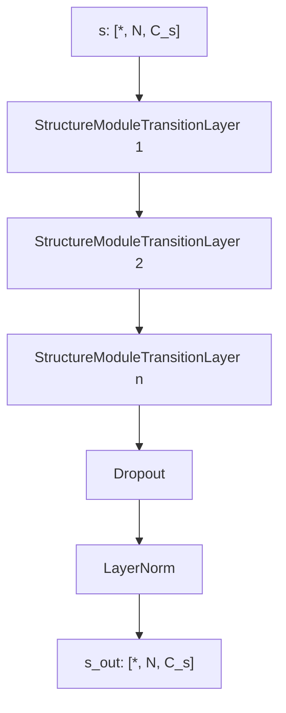

Each `StructureModuleTransitionLayer` is a three-layer MLP with residual connection:

```
s_out = s_in + linear_3(ReLU(linear_2(ReLU(linear_1(s_in)))))
```

Typical configuration: `no_transition_layers = 1` (in default configs).

**Sources:** [openfold/model/structure_module.py L766-L815](https://github.com/aqlaboratory/openfold/blob/56da08ec/openfold/model/structure_module.py#L766-L815)

---

## Geometric Transformations: Angles → Frames → Atoms

The Structure Module converts abstract angle predictions into concrete 3D atomic coordinates through a series of geometric transformations.

### Transformation Pipeline

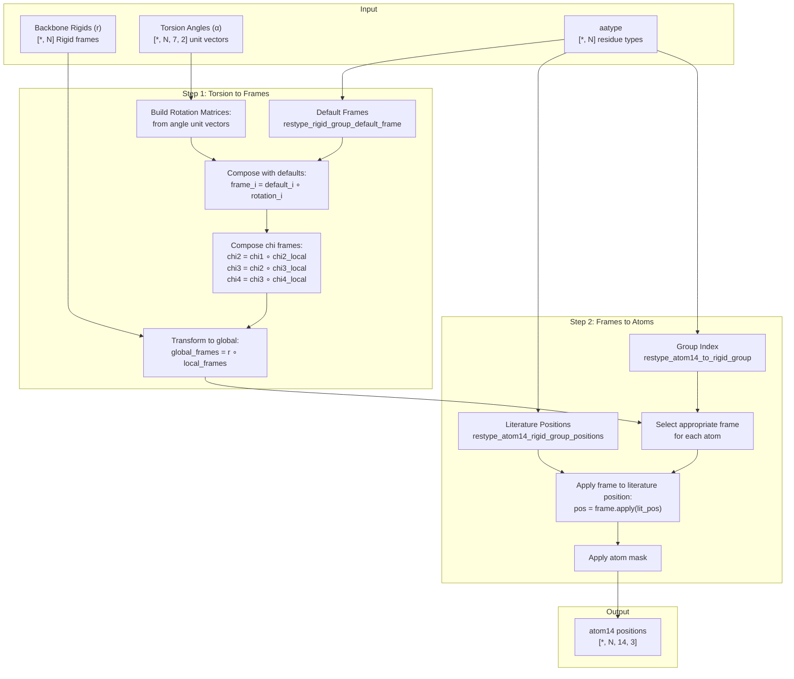

### torsion_angles_to_frames

This function converts torsion angle predictions into rigid body frames for each rigid group (8 frames per residue):

**Frame Groups** (per residue):

1. Backbone pre-omega (group 0)
2. Backbone phi (group 1)
3. Backbone psi (group 2)
4. Backbone post-omega (group 3)
5. Chi1 side-chain (group 4)
6. Chi2 side-chain (group 5)
7. Chi3 side-chain (group 6)
8. Chi4 side-chain (group 7)

**Process:**

1. Load default frames from `restype_rigid_group_default_frame` based on `aatype`
2. Convert angle unit vectors to 3x3 rotation matrices
3. Compose default frames with rotation matrices
4. Chain chi frames together (chi2 relative to chi1, etc.)
5. Transform all frames from backbone-relative to global coordinates

**Sources:** [openfold/utils/feats.py L185-L251](https://github.com/aqlaboratory/openfold/blob/56da08ec/openfold/utils/feats.py#L185-L251)

### frames_and_literature_positions_to_atom14_pos

This function places atoms in 3D space using the computed frames:

**Atom14 Representation**: 14 atoms per residue (sufficient for all residue types)

* Backbone atoms: N, CA, C, O, CB
* Side-chain atoms: up to 9 additional atoms (varies by residue type)

**Process:**

1. Load literature positions from `restype_atom14_rigid_group_positions`
2. Load group indices from `restype_atom14_to_rigid_group` (which frame each atom belongs to)
3. For each atom, apply the corresponding rigid frame to its literature position
4. Mask out atoms that don't exist for the given residue type

**Example**: For leucine (LEU):

* N, CA, C, O, CB: backbone frame
* CG: chi1 frame
* CD1, CD2: chi2 frame

**Sources:** [openfold/utils/feats.py L253-L290](https://github.com/aqlaboratory/openfold/blob/56da08ec/openfold/utils/feats.py#L253-L290)

 [openfold/model/structure_module.py L1060-L1068](https://github.com/aqlaboratory/openfold/blob/56da08ec/openfold/model/structure_module.py#L1060-L1068)

---

## Coordinate Representation Conversions

The Structure Module outputs `atom14` format, which is then converted to `atom37` for compatibility with PDB format and loss computations.

### Atom14 vs Atom37

| Representation | Atoms per Residue | Description |
| --- | --- | --- |
| **Atom14** | 14 | Compact representation sufficient for all residue types |
| **Atom37** | 37 | Standard PDB format with padding for all possible atom types |

### Conversion Process

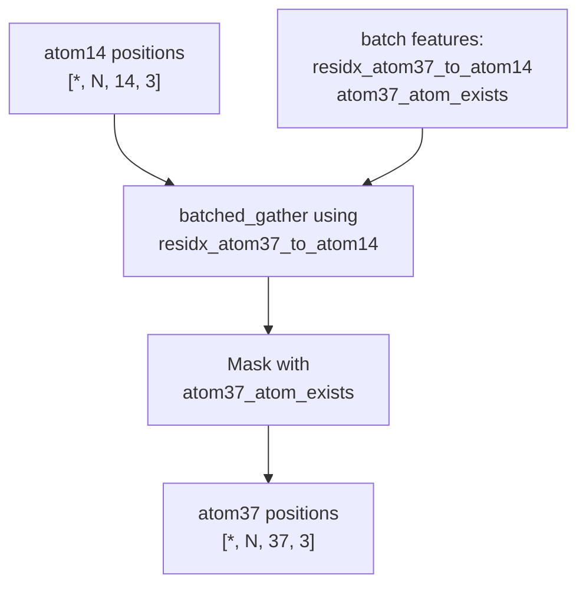

The conversion uses a lookup table `residx_atom37_to_atom14` that maps each atom37 index to its corresponding atom14 index for the given residue type.

**Sources:** [openfold/utils/feats.py L56-L67](https://github.com/aqlaboratory/openfold/blob/56da08ec/openfold/utils/feats.py#L56-L67)

 [openfold/model/model.py L463-L466](https://github.com/aqlaboratory/openfold/blob/56da08ec/openfold/model/model.py#L463-L466)

---

## Monomer vs Multimer Differences

The Structure Module has two implementations optimized for different use cases:

| Aspect | Monomer | Multimer |
| --- | --- | --- |
| **IPA Class** | `InvariantPointAttention` | `InvariantPointAttentionMultimer` |
| **Backbone Update** | `BackboneUpdate` (6-DOF vector) | `QuatRigid` (direct quaternion prediction) |
| **Point Projection** | Combined projections | Separate k/v point projections |
| **Precision** | Default precision | Forces FP32 for point projections during training |
| **Output Aggregation** | Matrix multiplication | Einsum operations for memory efficiency |

### InvariantPointAttentionMultimer

The multimer variant includes several optimizations and numerical stability improvements:

**Key Differences:**

* Uses `Vec3Array` for 3D point operations with explicit x, y, z components
* Computes point attention using `square_euclidean_distance` helper
* Uses einsum for attention aggregation: `torch.einsum('...qkh, ...khc->...qhc', a, v)`
* Applies attention normalization before output: `a = a * math.sqrt(1./3)`
* Separate linear projections for k and v (no shared `linear_kv`)

**Precision Requirements:**
The multimer implementation explicitly requires FP32 precision for point projections during training to maintain numerical stability with larger complexes.

**Sources:** [openfold/model/structure_module.py L513-L734](https://github.com/aqlaboratory/openfold/blob/56da08ec/openfold/model/structure_module.py#L513-L734)

 [openfold/model/structure_module.py L902-L913](https://github.com/aqlaboratory/openfold/blob/56da08ec/openfold/model/structure_module.py#L902-L913)

 [openfold/model/structure_module.py L924-L927](https://github.com/aqlaboratory/openfold/blob/56da08ec/openfold/model/structure_module.py#L924-L927)

---

## Memory Optimization During Inference

The Structure Module implements several memory optimization strategies for inference on long sequences.

### Offload Inference Mode

When `_offload_inference=True`, the pair representation `z` is offloaded to CPU between IPA operations to reduce GPU memory:

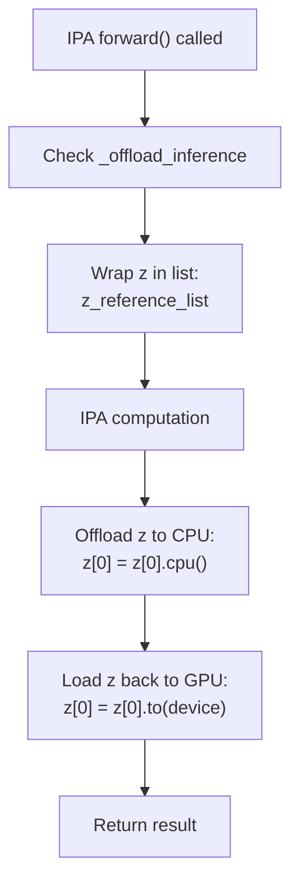

**Mechanism:**

1. Input `z` is wrapped in a list (for reference counting)
2. After extracting pair bias, `z` is moved to CPU
3. Before final output aggregation, `z` is moved back to GPU
4. Reference counting ensures memory is freed immediately

**Trade-off**: Slower inference due to CPU↔GPU transfers, but enables inference on longer sequences.

### In-place Operations

When `inplace_safe=True` (inference only), the Structure Module uses in-place operations to reduce memory allocations:

**In-place operations:**

* `pt_att *= pt_att` (squaring point distances)
* `pt_att *= head_weights` (weighting)
* Custom CUDA kernel `attn_core_inplace_cuda.forward_()` for in-place softmax
* In-place addition: `a += pt_att` instead of `a = a + pt_att`

**Sources:** [openfold/model/structure_module.py L327-L330](https://github.com/aqlaboratory/openfold/blob/56da08ec/openfold/model/structure_module.py#L327-L330)

 [openfold/model/structure_module.py L383-L386](https://github.com/aqlaboratory/openfold/blob/56da08ec/openfold/model/structure_module.py#L383-L386)

 [openfold/model/structure_module.py L406-L448](https://github.com/aqlaboratory/openfold/blob/56da08ec/openfold/model/structure_module.py#L406-L448)

 [openfold/model/structure_module.py L1013](https://github.com/aqlaboratory/openfold/blob/56da08ec/openfold/model/structure_module.py#L1013-L1013)

---

## Integration with Main Model

The Structure Module is invoked from the main AlphaFold model after the Evoformer completes processing.

### Forward Pass Integration

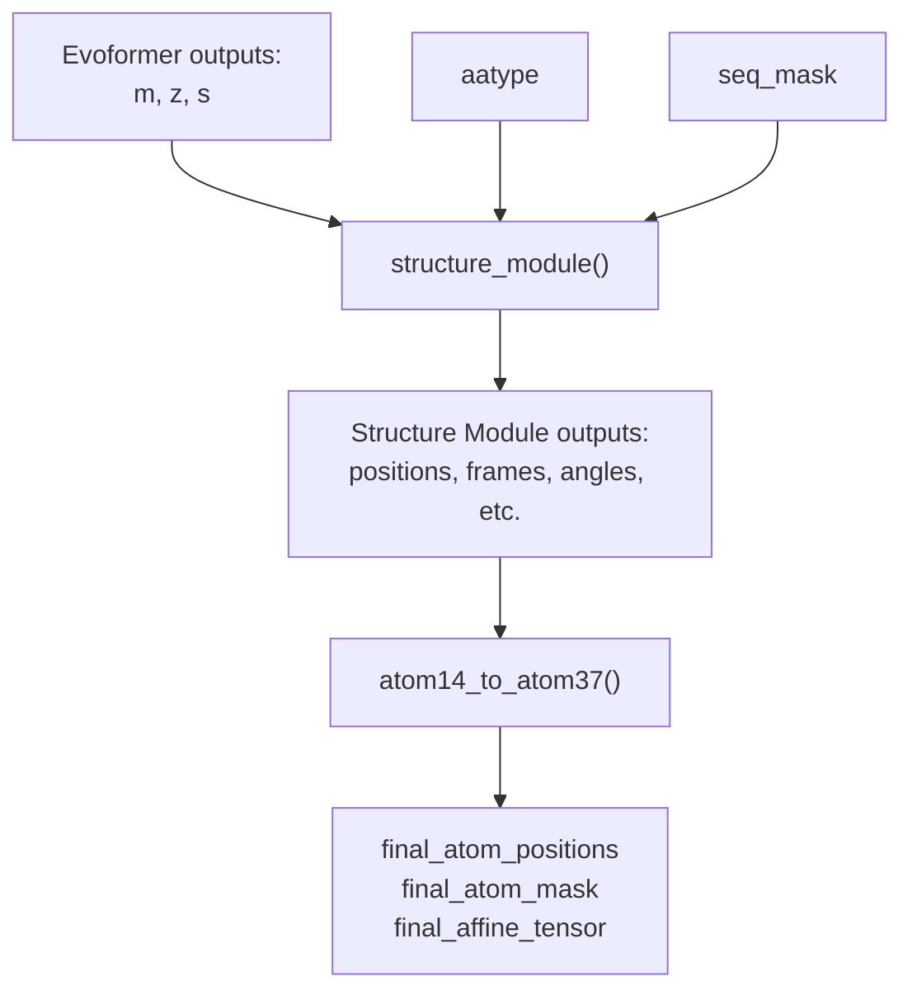

**Invocation** (from `AlphaFold.iteration()`):

```python
outputs["sm"] = self.structure_module(    outputs,  # Contains "single", "pair" from Evoformer    feats["aatype"],    mask=feats["seq_mask"].to(dtype=s.dtype),    inplace_safe=inplace_safe,    _offload_inference=self.globals.offload_inference,)outputs["final_atom_positions"] = atom14_to_atom37(    outputs["sm"]["positions"][-1], feats)
```

**Structure Module Output Dictionary:**

* `positions`: List of atom14 positions for each block `[*, N, 14, 3]`
* `frames`: List of backbone rigid frames for each block
* `angles`: List of normalized torsion angles for each block
* `unnormalized_angles`: List of unnormalized angle predictions
* `sidechain_frames`: Frames for side-chain rigid groups

**Sources:** [openfold/model/model.py L455-L468](https://github.com/aqlaboratory/openfold/blob/56da08ec/openfold/model/model.py#L455-L468)

 [openfold/model/structure_module.py L1061-L1068](https://github.com/aqlaboratory/openfold/blob/56da08ec/openfold/model/structure_module.py#L1061-L1068)

---

## Configuration Parameters

The Structure Module is highly configurable through the model configuration system (see [Configuration System](/aqlaboratory/openfold/5.1-configuration-system)).

### Key Configuration Parameters

| Parameter | Default | Description |
| --- | --- | --- |
| `c_s` | 384 | Single representation channel dimension |
| `c_z` | 128 | Pair representation channel dimension |
| `c_ipa` | 16 | IPA hidden channel dimension |
| `c_resnet` | 128 | AngleResnet hidden dimension |
| `no_heads_ipa` | 12 | Number of IPA attention heads |
| `no_qk_points` | 4 | Number of query/key points in IPA |
| `no_v_points` | 8 | Number of value points in IPA |
| `dropout_rate` | 0.1 | Dropout rate throughout the module |
| `no_blocks` | 8 | Number of structure module blocks |
| `no_transition_layers` | 1 | Number of layers in transition MLP |
| `no_resnet_blocks` | 2 | Number of resnet blocks in AngleResnet |
| `no_angles` | 7 | Number of torsion angles to predict |
| `trans_scale_factor` | 10 | Scale factor for transition hidden dimension |
| `epsilon` | 1e-12 | Small constant for numerical stability |
| `inf` | 1e5 | Large value for masking |

### Example Configuration Access

```
structure_module = StructureModule(    is_multimer=self.globals.is_multimer,    **self.config["structure_module"],)
```

**Sources:** [openfold/model/structure_module.py L817-L936](https://github.com/aqlaboratory/openfold/blob/56da08ec/openfold/model/structure_module.py#L817-L936)

---

## Output Formats and Usage

The Structure Module produces multiple outputs at different levels of abstraction for use in loss computation and downstream processing.

### Output Structure

```css
{    "positions": [  # List of length no_blocks        torch.Tensor  # [*, N_res, 14, 3] for each block    ],    "frames": [  # List of length no_blocks          Rigid  # [*, N_res] backbone frames for each block    ],    "angles": [  # List of length no_blocks        torch.Tensor  # [*, N_res, 7, 2] normalized angles for each block    ],    "unnormalized_angles": [  # List of length no_blocks        torch.Tensor  # [*, N_res, 7, 2] raw angle predictions    ],    "sidechain_frames": Rigid,  # [*, N_res, 8] all rigid groups}
```

### Loss Computation Usage

Different outputs are used for different loss terms (see [Loss Functions](/aqlaboratory/openfold/5.6-loss-functions)):

* **FAPE Loss**: Uses `positions` and `frames` from all blocks
* **Angle Loss**: Uses `angles` and `unnormalized_angles`
* **Violation Loss**: Uses final `positions` to check stereochemical violations
* **Auxiliary Losses**: Use intermediate representations

### Final Structure Output

The model converts the final block's predictions to atom37 format for output:

```markdown
final_atom_positions = atom14_to_atom37(    outputs["sm"]["positions"][-1],  # Last block's atom14 positions    feats  # Contains atom37 conversion maps)
```

This becomes the `final_atom_positions` key in the model output, which is written to PDB/mmCIF files.

**Sources:** [openfold/model/structure_module.py L1061-L1068](https://github.com/aqlaboratory/openfold/blob/56da08ec/openfold/model/structure_module.py#L1061-L1068)

 [openfold/model/model.py L463-L468](https://github.com/aqlaboratory/openfold/blob/56da08ec/openfold/model/model.py#L463-L468)