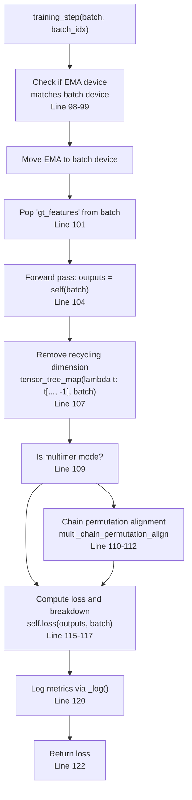
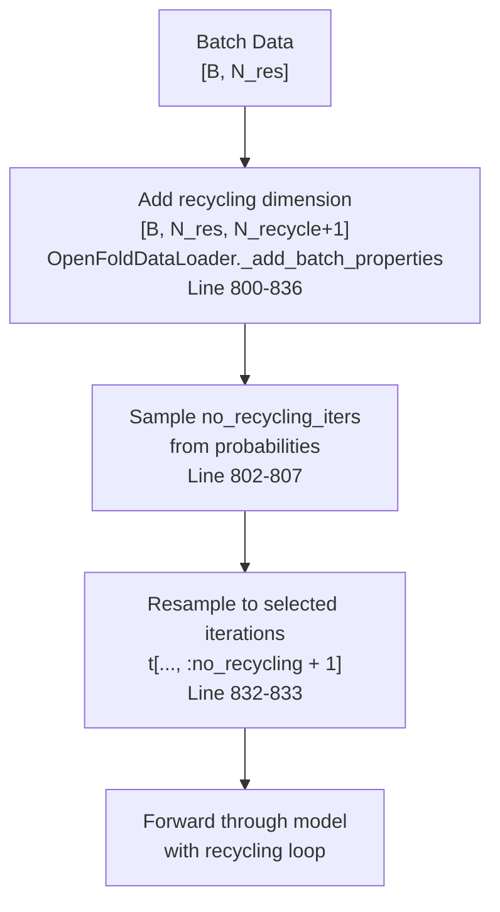
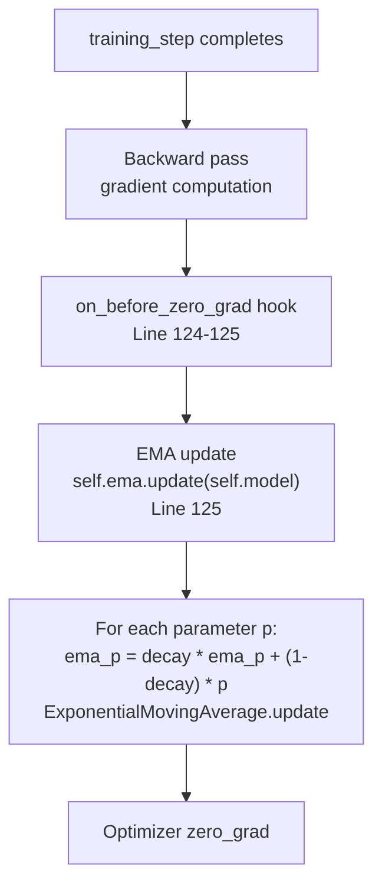
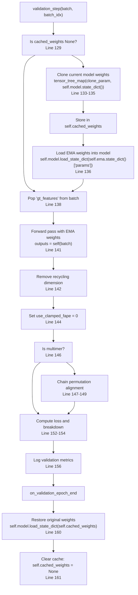
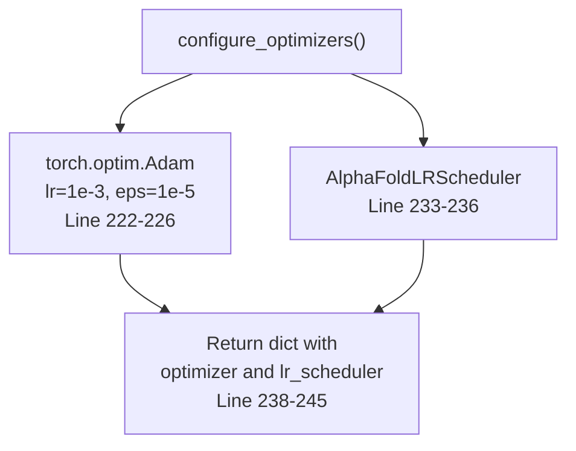
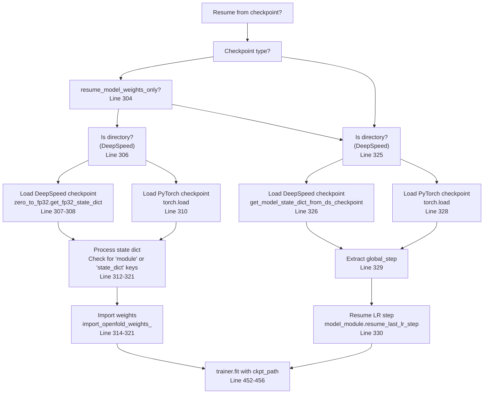
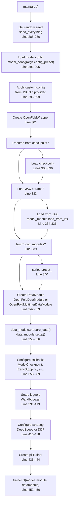

# Training Pipeline

> **Relevant source files**
> * [openfold/data/data_modules.py](https://github.com/aqlaboratory/openfold/blob/56da08ec/openfold/data/data_modules.py)
> * [openfold/utils/loss.py](https://github.com/aqlaboratory/openfold/blob/56da08ec/openfold/utils/loss.py)
> * [train_openfold.py](https://github.com/aqlaboratory/openfold/blob/56da08ec/train_openfold.py)

## Purpose and Scope

This page documents the training pipeline implementation in OpenFold, focusing on the `OpenFoldWrapper` PyTorch Lightning module, the training loop, recycling mechanism, Exponential Moving Average (EMA) for validation, and checkpoint management.

For information about data loading and stochastic filtering during training, see [Data Loading and Filtering](/aqlaboratory/openfold/4.2-data-loading-and-filtering). For memory optimization strategies including activation checkpointing and DeepSpeed integration, see [Memory Optimization for Training](/aqlaboratory/openfold/4.3-memory-optimization-for-training). For detailed loss function implementations, see [Loss Functions](/aqlaboratory/openfold/5.6-loss-functions).

---

## Overview

The OpenFold training pipeline is built on PyTorch Lightning and orchestrated by the `train_openfold.py` script. The core training logic is encapsulated in the `OpenFoldWrapper` class, which wraps the `AlphaFold` model and implements the training step, validation step, and optimizer configuration. The pipeline supports:

* **Iterative refinement** through recycling
* **Exponential Moving Average (EMA)** of model weights for stable validation
* **Multi-GPU training** via DDP or DeepSpeed strategies
* **Checkpoint management** with DeepSpeed ZeRO compatibility
* **Multimer-specific processing** including chain permutation alignment

**Sources:** [train_openfold.py L1-L703](https://github.com/aqlaboratory/openfold/blob/56da08ec/train_openfold.py#L1-L703)

---

## OpenFoldWrapper Architecture

The `OpenFoldWrapper` class is a PyTorch Lightning module that serves as the main training interface. It encapsulates the model, loss computation, EMA tracking, and training/validation logic.

```mermaid
flowchart TD

WRAPPER["OpenFoldWrapper<br>(pl.LightningModule)"]
MODEL["self.model<br>(AlphaFold)"]
LOSS["self.loss<br>(AlphaFoldLoss)"]
EMA["self.ema<br>(ExponentialMovingAverage)"]
CONFIG["self.config<br>(model_config)"]
FORWARD["forward(batch)<br>Line 62-63"]
TRAIN_STEP["training_step(batch, batch_idx)<br>Line 97-122"]
VAL_STEP["validation_step(batch, batch_idx)<br>Line 127-156"]
BEFORE_ZERO["on_before_zero_grad"]
VAL_END["on_validation_epoch_end()<br>Line 158-161"]
CONFIG_OPT["configure_optimizers()<br>Line 217-245"]
SAVE_CKPT["on_save_checkpoint(checkpoint)<br>Line 254-255"]
LOAD_CKPT["on_load_checkpoint(checkpoint)<br>Line 247-252"]

WRAPPER --> FORWARD
WRAPPER --> TRAIN_STEP
WRAPPER --> VAL_STEP
WRAPPER --> BEFORE_ZERO
WRAPPER --> VAL_END
WRAPPER --> CONFIG_OPT
WRAPPER --> SAVE_CKPT
WRAPPER --> LOAD_CKPT

subgraph subGraph1 ["Key Methods"]
    FORWARD
    TRAIN_STEP
    VAL_STEP
    BEFORE_ZERO
    VAL_END
    CONFIG_OPT
    SAVE_CKPT
    LOAD_CKPT
end

subgraph subGraph0 ["OpenFoldWrapper Components"]
    WRAPPER
    MODEL
    LOSS
    EMA
    CONFIG
    WRAPPER --> MODEL
    WRAPPER --> LOSS
    WRAPPER --> EMA
    WRAPPER --> CONFIG
end
```



### Key Components

| Component | Type | Purpose |
| --- | --- | --- |
| `self.model` | `AlphaFold` | The main model performing structure prediction |
| `self.loss` | `AlphaFoldLoss` | Aggregates all loss components (FAPE, LDDT, violations, etc.) |
| `self.ema` | `ExponentialMovingAverage` | Maintains smoothed weights for validation |
| `self.config` | `ml_collections.ConfigDict` | Configuration settings for model and training |
| `self.cached_weights` | `dict` or `None` | Temporarily stores model weights during validation |
| `self.last_lr_step` | `int` | Tracks the last learning rate step for resuming |

**Sources:** [train_openfold.py L45-L60](https://github.com/aqlaboratory/openfold/blob/56da08ec/train_openfold.py#L45-L60)

---

## Training Step Flow

The `training_step` method implements the forward pass, loss computation, and logging for each training batch.



### Key Steps

1. **EMA Device Synchronization** ([train_openfold.py L98-L99](https://github.com/aqlaboratory/openfold/blob/56da08ec/train_openfold.py#L98-L99) ): Ensures the EMA model is on the same device as the batch
2. **Ground Truth Extraction** ([train_openfold.py L101](https://github.com/aqlaboratory/openfold/blob/56da08ec/train_openfold.py#L101-L101) ): Removes ground truth features for multimer processing
3. **Forward Pass** ([train_openfold.py L104](https://github.com/aqlaboratory/openfold/blob/56da08ec/train_openfold.py#L104-L104) ): Runs the model to generate predictions
4. **Recycling Dimension Removal** ([train_openfold.py L107](https://github.com/aqlaboratory/openfold/blob/56da08ec/train_openfold.py#L107-L107) ): Selects the final recycling iteration for loss computation
5. **Chain Permutation** ([train_openfold.py L109-L112](https://github.com/aqlaboratory/openfold/blob/56da08ec/train_openfold.py#L109-L112) ): For multimer, aligns predicted chains with ground truth chains
6. **Loss Computation** ([train_openfold.py L115-L117](https://github.com/aqlaboratory/openfold/blob/56da08ec/train_openfold.py#L115-L117) ): Computes the full AlphaFold loss and breakdown
7. **Logging** ([train_openfold.py L120](https://github.com/aqlaboratory/openfold/blob/56da08ec/train_openfold.py#L120-L120) ): Logs training metrics including individual loss components

**Sources:** [train_openfold.py L97-L122](https://github.com/aqlaboratory/openfold/blob/56da08ec/train_openfold.py#L97-L122)

---

## Recycling Mechanism

During training, the model performs multiple recycling iterations where outputs from one iteration are fed as inputs to the next. This iterative refinement improves prediction quality.

### Recycling in Training Data

The data loader adds a recycling dimension to all batch tensors and samples the number of recycling iterations stochastically:



### Recycling Configuration

The number of recycling iterations is controlled by:

| Configuration | Description |
| --- | --- |
| `config.common.max_recycling_iters` | Maximum number of recycling iterations (typically 3) |
| `config.train.uniform_recycling` | If `True`, sample uniformly from [0, max]; if `False`, always use max |
| `no_recycling_iters` | Batch-level tensor specifying iterations for current batch |

After the forward pass, only the **final recycling iteration** is used for loss computation ([train_openfold.py L107](https://github.com/aqlaboratory/openfold/blob/56da08ec/train_openfold.py#L107-L107)

).

**Sources:** [train_openfold.py L97-L122](https://github.com/aqlaboratory/openfold/blob/56da08ec/train_openfold.py#L97-L122)

 [openfold/data/data_modules.py L770-L836](https://github.com/aqlaboratory/openfold/blob/56da08ec/openfold/data/data_modules.py#L770-L836)

---

## Exponential Moving Average (EMA)

EMA maintains a smoothed version of model weights by exponentially averaging them over training steps. This provides more stable weights for validation and inference.

### EMA Update Process



### EMA Configuration

The EMA decay rate is configured in the model config:

* **Decay rate**: Typically `0.999` ([train_openfold.py L54-L56](https://github.com/aqlaboratory/openfold/blob/56da08ec/train_openfold.py#L54-L56) )
* **Formula**: `ema_weight = decay * ema_weight + (1 - decay) * current_weight`

### EMA in Checkpoints

The EMA state is saved and loaded with checkpoints:

* **Saving** ([train_openfold.py L254-L255](https://github.com/aqlaboratory/openfold/blob/56da08ec/train_openfold.py#L254-L255) ): `checkpoint["ema"] = self.ema.state_dict()`
* **Loading** ([train_openfold.py L247-L252](https://github.com/aqlaboratory/openfold/blob/56da08ec/train_openfold.py#L247-L252) ): `self.ema.load_state_dict(ema)`

**Sources:** [train_openfold.py L54-L56](https://github.com/aqlaboratory/openfold/blob/56da08ec/train_openfold.py#L54-L56)

 [train_openfold.py L124-L125](https://github.com/aqlaboratory/openfold/blob/56da08ec/train_openfold.py#L124-L125)

 [train_openfold.py L247-L255](https://github.com/aqlaboratory/openfold/blob/56da08ec/train_openfold.py#L247-L255)

 [openfold/utils/exponential_moving_average.py](https://github.com/aqlaboratory/openfold/blob/56da08ec/openfold/utils/exponential_moving_average.py)

---

## Validation Step

Validation uses the EMA weights instead of the current training weights, providing a more stable evaluation.



### Validation Differences from Training

| Aspect | Training | Validation |
| --- | --- | --- |
| **Weights** | Current training weights | EMA weights |
| **Clamped FAPE** | Configurable via `use_clamped_fape` | Always unclamped (`use_clamped_fape = 0`) |
| **Metrics** | Basic metrics only | Full superimposition metrics (GDT-TS, GDT-HA, alignment RMSD) |
| **Logging** | Per-step and per-epoch | Per-epoch only |

### Validation Metrics

The `_compute_validation_metrics` method ([train_openfold.py L163-L215](https://github.com/aqlaboratory/openfold/blob/56da08ec/train_openfold.py#L163-L215)

) computes:

* **LDDT-CA**: Local Distance Difference Test on CA atoms
* **DRMSD**: Distance Root Mean Square Deviation
* **GDT-TS**: Global Distance Test (Total Score) - only during validation
* **GDT-HA**: Global Distance Test (High Accuracy) - only during validation
* **Alignment RMSD**: RMSD after superimposition - only during validation

**Sources:** [train_openfold.py L127-L161](https://github.com/aqlaboratory/openfold/blob/56da08ec/train_openfold.py#L127-L161)

 [train_openfold.py L163-L215](https://github.com/aqlaboratory/openfold/blob/56da08ec/train_openfold.py#L163-L215)

---

## Learning Rate Scheduling

The training pipeline uses the `AlphaFoldLRScheduler` which implements the learning rate schedule from the AlphaFold paper.

### Optimizer Configuration



### Learning Rate Schedule Details

The `AlphaFoldLRScheduler` provides:

* Warmup phase
* Linear decay or other schedule variants
* Step-based scheduling (interval: "step")
* Resume support via `last_epoch` parameter

When resuming from checkpoint:

1. The `last_global_step` is extracted from the checkpoint ([train_openfold.py L329](https://github.com/aqlaboratory/openfold/blob/56da08ec/train_openfold.py#L329-L329) )
2. `resume_last_lr_step` method sets `self.last_lr_step` ([train_openfold.py L257-L258](https://github.com/aqlaboratory/openfold/blob/56da08ec/train_openfold.py#L257-L258) )
3. The scheduler is initialized with `last_epoch=self.last_lr_step` ([train_openfold.py L235](https://github.com/aqlaboratory/openfold/blob/56da08ec/train_openfold.py#L235-L235) )

**Sources:** [train_openfold.py L217-L245](https://github.com/aqlaboratory/openfold/blob/56da08ec/train_openfold.py#L217-L245)

 [train_openfold.py L257-L258](https://github.com/aqlaboratory/openfold/blob/56da08ec/train_openfold.py#L257-L258)

 [train_openfold.py L324-L331](https://github.com/aqlaboratory/openfold/blob/56da08ec/train_openfold.py#L324-L331)

 [openfold/utils/lr_schedulers.py](https://github.com/aqlaboratory/openfold/blob/56da08ec/openfold/utils/lr_schedulers.py)

---

## Checkpoint Management

OpenFold supports multiple checkpoint formats including standard PyTorch checkpoints and DeepSpeed ZeRO checkpoints.

### Checkpoint Loading Flow



### Checkpoint Loading Scenarios

| Scenario | Condition | Action |
| --- | --- | --- |
| **Weights Only** | `resume_model_weights_only=True` | Load only model parameters, reset optimizer and training state |
| **Full Resume** | `resume_model_weights_only=False` | Load full training state including optimizer, scheduler, and global step |
| **DeepSpeed ZeRO** | Checkpoint is a directory | Use DeepSpeed utilities to reconstruct FP32 weights from sharded ZeRO checkpoint |
| **Standard PyTorch** | Checkpoint is a file | Use `torch.load` directly |
| **JAX Weights** | `resume_from_jax_params` specified | Load original AlphaFold JAX parameters and convert to PyTorch |

### DeepSpeed Checkpoint Utilities

For DeepSpeed ZeRO checkpoints:

* **Weights Only**: [train_openfold.py L307-L308](https://github.com/aqlaboratory/openfold/blob/56da08ec/train_openfold.py#L307-L308)  uses `zero_to_fp32.get_fp32_state_dict_from_zero_checkpoint`
* **Full Checkpoint**: [train_openfold.py L271-L282](https://github.com/aqlaboratory/openfold/blob/56da08ec/train_openfold.py#L271-L282)  defines `get_model_state_dict_from_ds_checkpoint` to read the latest checkpoint tag

### Checkpoint Saving

Checkpoints are saved automatically by PyTorch Lightning's `ModelCheckpoint` callback:

* **Frequency**: Controlled by `checkpoint_every_epoch` flag ([train_openfold.py L359-L365](https://github.com/aqlaboratory/openfold/blob/56da08ec/train_openfold.py#L359-L365) )
* **EMA State**: Automatically included via `on_save_checkpoint` hook ([train_openfold.py L254-L255](https://github.com/aqlaboratory/openfold/blob/56da08ec/train_openfold.py#L254-L255) )
* **Template Filtering**: When templates are disabled, template-related EMA parameters are filtered out ([train_openfold.py L249-L251](https://github.com/aqlaboratory/openfold/blob/56da08ec/train_openfold.py#L249-L251) )

**Sources:** [train_openfold.py L247-L255](https://github.com/aqlaboratory/openfold/blob/56da08ec/train_openfold.py#L247-L255)

 [train_openfold.py L271-L282](https://github.com/aqlaboratory/openfold/blob/56da08ec/train_openfold.py#L271-L282)

 [train_openfold.py L303-L336](https://github.com/aqlaboratory/openfold/blob/56da08ec/train_openfold.py#L303-L336)

 [train_openfold.py L359-L365](https://github.com/aqlaboratory/openfold/blob/56da08ec/train_openfold.py#L359-L365)

 [train_openfold.py L447-L456](https://github.com/aqlaboratory/openfold/blob/56da08ec/train_openfold.py#L447-L456)

---

## Training Script Integration

The `train_openfold.py` script orchestrates the entire training process using PyTorch Lightning's `Trainer`.

### Main Training Flow



### Command-Line Arguments

Key training arguments include:

| Argument Group | Key Arguments |
| --- | --- |
| **Data Paths** | `train_data_dir`, `train_alignment_dir`, `template_mmcif_dir`, `val_data_dir` |
| **Training Config** | `config_preset`, `experiment_config_json`, `train_epoch_len` |
| **Checkpointing** | `resume_from_ckpt`, `resume_model_weights_only`, `checkpoint_every_epoch` |
| **Optimization** | `deepspeed_config_path`, `precision`, `accumulate_grad_batches` |
| **Distributed** | `num_nodes`, `gpus`, `mpi_plugin` |
| **Monitoring** | `wandb`, `experiment_name`, `log_lr`, `log_performance` |
| **Early Stopping** | `early_stopping`, `patience`, `min_delta` |

### Configuration Presets

Common presets ([train_openfold.py L291-L295](https://github.com/aqlaboratory/openfold/blob/56da08ec/train_openfold.py#L291-L295)

):

* `"initial_training"`: Full training from scratch
* `"finetuning"`: Fine-tuning a pre-trained model
* `"model_1"`, `"model_2"`, etc.: Specific model variants

Custom configuration can override preset values via `--experiment_config_json`.

### Trainer Configuration

The PyTorch Lightning `Trainer` is configured with:

* **Strategy**: DeepSpeed (if `deepspeed_config_path` provided) or DDP ([train_openfold.py L416-L428](https://github.com/aqlaboratory/openfold/blob/56da08ec/train_openfold.py#L416-L428) )
* **Precision**: `bf16`, `16`, or `32` ([train_openfold.py L288-L289](https://github.com/aqlaboratory/openfold/blob/56da08ec/train_openfold.py#L288-L289) )
* **Callbacks**: Model checkpointing, early stopping, learning rate monitoring, performance logging
* **Loggers**: Weights & Biases integration
* **Epochs**: Controlled by `max_epochs` (typically 1 for large-scale training)

**Sources:** [train_openfold.py L284-L703](https://github.com/aqlaboratory/openfold/blob/56da08ec/train_openfold.py#L284-L703)

 [train_openfold.py L469-L688](https://github.com/aqlaboratory/openfold/blob/56da08ec/train_openfold.py#L469-L688)

---

## Multimer-Specific Training

For multimer training, additional processing is required to handle multiple chains and their permutations.

### Chain Permutation Alignment

During both training and validation, multimer predictions must be aligned with ground truth chains:

```
if self.is_multimer:    batch = multi_chain_permutation_align(        out=outputs,        features=batch,        ground_truth=ground_truth    )
```

This function ([train_openfold.py L110-L112](https://github.com/aqlaboratory/openfold/blob/56da08ec/train_openfold.py#L110-L112)

 [train_openfold.py L147-L149](https://github.com/aqlaboratory/openfold/blob/56da08ec/train_openfold.py#L147-L149)

):

* Computes optimal chain permutation that minimizes loss
* Reorders predicted chains to match ground truth
* Returns aligned batch for loss computation

### Multimer Data Module

Multimer training uses `OpenFoldMultimerDataModule` instead of `OpenFoldDataModule`:

```
if "multimer" in args.config_preset:    data_module = OpenFoldMultimerDataModule(        config=config.data,        batch_seed=args.seed,        **vars(args)    )
```

Key differences:

* Processes entire PDB structures (all chains) instead of individual chains
* Uses `HmmsearchHitFeaturizer` for template search
* Implements multimer-specific filtering criteria

**Sources:** [train_openfold.py L109-L112](https://github.com/aqlaboratory/openfold/blob/56da08ec/train_openfold.py#L109-L112)

 [train_openfold.py L147-L149](https://github.com/aqlaboratory/openfold/blob/56da08ec/train_openfold.py#L147-L149)

 [train_openfold.py L342-L353](https://github.com/aqlaboratory/openfold/blob/56da08ec/train_openfold.py#L342-L353)

 [openfold/utils/multi_chain_permutation.py](https://github.com/aqlaboratory/openfold/blob/56da08ec/openfold/utils/multi_chain_permutation.py)

---

## Training Monitoring and Logging

### Logged Metrics

During training, the `_log` method ([train_openfold.py L65-L95](https://github.com/aqlaboratory/openfold/blob/56da08ec/train_openfold.py#L65-L95)

) logs:

| Metric Type | Training | Validation |
| --- | --- | --- |
| **Loss Components** | Per-step and per-epoch | Per-epoch only |
| **LDDT-CA** | Per-epoch | Per-epoch |
| **DRMSD** | Per-epoch | Per-epoch |
| **GDT-TS** | No | Per-epoch |
| **GDT-HA** | No | Per-epoch |
| **Alignment RMSD** | No | Per-epoch |

### Weights & Biases Integration

If `--wandb` flag is provided:

1. Initialize wandb run ([train_openfold.py L393-L413](https://github.com/aqlaboratory/openfold/blob/56da08ec/train_openfold.py#L393-L413) )
2. Create `WandbLogger` with experiment name and project
3. Automatically log all metrics via PyTorch Lightning
4. Save configuration files to wandb ([train_openfold.py L421-L423](https://github.com/aqlaboratory/openfold/blob/56da08ec/train_openfold.py#L421-L423) )
5. Save package versions for reproducibility ([train_openfold.py L430-L433](https://github.com/aqlaboratory/openfold/blob/56da08ec/train_openfold.py#L430-L433) )

### Performance Logging

The `PerformanceLoggingCallback` ([train_openfold.py L379-L385](https://github.com/aqlaboratory/openfold/blob/56da08ec/train_openfold.py#L379-L385)

) can log:

* Throughput (samples/second)
* Time per step
* Memory usage

**Sources:** [train_openfold.py L65-L95](https://github.com/aqlaboratory/openfold/blob/56da08ec/train_openfold.py#L65-L95)

 [train_openfold.py L379-L389](https://github.com/aqlaboratory/openfold/blob/56da08ec/train_openfold.py#L379-L389)

 [train_openfold.py L393-L413](https://github.com/aqlaboratory/openfold/blob/56da08ec/train_openfold.py#L393-L413)

 [train_openfold.py L430-L433](https://github.com/aqlaboratory/openfold/blob/56da08ec/train_openfold.py#L430-L433)

---

## Summary

The OpenFold training pipeline is a sophisticated system built on PyTorch Lightning that implements:

1. **OpenFoldWrapper**: Core Lightning module wrapping model, loss, and EMA
2. **Iterative Refinement**: Recycling mechanism for progressive prediction improvement
3. **Stable Validation**: EMA weights provide consistent evaluation
4. **Flexible Checkpointing**: Support for standard and DeepSpeed ZeRO checkpoints
5. **Multimer Support**: Chain permutation alignment for complex predictions
6. **Comprehensive Monitoring**: Detailed metrics and Weights & Biases integration

The training script (`train_openfold.py`) orchestrates all components through PyTorch Lightning's `Trainer`, providing a robust and scalable training system for both monomer and multimer protein structure prediction.