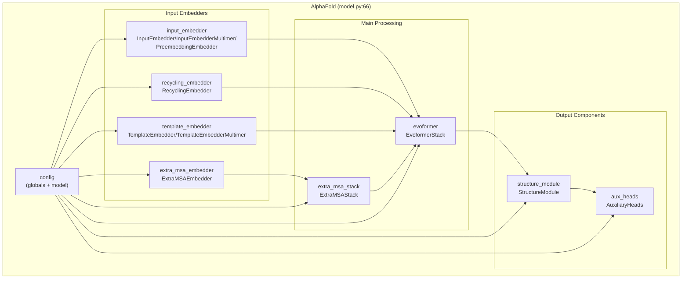
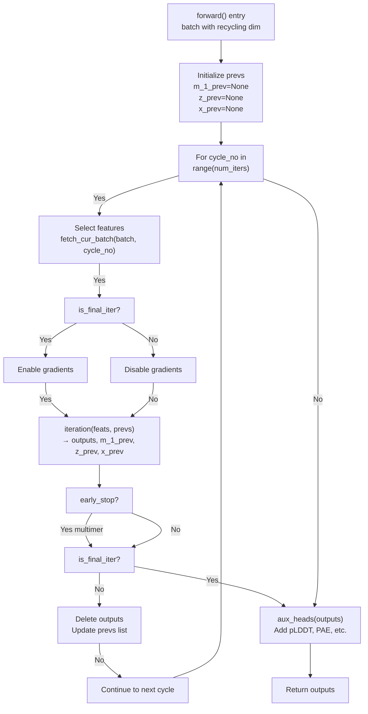
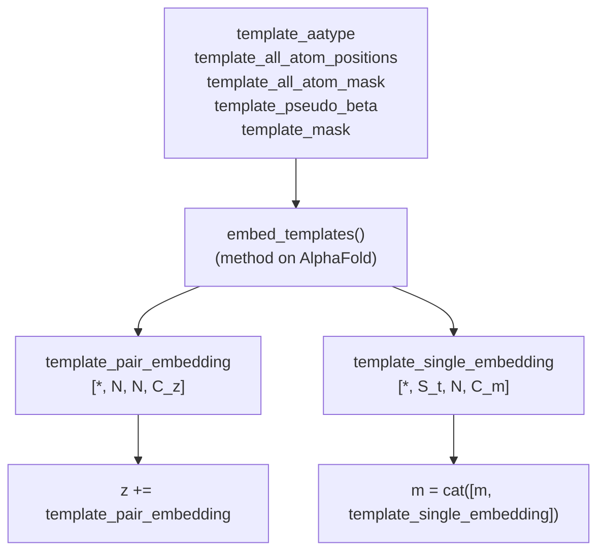
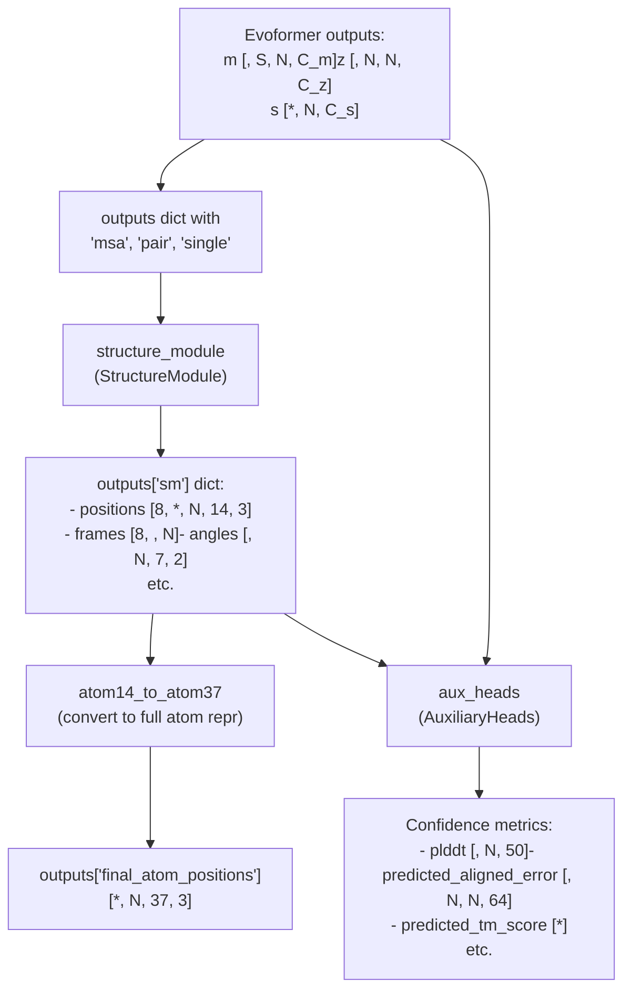

# AlphaFold Model Overview

# AlphaFold Model Overview

> **Relevant source files**
> - [openfold/model/model\.py](https://github.com/aqlaboratory/openfold/blob/56da08ec/openfold/model/model.py)
> - [openfold/model/template\.py](https://github.com/aqlaboratory/openfold/blob/56da08ec/openfold/model/template.py)
> - [openfold/model/triangular\_attention\.py](https://github.com/aqlaboratory/openfold/blob/56da08ec/openfold/model/triangular_attention.py)
> - [openfold/utils/tensor\_utils\.py](https://github.com/aqlaboratory/openfold/blob/56da08ec/openfold/utils/tensor_utils.py)

## Purpose and Scope

 This page documents the high\-level architecture of the `AlphaFold` class \([model\.py L66-L604](https://github.com/aqlaboratory/openfold/blob/56da08ec/openfold/model/model.py#L66-L604)\), which serves as the main entry point for the OpenFold model\. It explains the model's overall structure, the recycling mechanism, how different input modes are handled, and the data flow through the model from input features to predicted structures\.

 For configuration presets and hyperparameters, see [Configuration System](https://deepwiki.com/aqlaboratory/openfold/5.1-configuration-system)\. For detailed explanations of specific components, see [Evoformer Stack](https://deepwiki.com/aqlaboratory/openfold/5.3-evoformer-stack), [Structure Module](https://deepwiki.com/aqlaboratory/openfold/5.4-structure-module), [Primitives and Building Blocks](https://deepwiki.com/aqlaboratory/openfold/5.5-primitives-and-building-blocks), and [Loss Functions](https://deepwiki.com/aqlaboratory/openfold/5.6-loss-functions)\.

---

## AlphaFold Class Architecture

 The `AlphaFold` class is a `nn.Module` that implements Algorithm 2 from the AlphaFold 2 paper with training support\. It is initialized with a configuration object and instantiates all major model components\.

### Core Components



 **Sources:** [model\.py L66-L136](https://github.com/aqlaboratory/openfold/blob/56da08ec/openfold/model/model.py#L66-L136)

 The model's initialization \([model\.py L73-L135](https://github.com/aqlaboratory/openfold/blob/56da08ec/openfold/model/model.py#L73-L135)\) conditionally instantiates components based on configuration flags:

| Component | Config Flag | Purpose |
| --- | --- | --- |
| input\_embedder | Mode\-dependent | Embeds sequence/MSA features into m and z representations |
| recycling\_embedder | Always enabled | Processes outputs from previous iteration |
| template\_embedder | config\.template\.enabled | Embeds structural templates |
| extra\_msa\_embedder | config\.extra\_msa\.enabled | Embeds extra MSA sequences |
| extra\_msa\_stack | config\.extra\_msa\.enabled | Processes extra MSA with pair representation |
| evoformer | Always enabled | Core MSA and pair representation processing |
| structure\_module | Always enabled | Predicts 3D atomic coordinates |
| aux\_heads | Always enabled | Predicts confidence metrics \(pLDDT, PAE, etc\.\) |

### Input Embedder Modes

 The model supports three input modes, selected during initialization:

```
# Multimer modeif self.globals.is_multimer:    self.input_embedder = InputEmbedderMultimer(...)    # SoloSeq mode (ESM embeddings)elif self.seqemb_mode:    self.input_embedder = PreembeddingEmbedder(...)    # Standard monomer modeelse:    self.input_embedder = InputEmbedder(...)
```

 **Sources:** [model\.py L88-L101](https://github.com/aqlaboratory/openfold/blob/56da08ec/openfold/model/model.py#L88-L101)

---

## Recycling Mechanism

 AlphaFold uses a recycling mechanism where the model runs multiple iterations, feeding outputs from one iteration as inputs to the next\. This iterative refinement improves prediction quality\.

### Recycling Loop Architecture



 **Sources:** [model\.py L506-L604](https://github.com/aqlaboratory/openfold/blob/56da08ec/openfold/model/model.py#L506-L604)

### Recycling Variables

 Three tensors are recycled between iterations:

| Variable | Shape | Description |
| --- | --- | --- |
| m\_1\_prev | \[\*, N, C\_m\] | First row of MSA representation from previous iteration |
| z\_prev | \[\*, N, N, C\_z\] | Pair representation from previous iteration |
| x\_prev | \[\*, N, 37, 3\] | Atom37 positions from previous iteration |

 On the first iteration, these are initialized to zeros \([model\.py L270-L287](https://github.com/aqlaboratory/openfold/blob/56da08ec/openfold/model/model.py#L270-L287)\)\. For subsequent iterations, they contain the outputs from the previous cycle\.

### Early Stopping for Multimer

 In multimer mode, the model implements an early stopping criterion based on coordinate convergence \([model\.py L186-L212](https://github.com/aqlaboratory/openfold/blob/56da08ec/openfold/model/model.py#L186-L212)\):

```python
def tolerance_reached(self, prev_pos, next_pos, mask, eps=1e-8) -> bool:    # Compares CA-CA distance matrices between iterations    # Returns True if change is below config.recycle_early_stop_tolerance
```

 When tolerance is reached, recycling terminates early even if `num_iters` hasn't been exhausted \([model\.py L478-L479](https://github.com/aqlaboratory/openfold/blob/56da08ec/openfold/model/model.py#L478-L479)\)\.

 **Sources:** [model\.py L186-L212](https://github.com/aqlaboratory/openfold/blob/56da08ec/openfold/model/model.py#L186-L212) [model\.py L563-L594](https://github.com/aqlaboratory/openfold/blob/56da08ec/openfold/model/model.py#L563-L594)

---

## Single Iteration Data Flow

 The `iteration()` method \([model\.py L214-L486](https://github.com/aqlaboratory/openfold/blob/56da08ec/openfold/model/model.py#L214-L486)\) performs a single forward pass through the model\. This is the core processing pipeline\.

### Iteration Pipeline

```mermaid
flowchart TD

START["iteration(feats, prevs)"]
DTYPE["Cast features to model dtype"]
UNPACK["Unpack prevs<br>m_1_prev, z_prev, x_prev = prevs.pop()"]
INIT_CHECK["Any prev is None?"]
INIT_ZEROS["Initialize prevs to zeros"]
INPUT_MODE["Input mode?"]
MULTIMER_EMB["InputEmbedderMultimer<br>m, z = input_embedder(feats)"]
SEQEMB_EMB["PreembeddingEmbedder<br>m, z = input_embedder(target, idx, emb)"]
STANDARD_EMB["InputEmbedder<br>m, z = input_embedder(target, idx, msa)"]
PSEUDO["pseudo_beta_fn(aatype, x_prev)"]
RECYCLE_EMB["recycling_embedder<br>m_1_prev_emb, z_prev_emb"]
ADD_RECYCLE["m[0] += m_1_prev_emb<br>z += z_prev_emb"]
TEMPL_CHECK["template.enabled?"]
EMBED_TEMPL["embed_templates()<br>→ template_embeds"]
ADD_TEMPL_PAIR["z += template_pair_embedding"]
ADD_TEMPL_SINGLE["template_single?"]
CAT_MSA["m = cat([m, template_single_embedding])"]
EXTRA_CHECK["extra_msa.enabled?"]
BUILD_EXTRA["build_extra_msa_feat(feats)"]
EXTRA_EMB["extra_msa_embedder(extra_msa_feat)"]
EXTRA_STACK["extra_msa_stack(a, z)<br>→ z updated"]
EVO["evoformer(m, z)<br>→ m, z, s"]
STORE["outputs['msa'] = m<br>outputs['pair'] = z<br>outputs['single'] = s"]
SM["structure_module(outputs, aatype)<br>→ outputs['sm']"]
ATOM37["atom14_to_atom37()<br>→ outputs['final_atom_positions']"]
RETURN["Return outputs,<br>m_1_prev, z_prev, x_prev,<br>early_stop"]

START --> DTYPE
INIT_CHECK -->|"No"| INPUT_MODE
INIT_ZEROS -->|"Yes"| INPUT_MODE
MULTIMER_EMB -->|"is_multimer"| PSEUDO
SEQEMB_EMB -->|"seqemb_mode"| PSEUDO
STANDARD_EMB -->|"standard"| PSEUDO
ADD_RECYCLE -->|"Yes"| TEMPL_CHECK
TEMPL_CHECK -->|"No"| EXTRA_CHECK
ADD_TEMPL_SINGLE -->|"No"| EXTRA_CHECK
CAT_MSA -->|"Yes"| EXTRA_CHECK
EXTRA_CHECK -->|"No"| EVO
EXTRA_STACK -->|"No"| EVO
STORE --> SM
ATOM37 --> RETURN

subgraph Structure ["Structure Prediction"]
    SM
    ATOM37
    SM --> ATOM37
end

subgraph MainTrunk ["Main Evoformer Trunk"]
    EVO
    STORE
    EVO --> STORE
end

subgraph ExtraMSA ["Extra MSA Processing"]
    EXTRA_CHECK
    BUILD_EXTRA
    EXTRA_EMB
    EXTRA_STACK
    EXTRA_CHECK -->|"Yes"| BUILD_EXTRA
    BUILD_EXTRA -->|"Yes"| EXTRA_EMB
    EXTRA_EMB -->|"No"| EXTRA_STACK
end

subgraph Templates ["Template Processing"]
    TEMPL_CHECK
    EMBED_TEMPL
    ADD_TEMPL_PAIR
    ADD_TEMPL_SINGLE
    CAT_MSA
    TEMPL_CHECK -->|"Yes"| EMBED_TEMPL
    EMBED_TEMPL -->|"Yes"| ADD_TEMPL_PAIR
    ADD_TEMPL_PAIR -->|"No"| ADD_TEMPL_SINGLE
    ADD_TEMPL_SINGLE -->|"Yes"| CAT_MSA
end

subgraph Recycle ["Recycling Embedding"]
    PSEUDO
    RECYCLE_EMB
    ADD_RECYCLE
    PSEUDO -->|"seqemb_mode"| RECYCLE_EMB
    RECYCLE_EMB --> ADD_RECYCLE
end

subgraph InputEmbed ["Input Embedding"]
    INPUT_MODE
    MULTIMER_EMB
    SEQEMB_EMB
    STANDARD_EMB
    INPUT_MODE -->|"is_multimer"| MULTIMER_EMB
    INPUT_MODE -->|"seqemb_mode"| SEQEMB_EMB
    INPUT_MODE -->|"standard"| STANDARD_EMB
end

subgraph Init ["Initialization"]
    DTYPE
    UNPACK
    INIT_CHECK
    INIT_ZEROS
    DTYPE --> UNPACK
    UNPACK -->|"Yes"| INIT_CHECK
    INIT_CHECK -->|"Yes"| INIT_ZEROS
end
```



 **Sources:** [model\.py L214-L486](https://github.com/aqlaboratory/openfold/blob/56da08ec/openfold/model/model.py#L214-L486)

### Key Data Structures

 Throughout the iteration, the model maintains several key tensors:

| Tensor | Shape | Description |
| --- | --- | --- |
| m | \[\*, S\_c, N, C\_m\] | MSA representation \(S\_c clustered sequences\) |
| z | \[\*, N, N, C\_z\] | Pair representation \(residue\-residue interactions\) |
| s | \[\*, N, C\_s\] | Single representation \(per\-residue features\) |
| seq\_mask | \[\*, N\] | Valid residue mask |
| pair\_mask | \[\*, N, N\] | Valid residue pair mask |
| msa\_mask | \[\*, S, N\] | Valid MSA position mask |

 **Sources:** [model\.py L224-L238](https://github.com/aqlaboratory/openfold/blob/56da08ec/openfold/model/model.py#L224-L238)

---

## Input Embedding Modes

 The model's initial embedding step varies based on the operating mode:

### Standard Monomer Mode

```
m, z = self.input_embedder(    feats["target_feat"],      # [*, N, C_tf] one-hot target sequence    feats["residue_index"],    # [*, N] residue indices    feats["msa_feat"],         # [*, S, N, C_msa] MSA features    inplace_safe=inplace_safe,)
```

 - Uses `InputEmbedder` class
- Embeds target sequence and MSA into initial `m` and `z` representations
- `m` shape: `[*, S_c, N, C_m]` where S\_c is number of clustered sequences
- `z` shape: `[*, N, N, C_z]`

 **Sources:** [model\.py L254-L263](https://github.com/aqlaboratory/openfold/blob/56da08ec/openfold/model/model.py#L254-L263)

### Multimer Mode

```
m, z = self.input_embedder(feats)
```

 - Uses `InputEmbedderMultimer` class
- Processes multiple chains with `asym_id` for chain identification
- Includes additional features for inter\-chain interactions
- Special handling in template embedding with `multichain_mask_2d`

 **Sources:** [model\.py L240-L244](https://github.com/aqlaboratory/openfold/blob/56da08ec/openfold/model/model.py#L240-L244) [model\.py L138-L156](https://github.com/aqlaboratory/openfold/blob/56da08ec/openfold/model/model.py#L138-L156)

### SoloSeq Mode \(ESM Embeddings\)

```
m, z = self.input_embedder(    feats["target_feat"],    feats["residue_index"],    feats["seq_embedding"]     # [*, N, C_esm] pre-computed ESM-1b embeddings)
```

 - Uses `PreembeddingEmbedder` class
- Bypasses MSA generation by using pre\-computed language model embeddings
- `m` shape: `[*, 1, N, C_m]` \(only single sequence\)
- Significantly faster inference but potentially lower accuracy

 **Sources:** [model\.py L245-L253](https://github.com/aqlaboratory/openfold/blob/56da08ec/openfold/model/model.py#L245-L253)

---

## Template and Extra MSA Processing

### Template Embedding

 When templates are enabled \(`config.template.enabled`\), the model embeds structural templates and merges them with the pair representation:



 **Sources:** [model\.py L324-L366](https://github.com/aqlaboratory/openfold/blob/56da08ec/openfold/model/model.py#L324-L366)

 The `embed_templates()` method \([model\.py L137-L184](https://github.com/aqlaboratory/openfold/blob/56da08ec/openfold/model/model.py#L137-L184)\) has three modes:

 1. **Standard**: Processes all templates together
2. **Offload** \(`template_config.offload_templates`\): Processes templates one\-by\-one with CPU offloading for memory efficiency \([template\.py L490-L600](https://github.com/aqlaboratory/openfold/blob/56da08ec/openfold/model/template.py#L490-L600)\)
3. **Average** \(`template_config.average_templates`\): Processes templates in groups and averages embeddings \([template\.py L603-L715](https://github.com/aqlaboratory/openfold/blob/56da08ec/openfold/model/template.py#L603-L715)\)

### Extra MSA Processing

 When enabled \(`config.extra_msa.enabled`\), extra MSA sequences are processed separately to update the pair representation:

```
# Build extra MSA featuresextra_msa_feat = build_extra_msa_feat(feats).to(dtype=z.dtype) # Embed extra MSAa = self.extra_msa_embedder(extra_msa_feat) # Process through extra MSA stackz = self.extra_msa_stack(    a, z,    msa_mask=feats["extra_msa_mask"].to(dtype=m.dtype),    chunk_size=self.globals.chunk_size,    ...)
```

 The extra MSA is processed separately from the clustered MSA to handle larger numbers of sequences without increasing memory proportionally\. The `ExtraMSAStack` updates only the pair representation `z`, not the MSA representation `m`\.

 **Sources:** [model\.py L368-L411](https://github.com/aqlaboratory/openfold/blob/56da08ec/openfold/model/model.py#L368-L411)

---

## Structure Prediction and Output

 After the Evoformer processes `m` and `z`, the model predicts 3D structure:

### Structure Module Pipeline



 **Sources:** [model\.py L449-L468](https://github.com/aqlaboratory/openfold/blob/56da08ec/openfold/model/model.py#L449-L468) [model\.py L601-L603](https://github.com/aqlaboratory/openfold/blob/56da08ec/openfold/model/model.py#L601-L603)

### Structure Module Output

 The `structure_module` returns a dictionary containing:

 - `positions`: Atom14 coordinates at each of 8 IPA iterations `[8, *, N, 14, 3]`
- `frames`: Rigid transformations \(backbone frames\) `[8, *, N]`
- `angles`: Torsion angles `[*, N, 7, 2]` \(sin/cos representation\)
- `sidechains`: Side\-chain frames
- Various violation and loss terms

 **Sources:** [model\.py L456-L467](https://github.com/aqlaboratory/openfold/blob/56da08ec/openfold/model/model.py#L456-L467)

### Auxiliary Heads

 The `aux_heads` module adds confidence and error prediction outputs:

 - `plddt`: Per\-residue confidence \(predicted LDDT\) `[*, N, 50]` \(binned distribution\)
- `predicted_aligned_error`: Inter\-residue error prediction `[*, N, N, 64]`
- `predicted_tm_score`: Template modeling score prediction `[*]`
- `distogram`: Distance distribution prediction
- `experimentally_resolved`: Mask prediction for resolved regions

 **Sources:** [model\.py L601-L603](https://github.com/aqlaboratory/openfold/blob/56da08ec/openfold/model/model.py#L601-L603)

---

## Memory Optimization Features

 The model includes several memory optimization strategies controlled by global configuration flags:

### Offload Inference Mode

 When `globals.offload_inference` is enabled, the model offloads intermediate tensors to CPU:

```
if self.globals.offload_inference and inplace_safe:    m = m.cpu()    z = z.cpu()    # ... process recycling embedder on GPU ... if self.globals.offload_inference and inplace_safe:    m = m.to(m_1_prev_emb.device)    z = z.to(z_prev.device)
```

 The extra MSA stack and Evoformer have special `_forward_offload()` methods that accept CPU tensors and manage GPU transfers internally \([model\.py L378-L395](https://github.com/aqlaboratory/openfold/blob/56da08ec/openfold/model/model.py#L378-L395) [model\.py L417-L431](https://github.com/aqlaboratory/openfold/blob/56da08ec/openfold/model/model.py#L417-L431)\)\.

 **Sources:** [model\.py L294-L311](https://github.com/aqlaboratory/openfold/blob/56da08ec/openfold/model/model.py#L294-L311) [model\.py L378-L431](https://github.com/aqlaboratory/openfold/blob/56da08ec/openfold/model/model.py#L378-L431)

### In\-place Operations

 The `inplace_safe` flag controls whether operations can modify tensors in\-place:

```
inplace_safe = not (self.training or torch.is_grad_enabled())
```

 When `inplace_safe=True` \(during inference without gradients\), the model uses in\-place operations to reduce memory allocations\. This flag is passed to all sub\-modules\.

 **Sources:** [model\.py L233](https://github.com/aqlaboratory/openfold/blob/56da08ec/openfold/model/model.py#L233-L233) [model\.py L262-L263](https://github.com/aqlaboratory/openfold/blob/56da08ec/openfold/model/model.py#L262-L263)

### Activation Checkpointing Control

 The model can dynamically enable/disable activation checkpointing:

```python
def _disable_activation_checkpointing(self):    self.template_embedder.template_pair_stack.blocks_per_ckpt = None    self.evoformer.blocks_per_ckpt = None    for b in self.extra_msa_stack.blocks:        b.ckpt = False def _enable_activation_checkpointing(self):    # Restore checkpoint settings from config    ...
```

 This allows inference to run without checkpointing overhead while training uses checkpointing to save memory\.

 **Sources:** [model\.py L488-L504](https://github.com/aqlaboratory/openfold/blob/56da08ec/openfold/model/model.py#L488-L504)

### Gradient Management

 During the recycling loop, gradients are only enabled for the final iteration:

```
is_final_iter = cycle_no == (num_iters - 1) or early_stopwith torch.set_grad_enabled(is_grad_enabled and is_final_iter):    # ... run iteration ...
```

 This prevents gradient accumulation across recycling iterations, saving memory and computation\.

 **Sources:** [model\.py L573-L594](https://github.com/aqlaboratory/openfold/blob/56da08ec/openfold/model/model.py#L573-L594)

---

## Summary

 The `AlphaFold` class orchestrates the entire model architecture:

 1. **Input Embedding**: Converts raw features to `m` \(MSA\) and `z` \(pair\) representations using mode\-specific embedders
2. **Recycling**: Iteratively refines predictions by feeding previous outputs as inputs
3. **Template Processing**: Optionally incorporates structural templates into the pair representation
4. **Extra MSA**: Processes additional sequences to enhance pair features
5. **Evoformer**: Core processing of MSA and pair representations through 48 blocks
6. **Structure Module**: Predicts 3D atomic coordinates using geometric reasoning
7. **Auxiliary Heads**: Adds confidence metrics and error predictions

 The model supports three operating modes \(monomer, multimer, SoloSeq\) and includes extensive memory optimizations \(offloading, in\-place operations, checkpointing\) to enable both training and inference on proteins of varying lengths\.

 **Sources:** [model\.py L66-L604](https://github.com/aqlaboratory/openfold/blob/56da08ec/openfold/model/model.py#L66-L604)

---
*Source: [https://deepwiki.com/aqlaboratory/openfold/5.2-alphafold-model-overview](https://deepwiki.com/aqlaboratory/openfold/5.2-alphafold-model-overview) on DeepWiki*