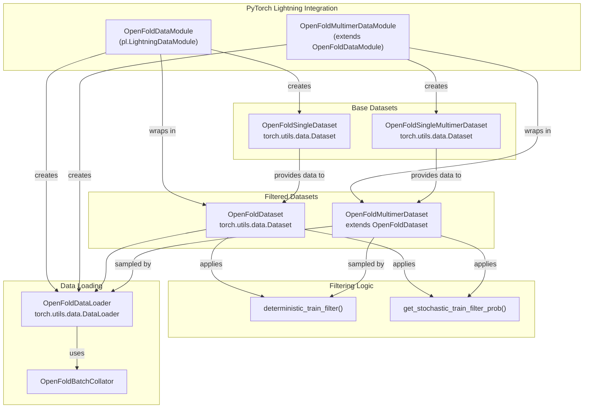
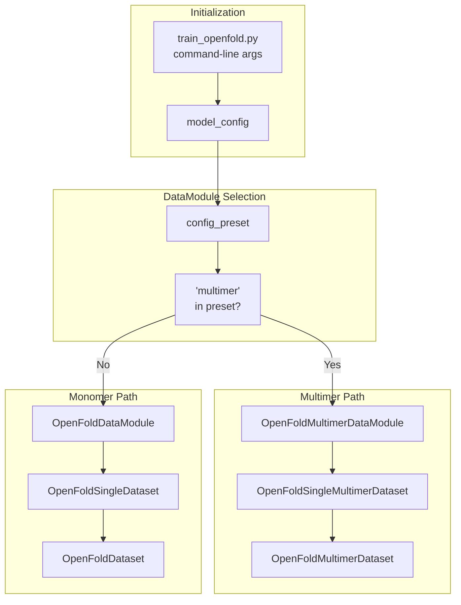
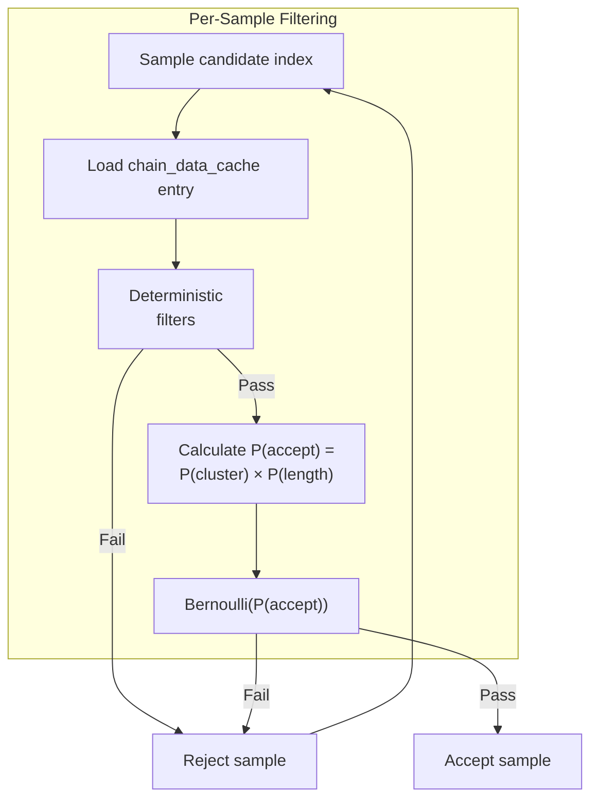
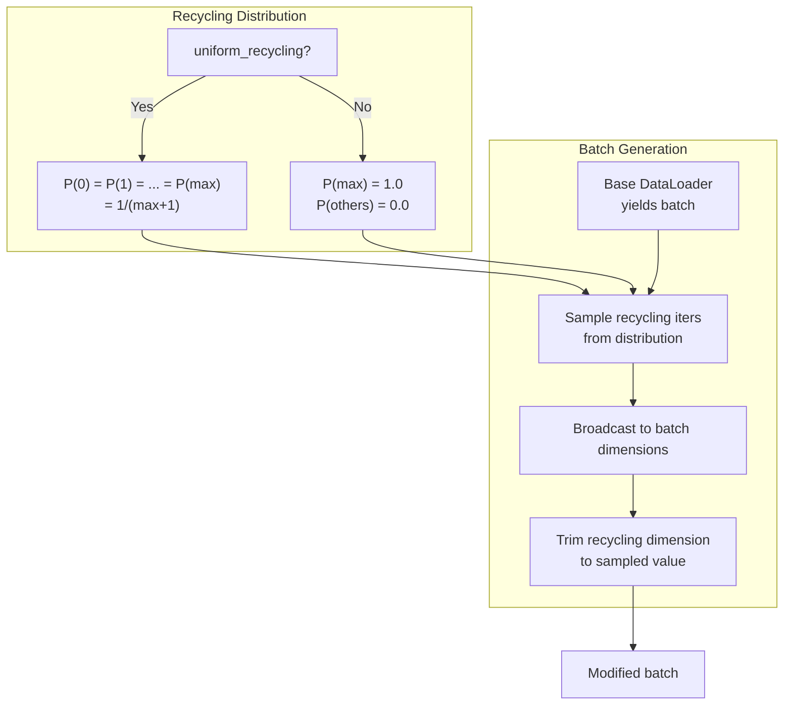
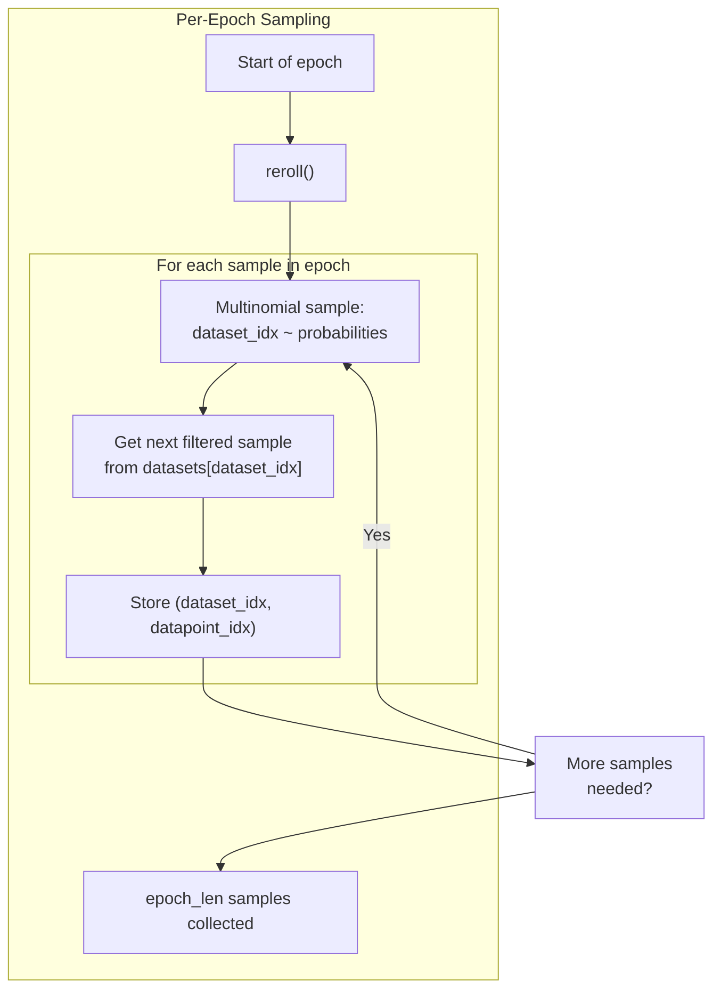

# Data Loading and Filtering

# Data Loading and Filtering

> **Relevant source files**
> - [openfold/data/data\_modules\.py](https://github.com/aqlaboratory/openfold/blob/56da08ec/openfold/data/data_modules.py)
> - [openfold/utils/loss\.py](https://github.com/aqlaboratory/openfold/blob/56da08ec/openfold/utils/loss.py)
> - [train\_openfold\.py](https://github.com/aqlaboratory/openfold/blob/56da08ec/train_openfold.py)

## Purpose and Scope

 This page documents OpenFold's training data loading and filtering system, which implements the stochastic and deterministic filtering strategies used in AlphaFold's training protocol\. This includes the PyTorch Lightning DataModules, Dataset classes, filtering logic, and custom DataLoader implementations\.

 For information about the overall training pipeline and how these data modules are used during training, see [Training Pipeline](https://deepwiki.com/aqlaboratory/openfold/4.1-training-pipeline)\. For details on the data transformation and augmentation applied to features after loading, see [Data Transforms and Augmentation](https://deepwiki.com/aqlaboratory/openfold/6.2-data-transforms-and-augmentation)\.

## Overview

 OpenFold's data loading system is designed around PyTorch Lightning's DataModule pattern with custom filtering logic to match AlphaFold's training methodology\. The system handles:

 - **Stochastic filtering** to balance dataset composition by cluster size and sequence length
- **Deterministic filtering** based on resolution and sequence properties
- **Dataset composition** combining PDB training data with self\-distillation data
- **Virtual epoch lengths** since filtered datasets have no well\-defined size
- **Batch property sampling** for recycling iteration counts



 **Sources:** [data\_modules\.py L1-L1187](https://github.com/aqlaboratory/openfold/blob/56da08ec/openfold/data/data_modules.py#L1-L1187) [train\_openfold\.py L342-L356](https://github.com/aqlaboratory/openfold/blob/56da08ec/train_openfold.py#L342-L356)

## Data Module Architecture

### OpenFoldDataModule

 The `OpenFoldDataModule` class is the main entry point for data loading in monomer training\. It implements PyTorch Lightning's `LightningDataModule` interface and manages the creation of training, validation, and prediction datasets\.

| Component | Purpose |
| --- | --- |
| Training Dataset | Filtered dataset combining PDB data and optional distillation data |
| Validation Dataset | Unfiltered evaluation dataset |
| Prediction Dataset | Dataset for inference mode |

 **Key Parameters:**

 - `train_data_dir`: Directory containing training mmCIF files
- `train_alignment_dir`: Directory with precomputed MSA alignments
- `train_chain_data_cache_path`: JSON cache with chain metadata for filtering
- `distillation_data_dir`: Optional directory with self\-distillation PDB files
- `train_epoch_len`: Virtual epoch length \(default: 50,000\)
- `batch_seed`: Random seed for reproducible batch sampling

 **Sources:** [data\_modules\.py L848-L1060](https://github.com/aqlaboratory/openfold/blob/56da08ec/openfold/data/data_modules.py#L848-L1060) [train\_openfold\.py L343-L353](https://github.com/aqlaboratory/openfold/blob/56da08ec/train_openfold.py#L343-L353)

### OpenFoldMultimerDataModule

 The multimer\-specific data module extends `OpenFoldDataModule` with additional requirements for multimer training:

 - Uses `mmcif_data_cache_path` instead of `chain_data_cache_path` to track chains per complex
- Creates `OpenFoldSingleMultimerDataset` instances that process entire multimer structures
- Applies multimer\-specific filtering criteria \(minimum total residues, per\-chain cluster sizes\)



 **Sources:** [data\_modules\.py L1062-L1166](https://github.com/aqlaboratory/openfold/blob/56da08ec/openfold/data/data_modules.py#L1062-L1166) [train\_openfold\.py L342-L356](https://github.com/aqlaboratory/openfold/blob/56da08ec/train_openfold.py#L342-L356)

## Dataset Classes

### Base Dataset: OpenFoldSingleDataset

 `OpenFoldSingleDataset` is the fundamental dataset class that loads and processes individual protein chains\. It reads structure files \(mmCIF, PDB, or `.core` format\) and generates features using the `DataPipeline`\.

 **Key Responsibilities:**

 1. **File Discovery**: Maps chain IDs to structure files in `data_dir`
2. **MSA Loading**: Loads precomputed alignments from `alignment_dir`
3. **Template Search**: Uses `HhsearchHitFeaturizer` for template identification
4. **Feature Generation**: Processes raw data through `DataPipeline` and `FeaturePipeline`

 **Filtering Integration:**

 The dataset requires a `chain_data_cache_path` \(JSON file\) containing metadata for each chain:

 - `seq`: Amino acid sequence
- `resolution`: Structure resolution in Ångströms
- `cluster_size`: Number of similar sequences in the cluster

 This metadata is used by `OpenFoldDataset` for filtering decisions\.

 **Sources:** [data\_modules\.py L26-L290](https://github.com/aqlaboratory/openfold/blob/56da08ec/openfold/data/data_modules.py#L26-L290)

### Base Dataset: OpenFoldSingleMultimerDataset

 `OpenFoldSingleMultimerDataset` handles multimer structures where multiple chains are processed together\. Unlike the monomer dataset which works with individual chains, this class:

 - Uses `mmcif_data_cache_path` to map PDB IDs to their constituent chains
- Returns features for all chains in a complex simultaneously
- Uses `HmmsearchHitFeaturizer` \(rather than `HhsearchHitFeaturizer`\) for template search
- Processes data through `DataPipelineMultimer`

 **Sources:** [data\_modules\.py L292-L505](https://github.com/aqlaboratory/openfold/blob/56da08ec/openfold/data/data_modules.py#L292-L505)

### Filtered Dataset: OpenFoldDataset

 `OpenFoldDataset` wraps one or more base datasets and applies AlphaFold's stochastic filtering protocol\. This class has no fixed length—instead, it generates samples on\-demand by filtering the base datasets\.

 **Architecture:**

  **Key Methods:**

 - `reroll()`: Generates a new set of `epoch_len` samples by filtering constituent datasets
- `looped_samples()`: Infinite generator that yields filtered samples from one dataset
- `looped_shuffled_dataset_idx()`: Uniformly shuffles dataset indices

 **Sources:** [data\_modules\.py L535-L662](https://github.com/aqlaboratory/openfold/blob/56da08ec/openfold/data/data_modules.py#L535-L662)

### Filtered Dataset: OpenFoldMultimerDataset

 `OpenFoldMultimerDataset` extends `OpenFoldDataset` with multimer\-specific filtering logic\. The key difference is in how stochastic probabilities are computed—instead of a single probability per structure, it computes per\-chain probabilities based on individual chain cluster sizes\.

 **Sources:** [data\_modules\.py L664-L754](https://github.com/aqlaboratory/openfold/blob/56da08ec/openfold/data/data_modules.py#L664-L754)

## Stochastic Filtering

 OpenFold implements AlphaFold's two\-stage filtering strategy to balance the training dataset\.

### Deterministic Filters

 Deterministic filters eliminate structures that don't meet minimum quality criteria\. All structures must pass these checks:

| Filter | Threshold \(Monomer\) | Threshold \(Multimer\) | Purpose |
| --- | --- | --- | --- |
| Resolution | ≤ 9\.0 Å | ≤ 9\.0 Å | Exclude low\-quality structures |
| Max Single AA | ≤ 80% | ≤ 80% | Exclude biased sequences |
| Min Residues | N/A | ≥ 200 \(distillation only\) | Ensure sufficient size |

 **Implementation:**

```python
# Monomer filteringdef deterministic_train_filter(    cache_entry: Any,    max_resolution: float = 9.,    max_single_aa_prop: float = 0.8,    *args, **kwargs) -> bool:    resolution = cache_entry.get("resolution", None)    seqs = [cache_entry["seq"]]        return all([        resolution_filter(resolution, max_resolution),        aa_count_filter(seqs, max_single_aa_prop)    ])
```

 **Sources:** [data\_modules\.py L560-L573](https://github.com/aqlaboratory/openfold/blob/56da08ec/openfold/data/data_modules.py#L560-L573) [data\_modules\.py L684-L706](https://github.com/aqlaboratory/openfold/blob/56da08ec/openfold/data/data_modules.py#L684-L706) [data\_modules\.py L507-L532](https://github.com/aqlaboratory/openfold/blob/56da08ec/openfold/data/data_modules.py#L507-L532)

### Stochastic Filters

 After passing deterministic filters, structures are stochastically sampled with probability:

 **P\(accept\) = P\(cluster\) × P\(length\)**

#### Cluster Size Probability

 Reduces redundancy by downweighting structures from large sequence clusters:

 **P\(cluster\) = 1 / cluster\_size**

 If `cluster_size` is not available, P\(cluster\) = 1\.

#### Chain Length Probability

 Balances sequence length distribution to prevent bias toward short sequences:

 **P\(length\) = \(1/512\) × max\(min\(L, 512\), 256\)**

 where L is the chain length\.

 For sequences:

 - L < 256: P\(length\) = 256/512 = 0\.5
- 256 ≤ L ≤ 512: P\(length\) = L/512 \(linear increase\)
- L \> 512: P\(length\) = 1\.0



 **Implementation:**

 For monomers, the probability is computed per structure:

```python
# Line 576-595 in data_modules.pydef get_stochastic_train_filter_prob(    cache_entry: Any,    *args, **kwargs) -> float:    probabilities = []        cluster_size = cache_entry.get("cluster_size", None)    if cluster_size is not None and cluster_size > 0:        probabilities.append(1 / cluster_size)        chain_length = len(cache_entry["seq"])    probabilities.append((1 / 512) * (max(min(chain_length, 512), 256)))        out = 1    for p in probabilities:        out *= p        return out
```

 For multimers, per\-chain probabilities are computed and applied independently:

```python
# Lines 708-718 in data_modules.pydef get_stochastic_train_filter_prob(    cache_entry: Any,    *args, **kwargs) -> list:    cluster_sizes = cache_entry.get("cluster_sizes")    if cluster_sizes is not None:        return [1 / c if c > 0 else 1 for c in cluster_sizes]        num_chains = len(cache_entry["chain_ids"])    return [1.] * num_chains
```

 **Sources:** [data\_modules\.py L575-L595](https://github.com/aqlaboratory/openfold/blob/56da08ec/openfold/data/data_modules.py#L575-L595) [data\_modules\.py L707-L718](https://github.com/aqlaboratory/openfold/blob/56da08ec/openfold/data/data_modules.py#L707-L718) [data\_modules\.py L610-L641](https://github.com/aqlaboratory/openfold/blob/56da08ec/openfold/data/data_modules.py#L610-L641) [data\_modules\.py L720-L753](https://github.com/aqlaboratory/openfold/blob/56da08ec/openfold/data/data_modules.py#L720-L753)

## Data Loader and Batch Processing

### OpenFoldDataLoader

 `OpenFoldDataLoader` extends `torch.utils.data.DataLoader` with custom batch processing logic\. It adds dynamic batch properties that vary across training steps\.

 **Key Features:**

 1. **Recycling Iteration Sampling**: Randomly selects number of recycling iterations per batch
2. **Batch Property Management**: Adds metadata tensors to each batch
3. **Generator Management**: Ensures reproducible randomness with optional seed

 **Recycling Iteration Sampling:**

 The data loader samples the number of recycling iterations from a distribution:

| Mode | Distribution | Purpose |
| --- | --- | --- |
| Uniform | config\.train\.uniform\_recycling=True | Equal probability for 0, 1, \.\.\., max\_iters |
| Max Only | config\.train\.uniform\_recycling=False | Always use max\_recycling\_iters |



 **Implementation Details:**

 The `_add_batch_properties()` method:

 1. Samples recycling iterations using `torch.multinomial()`
2. Adds `no_recycling_iters` tensor to batch
3. Trims all features to `no_recycling_iters + 1` in the recycling dimension

 **Sources:** [data\_modules\.py L762-L846](https://github.com/aqlaboratory/openfold/blob/56da08ec/openfold/data/data_modules.py#L762-L846) [data\_modules\.py L770-L798](https://github.com/aqlaboratory/openfold/blob/56da08ec/openfold/data/data_modules.py#L770-L798)

### OpenFoldBatchCollator

 A simple collator that stacks individual samples into batches using `torch.stack()`:

```python
class OpenFoldBatchCollator:    def __call__(self, prots):        stack_fn = partial(torch.stack, dim=0)        return dict_multimap(stack_fn, prots)
```

 The `dict_multimap` utility recursively applies `torch.stack` to all tensors in nested dictionaries\.

 **Sources:** [data\_modules\.py L756-L760](https://github.com/aqlaboratory/openfold/blob/56da08ec/openfold/data/data_modules.py#L756-L760)

## Dataset Composition

 Training datasets can combine two sources with weighted sampling:

### Dataset Sources

| Source | Description | File Types | Filtering |
| --- | --- | --- | --- |
| Training Data | PDB structures with native ground truth | \.cif, \.core | Standard filters |
| Distillation Data | Structures predicted by previous model versions | \.pdb | Standard \+ minimum residue filter |

### Probability\-Based Sampling

 The `OpenFoldDataset` constructor accepts:

 - `datasets`: List of base datasets
- `probabilities`: Corresponding sampling probabilities

 **Example Configuration:**

```
# From train_openfold.py setupdatasets = [train_dataset, distillation_dataset]d_prob = config.train.distillation_prob  # e.g., 0.1probabilities = [1. - d_prob, d_prob]     # [0.9, 0.1] train_dataset = OpenFoldDataset(    datasets=datasets,    probabilities=probabilities,    epoch_len=train_epoch_len,    generator=generator,)
```

 **Sampling Process:**



 1. At each epoch, `reroll()` is called
2. For each of `epoch_len` samples: - Sample dataset index from `probabilities` - Get next filtered sample from that dataset - Store the \(dataset\_idx, datapoint\_idx\) pair
3. During training, samples are accessed via these stored pairs

 **Sources:** [data\_modules\.py L650-L661](https://github.com/aqlaboratory/openfold/blob/56da08ec/openfold/data/data_modules.py#L650-L661) [train\_openfold\.py L962-L998](https://github.com/aqlaboratory/openfold/blob/56da08ec/train_openfold.py#L962-L998) [data\_modules\.py L1019-L1048](https://github.com/aqlaboratory/openfold/blob/56da08ec/openfold/data/data_modules.py#L1019-L1048)

## Usage in Training

### Integration with PyTorch Lightning

 The data module is instantiated in `train_openfold.py` and passed to PyTorch Lightning's `Trainer`:

```
# train_openfold.py lines 342-356if "multimer" in args.config_preset:    data_module = OpenFoldMultimerDataModule(        config=config.data,        batch_seed=args.seed,        **vars(args)    )else:    data_module = OpenFoldDataModule(        config=config.data,        batch_seed=args.seed,        **vars(args)    ) data_module.prepare_data()data_module.setup() # Later: lines 452-456trainer.fit(    model_module,    datamodule=data_module,    ckpt_path=ckpt_path,)
```

### Virtual Epoch Length

 Since filtered datasets have no well\-defined length, OpenFold uses a "virtual" epoch length:

 - Controlled by `--train_epoch_len` argument \(default: 10,000\)
- Affects validation and checkpointing frequency
- Does not determine total training samples \(controlled by `max_epochs`\)

 **Example:**

 - `train_epoch_len=10000`, `max_epochs=5`
- Total samples: 50,000 \(not including rejected samples from filtering\)
- Validation runs 5 times \(once per epoch\)

### Dataset Reloading

 The data loader rerolls the dataset at the start of each epoch:

```
# openfold/data/data_modules.py lines 1025-1028if stage == "train":    dataset = self.train_dataset    # Filter the dataset, if necessary    dataset.reroll()
```

 This ensures:

 - Fresh random samples each epoch
- Different filtering outcomes
- Non\-deterministic training progression \(unless `batch_seed` is set\)

 **Sources:** [train\_openfold\.py L342-L356](https://github.com/aqlaboratory/openfold/blob/56da08ec/train_openfold.py#L342-L356) [train\_openfold\.py L452-L456](https://github.com/aqlaboratory/openfold/blob/56da08ec/train_openfold.py#L452-L456) [data\_modules\.py L1019-L1048](https://github.com/aqlaboratory/openfold/blob/56da08ec/openfold/data/data_modules.py#L1019-L1048)

## Summary

 The data loading and filtering system implements AlphaFold's training protocol through a hierarchy of classes:

 1. **Base Datasets** \(`OpenFoldSingleDataset`, `OpenFoldSingleMultimerDataset`\) load raw data
2. **Filtered Datasets** \(`OpenFoldDataset`, `OpenFoldMultimerDataset`\) apply stochastic sampling
3. **Data Modules** \(`OpenFoldDataModule`, `OpenFoldMultimerDataModule`\) orchestrate the pipeline
4. **Data Loader** \(`OpenFoldDataLoader`\) adds batch properties like recycling iterations

 The filtering strategy balances:

 - **Dataset redundancy** via cluster size downweighting
- **Sequence length distribution** via length\-dependent sampling
- **Dataset composition** via probability\-weighted source selection

 This approach produces diverse, balanced batches while maintaining compatibility with AlphaFold's published training methodology\.

---
*Source: [https://deepwiki.com/aqlaboratory/openfold/4.2-data-loading-and-filtering](https://deepwiki.com/aqlaboratory/openfold/4.2-data-loading-and-filtering) on DeepWiki*